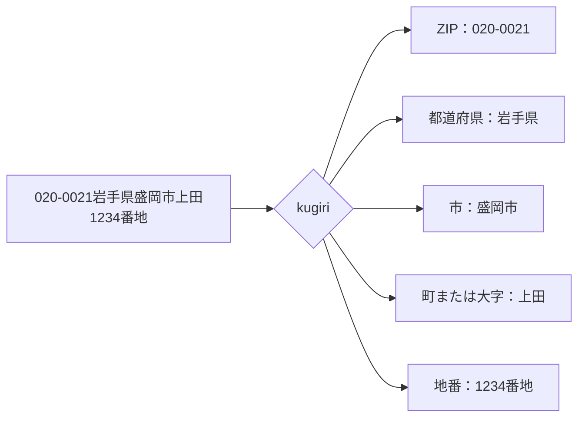
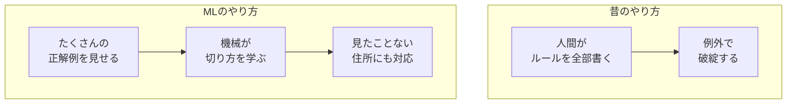
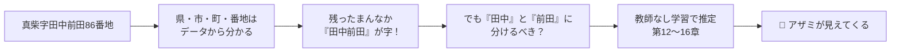
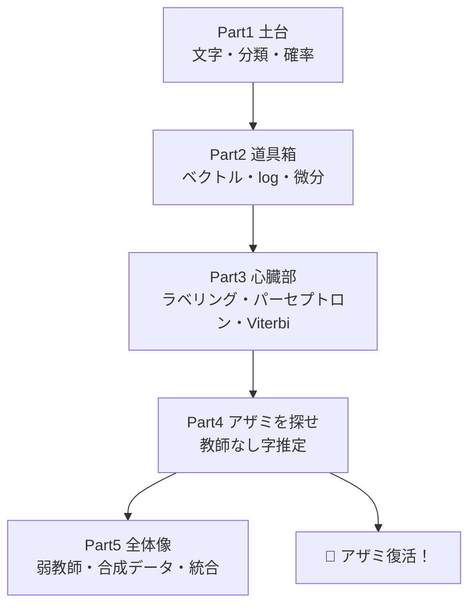

# 第0章　消えた精霊と、住所を切る機械

> **この章のゴール**
> - kugiri が「何を」「なぜ」やるのかを、物語としてつかむ
> - 「住所を切り分ける」とはどういうことか、目で見て分かる
> - これから学ぶ旅の地図を手に入れる

> **登場人物**：みどり先生、ツムギ、ゲンタ、アザミ

---

## ある放課後の、プログラミング室

**ツムギ**：先生〜、なんか今日、部屋のすみっこがキラキラしてませんか？

**みどり先生**：お、気づいた？　じつはね、ここには**精霊**がいるんだよ。

**ゲンタ**：……先生、それ、さすがにウソでしょ。それ、意味あるの？

**みどり先生**：あわてない、あわてない。まあ見てて。
——アザミ、出ておいで。

**アザミ**：……（ぼんやり、半透明のすがた）……こんにちは……でも、わたしの姿、よく見えないでしょう？

**ツムギ**：ほんとだ！　すけて見える！　なんで？

**アザミ**：わたしは「**字（あざ）**」の精霊なの。住所のなかの、小さな小さな地名。
でもね、わたしには **「名前のラベル」をつけてくれる人がいない**の。
だから、こんなにうすくなってしまったのよ……。

**みどり先生**：このコースのゴールはね、**アザミの姿を取りもどすこと**なんだ。
そのために、君たちには「住所を切り分ける機械」のしくみを、ぜんぶ学んでもらう。

---

## そもそも「住所を切り分ける」って？

**みどり先生**：たとえば、こんな住所があるとするね。

```
020-0021岩手県盛岡市上田1234番地
```

**みどり先生**：これ、人間が見ればなんとなく区切れるよね。ツムギ、やってみて。

**ツムギ**：えーと……
`020-0021` が郵便番号で、`岩手県` が県で、`盛岡市` が市で、`上田` が町で、`1234番地` が番地？

**みどり先生**：大正解！　いま君がやった「区切り」を、**機械にやらせる**のが kugiri だよ。
図にするとこう。



**ゲンタ**：ふーん。でもこれ、「県は最後が『県』」「番地は最後が『番地』」みたいな
**ルールを書けば**できるんじゃないの？

**みどり先生**：いい質問だ、ゲンタ。半分はそのとおり。でも、半分は大ハズレなんだ。

---

## なぜ「ルールを書く」だけではダメなのか

**みどり先生**：日本の住所はね、**例外のかたまり**なんだよ。たとえば——

- 「市」で終わらない市区町村（姫路市の「**区**」、長崎県の「**免**」「**里**」）
- 同じ「区」でも、東京の特別区と、政令市の区はちがう
- 数字の書き方がバラバラ（`1丁目` `一丁目` `１丁目`）
- ハイフンも何種類もある（`-` `ー` `−` `－`）

**ツムギ**：うわ、ぜんぶルールに書くの、むりっぽい……。

**みどり先生**：そう。だから kugiri は、**たくさんの例から「切り方」を自分で学ぶ**。
これが **機械学習（きかいがくしゅう、Machine Learning）** ——略して **ML** だよ。



**ゲンタ**：なるほど、意味あるわ。例外が多いなら、例から学ばせたほうが早い、と。

---

## そして、いちばんむずかしい「字（あざ）」

**アザミ**：……でも、わたしのことは、もっとむずかしいの。

**みどり先生**：そうなんだ。さっきの「正解例を見せる」ってところ、覚えてる？
じつは、**「字」だけは、正解例（ラベル）がほとんど存在しない**んだよ。

**ツムギ**：え、なんで字だけ？

**みどり先生**：国が配っている住所データ（ABRや郵便番号データ）には、
県・市・町・番地はちゃんと分かれて入っている。でも「字」は、
町名の中にまぎれていて、**どこからどこまでが字なのか、だれも区切ってくれていない**んだ。

**アザミ**：だから、わたしは「教えてもらえない子」なの……。

**みどり先生**：でもね、あきらめないよ。
**正解を教えてもらえなくても、データのかたよりから『たぶんここが字だ』を当てる方法**がある。
それを **教師なし学習（きょうしなしがくしゅう、unsupervised learning）** という。

このコースのクライマックスは、まさにそこ。
**だれも教えてくれない「字」を、君たちの手で見つけ出して、アザミを救う**んだ。



---

## 旅の地図

**みどり先生**：これから、こういう順番で登っていくよ。



**ツムギ**：けっこう長い旅だ……！

**みどり先生**：あわてない、あわてない。一歩ずつ行けば必ず着く。
それにね、各章の終わりには「**アザミの見え具合**」メーターをつけておく。
君たちが学ぶほど、アザミがはっきりしてくる。それが、進んでる証拠だよ。

**アザミ**：……みんな、よろしくね。わたし、また、ちゃんと見えるようになりたいの。

**ゲンタ**：……しょうがないな。やってやるよ。

**ツムギ**：わたしも！　よーし、やるぞー！

---

## 手を動かそう

実際に kugiri を動かしてみましょう。ターミナルで：

```bash
mvn -q compile
mvn -q exec:java -Dexec.mainClass=org.unlaxer.kugiri.demo.SynthDemo -Dstdout.encoding=UTF-8
```

すると、こんなふうに住所が部品に切り分けられて表示されます。

```
入力: 020-0021岩手県盛岡市上田1234番地
   ZIP      020-0021
   都道府県     岩手県
   市        盛岡市
   町または大字   上田
   地番       1234番地
```

いまはまだ「魔法」に見えてOKです。
このコースを終えるころには、**この一行一行が、なぜそう切れたのか**、
全部説明できるようになっています。

---

## 今日のまとめ

- kugiri は「住所の文字列」を「意味のかたまり（部品）」に切り分けるソフト。
- 日本の住所は例外だらけなので、ルールを全部書くのは無理。
  だから **たくさんの例から学ぶ（機械学習・ML）**。
- ただし「**字（あざ）**」だけは正解ラベルが無い。
  これを **教師なし学習** で当てるのが、このコースの最大の山場であり、
  **精霊アザミを救う物語**でもある。

---

## アザミメーター

```
アザミの見え具合：█░░░░░░░░░ 5%
（コメント：物語が始まった。アザミのいる場所だけ、わかった。）
```

---

## 次回予告

**みどり先生**：まずは土台から。
そもそもコンピュータは、「文字」をどう見ていると思う？　ツムギ。

**ツムギ**：え？　文字は……文字でしょ？

**みどり先生**：ふふ、それがちがうんだなあ。次の章で、CPねこに教えてもらおう。

[第1章　コンピュータは文字をどう見ている？ →](01-moji-to-codepoint.md)

---

[← もくじ](README.md) ・ [第1章 →](01-moji-to-codepoint.md)
