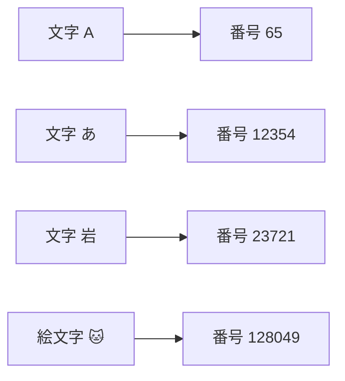
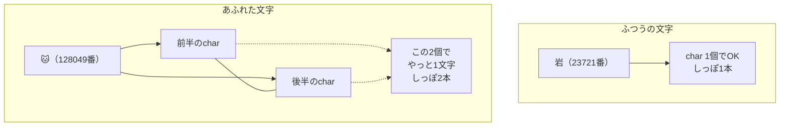
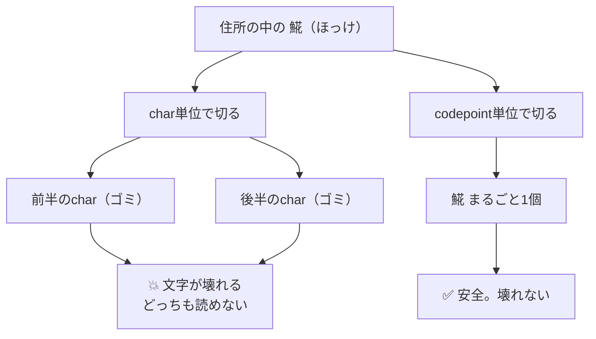
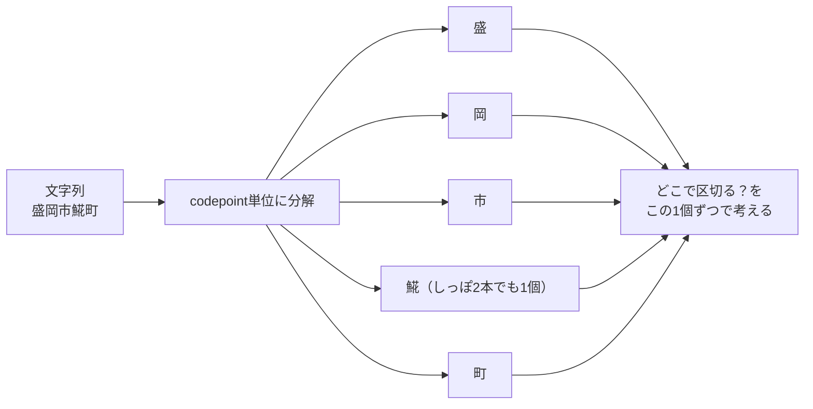

# 第1章　コンピュータは文字をどう見ている？（codepoint）

> **この章のゴール**
> - コンピュータは文字を「番号（codepoint, コードポイント）」で扱っている、と納得する
> - Java の `char` は16ビットしかなく、珍しい文字は「char 2個」で表すと知る
> - だから kugiri が **char 単位ではなく codepoint 単位** で住所を切る理由がわかる

> **登場人物**：みどり先生、ツムギ、ゲンタ、CPねこ

---

## 文字って、そもそも何でできてる？

**ツムギ**：先生、前回「コンピュータは文字を文字として見ていない」って言ってましたよね。あれ、どういうこと？

**みどり先生**：あわてない、あわてない。今日はそのエキスパートを呼んでるんだ。——CPねこ、おいで。

**CPねこ**：にゃー。よばれて出てきたにゃ。わたしは Unicode（ユニコード）と codepoint にくわしい猫にゃ。

**ゲンタ**：……猫が説明するの？　それ、意味あるの？

**CPねこ**：意味、おおありにゃ。まず質問。ツムギ、コンピュータの中身って、結局なにでできてると思うにゃ？

**ツムギ**：えっと……0と1、でしたっけ。

**CPねこ**：そのとおりにゃ！　コンピュータは **数しか** あつかえないにゃ。文字も、絵も、音も、ぜんぶ最後は数にゃ。だから文字にも、ひとつずつ **背番号** がついてるにゃ。

**みどり先生**：その背番号のことを、Unicode の世界では **codepoint（コードポイント、符号位置）** と呼ぶんだ。

> 📌 **言葉メモ**
> **codepoint（コードポイント）** ＝「この文字は何番の文字か」という、世界共通の通し番号。
> 「コード（符号）」の「ポイント（位置）」。要するに **文字の住所番号** にゃ。

---

## 文字と番号の対応表

**CPねこ**：たとえば、こういう対応がついてるにゃ。



**CPねこ**：`A` は65番、ひらがなの `あ` は12354番、漢字の `岩` は23721番……ぜんぶ世界共通で決まってるにゃ。だから日本のパソコンで打った `岩` が、アメリカのパソコンでも `岩` のまま読めるにゃ。

**ツムギ**：へえ！　文字に番号がふってあるから、ちゃんと通じるんだ。

**みどり先生**：番号の書き方には作法があってね。ふつう `U+` のあとに16進数で書く。たとえば `A` は `U+0041`。でも今日は「ただの通し番号」と思っておけば十分だよ。あわてない、あわてない。

**ゲンタ**：番号がついてるなら、もう全部解決じゃん。何が問題なの？

**CPねこ**：……ふっふっふ。ここからが本題にゃ。

---

## Java の `char` は、しっぽが短い

**CPねこ**：問題は、Java っていうプログラミング言語の `char`（チャー、文字型）にあるにゃ。`char` は **16ビット** ぶんの箱なんにゃ。

**ツムギ**：16ビット？

**みどり先生**：ビットは0か1のスイッチ1個ぶん。16ビットなら、スイッチが16個ならんでる。表せる数は……

```
2を16回かける = 65536とおり
（0番 〜 65535番 まで）
```

**みどり先生**：つまり `char` 1個では、**0番から65535番まで** の文字しか表せないんだ。

**ゲンタ**：あれ、でもさっき絵文字の 🐱 って **128049番** って言ってなかった？　65535を超えてるじゃん。

**CPねこ**：よく気づいたにゃ！　そこが大問題なんにゃ。Unicode には今や **10万種類以上** の文字があるにゃ。でも `char` のしっぽは65536とおりぶんしかない。**入りきらない** にゃ。

---

## あふれた文字は「しっぽが2本」

**CPねこ**：そこで Java はこうしたにゃ。65535番より大きい文字は、**`char` を2個くっつけて1文字** を表すことにしたにゃ。わたしはこれを「**しっぽが2本**」って呼んでるにゃ。

**ツムギ**：しっぽ2本？

**CPねこ**：そうにゃ。ふつうの文字（`あ` とか `岩` とか）は、しっぽ1本＝`char` 1個でOK。でも 🐱 みたいなあふれた文字は、しっぽが2本ないと立てないにゃ。



**みどり先生**：この「2個1組」のことを、ちゃんとした言葉では **サロゲートペア（surrogate pair, 代理対）** っていうんだ。

> 📌 **言葉メモ**
> **サロゲートペア** ＝ `char` 1個では表せない文字を、`char` 2個のペアで表すしくみ。
> CPねこ語で「しっぽが2本」。前半・後半がそろって、はじめて1文字になる。

**CPねこ**：絵文字だけじゃないにゃ。珍しい漢字や、地域でしか使わない特別な文字（**外字／PUA**、private use area）も、しっぽ2本のことが多いにゃ。

**ツムギ**：住所に珍しい漢字……あ、ありそう！　地名って変わった漢字いっぱいある！

**CPねこ**：そこにゃ！　するどいにゃ、ツムギ。

---

## char 単位で切ると、文字が真っ二つ

**みどり先生**：さあ、ここで kugiri の話につながる。kugiri は住所の文字列を「1文字ずつ」見て、どこで区切るかを決める。じゃあ、もし **`char` 1個ずつ** で区切ったらどうなる？

**ゲンタ**：……あ。しっぽ2本の文字を、しっぽの真ん中で切っちゃう？

**CPねこ**：大正解にゃ！　たとえば珍しい魚の漢字 **`𩸽`（ほっけ）** はしっぽ2本にゃ。`char` 単位でぶった切ると、こうなるにゃ。



**ツムギ**：うわー、半分こにされたら、もう `𩸽` じゃなくなっちゃう……！

**みどり先生**：そう。前半だけ、後半だけでは、どっちも意味のない「文字のかけら」なんだ。住所のなかの大事な1文字が、区切りのせいで壊れてしまう。これは絶対に避けたい。

**CPねこ**：だから kugiri のルールはひとつ。**ぜったいに codepoint 単位であつかう** にゃ。`char` 単位は禁止にゃ。1個の codepoint は、しっぽが1本でも2本でも、**まとめて1文字** としてあつかうにゃ。

---

## CPねこのまとめ図



**みどり先生**：この「1個ずつのリスト」を作るのが、これから見る kugiri のソースコードだよ。

---

## 手を動かそう

実際のソースを見てみましょう。ファイルは
`src/main/java/org/unlaxer/kugiri/label/CodePoints.java` です。

この章の主役メソッドは **`CodePoints.of`** と **`CodePoints.join`** の2つだけ。とても短いです。

```java
/** 各 codepoint を 1 要素の文字列にした列。サロゲートペア/外字PUAも 1 要素。 */
public static List<String> of(String s) {
    List<String> out = new ArrayList<>();
    s.codePoints().forEach(cp -> out.add(new String(Character.toChars(cp))));
    return out;
}

public static String join(List<String> cps) {
    return String.join("", cps);
}
```

**ゲンタ**：たった数行じゃん。これでさっきの話、ぜんぶ解決してるの？

**CPねこ**：してるにゃ。一行ずつ読むにゃ。

**`s.codePoints()`**
：これが魔法のキモにゃ。Java が用意してくれてる道具で、文字列を **codepoint 単位** で前から順に取り出してくれるにゃ。`char` 単位の `s.chars()` ではなく、わざわざ `codePoints()` を使ってるのがポイントにゃ。しっぽが2本の文字も、ちゃんと **1個** として渡してくれるにゃ。

**`Character.toChars(cp)`**
：取り出した番号（`cp`）を、もう一度ちゃんとした文字（`char` の列）に戻す道具にゃ。しっぽ2本の文字なら、ここで2個の `char` がセットで返るにゃ。それを `new String(...)` で **1個の文字列** にまとめるにゃ。

**`out.add(...)`**
：そうやって作った「1文字ぶんの文字列」を、リストに順番に足していくにゃ。

> 📌 **直感メモ**
> `of` の戻り値は `List<String>`（文字列のリスト）。
> 「なんで `List<Character>`（char のリスト）じゃないの？」と思うかもしれない。
> 答え：**しっぽ2本の文字を1個に保てるのは `String` だから**。`Character`（char 1個）だと、しっぽ2本の文字を入れられず、半分こになってしまう。だから1個ぶんを `String` にしてリストにしている。

**`join`**
：逆向きの道具にゃ。バラバラにした文字列のリストを、`String.join("", ...)` で **すきまなく連結** して、元の文字列に戻すにゃ。切って、また貼れる、というわけにゃ。

---

### 数えてみよう：`𩸽` は 1個？ 2個？

**みどり先生**：いちばん大事なところを、計算で確かめよう。珍しい漢字 `𩸽`（ほっけ）を使った、こんな小さな住所を考える。

```
入力："盛岡市𩸽町"
```

**みどり先生**：これを2つのやり方で「文字数」を数えると、答えがちがうんだ。

| 数え方 | 結果 | なぜ |
|---|---|---|
| `"盛岡市𩸽町".length()`（char 単位） | **6** | `𩸽` がしっぽ2本＝char 2個と数えられる |
| `CodePoints.of("盛岡市𩸽町").size()`（codepoint 単位） | **5** | `𩸽` がちゃんと1個と数えられる |

**ツムギ**：あ、ほんとだ！　`char` だと6になっちゃう。`盛`・`岡`・`市`・`𩸽`・`町` で5個のはずなのに、`𩸽` が2個ぶんに膨らんでる！

**CPねこ**：そうにゃ。`CodePoints.of` を通せば、ちゃんと **5個** のリストになるにゃ：

```
["盛", "岡", "市", "𩸽", "町"]   ← 4番目の 𩸽 は、しっぽ2本でも1個！
```

**みどり先生**：このリストの「1個ずつ」が、これから何章もかけて学ぶ「区切りの単位」になる。`char` で数えていたら、4番目で `𩸽` を真っ二つにして、住所がぐちゃぐちゃになっていたはずだよ。

**ゲンタ**：……なるほど。短いコードだけど、ちゃんと意味があるのか。納得した。

**CPねこ**：にゃはは。猫の説明、意味あっただろにゃ？

---

### ミニ練習

紙の上でやってみましょう（答えは下）。

1. `"あ"` を `CodePoints.of` に通すと、リストの大きさ（`size`）はいくつ？
2. 絵文字 `"🐱"` を `CodePoints.of` に通すと、リストの大きさはいくつ？　ちなみに `"🐱".length()`（char 単位）は2です。
3. `CodePoints.of("市𩸽")` の結果を `CodePoints.join` に通すと、何が返る？

<details>
<summary>答え</summary>

1. **1**。`あ` はしっぽ1本なので、1個。
2. **1**。🐱 はしっぽ2本（char では2）だけど、codepoint では **1個**。だから `size` は1。ここが char と codepoint の差！
3. **`"市𩸽"`**。バラした `["市", "𩸽"]` をすきまなく連結して、元の文字列にちゃんと戻る。

</details>

---

## 今日のまとめ

- コンピュータは文字を **番号（codepoint, コードポイント）** であつかう。文字には世界共通の通し番号がついている。
- Java の `char` は16ビット＝65536とおりしか表せない。あふれる文字（絵文字・珍しい漢字・外字PUA）は **`char` 2個＝しっぽ2本（サロゲートペア）** で1文字を表す。
- `char` 単位で住所を切ると、しっぽ2本の文字を **真っ二つに壊す** 危険がある。
- だから kugiri は **ぜったいに codepoint 単位** であつかう。`CodePoints.of` は `String.codePoints()` で1個ずつ取り出し、`Character.toChars` で文字に戻して **1個ぶんを `String`** にしてリスト化する。`join` で元に戻せる。

---

## アザミメーター

```
アザミの見え具合：█░░░░░░░░░ 8%
（コメント：住所を「壊さずに1個ずつ並べる」土台ができた。アザミの足もとの地面が、少し見えてきた。）
```

---

## 次回予告

**みどり先生**：これで住所を「1個ずつ」並べられるようになった。じゃあ次は、その1個ずつを見て「これは数字？　漢字？　ハイフン？」と **見分ける** 話だ。

**ツムギ**：見分ける……？　それ、ただ目で見ればわからない？

**みどり先生**：ふふ。それを機械にやらせるのが「分類」だよ。「ルールを書く」のと「学習させる」のは、どうちがうのか。次の章で確かめよう。

**CPねこ**：またね、にゃー。

---

[← 第0章　消えた精霊と、住所を切る機械](00-prologue.md) ・ [第2章 →](02-bunrui-towa.md)
