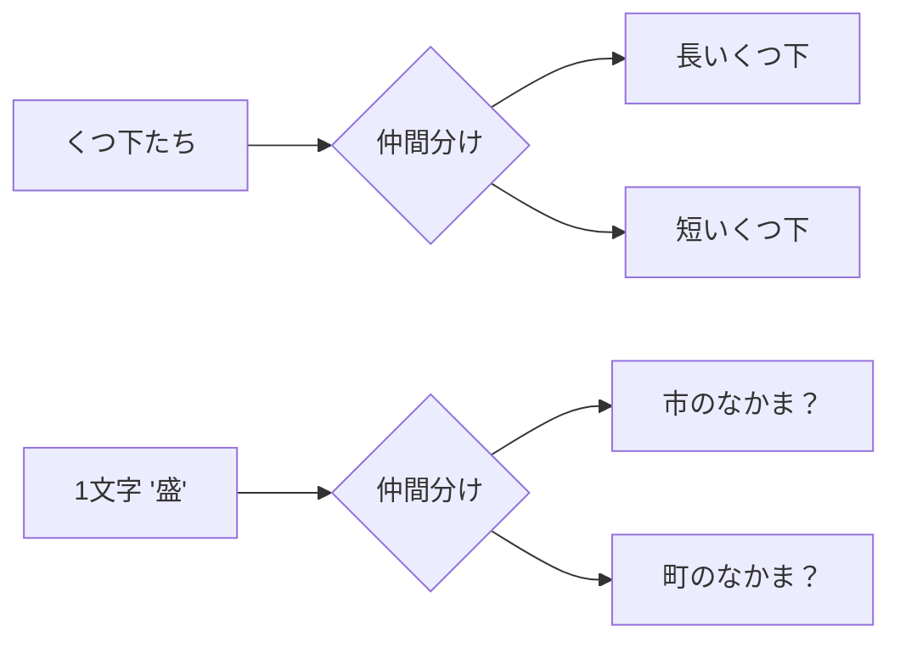
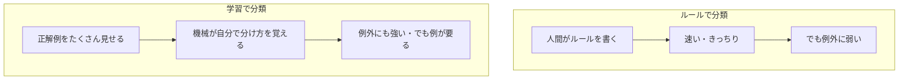
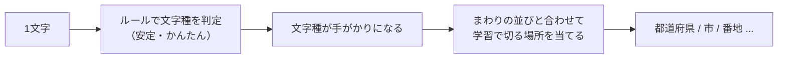
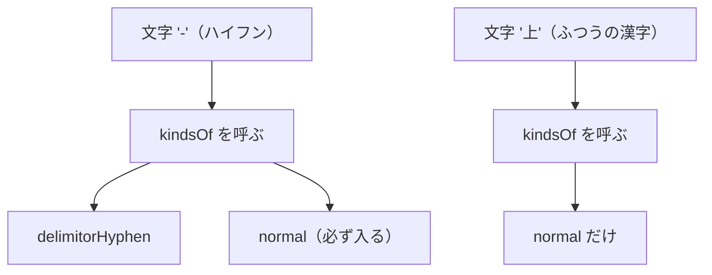
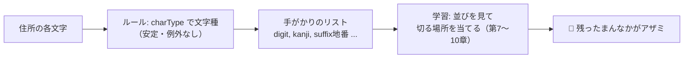

# 第2章　「分類」ってなに？（ルール vs 学習・文字種）

> **この章のゴール**
> - 「分類（classification）」＝「これは○○のなかま」と仲間分けすること、だとわかる
> - 分類には **(1) ルールで分ける** と **(2) 例から学ぶ** の2つのやり方があると知る
> - kugiri は「**文字の種類はルールで**、**並びは学習で**」と両方を組み合わせていると理解する
> - `Features.charType` が、文字を space/digit/jnum/hyphen/… に分類しているしくみをつかむ

> **登場人物**：みどり先生、ツムギ、ゲンタ、CPねこ、アザミ

---

## 「分類」って、じつは毎日やってる

**ツムギ**：先生、今日のテーマ「分類」って……なんか難しそう。

**みどり先生**：あわてない、あわてない。分類はね、君が毎日やってることだよ。
たとえば洗濯物。Tシャツ、くつ下、タオル……これを「**仲間ごとに分ける**」よね。

**ツムギ**：あ、それはやります。くつ下はくつ下でまとめる、みたいな。

**みどり先生**：それが **分類（ぶんるい、classification）** だよ。
**「これは○○のなかま」**って名札を貼ること。たったそれだけ。

**ゲンタ**：そんなの当たり前じゃん。それ、意味あるの？

**みどり先生**：それがあるんだなあ。コンピュータに分類をやらせると、いろんなことができる。
たとえば——「このメールは**迷惑メール**？ふつうのメール？」も分類。
「この写真は**ねこ**？いぬ？」も分類。
そして kugiri がやる「**この文字は『市』のなかま？『番地』のなかま？**」も、ぜんぶ分類なんだ。



**みどり先生**：上が洗濯物、下が住所の文字。やってることは同じ「仲間分け」だよね。

---

## 分類の2つのやり方

**みどり先生**：さて、ここが今日いちばん大事なところ。
分類のやり方には、大きく分けて **2種類** ある。

> **分類の2つのやり方**
> 1. **ルールで分ける**：人間が「こうなってたら○○」というルールを書く
> 2. **例から学ぶ**：たくさんの正解例を見せて、機械に分け方を覚えさせる（＝機械学習・ML）

**ゲンタ**：1つめのルール、ってどういうこと？

**みどり先生**：たとえば「**最後が『県』なら都道府県**」というルール。
これは人間が頭で考えて、そのまま書く。`if (最後 == "県") return 都道府県;` みたいにね。

**ツムギ**：あ、それ第0章でゲンタが言ってたやつだ。「ルールを書けばいいんじゃないの？」って。

**みどり先生**：よく覚えてた！　そして、その結末も覚えてるかな？

**ツムギ**：えーと……日本の住所は例外だらけで、ルールを全部書くのは無理、でした。

**みどり先生**：大正解。だから「並び（どこで切るか）」は、ルールじゃなくて **例から学ぶ** ほうを使う。



**みどり先生**：どっちが「えらい」わけじゃないよ。**得意・不得意がちがう**だけ。
ルールは速くてきっちりしてるけど、例外に弱い。
学習は例外に強いけど、たくさんの「正解例（教師データ）」が要る。

**アザミ**：……わたし（字）には、その「正解例」が無いのよね……。

**みどり先生**：そうだったね、アザミ。だから君のことは、もっと特別な方法で探す。それは第12章からのお楽しみ。

---

## kugiri は「いいとこ取り」をする

**みどり先生**：ここで kugiri の作戦を発表しよう。kugiri は **両方を組み合わせる**。

> **kugiri の作戦**
> - 「**文字の種類**」は **ルールで** 分類する（数字は数字、ひらがなはひらがな）
> - その種類を手がかりにして、「**どこで切るか（並び）**」は **学習で** 当てる

**ツムギ**：なんで、そこだけルールなんですか？　全部学習じゃダメ？

**みどり先生**：いい「なんで？」だ。理由はね、**文字の種類はすごく安定してる**から。

**みどり先生**：考えてみて。`3` はどこに出てきても数字。`あ` はどこに出てきてもひらがな。
これは住所が変わっても、ぜったいにブレない。**ルールでカチッと決められる**んだ。

**ゲンタ**：たしかに。`3` がときどきひらがなになる、なんてことはないもんな。

**みどり先生**：そう。一方で「**どこで切るか**」は、文字の種類だけじゃ決まらない。
たとえば数字の `1` が「丁目の1」なのか「番地の1」なのか「号の1」なのかは、
**まわりの並びを見ないとわからない**。だからそこは学習にまかせる。



**みどり先生**：この図の左半分が「ルール」、右半分が「学習」。
**ルールで作った『手がかり』を、学習にバトンタッチする**——これが kugiri の心臓部の入り口なんだ。

---

## 文字種（CharacterKind）：住所に特化した仲間分け

**CPねこ**：にゃ〜。文字の仲間分けの話なら、ぼくの出番だにゃ。

**みどり先生**：おっ、CPねこ。kugiri は文字種をどうやって決めてるんだっけ？

**CPねこ**：`japanese-parser-common` っていうライブラリの中に、
**`BuiltinCharacterKind`（ビルトイン・キャラクターカインド）** っていう「文字種の一覧表」があるにゃ。
これがふつうの「ひらがな・カタカナ」だけじゃなくて、**住所に特化した**仲間分けを持ってるのがミソだにゃ。

**ツムギ**：住所に特化って？

**CPねこ**：たとえばこういうのがあるにゃ。

| 文字種（名前） | なかま | 例 |
|---|---|---|
| `arabicNumber` | アラビア数字（半角も全角も） | `0`〜`9`、`０`〜`９` |
| `japaneseAddressNumber` | 漢数字 | 一 二 三 … 十 百 千 |
| `hiragana` | ひらがな | あ い う … |
| `katakana` | カタカナ | ア イ ウ … |
| `alphabet` | アルファベット | A〜Z、a〜z |
| `delimitorHyphen` | いろんなハイフン | `-` `‐` `–` `—` `−` `－` |
| `delimitorJapanese` | 区切りっぽい和字 | の ノ 之 乃 |
| `suffix丁目` | 「丁目」のしるし | 丁目 |
| `suffix地番` | 「番地」のしるし | 番地 番 |
| `suffix号` | 「号」のしるし | 号 |
| `suffix号室` | 「号室」のしるし | 号室 |
| `suffix棟` | 「棟」のしるし | 棟 号棟 号館 |
| `suffix階` | 「階」のしるし | 階 F Ｆ |
| `十干` | じっかん | 甲 乙 丙 丁 戊 … |
| `十二支` | じゅうにし | 子 丑 寅 卯 … |
| `normal` | どれでもない（ふつう） | 上 田 盛 岡 … |

**CPねこ**：見て、`suffix丁目` とか `suffix地番` とか、**住所でしか出てこない仲間**があるにゃ。
こういうのが「**ここで区切れるかも**」っていう手がかりになるんだにゃ。

**ゲンタ**：なるほど。「番地」っていう文字が出たら、その前は番地だった可能性が高い、ってことか。

**みどり先生**：そういうこと。ふつうの文字種ライブラリには「番地のしるし」なんて種類は無い。
でも住所を切るには、これがすごく効くんだ。

> 📌 **用語メモ**
> - **文字種（もじしゅ、CharacterKind）**＝文字を住所むけに仲間分けした「種類」。
> - 住所用語はソースの原表記のまま（`十干`＝じっかん、`十二支`＝じゅうにし など）。

---

## 1つの文字が、いくつもの仲間に属する

**CPねこ**：ここで大事なことを言うにゃ。**1つの文字が、複数の種類に入ることがある**にゃ。

**ツムギ**：え、ひとつの文字なのに、ふたつの仲間？

**CPねこ**：たとえばハイフン `-`。これは `delimitorHyphen`（ハイフンのなかま）でもあるし、
同時に `normal`（ふつうの文字）でもあるにゃ。

**ゲンタ**：なんで両方になるの？

**CPねこ**：仲間分けを聞く窓口の `CharacterKindRegistry.kindsOf(codePoint)`（カインズ・オブ）が、
**当てはまる種類を「集合（セット）」でぜんぶ返す**からだにゃ。
そして大事なのが——**返ってくる集合には、必ず `normal` が入ってる**にゃ。



**CPねこ**：上の図、ハイフンは2つ返ってくるけど、`上` みたいなふつうの漢字は `normal` だけ返ってくるにゃ。
**「特別な種類が見つかっても、normal はおまけで必ずつける」**——これがルールだにゃ。

**ツムギ**：なんで normal を必ずつけるの？

**みどり先生**：あわてない、あわてない。それはね、「**最後の受け皿**」をいつも用意しておくためだよ。
どんな文字でも、最低でも `normal` には属する。だから「分類できない文字」が出ない。
迷子が出ないように、いちばん大きなカゴ（normal）をいつも置いておく感じだね。

---

## Features.charType：手がかりを1つの名前にまとめる

**みどり先生**：さあ、kugiri の本物のコードを見よう。`feature/Features.java` の `charType` メソッドだ。
これは「1文字をもらって、`space`・`digit`・`jnum`・`hyphen`・… のどれか **1つの名前** を返す」関数だよ。

```java
// feature/Features.java の charType（住所むけ文字種を1つの名前にまとめる）
public static String charType(String cp) {
    int c = cp.codePointAt(0);
    Set<CharacterKind> kinds = REGISTRY.kindsOf(c);   // ← さっきの kindsOf！
    if (kinds.contains(BuiltinCharacterKind.delimitorSpace))       return "space";
    if (kinds.contains(BuiltinCharacterKind.arabicNumber))         return "digit";
    if (kinds.contains(BuiltinCharacterKind.japaneseAddressNumber)) return "jnum";
    if (kinds.contains(BuiltinCharacterKind.delimitorHyphen))      return "hyphen";
    if (kinds.contains(BuiltinCharacterKind.hiragana))             return "hira";
    if (kinds.contains(BuiltinCharacterKind.katakana))             return "kata";
    if (kinds.contains(BuiltinCharacterKind.alphabet))             return "latin";
    // normal の内訳: CJK（漢字ブロック）は kanji、それ以外は other
    Character.UnicodeBlock b = Character.UnicodeBlock.of(c);
    if (b == Character.UnicodeBlock.CJK_UNIFIED_IDEOGRAPHS
            || b == Character.UnicodeBlock.CJK_UNIFIED_IDEOGRAPHS_EXTENSION_A
            || (c >= 0x20000 && c <= 0x2FFFF)) return "kanji";
    return "other";
}
```

**ツムギ**：うわ、`if` がいっぱい……。でも、なんか規則的。

**みどり先生**：よく見て。やってることは2段階だけだよ。

> **charType がやっていること**
> 1. `kindsOf(c)` で、その文字の **種類の集合** をもらう（ここまでが第1ステップの「文字種」）
> 2. その集合に何が入ってるかを **上から順にチェック**して、最初に当たった名前を返す

**ゲンタ**：なるほど。`contains`（コンテインズ＝「ふくまれてる？」）で、集合に種類が入ってるか聞いてるんだな。

**みどり先生**：そう。そして **順番が大事**。上から `space` → `digit` → `jnum` → … と見ていく。
さっきの「1文字が複数の仲間に属する」を思い出して。
もし複数当てはまっても、**上に書いてあるほうが勝つ**んだ。

**ツムギ**：だから「いちばん意味のある種類」を上に書いておくんですね。

**みどり先生**：そのとおり。そして最後。`space` でも `digit` でも… でもない文字は、
集合的には `normal` のなかま。それをさらに2つに分ける——
**漢字のブロックに入ってたら `kanji`、それ以外は `other`**。

**CPねこ**：ここで Unicode の「ブロック」が出てくるにゃ。
漢字は Unicode 上でまとまった範囲（CJK統合漢字）に住んでるから、その住所を見れば漢字かどうかわかるにゃ。
`0x20000`〜`0x2FFFF` は **しっぽが2本（サロゲートペア）** で表す追加漢字のエリアだにゃ。外字にもちゃんと対応にゃ。

---

## なぜ「ルールで文字種・学習で並び」と分けるのか（まとめの直感）

**みどり先生**：ここで今日いちばん大事な考え方を、もう一度。

**みどり先生**：`charType` は **完全にルール**だよね。`if` で書いてあるだけ。機械学習はどこにも無い。
でも、これだけでは住所は切れない。なぜなら——

**ツムギ**：数字の `1` が、丁目なのか番地なのか号なのか、文字種だけじゃ決まらないから！

**みどり先生**：完璧！　文字種は **安定した手がかり**を作るだけ。
その手がかりを**どう組み合わせて切るか**は、まわりの並びしだい。だから学習にまかせる。



**ゲンタ**：きれいに役割分担してるんだな。ルールが得意なところはルール、苦手なところは学習、と。

**みどり先生**：そういうこと。**安定してるものはルールで、ブレるものは学習で**。
これは ML の世界でとても大事な感覚だよ。あわてない、あわてない。今日はここがわかれば大成功だ。

---

## 手を動かそう

紙とえんぴつで、いくつかの文字を**手で分類**してみましょう。
それぞれ「どの文字種（BuiltinCharacterKind）に当てはまる？」と「`charType` は何を返す？」を考えます。

対象の文字：`3`　`三`　`丁`　`の`　`-`　`あ`

<details>
<summary>こたえ</summary>

| 文字 | 当てはまる文字種（＋必ず normal） | `charType` の結果 | ひとこと |
|---|---|---|---|
| `3` | `arabicNumber`, normal | **`digit`** | 半角でも全角 `３` でも digit |
| `三` | `japaneseAddressNumber`, normal | **`jnum`** | 漢数字は jnum（digit ではない！） |
| `丁` | `normal` のみ（漢字） | **`kanji`** | 「丁目」になると `suffix丁目` も付くが、単独の「丁」は normal → 漢字ブロックなので kanji |
| `の` | `delimitorJapanese`, `hiragana`, normal | **`hira`** | 複数の仲間に属する。でも charType は上から見て `hiragana` に先に当たる → hira |
| `-` | `delimitorHyphen`, normal | **`hyphen`** | normal も含むが、上にある delimitorHyphen が勝つ |
| `あ` | `hiragana`, normal | **`hira`** | ひらがな |

ポイント：
- `3` と `三` は人間には「どっちも数字」だけど、kugiri は **digit と jnum に分けて**いる。書き方がちがうと切れ方も変わるから。
- `の` のように **いくつもの仲間に属する**文字は、`charType` の **上から順**のチェックで「どの名前で代表させるか」が決まる。
- どの文字も、集合には必ず `normal` が入っている（最後の受け皿）。

</details>

実際に動かして確かめたいときは、こんな小さなコードで試せます（`charType` は `public static` なので直接呼べます）。

```java
for (String ch : new String[]{"3", "三", "丁", "の", "-", "あ"}) {
    System.out.println(ch + " -> " + org.unlaxer.kugiri.feature.Features.charType(ch));
}
// 期待: 3 -> digit / 三 -> jnum / 丁 -> kanji / の -> hira / - -> hyphen / あ -> hira
```

---

## 今日のまとめ

- **分類（classification）**＝「これは○○のなかま」と仲間分けすること。毎日やってる洗濯物と同じ。
- 分類には2つのやり方：**(1) ルールで分ける**（速い・例外に弱い）、**(2) 例から学ぶ**（例外に強い・教師データが要る）。
- kugiri は **いいとこ取り**。**文字の種類はルールで**（安定してるから）、**どこで切るかは学習で**（まわりの並びしだいだから）。
- 文字種は `BuiltinCharacterKind` が持つ住所特化の仲間分け（`arabicNumber`・`japaneseAddressNumber`・`suffix地番`・`delimitorHyphen`・`十干`・`十二支` …）。これが区切りの手がかりになる。
- 1つの文字は複数の種類に属しうる。`CharacterKindRegistry.kindsOf` は当てはまる種類の集合を返し、**必ず `normal` を含む**（最後の受け皿）。
- `Features.charType` は、その集合を **上から順にチェック**して `space/digit/jnum/hyphen/hira/kata/latin/kanji/other` のどれか1つに代表させる。

---

## アザミメーター

```
アザミの見え具合：█░░░░░░░░░ 12%
（コメント：文字を「仲間分け」する目を手に入れた。アザミの居場所の手がかりが、少し見えてきた。）
```

---

## 次回予告

**みどり先生**：今日は「分け方」を学んだ。次は「**どれくらいありそうか**」を数で言う方法だ。

**ツムギ**：どれくらいありそうか……？

**みどり先生**：そう、**確率（かくりつ）**。むずかしくないよ。**数えて、割るだけ**だ。
教師なしでアザミを探すときに、これがどうしても要るんだ。次の章へ。

[← 第1章](01-moji-to-codepoint.md) ・ [第3章 →](03-kakuritsu.md)
