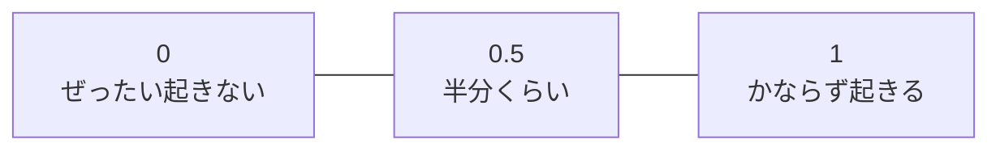
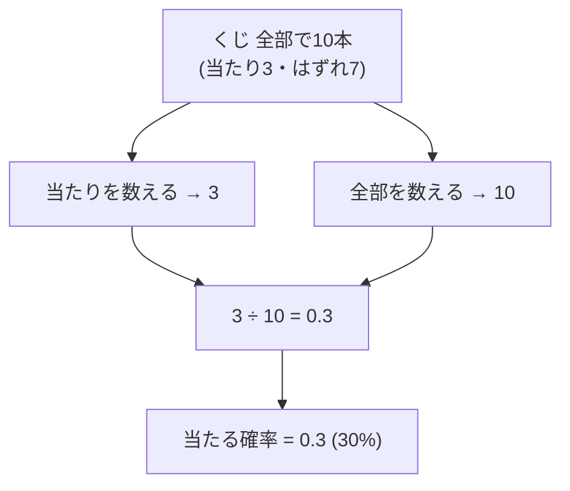
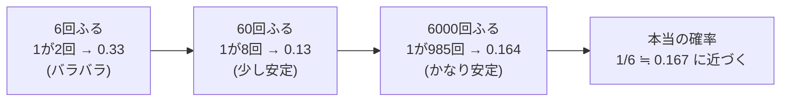
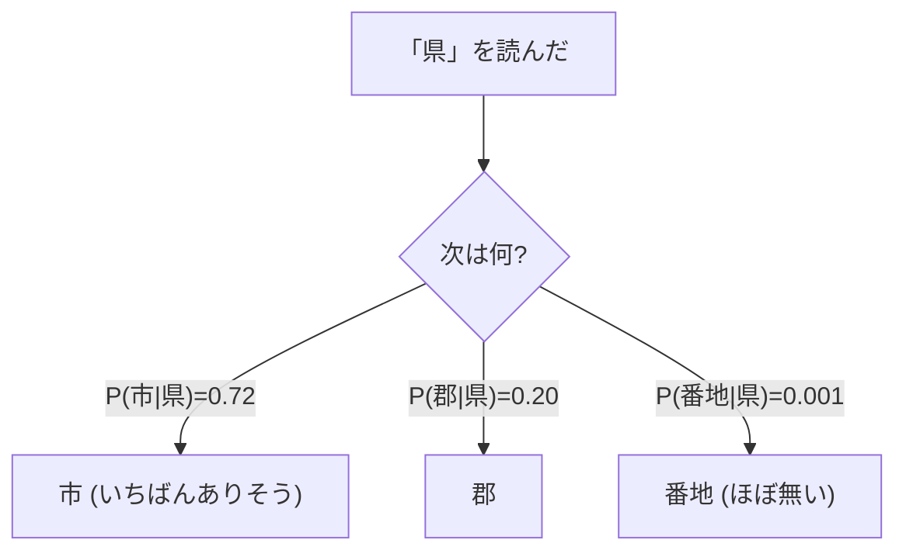
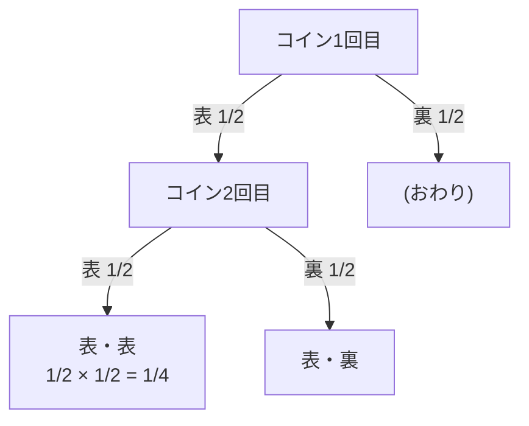

# 第3章　確率のきほん（数えて、割るだけ）

> **この章のゴール**
> - **確率（かくりつ、probability）** ＝「100回やったら、何回起きるか」だと納得する
> - いちばん基本の確率は **「数えて、割る」** だけだと体感する
> - **条件つき確率（じょうけんつきかくりつ、conditional probability）** ＝「Aが起きたとき、Bも起きる割合」を、住所でつかむ（→第9・13〜15章の土台）

> **登場人物**：みどり先生、ツムギ、ゲンタ、ポストくん

---

## 「確率」って、こわくない

**ツムギ**：先生、次は「確率」ですか……。なんか、当たるとか外れるとか、ギャンブルっぽくてニガテです。

**みどり先生**：あわてない、あわてない。確率はね、ぜんぜんこわくないよ。
ひとことで言うと——**「100回やったら、何回起きるか」**。それだけだ。

**ゲンタ**：100回？　なんで100回なんですか。

**みどり先生**：たとえ話のための回数だよ。
「このくじ、当たる確率は3割」って言ったら、**「100回ひいたら、だいたい30回当たる」**って意味だよね。

**ツムギ**：あ、それは分かります。3割＝30％＝……えっと、0.3。

**みどり先生**：そう！　確率は **0から1までの数**（または0%から100%）で表すんだ。

> 📌 **読み方メモ：確率の大きさ**
> - 確率 **0** ＝ ぜったいに起きない（くもりのち雨で「雪の確率0%」みたいな）
> - 確率 **1**（＝100%）＝ かならず起きる
> - 確率 **0.3**（＝30%）＝「100回やったら、だいたい30回」



**みどり先生**：上の図は「確率のものさし」。左にいくほど起きにくく、右にいくほど起きやすい。
ぜんぶこのあいだの数だ。1をこえる確率も、マイナスの確率も、この世には無い。

---

## いちばん基本の確率：数えて、割る

**みどり先生**：じゃあ、その確率って、どうやって出すと思う？　ツムギ。

**ツムギ**：うーん……占い？

**みどり先生**：ふふ、ちがう。**数えて、割る**だけなんだ。式にするとこう。

$$
\text{確率} = \frac{\text{起きた回数}}{\text{全部の回数}}
$$

> 📌 **読み方メモ：この分数**
> - 上（分子）＝ 「ねらってる出来事が **起きた回数**」
> - 下（分母）＝ 「**全部で何回**やったか」
> - 横線は「÷（わる）」。だから式は **「起きた回数 ÷ 全部の回数」** とまったく同じ。
> - 気持ち：たくさんのうち、何回ぶんを占めてるか＝**割合（わりあい）**だね。

**みどり先生**：くじ引きで考えよう。袋のなかに、当たりくじが3本、はずれが7本。ぜんぶで10本。

**ツムギ**：当たりの確率は……当たり3本 ÷ ぜんぶ10本 ＝ 3/10 ＝ 0.3！　3割だ！

**みどり先生**：大正解。**数えて、割る**。これが確率のいちばんの土台だよ。



**ゲンタ**：あれ、これってクラスのアンケートと同じですよね。「好きな食べ物カレーの人 12人 ÷ クラス40人 ＝ 0.3」みたいな。

**みどり先生**：まさにそれ。**サイコロ**でも、**くじ**でも、**アンケート**でも、ぜんぶ同じ。
「ねらいの数」を数えて、「全部の数」で割る。それだけで確率になる。

---

## 頻度：たくさん数えるほど、本物に近づく

**ツムギ**：先生、ちょっと気になったんですけど。サイコロで「1の出る確率は 1/6」って習いました。でも、わたしが6回ふっても、1が1回だけ出るとはかぎらないですよね？

**みどり先生**：おお、するどい「なんで？」だ。そのとおり。6回ふって1が0回かもしれないし、3回かもしれない。
ここで大事なのが **頻度（ひんど、frequency）** という言葉。

> 📌 **ことばメモ：頻度**
> **頻度** ＝ 「実際に **数えた回数そのもの**」。
> たとえば「サイコロを600回ふって、1が95回出た」の **95** が頻度。
> その頻度を全部の回数で割ると確率（の見積もり）になる：95 ÷ 600 ≒ 0.158。

**みどり先生**：おもしろいのはここから。**たくさん数えるほど**、割り算で出した確率が、本当の確率（1/6 ≒ 0.167）に **近づいていく**んだ。



**ゲンタ**：回数が少ないと結果がブレるけど、回数を増やすと落ち着くってことか。

**みどり先生**：そう。これを大人の言葉で **大数（たいすう）の法則**っていう。むずかしい名前だけど、気持ちはかんたん。
**「いっぱい数えれば、本当の割合が見えてくる」**。それだけ。

**ツムギ**：だから、アンケートも10人より100人にきいたほうが「本当の人気」が分かるんですね。

**みどり先生**：その感覚で完璧だよ。
——そしてね、kugiri も、まさにこれをやってる。**たくさんの住所を数えて、割って**、確率を見積もるんだ。
データが多いほど、その見積もりが正確になる。

---

## 条件つき確率：「Aのあとに、Bが来る割合」

**みどり先生**：さあ、ここからが今日のいちばん大事なところ。ポストくん、出ておいで。

**ポストくん**：ピッ、確認しました。郵便配達ロボット、ポストくんです。
わたくし、体に住所データ KEN_ALL.CSV を積んでおります。住所のことなら、おまかせを。

**みどり先生**：ポストくん、住所って「県」の次には、何が来ることが多い？

**ポストくん**：ピッ、確認しました。**「県」の次は、ほぼ「市」か「郡」**でございます。
「岩手県 **盛岡市**」「青森県 **三戸郡**」のように。県の次にいきなり「番地」が来ることは、まずありません。

**みどり先生**：これだよ、これ。
「**県が来た。じゃあ、その次に市が来る割合は？**」——こういう **「○○が起きたとき、△△も起きる割合」** を、**条件つき確率**っていうんだ。

**ツムギ**：条件……つき？

**みどり先生**：「県のあと」っていう **条件**をつけて、確率を考えるからだよ。記号で書くとこう。こわがらないで。

$$
P(\text{市} \mid \text{県}) = \frac{\text{「県のあとに市」が来た回数}}{\text{「県」が来た回数 ぜんぶ}}
$$

> 📌 **読み方メモ：P(市 | 県)**
> - `P` ＝ probability（プロバビリティ）の頭文字。「〜の確率」を表すおまじない。
> - `|`（たてぼう）＝ 「〜という条件のもとで」と読む。英語の "given"（given：〜が与えられたとき）。
> - だから `P(市 | 県)` は **「県が来たという条件のもとで、市が来る確率」**。声に出すなら「ピー・市・じょうけん・県」でOK。
> - 気持ち：やってることは、やっぱり **数えて、割る** だけ。
>   ただし「全部」じゃなくて「**県のあと、という場面だけ**」を数えて割る。

**みどり先生**：たとえば、データのなかで「県」が1000回出てきて、そのうち「県のすぐあとが市」だったのが720回だったとする。すると——

$$
P(\text{市} \mid \text{県}) = \frac{720}{1000} = 0.72
$$

**ツムギ**：県のあとは、72%の確率で市！　……これ、なんか、住所を当てる役に立ちそう。

**みどり先生**：めちゃくちゃ役に立つ。だって、「いま読んでるのが県だ」と分かったら、**次は市っぽい、と先まわりして予想できる**よね。



**ゲンタ**：なるほど。これ、意味あるわ。
「次に来やすいもの」が確率で分かってれば、変な切り方を防げる。

**みどり先生**：そのとおり！　この **「Aの次にBが来る割合」＝条件つき確率**が、
このあと第9章の **「遷移（せんい）」**（ラベルからラベルへ移る道）や、
第13〜15章の **教師なし字推定**で、ものすごく効いてくるんだ。今日はその種をまいておこう。

---

## かけ算：両方とも起きる確率

**みどり先生**：確率には、もうひとつ大事な計算がある。**かけ算**だ。

**みどり先生**：たとえば、コインを2回投げて、**2回とも表**が出る確率は？

**ツムギ**：1回目が表の確率が 1/2 で……2回目も表が 1/2 で……えーと？

**みどり先生**：おたがいに関係ない（一方が他方に影響しない）出来事——これを **独立（どくりつ、independent）**な出来事という——が **両方とも起きる**確率は、**かけ算**で出すんだ。

$$
P(\text{表 かつ 表}) = \frac{1}{2} \times \frac{1}{2} = \frac{1}{4}
$$

> 📌 **読み方メモ：かつ**
> 「表 **かつ** 表」＝「表でも **あって**、表でも **ある**」＝両方そろう、という意味。
> 両方そろう確率は **それぞれの確率をかける**。気持ちは「半分の、そのまた半分」。



**ゲンタ**：4通り（表表・表裏・裏表・裏裏）のうち1つだから 1/4。たしかに、数えて割っても同じになりますね。

**みどり先生**：いいね、ゲンタ。どっちで考えても同じ答えになる。

**ツムギ**：でも先生、かけ算って……数がどんどん小さくなりますよね？　1/2 を10回かけたら……。

**みどり先生**：おお、よく気づいた。それが今日いちばんの **伏線（ふくせん）**だ。
1/2 を10回かけると `1/1024`、つまり約 0.001。20回なら 100万分の1。
**確率はかければかけるほど、おそろしく小さくなる**んだ。

**ツムギ**：住所って、何文字もありますよね。1文字ずつの確率を全部かけたら……。

**みどり先生**：そう、**ものすごく小さい数**になってしまう。コンピュータでもうまく扱えないくらいにね。
そこで登場するのが、第5章の魔法 **log（ログ）**——**かけ算を足し算に変える**道具だ。
でも、それはまた次回。あわてない、あわてない。

---

## 手を動かそう

### その1：袋の玉（数えて、割る）

赤玉が4個、白玉が6個、青玉が2個。ぜんぶで12個の玉が袋に入っています。
目をつぶって1個取り出すとき——

1. **赤玉**が出る確率は？
2. **白玉**が出る確率は？
3. **赤か青**が出る確率は？

<details>
<summary>こたえ</summary>

ぜんぶで 4 + 6 + 2 = **12個**。

1. 赤 4 ÷ 12 = **1/3 ≒ 0.33（33%）**
2. 白 6 ÷ 12 = **1/2 = 0.5（50%）**
3. 赤か青は (4 + 2) ÷ 12 = 6 ÷ 12 = **1/2 = 0.5（50%）**
   （「赤か青」は、赤の個数と青の個数を **足して**から割る）

</details>

### その2：サイコロのかけ算

ふつうのサイコロ（1〜6）を2回ふります。

1. 1回目が **偶数**（2,4,6）の確率は？
2. **2回とも偶数**の確率は？（1回目と2回目は独立）

<details>
<summary>こたえ</summary>

1. 偶数は3面（2,4,6）。3 ÷ 6 = **1/2 = 0.5**
2. 独立なので **かけ算**：1/2 × 1/2 = **1/4 = 0.25（25%）**

</details>

### その3：住所データで「数えて割る」（kugiri の感覚）

ポストくんの KEN_ALL.CSV から、市区町村の名前を5個だけ取り出してみました。

```
盛岡市
三戸郡
横浜市
渋谷区
姫路市
```

**問題**：この5個のうち、**「市」で終わる**ものの割合（確率）は？

<details>
<summary>こたえ</summary>

「市」で終わるのは `盛岡市` `横浜市` `姫路市` の **3個**。全部で **5個**。

確率 = 3 ÷ 5 = **0.6（60%）**

つまり、この小さなデータでは「市区町村の名前は、6割が『市』で終わる」と見積もれます。
——でも、たった5個では当てになりません（**大数の法則**！）。
本物の kugiri は、何万件もの住所を **数えて、割って**、もっと正確な割合を求めます。
こうやって集めた確率が、第13〜15章で「字の区切り目」を当てる材料になるのです。

</details>

> 💡 **ちょっと予告**：上の例では「最後の1文字」だけ見ました。
> もし「**『市』を読んだあと、次に何が来るか**」を数えて割れば、それが **条件つき確率** `P(次 | 市)` です。
> kugiri はこの「次に来やすさ」を山ほど数えて、住所の切り方の手がかりにしています。

---

## 今日のまとめ

- **確率**＝「100回やったら、何回起きるか」。**0から1**（または0%〜100%）の数。
- いちばん基本の確率は **「数えて、割る」**：起きた回数 ÷ 全部の回数。
- **頻度**＝数えた回数そのもの。**たくさん数えるほど**、割り算した確率が本当の確率に近づく（大数の法則）。
- **条件つき確率** `P(B | A)`＝「Aが起きたとき、Bも起きる割合」。
  住所では「県のあとに市が来る割合」など。第9章の遷移・第13〜15章で大活躍。
- **独立な出来事が両方起きる**確率は **かけ算**（コイン2回とも表＝1/2×1/2）。
  ただしかけると数が小さくなりすぎる → 第5章の **log** につながる伏線。

---

## アザミメーター

```
アザミの見え具合：██░░░░░░░░ 16%
（コメント：「数えて割る」で割合が出せるようになった。アザミがどこに『出やすいか』を測る目盛りが見えてきた。）
```

---

## 次回予告

**みどり先生**：これで「確率」と「割合」は手に入れた。
でも次は、ちょっと寄り道して **数のならび＝ベクトル**と、その「合計点の出し方＝内積」を学ぶよ。

**ツムギ**：ベクトル……また名前がこわいやつだ。

**みどり先生**：あわてない、あわてない。中身は「数字をならべて、かけて足すだけ」さ。
パーセも待ってる。次の章へ。

[← 第2章](02-bunrui-towa.md) ・ [第4章 →](04-vector-naiseki.md)
