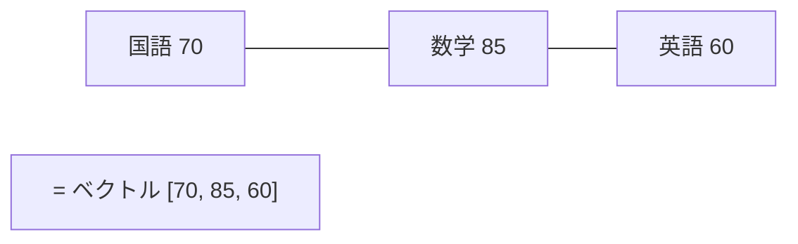
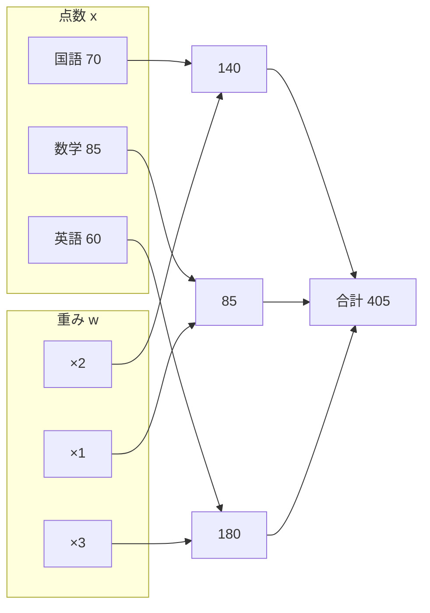
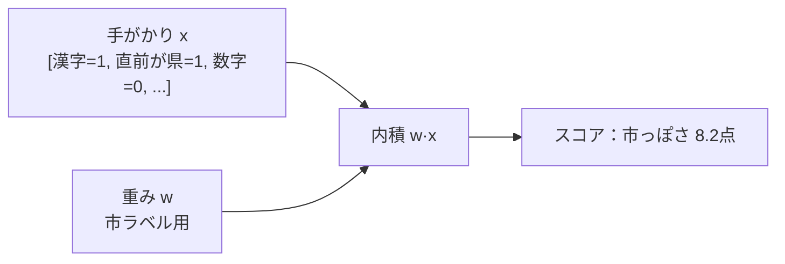

# 第4章　ベクトルと内積（数字のならびと「かけて足す」）

> **この章のゴール**
> - 「ベクトル」＝ただの**数字のならび**だと納得する
> - 「内積（ないせき）」＝**同じ場所どうしをかけて、ぜんぶ足す**を計算できる
> - 内積が「**手がかりの強さの合計点**」になる感覚をつかむ（→第8章の予習）

> **登場人物**：みどり先生、ツムギ、ゲンタ、パーセ

---

## 「ベクトル」ってこわい言葉だけど

**ツムギ**：先生、次は「ベクトル」と「内積」って書いてあります……。もう名前からして無理そう。

**みどり先生**：あわてない、あわてない。
**ベクトル**っていうのはね、難しく考えなくていい。ただの「**数字のならび**」だよ。

**ゲンタ**：ならび？

**みどり先生**：たとえば、テストの点数。国語70、数学85、英語60。
これを順番にならべて `[70, 85, 60]` と書いたら、もうこれがベクトルだ。



**ツムギ**：え、それだけ？　ただ点数を並べただけじゃん。

**みどり先生**：それだけ。**「いくつかの数を、順番を決めてまとめたもの」**——それがベクトル。
数の個数を「**次元（じげん）**」っていう。`[70, 85, 60]` は3次元のベクトルだ。

> 📌 **読み方メモ**
> ベクトルは太字や矢印で書くことが多い。たとえば **v** = [70, 85, 60]。
> このコースでは、ただの「数字のならび」と思ってOK。

---

## 内積：同じ場所どうしを「かけて足す」

**みどり先生**：さて、ここからが本番。**内積（ないせき、dot product）**だ。
2つの同じ長さのベクトルがあるとき、内積はこうやって計算する。

> **内積のやり方**
> 1. 同じ場所どうしを **かける**
> 2. その結果を **ぜんぶ足す**

**みどり先生**：例でやろう。重みベクトル **w** = [2, 1, 3]、点数ベクトル **x** = [70, 85, 60]。

```
内積 = 2×70 + 1×85 + 3×60
     = 140  +  85  + 180
     = 405
```

**ツムギ**：あ、これならできる！　かけて、足すだけだ。

**みどり先生**：そう。記号で書くとこうなる。こわがらないで。

$$
\mathbf{w}\cdot\mathbf{x} = \sum_{i} w_i \times x_i
$$

> 📌 **読み方メモ**
> - `w·x`（ダブリュー・ドット・エックス）＝「w と x の内積」
> - `Σ`（シグマ）＝「**ぜんぶ足す**」記号。下に `i`、つまり「場所 i を 1番目、2番目…と全部動かして足す」
> - `wᵢ`（ダブリュー・アイ）＝ w の i 番目の数
> - つまりこの式は、さっきの「同じ場所どうしをかけて、ぜんぶ足す」を記号にしただけ。

---

## 内積は「重みつきの合計点」

**ゲンタ**：計算はわかった。でも、これ、何がうれしいの？　意味あるの？

**みどり先生**：いい質問。内積はね、**「重みをつけた合計点」**だと思うと、ぐっと意味が出る。

さっきの **w** = [2, 1, 3] は「**どの教科をどれくらい重視するか**」だと考えてみて。
- 国語の重み 2
- 数学の重み 1
- 英語の重み 3（英語をいちばん重視！）

**みどり先生**：すると内積 405 は、「**この重視のしかたでの、その人の総合点**」になる。



**ツムギ**：英語を重視すると、英語が得意な人の点が上がるってことか。

**みどり先生**：そのとおり！　**重み w を変えると、「何を大事にするか」が変わる**。
この「重みを調整して、いい点の出し方を見つける」——これが、じつは
**機械学習の心臓部**なんだよ。

---

## kugiri ではどう使う？（予告）

**パーセ**：はじめまして！　ぼく、パーセ。第8章で大活躍するよ。
じつはぼくの仕事、いまの「内積」そのものなんだ。

**みどり先生**：パーセはね、住所の1文字ごとに、
「この文字は『市』っぽい？『番地』っぽい？」を**点数（スコア）**で出す。
そのスコアの計算が、まさに内積なんだ。

- **x**（手がかり）＝「この文字は漢字？数字？前の文字は『市』だった？」を 0/1 で並べたベクトル（→第7章）
- **w**（重み）＝「その手がかりは『市』ラベルにどれくらい効くか」を並べたベクトル
- **スコア = w·x**（内積）＝「この文字が『市』である強さ」



**ゲンタ**：なるほど、だから内積を先にやるのか。点数の出し方そのものだから。

**みどり先生**：そういうこと。あわてない、あわてない。今日は内積ができれば100点だ。

---

## 手を動かそう

紙とえんぴつで、内積を3回計算してみましょう。

1. **w** = [1, 1, 1]、**x** = [3, 4, 5] → 内積は？
2. **w** = [5, 0, 0]、**x** = [3, 4, 5] → 内積は？（重み 5,0,0 は「1番目だけ重視」）
3. **w** = [-1, 1, 0]、**x** = [3, 4, 5] → 内積は？（マイナスの重みもアリ！）

<details>
<summary>こたえ</summary>

1. 1×3 + 1×4 + 1×5 = **12**（ただの合計）
2. 5×3 + 0×4 + 0×5 = **15**（1番目だけ見ている）
3. (-1)×3 + 1×4 + 0×5 = **1**（「2番目−1番目」を見ている。マイナスは「逆に効く手がかり」）

</details>

そして、Java での内積はたった数行です（第8章の `PerceptronTagger.emission` がこの形）。

```java
double dot = 0;
for (int i = 0; i < w.length; i++) {
    dot += w[i] * x[i];   // かけて、足す
}
```

たったこれだけ。ベクトルと内積は、もうあなたのものです。

---

## 今日のまとめ

- **ベクトル**＝数字のならび（個数を「次元」という）。
- **内積**＝同じ場所どうしを**かけて、ぜんぶ足す**。記号は `w·x` や `Σ wᵢxᵢ`。
- 内積は「**重みつきの合計点**」。重み w を変えると「何を大事にするか」が変わる。
- kugiri では、内積が「この文字は○○ラベルっぽい」というスコアの正体になる（第8章）。

---

## アザミメーター

```
アザミの見え具合：██░░░░░░░░ 20%
（コメント：点数の出し方＝内積がわかった。アザミを測る「ものさし」の形が見えてきた。）
```

---

## 次回予告

**みどり先生**：内積で「足し算の点数」は出せるようになった。
でも、教師なし学習では「**かけ算した確率**」をたくさん扱う。これがやっかいでね……。

**ツムギ**：かけ算、得意ですよ？

**みどり先生**：0.001 × 0.002 × 0.0005 × …… を100回やったら？

**ツムギ**：……うっ、ものすごく小さい数に……。

**みどり先生**：そこで登場するのが「**log（ログ）**」という魔法だ。次の章へ。

[← 第3章](03-kakuritsu.md) ・ [第5章 →](05-log-to-jouhou.md)
