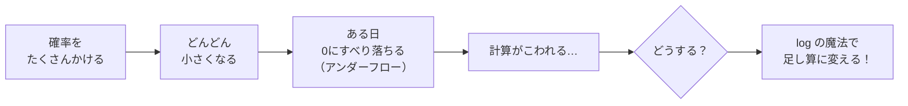
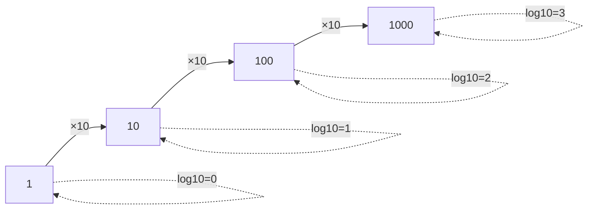
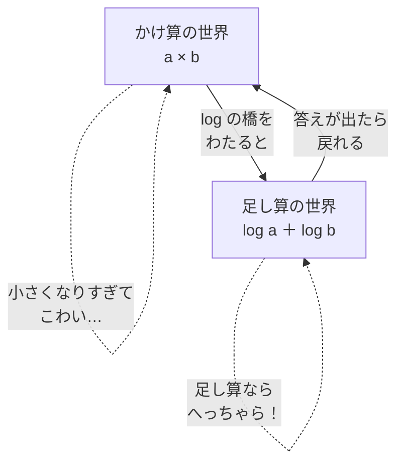
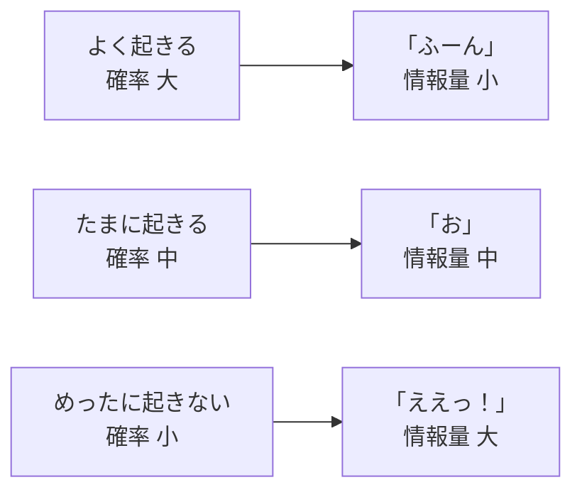
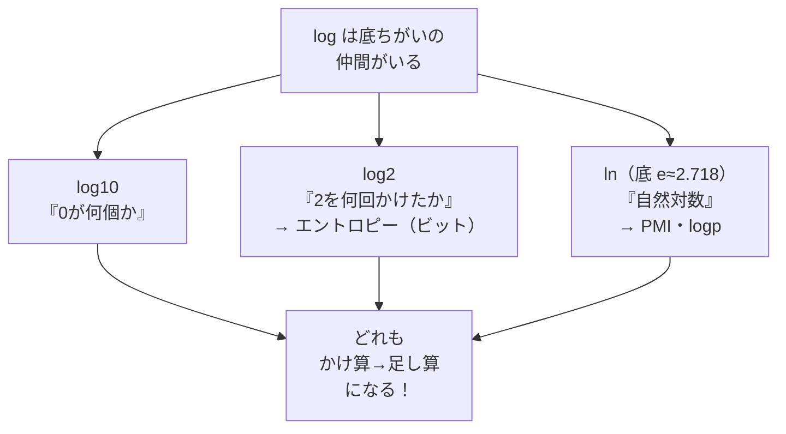

# 第5章　log と情報量（だいたい何桁か、を測る魔法）

> **この章のゴール**
> - `log`（ログ、対数）＝「**だいたい何桁か**／**何回かければ届くか**」を測るものさしだとわかる
> - いちばん大事な性質 `log(a×b) = log(a) + log(b)`、つまり「**かけ算が足し算に変わる**」をつかむ
> - **情報量（じょうほうりょう）＝ −log(確率)**＝「**起きたときのびっくり度**」だと納得する

> **登場人物**：みどり先生、ツムギ、ゲンタ、アザミ

---

## 前回のつづき：かけ算した確率は、小さくなりすぎる

**ツムギ**：先生、第4章のおわりにモヤモヤが残ってるんですけど……。
確率をたくさんかけると、ものすごく小さい数になっちゃうって話。

**みどり先生**：いい引っかかり方だ。あわてない、あわてない。まず、どれくらい小さくなるか、見てみよう。

**みどり先生**：たとえば、ひとつの確率が 0.1（10回に1回）だとするね。
これを何回もかけていくと——

```
0.1                       = 0.1
0.1 × 0.1                 = 0.01
0.1 × 0.1 × 0.1           = 0.001
…
0.1 を 100回かけると       = 0.000……0001（0が100個）
```

**ゲンタ**：うわ、0が100個。これ、コンピュータで扱えるの？

**みどり先生**：そこなんだ。コンピュータが数を入れておく箱には**底（そこ）がある**。
小さすぎる数は、ある日とつぜん **0 にすべり落ちてしまう**。これを
**アンダーフロー（underflow、桁あふれの逆）**っていう。

**ツムギ**：せっかく計算したのに、0になっちゃうの……？

**みどり先生**：そう。だから kugiri みたいに「確率をたくさんかける」プログラムは、
**そのままでは動かない**。ここで魔法の道具が登場する。それが `log`（ログ）だ。



---

## log って、なに？　①「だいたい何桁か」を測るものさし

**みどり先生**：`log`（ログ、対数〔たいすう、logarithm〕）は、こわい顔をしてるけど、
正体はやさしいんだ。ひとことで言うと——

> 📌 **log の気持ち（その1）**
> `log` ＝「**その数は、だいたい何桁か**」を測るものさし。

**みどり先生**：とくに **底（てい）が 10 の log**（`log10` と書く）は、
「**0 が何個ついてるか**」にすごく近い感覚なんだ。

```
log10(10)      = 1   ← 0が1個
log10(100)     = 2   ← 0が2個
log10(1000)    = 3   ← 0が3個
log10(10000)   = 4   ← 0が4個
```

**ツムギ**：あ、ほんとだ！　0の数とぴったり同じ！

**みどり先生**：そう。`log10(1000) = 3` は、「1000は、だいたい3桁の数（正確には4桁だけど、けたの感覚）」
「10を3回かけると1000になる」という意味だ。



**みどり先生**：図を見て。10倍するたびに、log10 は **ちょうど +1 ずつ**増えていく。
「10倍ごとに1段あがる階段」——それが log なんだ。
**大きな数を、小さな『段数』に変えてくれる**道具、と思ってもいい。

---

## log って、なに？　②「何回かければ届くか」

**ゲンタ**：底が10じゃないやつもあるって聞いたけど。

**みどり先生**：あるよ。**底が2の log**（`log2` と書く）だ。
こっちは「**2を何回かければ、その数に届くか**」を数える。

> 📌 **log の気持ち（その2）**
> `log2(x)` ＝「**2 を何回かけたら x になるか**」。つまり**かけ算の回数を数える**。

```
log2(2)   = 1   ← 2を1回 → 2
log2(4)   = 2   ← 2を2回 → 2×2=4
log2(8)   = 3   ← 2を3回 → 2×2×2=8
log2(16)  = 4   ← 2を4回 → 2×2×2×2=16
```

**ツムギ**：`log2(8) = 3` は、「2を3回かけたら8」だから3、ってこと？

**みどり先生**：そのとおり！　完ぺき。
底が10でも2でも、考え方は同じ。**「底（その数）を何回かければ届くか」を数えてるだけ**。
底が10なら「10を何回」、底が2なら「2を何回」。それだけのちがいだよ。

**ゲンタ**：じゃあ、底はなんでもいいの？

**みどり先生**：気持ちはどの底でも同じ。ただ、**場面によって便利な底がちがう**。
あとで出てくるけど、kugiri では場所によって底2を使ったり、もうひとつの底（自然対数）を使ったりする。
そこは終わりのほうで、ちゃんと説明するからね。あわてない、あわてない。

---

## いちばん大事な魔法：かけ算が、足し算に変わる

**みどり先生**：さあ、ここが今日のハイライト。**log のいちばん大事な性質**だ。
心して聞いてね。

> 📌 **log のいちばん大事な性質**
> $$\log(a \times b) = \log(a) + \log(b)$$
> **読み方**：「ログ・エー・かける・ビー　イコール　ログ・エー　たす　ログ・ビー」
> **気持ち**：**かけ算が、足し算に変わる！**

**ツムギ**：かけ算が……足し算に？　ほんとに？

**みどり先生**：たしかめてみよう。さっきの log10 でやるよ。

```
log10(100 × 1000) = log10(100000) = 5     ← 0が5個

log10(100) + log10(1000) = 2 + 3 = 5      ← ぴったり同じ！
```

**ツムギ**：ほんとだ、5で一致した！　なんでこうなるの？

**みどり先生**：理由はかんたん。さっき「log は0の数を数える」って言ったよね。
`100`（0が2個）と `1000`（0が3個）をかけると、`100000`（0が5個）になる。
**0の数は、足し算でふえる**でしょ？　2個 + 3個 = 5個。だから log も足し算になるんだ。



**みどり先生**：この図がすべて。**「かけ算の世界」はこわい（小さくなりすぎる）。
でも log の橋をわたると「足し算の世界」に行ける**。足し算なら、小さくなりすぎないし、
コンピュータも平気だ。

**ゲンタ**：……あ、わかった。第4章の内積も「かけて、足す」だったよね。
log も足し算になるなら、相性いいんだ。

**みどり先生**：鋭い！　その通りなんだ。
ベクトルの内積も足し算、log にした確率も足し算。**ぜんぶ足し算でそろう**。
だからコンピュータはご機嫌に計算できる。これがエンジニアが log を愛する理由だよ。

---

## だから、確率は「log にして足す」

**みどり先生**：では、最初の問題にもどろう。
「確率をたくさんかけると0にすべり落ちる」問題。これを log で解決する。

**みどり先生**：やることはこうだ。

> **確率の必殺技**
> 確率を **かけ算する**かわりに、ひとつずつ **log にして、足す**。

```
こまる方法： 0.1 × 0.1 × 0.1 = 0.001（だんだん0へ…）

たすかる方法：log10(0.1) + log10(0.1) + log10(0.1)
            = (−1) + (−1) + (−1)
            = −3
```

**ツムギ**：あれ、log10(0.1) って、なんでマイナス1なの？

**みどり先生**：いい「なんで？」だ。`0.1` は `1/10`、つまり「10で**割る**」数だよね。
かける方向（10, 100, 1000）が +1, +2, +3 だったから、
割る方向（0.1, 0.01, 0.001）は **逆向きで −1, −2, −3** になるんだ。

```
log10(1000) = 3      log10(0.001) = −3
log10(100)  = 2      log10(0.01)  = −2
log10(10)   = 1      log10(0.1)   = −1
log10(1)    = 0
```

**ゲンタ**：なるほど。確率は 0〜1 の数（1より小さい）だから、log すると**ぜんぶマイナス**になるんだ。

**みどり先生**：そう。だから「確率を log にして足す」と、
**だんだん小さいマイナスに足されていくだけ**。0にすべり落ちることはない。
これでアンダーフローを回避できる。

**みどり先生**：実際、kugiri の `AzaInducer`（字を推定する心臓部）の中でも、
確率はぜんぶ log にしてから足し算で扱っている。そういうコードになってるんだ。
（くわしくは第15章で見るけど、`logp` という名前のメソッドがまさにこれ。）

---

## 情報量：めったに起きないことほど、びっくりが大きい

**みどり先生**：さて、log のもうひとつの顔を紹介しよう。**情報量（じょうほうりょう、information）**だ。
これは、次の章の主役「エントロピー」につながる、大事な考え方。

**みどり先生**：まず、こんな質問。ツムギ、どっちがびっくりする？

- ① 朝、太陽がのぼった（ほぼ100％起きる）
- ② 朝、空からカエルが降ってきた（めったに起きない）

**ツムギ**：そりゃ②でしょ！　カエルが降ってきたら、びっくりして叫ぶ。

**みどり先生**：だよね。**めったに起きないこと（確率が小さい）ほど、起きたときのびっくりが大きい**。
この「びっくり度」を数で表したのが、情報量なんだ。式はこう。

> 📌 **情報量（じょうほうりょう、information）**
> $$\text{情報量} = -\log(\text{確率})$$
> **読み方**：「マイナス・ログ・かくりつ」
> **気持ち**：**起きたときの「びっくり度」**。確率が小さいほど、大きくなる。

**ツムギ**：また log だ。しかも頭にマイナス。

**みどり先生**：思い出して。確率は1より小さいから、`log(確率)` は**マイナス**になるんだったね。
それに頭からマイナスをつけると、**プラスに戻る**。だから情報量は「プラスのびっくり度」になる。

**みどり先生**：計算してみよう。底2でやるよ（単位は **ビット（bit）**っていう）。

```
確率 1/2（コイン表）   → 情報量 = −log2(1/2) = 1 ビット
確率 1/8（さいころ近い）→ 情報量 = −log2(1/8) = 3 ビット
確率 1/1024（レア！）  → 情報量 = −log2(1/1024) = 10 ビット
```

**ゲンタ**：確率が小さくなるほど、情報量（びっくり度）が大きくなってる。
1/2 で1ビット、1/1024 で10ビット。

**みどり先生**：その通り。図にするとこんなイメージだ。



**ツムギ**：なんで「情報」っていう名前なの？　びっくり度なのに。

**みどり先生**：いい質問だ。考えてみて。
「太陽がのぼった」って聞いても、**新しく知ることはほとんどない**（知ってたから）。
でも「カエルが降った」って聞いたら、**すごく新しい情報**だよね。
**めずらしいニュースほど、情報がたっぷり詰まってる**。だから「情報量」っていうんだ。

**アザミ**：……ねえ、わたし思ったんだけど。
わたし「字（あざ）」って、住所のなかでも**めずらしい部品**でしょう？
だったら……わたしを見つけたときの情報量って、大きいのかしら……？

**みどり先生**：おお、アザミ。いいところに気づいたね。
**「めずらしいもの」を見つける手がかりとして、情報量はとても役に立つ**んだ。
これが、後でアザミを探すときの大事な道具になる。よく覚えておいてね。

---

## kugiri では、底がふたつある（だいじな注意）

**ゲンタ**：先生、さっき「kugiri では底を使いわける」って言ってましたよね。あれ、結局どうなんですか。

**みどり先生**：うん、そこは正直に言っておくね。あわてない、あわてない。
kugiri の `AzaInducer` の中には、**ふたつの種類の log** が出てくる。

> 📌 **kugiri で使う2つの log**
> - **エントロピー**（次章の主役）→ **底2の log**（単位はビット）
> - **PMI** や **logp**（確率の足し算）→ **自然対数 ln（底が e）**

**ツムギ**：……ln（エルエヌ）？　e（イー）？　また新しいのが出てきた。

**みどり先生**：こわがらなくていい。**`ln`（自然対数〔しぜんたいすう〕、natural log）も log の仲間**。
ただ底が `e`（イー、だいたい 2.718…）という、ちょっとはんぱな数なだけ。

**みどり先生**：でも、いちばん大事なことは変わらない。
**`ln(a×b) = ln(a) + ln(b)`、かけ算が足し算に変わる魔法は、底がいくつでも成り立つ**。
だから「確率を足し算にする」目的なら、底はなんでもいい。e でも10でも2でも。



**ゲンタ**：じゃあ、なんで使いわけてるの？　ひとつに統一すればいいのに。

**みどり先生**：鋭い。理由はね、**それぞれの分野で『お約束の底』がある**からなんだ。
情報の世界（エントロピー）では「ビットで数えたい」から底2。
数学やコンピュータの計算では `ln`（底e）がいちばん素直で速い。
だから kugiri も、その慣習に合わせてあるんだよ。中身の気持ちは、ぜんぶ同じ log だからね。

**みどり先生**：いまは「**log にはいくつか底があって、kugiri は場面で使いわけてる。でもどれも、かけ算→足し算の魔法は同じ**」——
これだけ覚えてくれれば、満点だ。

---

## 手を動かそう

### その1：log2 を手で計算する

紙とえんぴつで、「2を何回かければ届くか」を数えてみましょう。

1. `log2(2)` ＝ ？
2. `log2(4)` ＝ ？
3. `log2(8)` ＝ ？

<details>
<summary>こたえ</summary>

1. `log2(2) = 1`（2を1回 → 2）
2. `log2(4) = 2`（2を2回 → 2×2 = 4）
3. `log2(8) = 3`（2を3回 → 2×2×2 = 8）

</details>

### その2：かけ算を、log で足し算に直す

第4章でこわかった「確率のかけ算」を、log で足し算に直してみましょう。

**問題**：`0.5 × 0.5 × 0.5` を、log で足し算に直すと？
（ヒント：`log2(0.5) = −1` です。0.5 ＝ 1/2 ＝「2で1回割る」だから。）

<details>
<summary>こたえ</summary>

かけ算のまま計算すると：
```
0.5 × 0.5 × 0.5 = 0.125
```

log2 にして足し算にすると：
```
log2(0.5) + log2(0.5) + log2(0.5)
= (−1) + (−1) + (−1)
= −3
```

たしかめ：`log2(0.125) = log2(1/8) = −3`。ぴったり一致！
**かけ算（0.5を3回）が、足し算（−1を3回）に変わった**のがわかりますね。

</details>

### その3：実物のコードをのぞいてみる（予習）

kugiri の `aza/AzaInducer.java` には、確率を log にしてから足し算する `logp` というメソッドがあります。
中身はまだ全部わからなくてOK。`Math.log(...)`（これが ln＝自然対数）が使われている、
というところだけ見てください。

```java
// aza/AzaInducer.java の logp メソッド（一部）
private double logp(String piece) {
    Integer c = lex.get(piece);
    if (c != null) return Math.log(c / Z);   // ← 確率を log に！（Math.log は自然対数 ln）
    // ... 未知の場合のフロア処理 ...
}
```

そして、同じファイルの `entropy`（次章の主役）では、**底2の log** を作るためにこんな書き方をします。

```java
// aza/AzaInducer.java の entropy メソッド（一部）
// Math.log は ln（底 e）。それを ln(2) で割ると「底2の log」になる、という小ワザ。
h -= p * (Math.log(p) / Math.log(2));   // ← Math.log(2) で割って log2 に変換
```

**みどり先生**：`Math.log(p) / Math.log(2)` で「底2の log」が作れる——これは、
**どんな底の log も、わり算で別の底に変えられる**という性質を使ってるんだ。
いまは「へえ、そんな手があるのか」でOK。次の章で、この `entropy` がいよいよ主役になるよ。

---

## 今日のまとめ

- `log`（ログ、対数）＝「**だいたい何桁か**」「**底を何回かければ届くか**」を測るものさし。
  - `log10(1000) = 3`（0が3個）、`log2(8) = 3`（2を3回かける）。
- いちばん大事な性質：`log(a×b) = log(a) + log(b)`。**かけ算が足し算に変わる**。
  - だから確率は **log にして足す**。小さくなりすぎる（アンダーフロー）のを防げる。第4章の内積（足し算）とも相性ばつぐん。
- **情報量 ＝ −log(確率)** ＝「起きたときの**びっくり度**」。確率が小さい（めずらしい）ほど大きい。底2なら単位は**ビット**。
- kugiri は **エントロピー＝底2**、**PMI・logp＝自然対数 ln（底 e）** を使いわける。でも「かけ算→足し算」の魔法は、どの底でも同じ。

---

## アザミメーター

```
アザミの見え具合：██░░░░░░░░ 24%
（コメント：「めずらしいもの＝情報量が大きい」とわかった。
　めずらしい子のアザミを測る道具が、また一つ手に入った！）
```

---

## 次回予告

**みどり先生**：今日は「1つのことが起きたときのびっくり度（情報量）」を測った。
じゃあ、**たくさんのことが起きうるとき、平均してどれくらいびっくりするか**を考えたら？

**ツムギ**：平均のびっくり度……？

**みどり先生**：それが「**エントロピー**」だ。ばらつき、予測しにくさを測る、すごいやつでね。
アザミを探す最初の決め手になる。でもその前に、付録でちょっとだけ「微分」に寄り道しよう。
「なぜ重みをちょっとずつ動かすと正しいのか」——その種あかしだ。あわてない、あわてない。

---

[← 第4章](04-vector-naiseki.md) ・ [付録A1 →](A1-bibun-nyuumon.md)
