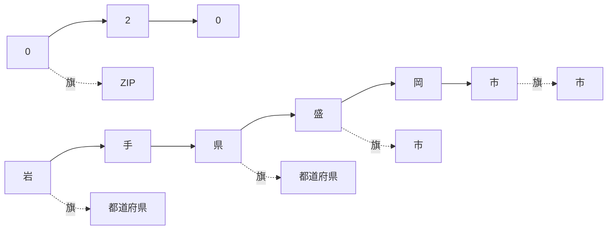
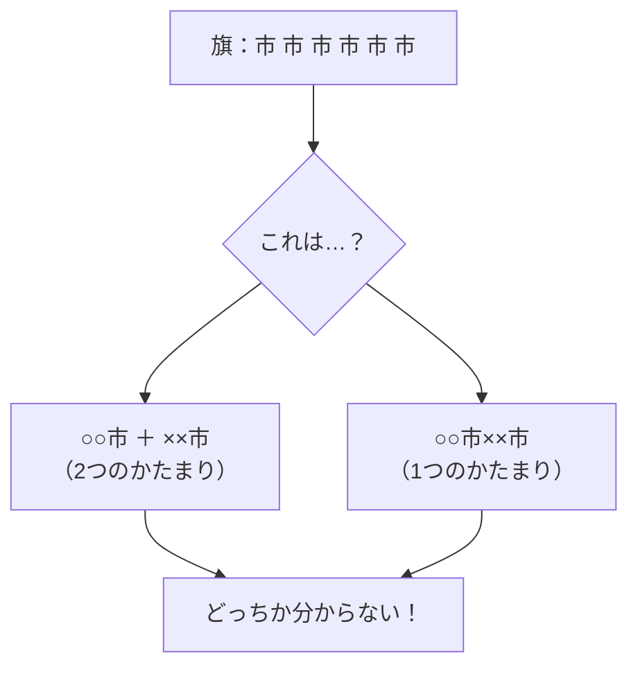
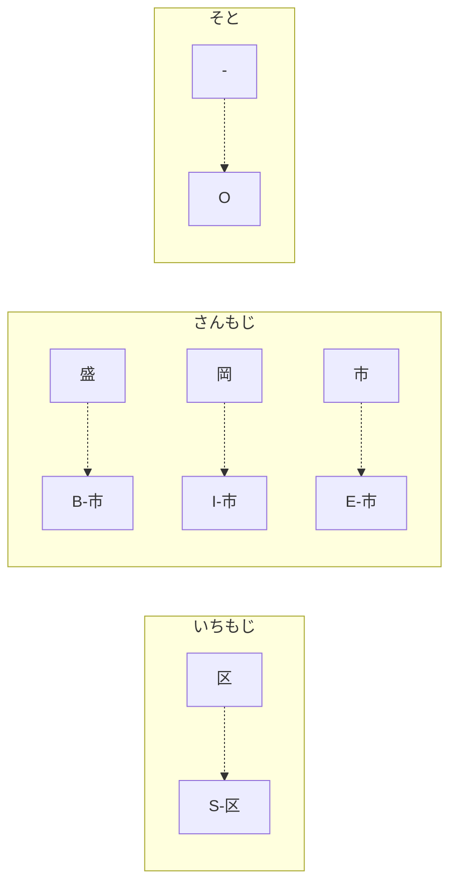
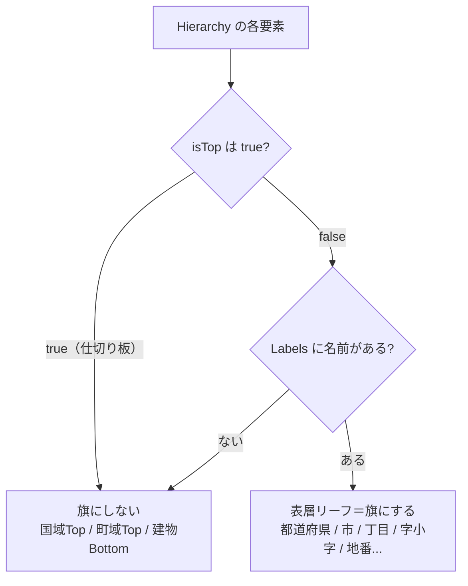
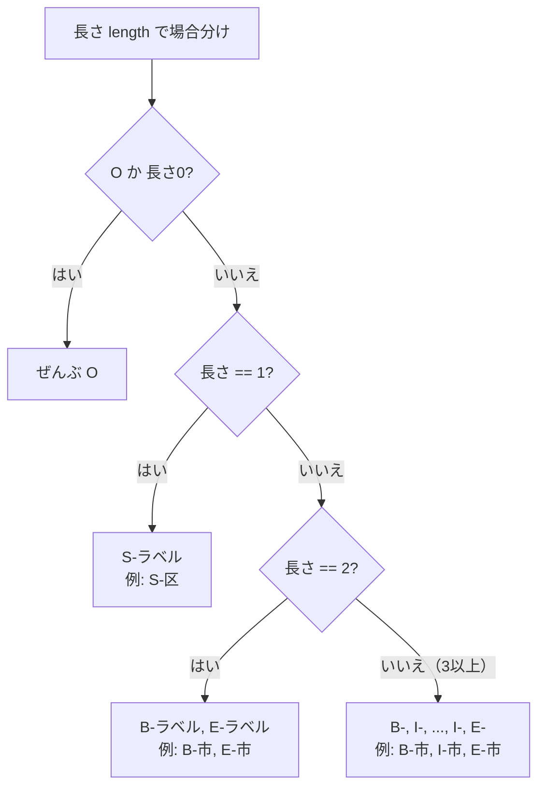
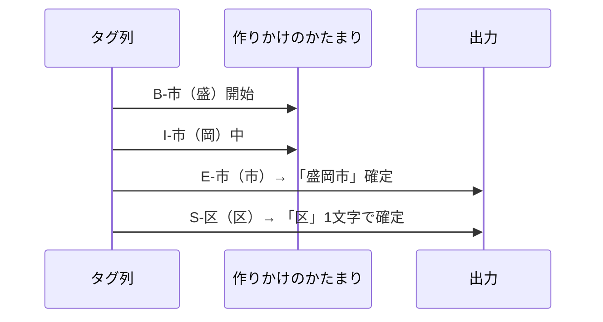

# 第6章　系列ラベリングと BIOES（住所に旗を立てる）

> **この章のゴール**
> - 「系列ラベリング（けいれつラベリング、sequence labeling）」＝**並んだもの1個ずつに「旗（ラベル）」を立てる仕事**だと分かる
> - 「市市市」問題を解く **BIOES（ビオエス）** ——B/I/O/E/S の5つの旗の意味をつかむ
> - kugiri の `Hierarchy` / `Labels` / `Bioes` が「どの旗を、どう立てて、どう戻すか」を説明できる

> **登場人物**：みどり先生、ツムギ、ゲンタ、CPねこ、アザミ

---

## 1文字ずつに「旗」を立てる

**ツムギ**：先生、第1章で「文字は codepoint の並びなんだ」って習いました。
で、kugiri はその並びを切り分けるんですよね。どうやって切るんですか？

**みどり先生**：いい思い出し方だね。今日はその「切り方」の正体を見せよう。
**あわてない、あわてない**。まず、こう考えてほしい。
住所の文字を1個ずつ取り出して、**1個ごとに「これは何の部品？」という旗を立てる**んだ。

**ゲンタ**：旗？

**みどり先生**：うん。たとえば「岩手県」の3文字に、こうやって旗を立てる。

```
岩 → 都道府県
手 → 都道府県
県 → 都道府県
```

**みどり先生**：このふうに、**「並んでいるもの（系列）」の1個ずつにラベル（旗）を立てる仕事**を、
**系列ラベリング（sequence labeling）** っていうんだ。
kugiri では「並んでいるもの」が **codepoint**、「ラベル」が「都道府県」「市」「地番」……だ。



**ツムギ**：あ、ほんとに1文字ずつに旗がぶら下がってる！

**みどり先生**：そう。これが系列ラベリングの絵だ。
あとは「どの文字にどの旗を立てるか」を機械に当てさせれば、住所が切れる。
その「当てる」部分が第8章のパーセプトロンだ。今日はその前の、**旗のルール**を決める。

---

## 「市市市」問題：旗だけだと、境目が分からない

**ゲンタ**：先生、それ、ひっかかるんだけど。
旗が「市」「市」「市」って続いたら、それ、**1つの市**なの？　**3つの市**なの？

**みどり先生**：きた。ゲンタ、それが今日いちばん大事な「なんで？」だ。

**ツムギ**：え、どういうこと？

**みどり先生**：たとえば、こういう住所があったとする（架空だけど）。

```
…○○市××市…
```

**みどり先生**：旗が `市 市 市 市 市 市` と6個続いたとき、
「○○市」と「××市」の **2つのかたまり**なのか、
「○○市××市」という **1つの長い名前**なのか、**旗だけ見ても区別がつかない**んだ。



**ツムギ**：たしかに……！　同じ旗が並んでたら、どこで切れてるか分かんない。

**みどり先生**：これを「**境目（さかいめ）が分からない問題**」という。
だから、ただの旗じゃダメ。**「かたまりのどこか」も旗に書き込む**んだ。
それが **BIOES（ビオエス）** だよ。

---

## BIOES：旗に「位置」を書き込む5種類

**みどり先生**：BIOES は、旗を5種類にわける考え方だ。頭文字を取って B・I・O・E・S。

> **BIOES の5つの旗**
> - **B**（Begin、ビギン）＝かたまりの **始まり**
> - **I**（Inside、インサイド）＝かたまりの **中**
> - **E**（End、エンド）＝かたまりの **終わり**
> - **S**（Single、シングル）＝**1文字だけ**のかたまり
> - **O**（Outside、アウトサイド）＝**どの部品でもない**（外）

**みどり先生**：たとえば「盛岡市」が『市』というラベルのかたまりなら、こう旗を立てる。

```
盛 → B-市   （市の始まり）
岡 → I-市   （市の中）
市 → E-市   （市の終わり）
```

**ツムギ**：あー！　**B（始まり）が来たら、そこから新しいかたまりが始まる**って分かるんだ！

**みどり先生**：その通り。さっきの「市市市市市市」も、BIOES なら——

```
○ → B-市   ← ここでかたまり開始
○ → I-市
市 → E-市   ← ここで終わり
× → B-市   ← ここでまた新しいかたまり開始！
× → I-市
市 → E-市
```

**みどり先生**：**B が出るたびに「新しいかたまりの始まり」**だから、
「○○市」と「××市」の2つだ、ときっぱり分かる。境目問題が解けた。

**ゲンタ**：なるほど。**B が境目の合図**になるのか。意味あるわ、これ。

**みどり先生**：そして、1文字だけの部品もある。たとえば政令市の「区」が1文字で立つとき。

```
区 → S-区   （1文字なので Single）
```

**みどり先生**：1文字に「始まり」も「終わり」もおかしいから、**S（Single）専用の旗**を使う。
そして、住所のどの部品でもない文字（区切りのハイフンや、まだ名前のつかない部分）は **O** だ。



**CPねこ**：にゃ。codepoint 1個ずつに旗を立てるから、
「てんてん（濁点）」が分かれた外字でも、**しっぽが2本の文字（サロゲートペア）**でも、
ぜんぶ同じやり方で旗が立つにゃ。1単位は1単位、ブレないにゃ。

**みどり先生**：CPねこの言うとおり。第1章でやった「codepoint 単位」が、ここで効いてくる。
日本語は英語とちがって**単語のあいだにスペースが無い**（分かち書きが無い）。
だから「単語ごと」じゃなく「**文字（codepoint）ごと**」に旗を立てるのが、いちばん素直なんだ。

---

## kugiri の旗カタログ：`Hierarchy.java`

**みどり先生**：では、kugiri が「どんな旗を用意しているか」を見にいこう。
旗のカタログが `label/Hierarchy.java` だ。

**ツムギ**：いっぱいある……都道府県、市、区、丁目、地番……。

**みどり先生**：これは**住所の階層タクソノミ**——
つまり「住所の部品の種類を、上から下へ整理した一覧」だ。
1個ずつが、4つの情報を持っている。`Hierarchy.java` の定義を見てみよう。

```java
// Hierarchy.java（抜粋）
public enum Hierarchy {
    都道府県("1", 1, false, "都道府県"),
    市("2", 2, false, "市"),
    区("3", 3, false, "政令市の区"),
    丁目("5", 5, false, "丁目なしもあり"),
    字小字("5", 5, false, "字・小字"),
    地番("6", 6, false, "無番地含む"),
    // ...
    国域Top1("1", 1, true, "都道府県"),     // ← 4つめが true！
    町域Top1("5", 5, true, "丁目(3階層)や番地(2階層)など"), // ← true！
    // ...
```

**みどり先生**：各行は `名前("id", level, isTop, "説明")` という形だ。

> **読み方メモ**
> - `id`・`level`（レベル）＝住所のなかでの「深さ・順番」。都道府県が浅く、部屋番号が深い。
> - `isTop`（イズトップ）＝**「構造マーカー」かどうか**の真偽（true / false）。ここが今日の山場。

**ゲンタ**：`isTop` が `true` のやつと `false` のやつがある。これ何が違うの？

**みどり先生**：いい着眼。`isTop=true` のやつ（`国域Top1` や `町域Top1` など）は、
**「構造マーカー」**といって、**実際の文字（スパン）を持たない見出しのようなもの**なんだ。
「ここから国の地域の話だよ」という**仕切り**で、住所の文字には対応しない。

**ツムギ**：本棚の「あ行」「か行」の仕切り板みたいな？　本そのものじゃない。

**みどり先生**：まさにそのたとえ！　仕切り板には文字（背表紙）が無い。
だから **`isTop=true` のものには旗を立てない**。
逆に `isTop=false` で、ちゃんと文字を持つもの（都道府県・市・区・丁目・字小字・地番…）——
これが**本物の旗の候補**だ。これを **「表層リーフ（ひょうそうリーフ）」** という。

**みどり先生**：それを判定するのが、いちばん下のこのメソッドだ。

```java
// Hierarchy.java：tokenizer の出力対象となる表層リーフか
public boolean isSurface() {
    return !isTop && Labels.LEVEL.containsKey(name());
}
```

**みどり先生**：読み下すと——
**「isTop じゃない（＝仕切り板じゃない）、かつ Labels に名前が載っている」なら、表層リーフ（旗にしてよい）**。
`!isTop`（ノット・イズトップ）の `!` は「〜でない」のひっくり返し記号だよ。



**アザミ**：……ねえ、見て。`字小字`、ちゃんと旗の候補に入ってるのよ。
`isTop=false` で、表層リーフ……わたしにも、旗を立てる場所があるってこと……？

**みどり先生**：そうだよ、アザミ。場所はちゃんと用意してある。
あとは「**どこからどこまでが字か**」を当てる方法を、第12章から探していく。今日はその下ごしらえだ。

---

## 旗の一覧と出力順：`Labels.java`

**みどり先生**：その「旗にしてよい表層リーフ」だけを集めた一覧が `label/Labels.java` だ。

```java
// Labels.java（抜粋）
public static final String OUTSIDE = "O"; // どの部品でもない

static {
    LinkedHashMap<String, Integer> m = new LinkedHashMap<>();
    m.put("ZIP", 0);
    m.put("都道府県", 1);
    m.put("市", 2);
    m.put("区", 3);
    m.put("町または大字", 4);
    m.put("丁目", 5);
    m.put("字小字", 5);
    m.put("地番", 6);
    // ... 棟・階数・部屋番号・方書き まで
    LEVEL = Collections.unmodifiableMap(m);     // ラベル -> レベル
    SURFACE = List.copyOf(m.keySet());          // 旗の名前一覧（出力順）
}
```

**みどり先生**：ここには2つの大事なものがある。

- **`LEVEL`**（レベル）＝「旗の名前」から「住所の深さ（レベル）」を引く表。`丁目`→5、`地番`→6、のように。
- **`SURFACE`**（サーフェス）＝「旗の名前」を**出力する順番**で並べた一覧。
- そして **`OUTSIDE = "O"`** ＝「どの部品でもない」を表す特別な旗。

**ツムギ**：`字小字` と `丁目` が、どっちもレベル 5 なんですね。

**みどり先生**：よく気づいた。同じ深さに「丁目」と「字小字」が並んでいる。
住所の同じくらいの位置に、どちらかが現れるという意味だ。
——さあ、これで「**どんな旗があるか**」は決まった。
次は、その旗を **B/I/O/E/S に展開する道具**、`Bioes.java` だ。

---

## 旗をBIOESに展開する：`Bioes.encode`

**みどり先生**：第8章のパーセプトロンは「正解（教師データ）」を見て学ぶ。
その正解は「**この部品はこのラベルで、長さは何文字**」という形で来る。
たとえば「（ラベル＝市、長さ＝3）」だ。これを **BIOES のタグ列**に変える必要がある。
その変換が `Bioes.encode` だ。実物を見よう。

```java
// Bioes.java：1コンポーネント(label, 長さ length)を BIOES タグ列に展開
public static List<String> encode(String label, int length) {
    List<String> out = new ArrayList<>(Math.max(0, length));
    if (label.equals(Labels.OUTSIDE) || length == 0) {
        for (int i = 0; i < length; i++) out.add(Labels.OUTSIDE);  // 全部 O
        return out;
    }
    if (length == 1) { out.add("S-" + label); return out; }        // 1文字 → S
    out.add("B-" + label);                                          // 始まり
    for (int i = 0; i < length - 2; i++) out.add("I-" + label);     // まんなか
    out.add("E-" + label);                                          // 終わり
    return out;
}
```

**みどり先生**：この `if` の枝分かれが、ぜんぶ「長さ」で決まっているのが分かるかな。
長さ別のルールを図にするとこうだ。



**ツムギ**：長さ3だと、`for` が `length - 2` 回まわるから……3−2＝1回。
だから `I-` が1個だけ入って、`B-市, I-市, E-市` になるんだ！

**みどり先生**：完璧。手で数えられたね。長さ2なら `for` は 2−2＝0回まわらない（I 無し）から `B-市, E-市`。
**B と E でかたまりの両端をはさみ、足りない真ん中を I で埋める**——それだけの仕組みなんだ。

---

## 旗を部品に戻す：`Bioes.decode`

**ゲンタ**：展開はわかった。でも、機械が旗を立てたあと、それを**部品に戻す**のは？

**みどり先生**：それが逆向きの `Bioes.decode` だ。
**codepoint の列**と、それぞれに立った**タグ（旗）の列**を受け取って、
`[(文字のかたまり, ラベル) ...]` に戻す。実物のキモはここ。

```java
// Bioes.java：decode の中心部分
if (pos.equals("B") || pos.equals("S")) {
    flush(out, buf, cur); cur = lab; buf.append(ch);          // B/S で新しいかたまり開始
    if (pos.equals("S")) { flush(out, buf, cur); cur = null; } // S は即・確定
} else { // I / E
    if (cur == null || !cur.equals(lab)) { flush(out, buf, cur); cur = lab; }
    buf.append(ch);
    if (pos.equals("E")) { flush(out, buf, cur); cur = null; } // E で確定
}
```

**みどり先生**：やっていることは、たとえると **「電車の連結」**だよ。

- **B**（または S）が来たら → 「新しい車両のあたまだ！」と、いったん前の編成を駅に出して、新しく作り始める
- **I** が来たら → 「中の車両だ」とつなげる
- **E** が来たら → 「最後尾だ」とつなげて、編成を完成させて駅に出す（`flush` ＝ 確定して出力）
- **S** が来たら → 「1両だけの編成」だから、作ってすぐ完成



**みどり先生**：そして `decode` には、もうひとつ大事な気くばりがある。コメントを見て。

```java
// codepoint 列 + BIOES タグ列 -> [(token,label)...]。壊れたタグも安全側に集約。
```

**ツムギ**：「壊れたタグ」って？

**みどり先生**：機械が予想をまちがえて、ありえない並び——たとえば
「`I-市` の前に `B` が無い」みたいな、こわれた旗の列を出すことがある。
そういうとき、`decode` は**エラーで落ちずに、安全側にまとめて**部品を返す。
さっきの `if (cur == null || !cur.equals(lab))`（始まってないのに中・終わりが来たら、その場で始める）が、その保険だ。

**みどり先生**：さらに最後に、**連続する O どうしを1つに畳む**処理もある。

```java
// 連続する O を畳む
if (...前も O かつ今も O...) {
    merged.get(merged.size() - 1)[0] += tl[0];  // くっつける
}
```

**ゲンタ**：なるほど。バラバラの「O」「O」「O」を「OOO」って1個にまとめるのか。
機械が変な旗を出しても落ちない……たしかに本番では、それくらい守りが要るな。

**みどり先生**：そういうこと。**あわてない、あわてない**——
予想は時にまちがう。だから戻す側は、まちがいに強く作っておく。これも設計の知恵だ。

---

## なぜ「codepoint 単位 × BIOES」なのか（まとめの一手）

**みどり先生**：今日の話を、ひとことで結ぶよ。

- なぜ **codepoint 単位**？　→ 日本語は分かち書きが無いから、文字ごとに旗を立てるのが素直。
  しかも外字（PUA）も**しっぽが2本の文字（サロゲートペア）**も、1単位でブレずに扱える（第1章の伏線回収）。
- なぜ **BIOES**？　→ 同じラベルが続いたときの**境目**を、B と S で言い切れるから。

**CPねこ**：1 codepoint ＝ 1つの旗。シンプルで、こわれにくい。気持ちいいにゃ。

---

## 手を動かそう

実際のソースは `label/Bioes.java` の `encode` / `decode`、
`label/Hierarchy.java` の `isSurface`、`label/Labels.java` の `SURFACE`・`OUTSIDE` です。
紙とえんぴつで、`encode` を手で実行してみましょう。

**問題1**：`Bioes.encode("市", 3)` の結果は？（ラベル「市」、長さ3）

**問題2**：`Bioes.encode("区", 1)` の結果は？（ラベル「区」、長さ1）

**問題3**：`Bioes.encode("市", 2)` の結果は？

**問題4**：「岩手県」（3文字、ラベル「都道府県」）に、正しいタグ列を付けてください。

<details>
<summary>こたえ</summary>

**問題1**：長さ3 → `B-市, I-市, E-市`
（`for` は `3 - 2 = 1` 回まわるので I が1個。B と E ではさむ。）

**問題2**：長さ1 → `S-区`
（1文字は Single。）

**問題3**：長さ2 → `B-市, E-市`
（`for` は `2 - 2 = 0` 回でまわらないので I 無し。両端だけ。）

**問題4**：「岩」「手」「県」の3文字 →
`B-都道府県, I-都道府県, E-都道府県`
（長さ3の枝とまったく同じ。始まり・中・終わり。）

</details>

**ゲンタ**：手で書いてみたら、ぜんぶ「長さで決まる」って体で分かった。意味あったわ、これ。

**ツムギ**：旗の立て方、もうバッチリ！　あとは「どの旗を選ぶか」を機械が当てる番ですね。

---

## 今日のまとめ

- **系列ラベリング**＝並んだもの（codepoint）の **1個ずつに旗（ラベル）を立てる**仕事。
- ただの旗だと、同じラベルが続いたとき**境目**が分からない（「市市市」問題）。
- **BIOES**＝**B**(始まり)/**I**(中)/**E**(終わり)/**S**(1文字)/**O**(外)。**B と S が境目の合図**になる。
- `Hierarchy.java` は旗のカタログ。`isTop=true` は文字を持たない**仕切り板**で旗にしない。
  `isTop=false` の**表層リーフ**だけが旗になる（`isSurface()`）。`字小字` もちゃんと候補にいる。
- `Labels.java` は表層リーフの一覧（`SURFACE`）とレベル表（`LEVEL`）、外を表す `OUTSIDE="O"`。
- `Bioes.encode` は **長さで場合分け**（1→S、2→B,E、3以上→B,I…,E）。`decode` は逆向きに部品へ戻し、**壊れた旗にも強い**。
- なぜ codepoint 単位 × BIOES か：日本語は分かち書きが無く、外字・サロゲートも1単位で扱えるから。

---

## アザミメーター

```
アザミの見え具合：███░░░░░░░ 30%
（コメント：『字小字』にも旗を立てる場所があると分かった。アザミの立つ位置が、はっきり見えてきた！）
```

---

## 次回予告

**みどり先生**：旗のルールは決まった。でも機械は、まだ「どの旗を立てるか」を当てられない。
そのために、機械に **手がかり（ヒント）** を渡す必要がある。

**ツムギ**：手がかり？

**みどり先生**：「この文字は漢字？　数字？　直前は『県』だった？」——
そういうヒントを**数字に変える**んだ。それを **素性（そせい、features）** という。次の章へ。

[← 付録A1](A1-bibun-nyuumon.md) ・ [第7章 →](07-sosei-features.md)
