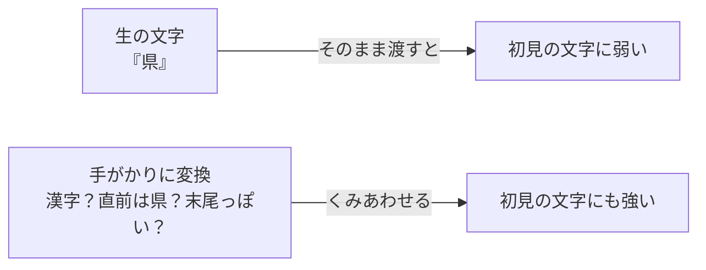
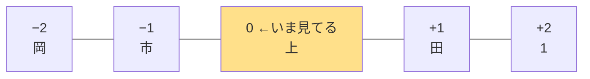
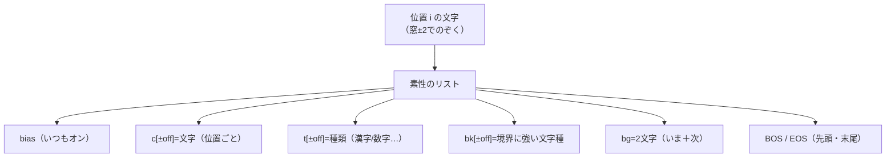
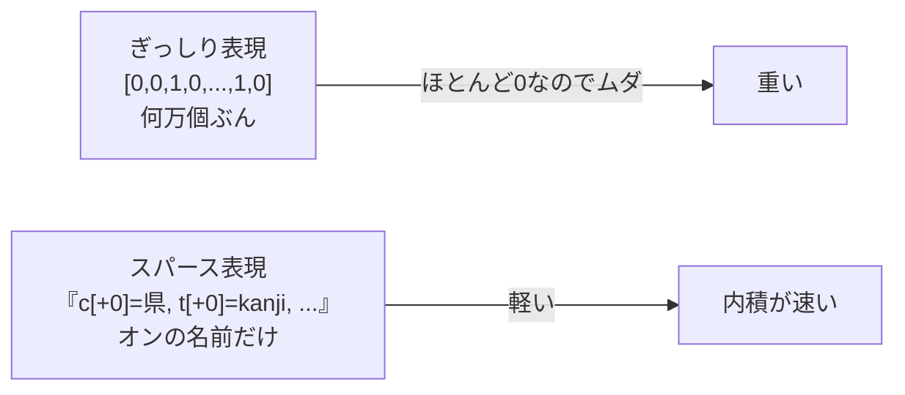

# 第7章　素性：手がかりを数字にする

> **この章のゴール**
> - **素性（そせい、features）**＝機械に渡す「手がかり」を、オン（1）かオフ（0）かで表したものだと分かる
> - なぜ「生の文字」ではなく「手がかり」を渡すと機械が賢くなれるのか、納得する
> - kugiri の `Features.charFeatures` が、1文字の位置から**どんな素性を作っているか**を1個ずつ読める

> **登場人物**：みどり先生、ツムギ、ゲンタ、CPねこ、パーセ

---

## 機械に渡すのは「文字」じゃなくて「手がかり」

**パーセ**：第4章で内積、おぼえてる？　**x**（手がかり）と **w**（重み）をかけて足す、ってやつ。
今日はね、その **x** の正体を作る回なんだ！

**ツムギ**：あ、パーセが「住所の1文字ごとにスコアを出す」って言ってたときの、x ？

**みどり先生**：そう。その **x** のことを、機械学習では **素性（そせい、features）** って呼ぶんだ。
英語だと features。「特徴」とか「手がかり」って意味だよ。

**ゲンタ**：手がかり……？　なんで文字そのものを渡しちゃダメなの？
「県」って文字を見せれば、それでいいじゃん。

**みどり先生**：いい「それ、意味あるの？」だね。あわてない、あわてない。
たとえ話をしよう。きみが探偵だったとして、犯人を当てたいとする。

**みどり先生**：「この人は田中さんです」という**名前そのもの**より、
「**背が高い**」「**右ききだ**」「**直前に現場にいた**」みたいな
**特徴のくみあわせ**のほうが、犯人当てに役立つよね？

**ツムギ**：たしかに！　名前だけだと、初めて会う人だとお手上げだもんね。

**みどり先生**：それと同じ。機械にとっても、
「この文字は**漢字か**」「**直前は『県』か**」みたいな**手がかり**のほうが、
「県」という**生の文字1個**より、ずっと判断に使えるんだ。
見たことない文字が来ても、「漢字だ」という手がかりなら効くからね。



**みどり先生**：この「文字 → 手がかりのリスト」に変換する係が、kugiri の `Features` クラスだよ。

---

## 窓（まど）：いまの文字だけじゃ、足りない

**ツムギ**：でも先生、いまの文字の手がかりだけで、区切りってわかるんですか？

**みどり先生**：おお、するどい。じつは**いまの文字だけでは足りない**んだ。
区切りは「**前後のつながり**」で決まるからね。

**みどり先生**：たとえば「市」という1文字。これだけ見せられても、
「盛岡**市**」の市なのか、ただの会話の「市」なのか、わからないよね。
でも「**前が『盛岡』**」「**後ろが数字**」って分かれば、ぐっと「ここで区切れる！」って自信が持てる。

**ゲンタ**：なるほど。前後を見ないと、境目は決められないのか。

**みどり先生**：そこで使うのが **窓（まど、window）** という考え方。
いまの文字を中心に、**前後2文字ずつ**、合わせて5文字ぶんを「のぞき窓」みたいに見るんだ。
kugiri では `±2`（マイナス2からプラス2まで）の窓を使っている。



**ツムギ**：まんなかが「いま見てる文字」で、その前後2つずつをのぞくんですね。

**みどり先生**：そういうこと。この窓の中の文字それぞれから、手がかりを取り出していく。
では、実物のコードを見てみよう。

---

## `charFeatures`：1文字の位置から手がかりを作る

**みどり先生**：これが心臓部、`feature/Features.java` の `charFeatures` メソッドだ。
`chars` は文を1文字（codepoint）ずつ並べたリスト、`i` は「いま見てる位置」だよ。

```java
// Features.java の charFeatures：位置 i の「オンになってる手がかり」一覧を作る
public static List<String> charFeatures(List<String> chars, int i) {
    List<String> f = new ArrayList<>();
    f.add("bias");                                    // ① 常にオンの「下駄」
    for (int off = -2; off <= 2; off++) cfeat(chars, i, off, f);  // ② 窓±2の手がかり
    if (i + 1 < chars.size()) f.add("bg=" + chars.get(i) + chars.get(i + 1)); // ③ バイグラム
    if (i == 0) f.add("BOS");                         // ④ 文の先頭
    if (i == chars.size() - 1) f.add("EOS");          // ⑤ 文の末尾
    return f;
}
```

**ツムギ**：戻り値が `List<String>` ……手がかりの「名前のリスト」なんだ。

**みどり先生**：そうなんだ。ここが大事。**オンになっている手がかりの名前だけ**を、リストに入れて返す。
順番に見ていこう。

### ① "bias"（バイアス）：いつもオンの「下駄」

**みどり先生**：いちばん最初の `f.add("bias")`。これは**どの文字でも、必ずオン**になる手がかりだ。

**ゲンタ**：いつもオン？　区別にならないじゃん。意味あるの？

**みどり先生**：これはね、ラベルごとの「**もともとの出やすさ**」を覚えるための席なんだ。
たとえば「O（どれでもない）」ラベルはそもそも数が多い。
そういう「**手がかりに関係なく、出やすい／出にくい**」ぶんを、この bias が引き受ける。
下駄（げた）をはかせる、みたいなイメージだよ。

### ② 窓±2：`cfeat` が各位置で作る3種類の手がかり

**みどり先生**：`for (int off = -2; off <= 2; off++)` で、`off` が −2, −1, 0, +1, +2 と動く。
各位置で `cfeat` を呼ぶ。その `cfeat` がこれだ。

```java
// Features.java の cfeat：位置 i+off の文字から手がかりを作る
private static void cfeat(List<String> chars, int i, int off, List<String> f) {
    int j = i + off;
    String p = (off >= 0 ? "+" : "") + off;          // "+0" "-1" のような位置ラベル
    if (j < 0 || j >= chars.size()) { f.add("c[" + p + "]=__BND__"); return; } // 範囲外
    String ch = chars.get(j);
    int cp = ch.codePointAt(0);
    f.add("c[" + p + "]=" + ch);                     // (a) その位置の文字そのもの
    f.add("t[" + p + "]=" + charType(ch));           // (b) その位置の文字の種類
    // 住所境界に強い BuiltinCharacterKind をそれぞれ個別素性として追加
    Set<...> kinds = REGISTRY.kindsOf(cp);
    for (BuiltinCharacterKind bk : BOUNDARY_KINDS) {
        if (kinds.contains(bk)) f.add("bk[" + p + "]=" + bk.name()); // (c) 境界に強い文字種
    }
}
```

**みどり先生**：ここで3種類の手がかりが出る。1個ずつ見よう。

**(a) `c[±off]=文字`：その位置の文字そのもの**

**みどり先生**：たとえば、いま見てる文字（`off=0`）が「県」なら `c[+0]=県` という手がかりがオンになる。
直前（`off=-1`）が「岩」なら `c[-1]=岩`。シンプルに「その場所に何の文字があるか」だ。

**(b) `t[±off]=種類`：その位置の文字の「種類」**

**みどり先生**：`charType` は第2章でやった「文字の種類」を返す係だね。
`kanji`（漢字）/ `digit`（算用数字）/ `hira`（ひらがな）/ `kata`（カタカナ）…みたいに分けてくれる。
「県」なら `t[+0]=kanji`、「1」なら `t[+0]=digit`。

**ツムギ**：あ、これがさっきの「漢字か？」って手がかりだ！
文字そのものを知らなくても、「漢字だ」だけで効くやつ。

**(c) `bk[±off]=種類名`：住所の境界に強い文字種**

**CPねこ**：ここはぼくの得意分野だにゃ。`bk` はね、**住所の区切りに効く特別な文字**だけ、
名前つきの手がかりにするんだにゃ。コードの上のほうにリストがあるにゃ。

```java
// Features.java の BOUNDARY_KINDS：境界として重要な文字種だけ集めたセット
private static final Set<BuiltinCharacterKind> BOUNDARY_KINDS = EnumSet.of(
    BuiltinCharacterKind.suffix丁目,   // 「丁目」っぽい
    BuiltinCharacterKind.suffix地番,   // 「番地」っぽい
    BuiltinCharacterKind.suffix号,     // 「号」っぽい
    BuiltinCharacterKind.suffix号室,   // 「号室」っぽい
    BuiltinCharacterKind.suffix棟,     // 「棟」っぽい
    BuiltinCharacterKind.suffix階,     // 「階」っぽい
    BuiltinCharacterKind.japaneseAddressNumber, // 漢数字など住所の数
    BuiltinCharacterKind.十干,          // 甲乙丙丁…
    BuiltinCharacterKind.十二支,        // 子丑寅卯…（字名に出る）
    BuiltinCharacterKind.delimitorJapanese, // 日本語の区切り
    BuiltinCharacterKind.delimitorHyphen    // ハイフン各種
);
```

**みどり先生**：これらのどれかに当てはまる文字だったら、その**名前の手がかりがオン**になる。
たとえば「目」が「丁目」の一部なら `bk[+0]=suffix丁目`。ハイフンなら `bk[+0]=delimitorHyphen`。
**こういう文字は「ここが区切りだよ」という強いサインだから**、わざわざ名前つきの席をあげているんだ。

**ゲンタ**：なるほど。区切りに効く文字だけ、特別あつかいしてるのか。意味あるわ。

**範囲外は `c[±off]=__BND__`（境界マーカー）**

**みどり先生**：もうひとつ。窓が文の外にはみ出したらどうする？
たとえば文の1文字目を見てるとき、`off=-2` や `-1` は**文より前**になっちゃう。
そのときは `c[-1]=__BND__` という「**ここは文の外だよ**」マーカーをオンにする。`BND` は boundary（境界）の略だ。

### ③ "bg=2文字"（バイグラム）：いまと次のペア

**みどり先生**：`f.add("bg=" + chars.get(i) + chars.get(i + 1))`。
いまの文字と**すぐ次の文字をくっつけたペア**だ。bg は bigram（バイグラム、2文字組）の略。
「上田」を見てるとき `bg=上田` がオン。1文字より「2文字のつながり」のほうが情報が濃いことがあるんだ。

### ④⑤ "BOS" / "EOS"：先頭と末尾の合図

**みどり先生**：`BOS`（Begin Of Sentence＝文の先頭）と `EOS`（End Of Sentence＝文の末尾）。
位置 `i` が 0 なら先頭だから `BOS`、最後なら `EOS` をオンにする。
住所は「先頭はだいたい ZIP か県」「末尾はだいたい番号系」みたいなクセがあるから、これも効く。



**ツムギ**：1文字の位置から、こんなにたくさんの手がかりが出るんだ！

---

## `sentFeatures`：文ぜんぶぶんをまとめる

**みどり先生**：`charFeatures` は「1文字ぶん」。
これを文の**全部の位置でやって**、リストのリストにするのが `sentFeatures` だよ。

```java
// Features.java の sentFeatures：文の全位置ぶんの素性リストを作る
public static List<List<String>> sentFeatures(List<String> chars) {
    List<List<String>> out = new ArrayList<>(chars.size());
    for (int i = 0; i < chars.size(); i++) out.add(charFeatures(chars, i));
    return out;
}
```

**ゲンタ**：戻り値が `List<List<String>>`……「手がかりリスト」が文字の数だけ並んでるんだ。

**みどり先生**：そう。`out.get(3)` なら「4文字目の手がかりリスト」。
これを次章のパーセに渡すと、1文字ずつスコアを出してくれる。

---

## オンのものだけ並べる「スパース表現」

**ツムギ**：先生、ひとつ気になることが。第4章だと x は `[1, 0, 0, 1, ...]` みたいな
**0と1の数字のならび**でしたよね？　でもここは**文字列のリスト**じゃないですか。

**みどり先生**：おお、よく覚えてた。じつは**同じこと**を言ってるんだよ。あわてない、あわてない。

**みどり先生**：考えてみて。手がかりの種類は何万個もある（`c[+0]=県` `c[+0]=市` …全部の文字ぶん！）。
でも、ある1文字でオンになるのは、せいぜい十数個。
だったら、**ほとんど 0 の長い 0/1 のならびを全部持つ**より、
**「オンになってる手がかりの名前だけ」**をリストにしたほうが、ずっとムダがない。

**ゲンタ**：あー、`[0,0,1,0,0,...,1,0]` を全部持つより、「3番目と最後がオン」とだけメモするのか。

**みどり先生**：その通り。この「**オンのものだけ持つ**」やり方を
**スパース表現（sparse、すかすかの意味）** っていう。
`charFeatures` が返すリストは、まさに「オンの手がかりの名前リスト」なんだ。



**パーセ**：これ、ぼくにとってもすごくありがたいんだ！
第8章でやるけど、ぼくのスコア計算は内積 **w·x**。
x が 0/1 なら、内積は「**オンの手がかりの重みを、ぜんぶ足すだけ**」になるんだ。

**みどり先生**：そこが美しいところ。x の値が 0 か 1 だから、`w・x` の中身は
`(0や1) × 重み` の足し算。**0 のところは消えて、1 のところ＝オンの重みだけ残る**。
だから「オンの名前リスト」さえあれば、その名前の重みを引いて足すだけでスコアになる。
——これが、第8章の `emission`（オンの手がかりの重みを合計する処理）の正体だよ。

**ツムギ**：第4章の内積と、第8章のパーセが、この素性でつながった……！

---

## 手を動かそう

`feature/Features.java` の `charFeatures` が、ある1文字でどんな素性を出すか、
**手で列挙**してみましょう。

題材は住所「**岩手県**」（3文字：岩・手・県）。
このうち **「県」の位置（i = 2、つまり最後の文字）** で `charFeatures` が出す素性を考えます。

ヒント：
- 文字の並びは `chars = [岩, 手, 県]`、`chars.size() = 3`、いま見てるのは `i = 2`。
- 窓は `off = -2, -1, 0, +1, +2`。`+1` `+2` は文の外（`i+off` が 3, 4 で範囲外）。
- 「県」は漢字。`bk` に当てはまる特別な文字種は無いとする（県は丁目でも番地でもハイフンでもない）。

<details>
<summary>こたえ</summary>

`charFeatures([岩,手,県], 2)` が返すリストは、だいたいこうなります。

```
bias                 ← ①いつもオン

c[-2]=岩             ← off=-2（i+off=0）の文字
t[-2]=kanji          ← その種類（漢字）

c[-1]=手             ← off=-1（i+off=1）の文字
t[-1]=kanji

c[+0]=県             ← off=0（いま見てる文字）
t[+0]=kanji

c[+1]=__BND__        ← off=+1（i+off=3）は範囲外！境界マーカー
c[+2]=__BND__        ← off=+2（i+off=4）も範囲外！

EOS                  ← i==size-1（2==3-1）なので末尾！
```

- `bg=` は「いまと次」をくっつけるので、**次の文字が無い（末尾）と作られません**。だから今回は出ません。
- `BOS` は `i==0` のときだけ。今回 `i=2` なので出ません。
- 「県」に `bk` の特別文字種が当たれば `bk[+0]=...` も増えますが、今回は無し。

数えると **9個** の素性がオン。これが「県」の位置の **x**（スパース表現）です。
次章のパーセは、この9個それぞれの重みを足して「県っぽさ」「O っぽさ」…のスコアを出します。

</details>

**ゲンタ**：なるほど、`+1` と `+2` がちゃんと `__BND__` になって、EOS も付くんだ。手で追えた！

---

## 今日のまとめ

- **素性（features）**＝機械に渡す「手がかり」。第4章の **x** の正体で、第8章でパーセが内積する相手。
- 生の文字より「**漢字か**」「**直前は『県』か**」のような**手がかりのくみあわせ**のほうが、初見の文字にも強くて賢い。
- **窓 ±2**：いまの文字だけでなく、前後2文字ずつものぞく。区切りは前後の文脈で決まるから。
- `charFeatures` が1文字位置で作る素性：`bias` / `c[±off]=文字` / `t[±off]=種類` / `bk[±off]=境界に強い文字種` / `bg=2文字` / `BOS` / `EOS`、範囲外は `c[±off]=__BND__`。
- `sentFeatures` は文ぜんぶぶんの素性リストのリスト。
- 0/1 の素性は「**オンのものだけ並べる**」スパース表現。だから内積が「オンの重みの合計」になり、第8章へつながる。

---

## アザミメーター

```
アザミの見え具合：███░░░░░░░ 34%
（コメント：文字を「手がかりの数字」に変える方法がわかった。アザミを測るための「ものさしの目盛り」が刻めてきた！）
```

---

## 次回予告

**みどり先生**：手がかり **x** は、これで作れるようになった。
あとは、その手がかりに「**重み w**」をつけて、スコアを出す係が必要だ。

**ツムギ**：あ、それってパーセの……！

**パーセ**：ぼくの出番だね！　次の章は、まちがえながら賢くなる、ぼくのしくみだよ。

[← 第6章](06-sequence-bioes.md) ・ [第8章 →](08-perceptron.md)
