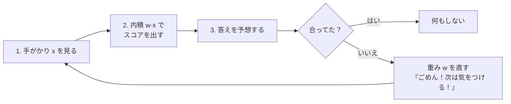
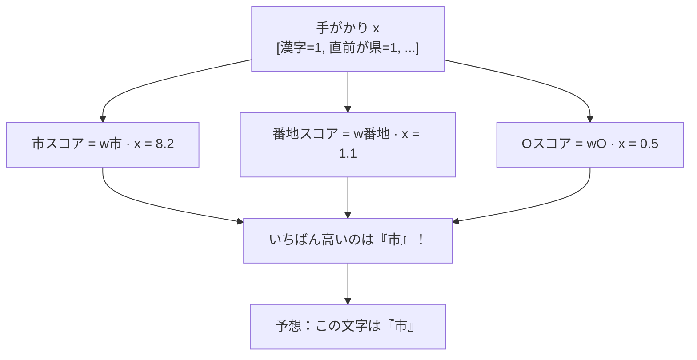
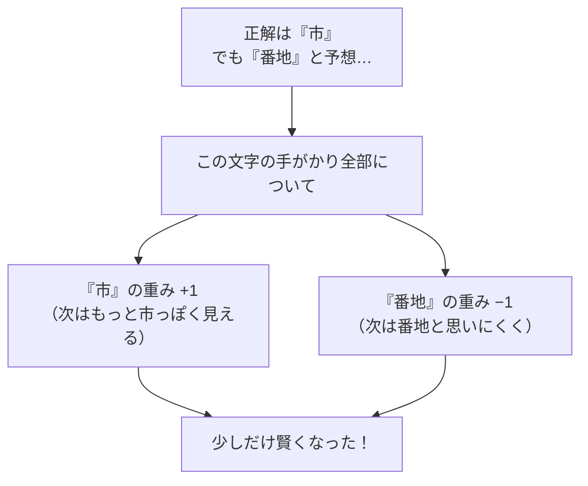
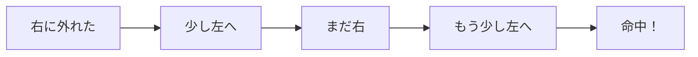

# 第8章　パーセプトロン：1個のニューロンで○×を分ける

> **この章のゴール**
> - パーセプトロンが「**内積でスコアを出して、まちがえたら重みを直す**」だけの仕組みだと分かる
> - 「学習」＝「重みをちょっとずつ正しい方へ動かすこと」だと体感する
> - kugiri の `PerceptronTagger` の重み（emis / trans / start）の正体をつかむ

> **登場人物**：みどり先生、ツムギ、ゲンタ、パーセ

---

## まちがえながら、かしこくなる機械

**パーセ**：やあ、ぼくパーセ！　今日はぼくのしくみを見せるよ。
ぼくはね、すごくシンプル。**「点数を出す」→「まちがえたら直す」**、これだけ！

**ツムギ**：それだけで、かしこくなれるの？

**みどり先生**：なれるんだなあ。あわてない、あわてない。順番に見ていこう。
パーセがやることは、たった3ステップだ。



---

## ステップ1〜3：スコアを出して予想する

**みどり先生**：第4章で内積をやったね。パーセは、その内積を**ラベルごと**に計算する。

たとえば「この文字は何ラベル？」を当てたいとする。候補が「市」「番地」「O（どれでもない）」の3つなら、
パーセは3つのスコアを出す。



**ゲンタ**：ラベルごとに重み w を持ってるんだ。`w市` `w番地` `wO` みたいに。

**みどり先生**：そう。kugiri のコードでは、それが `emis`（emission＝放出スコア）という名前で入っている。

```java
// PerceptronTagger.java より（少し簡略化）
private final Map<String, double[]> emis = new HashMap<>(); // 素性 -> ラベル別重み
```

**みどり先生**：`Map<String, double[]>` ——
「**手がかりの名前（String）**」から「**ラベルごとの重み（double[] 配列）**」を引く表だ。
たとえば `"c[0]=県"`（いまの文字が『県』）という手がかりに対して、
`[市は+0.0, 番地は-0.3, ... ]` のように、ラベルの数だけ重みが並んでいる。

そしてスコア（内積）の計算がこれ。

```java
// PerceptronTagger.emission：ある文字の手がかり一覧から、あるラベルのスコアを合計
private double emission(List<String> activeFeats, int label) {
    double s = 0;
    for (String f : activeFeats) {     // この文字でオンになってる手がかりを全部
        double[] wv = emis.get(f);
        if (wv != null) s += wv[label]; // そのラベルの重みを足す
    }
    return s;
}
```

**ツムギ**：あ、これ第4章の「かけて足す」だ！
手がかりは 0 か 1（オン/オフ）だから、**オンのやつの重みを足すだけ**になってるんだ。

**みどり先生**：よく気づいた！　手がかりが 0/1 のときは、内積 = 「オンの手がかりの重みの合計」。
だから掛け算が消えて、足し算だけになる。賢い手抜きだね。

---

## ステップ4：まちがえたら、重みを直す（ここが「学習」）

**みどり先生**：さあ、パーセの真骨頂。**まちがえたときの直し方**だ。
ルールはおどろくほどシンプル。

> **パーセプトロンの更新ルール**
> - **正解だったラベルの重み**を、その手がかりについて **+1**（もっと出やすく）
> - **まちがえて予想したラベルの重み**を、その手がかりについて **−1**（出にくく）

**パーセ**：たとえば、ぼくが「番地」って予想したけど、本当は「市」だったとするよね。
そしたら、いま見てた手がかり全部について——
**「市」の重みを上げて、「番地」の重みを下げる**んだ。「ごめん！次は気をつける！」ってね。



**みどり先生**：コードで見ると、ぴったりこの通りになっている。

```java
// PerceptronTagger.update：goldが正解ラベル、predが予想ラベル
private void update(List<List<String>> F, int[] gold, int[] pred) {
    int n = gold.length;
    for (int i = 0; i < n; i++) {
        if (gold[i] == pred[i]) continue;   // 合ってたら直さない
        for (String f : F.get(i)) {         // まちがえた文字の手がかり全部
            double[] wv = w(f);
            wv[gold[i]] += 1.0;             // 正解ラベルを +1
            wv[pred[i]] -= 1.0;             // 予想ラベルを −1
        }
    }
    // ... start と trans（次章で説明）も同じ要領で +1 / −1
}
```

**ゲンタ**：……これだけ？　こんな単純なことを繰り返すだけで、本当に賢くなるの？

**みどり先生**：なるんだ。これがパーセプトロンの美しいところ。
**「まちがえた分だけ、まちがえた方向の逆へ、ちょっと動かす」**。
それを何千回も繰り返すと、重みは「だいたい正しい」場所に落ち着いていく。

---

## なぜ「+1 / −1」でうまくいくの？（直感）

**ツムギ**：でも、なんで +1 と −1 でいいの？　もっと大きく直したほうが速くない？

**みどり先生**：いい「なんで？」だ。たとえ話をしよう。

**みどり先生**：目をつぶって、的に向かってボールを投げるとする。
「右に外れたよ」と言われたら、**ちょっとだけ左に**ずらして投げ直すよね。
いきなり大きく左にずらしたら、今度は左に外れる。**少しずつ直すのが、いちばん確実**なんだ。



**みどり先生**：パーセの +1 / −1 は、この「ちょっとだけ直す」なんだよ。
（このアイデアは付録A1の「微分」につながる。なぜ少しずつが正しいのか、数学で裏づけられる。）

---

## 手を動かそう：手で1回だけ学習してみる

簡単な例で、パーセの更新を**手で**やってみましょう。

- 手がかりは2つだけ：`末尾が県`（A）と `末尾が地`（B）
- ラベルは2つ：`県` と `地番`
- 最初、重みはぜんぶ 0：
  - A → [県:0, 地番:0]
  - B → [県:0, 地番:0]

**問題**：文字列の最後が「県」で、手がかり A がオン。正解は `県`。
重み全部 0 なので、スコアは 県:0、地番:0 で同点 → まちがえて `地番` と予想したとする。

→ 更新ルールを適用すると？

<details>
<summary>こたえ</summary>

まちがえたので、手がかり A について：
- `県` の重み +1 → A は [県:**1**, 地番:0]
- `地番` の重み −1 → A は [県:1, 地番:**−1**]

次に同じ文字が来たら、A のスコアは 県:1 > 地番:−1。
今度はちゃんと **県** と予想できる！　1回で賢くなった。

</details>

これを、たくさんの住所データで何回も回す——それが次章の「学習ループ」です。

---

## 今日のまとめ

- パーセプトロンは **①内積でスコア → ②いちばん高いラベルを予想 → ③まちがえたら重みを±1**、これだけ。
- スコア計算（`emission`）は、第4章の内積そのもの。手がかりが0/1なので「オンの重みの合計」。
- 「学習」とは **重みをちょっとずつ正しい方へ動かすこと**。一気に動かさないのがコツ。
- kugiri の重みは `emis`（文字の手がかり用）。次章で `start`・`trans`（並び順用）も登場。

---

## アザミメーター

```
アザミの見え具合：████░░░░░░ 42%
（コメント：『まちがえて、直して、賢くなる』機械の心臓が動き出した。アザミの顔のあたりが見えてきた！）
```

---

## 次回予告

**みどり先生**：今日は「1文字ずつ」予想した。でも住所は**並び**だ。
「県の次にいきなり号は来ない」みたいな、**順番のルール**も学ばせたい。

**ゲンタ**：たしかに。バラバラに予想したら、変な並びになりそう。

**みどり先生**：そこで「**構造化**パーセプトロン」と「**平均化**」の出番。次の章へ。

[← 第7章](07-sosei-features.md) ・ [第9章 →](09-structured-perceptron.md)
