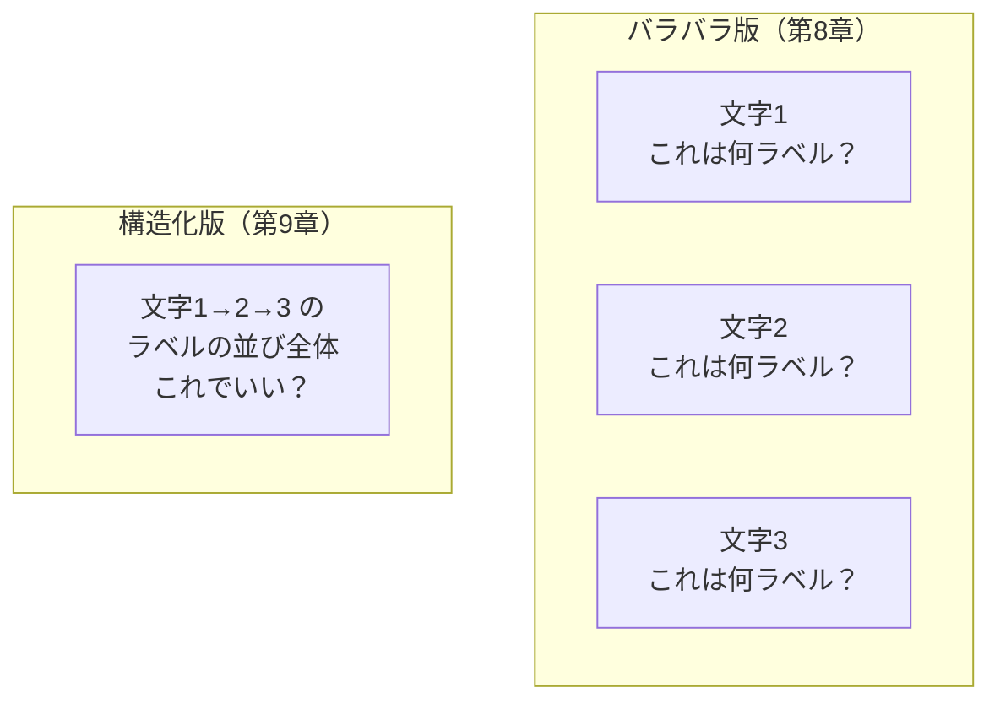
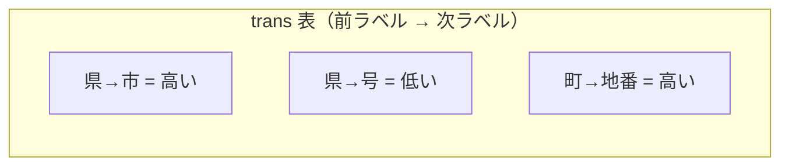
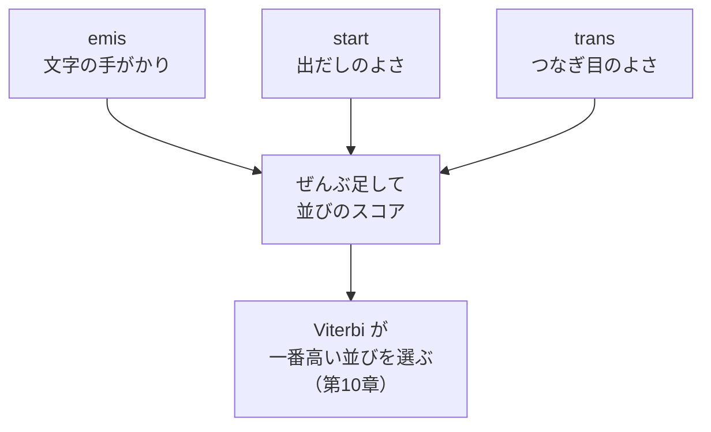
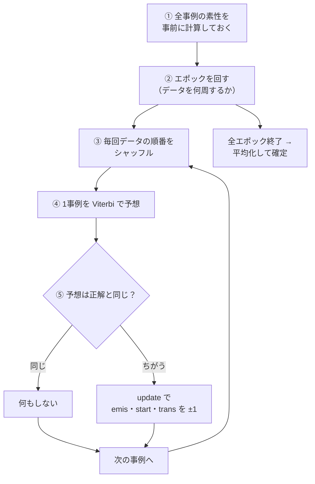
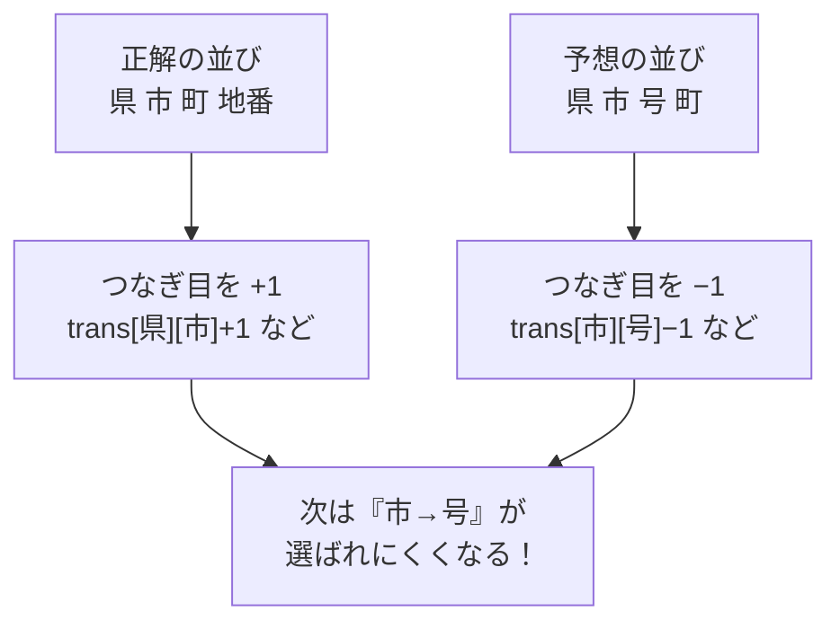
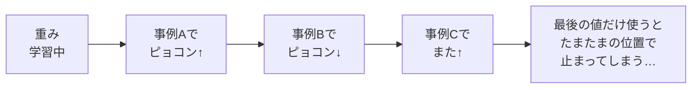
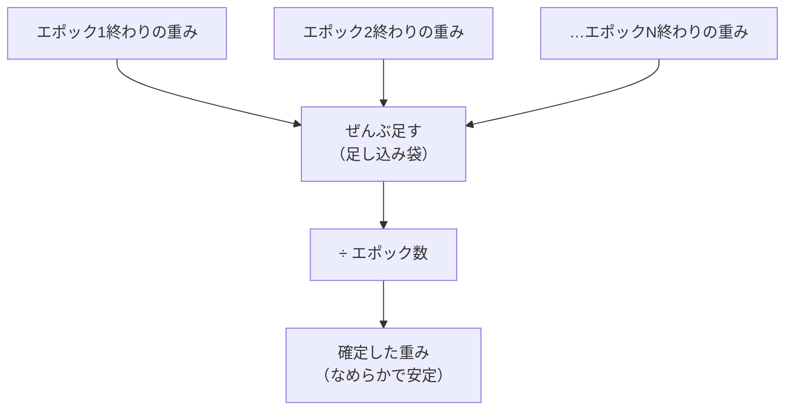

# 第9章　構造化パーセプトロンと平均化（学習ループ）

> **この章のゴール**
> - 「1文字ずつバラバラ」ではなく「**並び全体（系列）**をまとめて学ぶ」のが構造化（structured）だと分かる
> - `start`（開始スコア）と `trans`（遷移スコア）の正体をつかみ、`emis` と合わせた3種の重みが何のためにあるか分かる
> - kugiri の `fit`（学習ループ）と `update`（更新）と**平均化（averaging）**が、何をしているか説明できる

> **登場人物**：みどり先生、ツムギ、ゲンタ、パーセ

---

## 前回のおさらいと、新しいモヤモヤ

**パーセ**：やあ、またぼくだよ、パーセ！　前の章では「**1文字ずつ点数を出して、まちがえたら重み±1**」をやったよね。

**ツムギ**：うん。`emis`（エミス、emission＝放出スコア）って重みで、「この文字は市っぽい？番地っぽい？」を当てるやつ。

**みどり先生**：そう。でもね、ゲンタ。1文字ずつバラバラに当てると、ちょっと困ったことが起きる。

**ゲンタ**：……困ったこと？　それ、意味あるの？

**みどり先生**：あわてない、あわてない。たとえば、こんな予想が出たらどう思う？

```
県  →  市  →  号  →  町
```

**ゲンタ**：……変だよ。「県のすぐ次に号」なんて住所、ありえないでしょ。

**みどり先生**：その通り。1文字ずつだけ見ていると、機械は「**並び順のルール**」を知らないから、こういうヘンな並びを平気で作ってしまう。

**ツムギ**：あ〜！　1文字としては正しそうでも、つながりが変なんだ。

**みどり先生**：そこで登場するのが、今日の主役。**構造化（こうぞうか、structured）パーセプトロン**だよ。

---

## 構造化ってなに？　並び全体で勝負する

**みどり先生**：構造化っていうのはね、ひとことで言うと——

> **構造化（structured）＝1文字ずつバラバラに予想するのでなく、「並び全体（系列）」をまとめて予想して、まとめて学習すること。**

**ツムギ**：並び全体……？

**みどり先生**：たとえばクイズで考えよう。バラバラ版は「この1問」だけ採点する。構造化版は「**答案ぜんぶ**」をまとめて見て、「この答えの流れはアリか？」まで採点するんだ。



**みどり先生**：上は「1問ずつ」。下は「答案まるごと」。下のやり方なら、「県→号」みたいな**変なつなぎ目**にもペナルティをかけられる。

**ゲンタ**：なるほど。並びのルールを学ばせたいから、並びごと見る、と。意味あるわ。

---

## 3種類の重み：emis・start・trans

**みどり先生**：では「並び順」を学ぶために、新しい重みを2つ足すよ。前の章の `emis` と合わせて、ぜんぶで**3種類**だ。

**パーセ**：ぼくのダイヤルが3種類になるってことだね！

| 重み | 読み | 気持ち（直感） |
|---|---|---|
| `emis` | エミス（emission・放出） | この**文字そのもの**の手がかりから、どのラベルっぽいか（第8章） |
| `start` | スタート | **文の最初**のラベルは、何になりやすいか |
| `trans` | トランス（transition・遷移） | 「**前のラベル → 次のラベル**」のなりやすさ |

**ツムギ**：`start` は「いちばん最初は何が来やすい？」か。住所なら、最初は ZIP か県、だよね。

**みどり先生**：その通り。だから `start[県]` は高くなってほしいし、`start[号]` は低くなってほしい。

**ゲンタ**：で、`trans` が「前→次」の橋わたしの点数か。「県の次に市が来やすい」を覚えるところ。

**みどり先生**：ばっちり。コードでは最初にこう宣言されているよ。

```java
// PerceptronTagger.java より
private final Map<String, double[]> emis = new HashMap<>(); // 素性 -> ラベル別重み
private double[][] trans = new double[L][L];   // 「前ラベル → 次ラベル」の表
private double[] start = new double[L];          // 「最初のラベル」のなりやすさ
```

**みどり先生**：`L` はラベルの種類数だ。注目してほしいのは `trans` の `double[L][L]`。

**ツムギ**：四角い……表？　タテ × ヨコ？

**みどり先生**：そう。`trans[前のラベル][次のラベル]` という、**タテ L 個 × ヨコ L 個のマス目の表**になっている。これは「**行列（ぎょうれつ、matrix）**」の正体そのもので、付録A2で「行列」として正式に再登場するよ。今は「前→次のなりやすさを並べた表」だと思えばOK。



**みどり先生**：3つの重みは、最終的にぜんぶ**足し合わされて**1本のスコアになる。文字の手がかり（emis）＋出だしのよさ（start）＋つなぎ目のよさ（trans）、ぜんぶ合計だ。



**みどり先生**：この「合計したスコアが一番高い並びを選ぶ」係が、次章の主役**バーティ（Viterbi）**だよ。今日はバーティに「予想して」とお願いするだけ、と思っておこう。

---

## fit：学習ループの全体像

**みどり先生**：さあ、本体だ。学習の入り口は `fit`（フィット＝「合わせる」）というメソッド。たくさんの住所例を使って、3つの重みを正しい場所へ動かす。流れはこう。



**ツムギ**：エポック（epoch）って？

**みどり先生**：**データを何周するか**の回数だよ。教科書を1回読んだだけじゃ覚えないよね。同じデータを何周もして、だんだん覚える。その「1周」が1エポック。

**ゲンタ**：シャッフルは？　なんで毎回まぜるの？

**みどり先生**：いつも同じ順番だと、最後に見た事例にばかり引っぱられて、変なクセがつくんだ。毎回まぜると平らに学べる。トランプを配る前に切るのと同じ。

では、コードを上から見ていこう。まず**①素性の事前計算**。

```java
public void fit(List<Example> data, int epochs) {
    // 素性を事前計算
    List<List<List<String>>> feats = new ArrayList<>(data.size());
    List<int[]> golds = new ArrayList<>(data.size());
    for (Example ex : data) {
        feats.add(Features.sentFeatures(ex.chars()));   // 文字列→手がかり
        int[] g = new int[ex.tags().size()];
        for (int i = 0; i < g.length; i++) g[i] = labelIndex.get(ex.tags().get(i));
        golds.add(g);                                     // 正解ラベル列
    }
```

**みどり先生**：`feats` は各事例の「手がかり」を、`golds` は「正解ラベル列」を、先に全部そろえておく置き場だ。`gold`（ゴールド）は「**正解（金の答え）**」のこと。毎周ごとに作り直すと遅いから、1回だけ作ってとっておく。

次が**②③④⑤**のループ本体。

```java
    Random rng = new Random(0);
    List<Integer> order = new ArrayList<>();
    for (int i = 0; i < data.size(); i++) order.add(i);

    for (int e = 0; e < epochs; e++) {          // ② エポックを回す
        Collections.shuffle(order, rng);          // ③ 順番をシャッフル
        for (int idx : order) {
            List<List<String>> F = feats.get(idx);
            int[] gold = golds.get(idx);
            int[] pred = viterbi(F);              // ④ Viterbi で予想
            if (!Arrays.equals(pred, gold))       // ⑤ 予想≠正解 なら
                update(F, gold, pred);            //    重みを直す
        }
        // …（このあと平均化のための足し込みが入る。後述）
    }
```

**ツムギ**：`pred`（プレド）は predict（予想）の `pred` だ。「Viterbi が出した予想の並び」だね。

**みどり先生**：そう。`Arrays.equals(pred, gold)` は「予想と正解が**並びとしてピッタリ同じか**」のチェック。1文字でもズレてたら `update` でお直し。ここが第8章との大きな違いだよ。

**ゲンタ**：第8章は1文字ずつ比べてたけど、ここは「並び全体が一致してるか」で見てるんだね。まさに構造化だ。

---

## update：±1で3種の重みを直す

**みどり先生**：まちがえたときの直し方が `update`。考え方は第8章とまったく同じ。**正解の方を +1、まちがえた方を −1**。それを3種類の重みすべてにやるだけ。

```java
private void update(List<List<String>> F, int[] gold, int[] pred) {
    int n = gold.length;
    // (A) emis：文字位置ごとに、まちがえたところだけ直す
    for (int i = 0; i < n; i++) {
        if (gold[i] == pred[i]) continue;        // 合ってる位置はさわらない
        for (String f : F.get(i)) {
            double[] wv = w(f);
            wv[gold[i]] += 1.0;                  // 正解ラベル +1
            wv[pred[i]] -= 1.0;                  // 予想ラベル −1
        }
    }
    // (B) start：いちばん最初のラベル
    start[gold[0]] += 1.0; start[pred[0]] -= 1.0;
    // (C) trans：となりあう「前→次」ぜんぶ
    for (int i = 1; i < n; i++) {
        trans[gold[i - 1]][gold[i]] += 1.0;      // 正解のつなぎ目 +1
        trans[pred[i - 1]][pred[i]] -= 1.0;      // 予想のつなぎ目 −1
    }
}
```

**みどり先生**：3つに分けて読もう。

- **(A) emis**：文字位置ごとに、`gold` ラベルを +1、`pred` ラベルを −1。第8章でやったやつだ。
- **(B) start**：先頭ラベル（添え字 `[0]`）について、正解の出だしを +1、予想の出だしを −1。「最初は県っぽくしよう」を学ぶ。
- **(C) trans**：となりあうペアぜんぶについて、正解のつなぎ目を +1、予想のつなぎ目を −1。「県→市は出やすく、県→号は出にくく」を学ぶ。

**ツムギ**：`gold[i-1]` と `gold[i]` で「前のラベルと次のラベル」のペアを取り出してるんだ。それが `trans` 表のマスの場所（タテ・ヨコ）になるんだね。

**みどり先生**：そういうこと！　`trans[前][次]` のマスを +1 / −1 する。1個ずつ、ちょっとずつ直すから、何千回も回すうちに「正しいつなぎ目」が高く、「変なつなぎ目」が低くなっていくんだ。



---

## 平均化：ブレをならして、確定する

**みどり先生**：さて、ここからが今日のもうひとつの山場。**平均化（へいきんか、averaging）**だ。

**ツムギ**：平均化……平均って、足して個数で割るやつ？

**みどり先生**：そう、まさにそれ。なぜ必要かを話そう。学習中の重みはね、**行ったり来たり、ずっとブレている**んだ。最後に見た事例に引っぱられて、ピョコンと動く。



**ゲンタ**：たしかに。最後の1件がたまたま変な住所だったら、変な位置で止まっちゃうな。

**みどり先生**：その「たまたま」を消したい。そこで、**各エポックの終わりに、いまの重みを「足し込み袋」に加算しておく**。袋の名前は `emisAcc`・`transAcc`・`startAcc`（Acc は accumulate＝ためる、の意味）。

```java
        // …fit のエポックループの中、各事例を処理し終わった直後…
        // accumulate（足し込み袋に、今の重みを足す）
        for (Map.Entry<String, double[]> en : emis.entrySet()) {
            double[] acc = emisAcc.computeIfAbsent(en.getKey(), k -> new double[L]);
            for (int k = 0; k < L; k++) acc[k] += en.getValue()[k];
        }
        for (int a = 0; a < L; a++) {
            startAcc[a] += start[a];
            for (int b = 0; b < L; b++) transAcc[a][b] += trans[a][b];
        }
    }   // ← エポックループ終わり
```

**みどり先生**：エポックが終わるたびに、今の `emis`・`start`・`trans` を、まるごと袋へ足し込む。これをエポック数ぶん繰り返す。

そして全エポックが終わったら、**「足し込んだ合計 ÷ エポック数」で平均をとって確定**する。

```java
    // 平均を確定（足し込んだ合計 ÷ epochs）
    for (Map.Entry<String, double[]> en : emisAcc.entrySet()) {
        double[] avg = new double[L];
        for (int k = 0; k < L; k++) avg[k] = en.getValue()[k] / epochs;
        emis.put(en.getKey(), avg);
    }
    for (int a = 0; a < L; a++) {
        start[a] = startAcc[a] / epochs;
        for (int b = 0; b < L; b++) trans[a][b] = transAcc[a][b] / epochs;
    }
}
```

**ツムギ**：あ、最後にちゃんと `/ epochs`（エポック数で割る）してる！　これが平均だ。

**みどり先生**：その通り。数式で書くと、確定する重みは

```
確定する重み ＝ (各エポック終わりの重みの合計) ÷ (エポック数)
```

——読み方は「カクテイするオモミ、イコール、ゴウケイ、わる、エポックすう」。気持ちは「**途中のブレを全部ならして、まんなかの値で決める**」だよ。



**ゲンタ**：で、なんでこれが効くの？　ただ平均とるだけでしょ？

**みどり先生**：いい「なんで？」だ。理由は2つ。

1. **ブレがならされる**：ピョコンと上がった瞬間、下がった瞬間が打ち消し合って、まんなかの落ち着いた値になる。
2. **過学習（かがくしゅう、overfitting）を抑える**：過学習とは「**練習データに合わせすぎて、新しいデータに弱くなる**」こと。最後の値はその時の練習データにベッタリだけど、平均なら全体をならしたぶん、**見たことのない住所にも強くなる**んだ。

**ツムギ**：なるほど！　テスト前に「最後に解いた1問」だけ覚えるんじゃなくて、「全部の問題をならして理解する」ほうが本番に強い、みたいな？

**みどり先生**：まさにそのたとえ、ぴったりだ。それが**平均化構造化パーセプトロン**——kugiri の `PerceptronTagger` の正式名だよ。

---

## 手を動かそう

### 1. fit の流れを、自分の言葉で擬似コードに

実物は `tagger/PerceptronTagger.java` の `fit` メソッドです。流れを自分の言葉で書いてみましょう。空欄を埋めてみてください。

```
fit(データ, エポック数):
    すべての事例の【         】（手がかり）と【         】（正解）を事前計算しておく
    足し込み袋（emisAcc / startAcc / transAcc）を用意

    繰り返す（エポックの数だけ）:
        データの順番を【        】する
        各事例について:
            Viterbi で【      】を出す
            もし 予想 ≠ 正解 なら → update で emis・start・trans を【   】更新
        エポックの終わり: 今の重みを足し込み袋に【     】

    最後に: 足し込み袋 ÷ 【       】 で平均をとって、重みを確定する
```

<details>
<summary>こたえ</summary>

- 素性 / 正解（gold）
- シャッフル
- 予想（pred）
- ±1
- 足す（加算）
- エポック数（epochs）

</details>

### 2. trans の更新を、小さな例で1回だけ手計算

ラベルは `県`・`市`・`号` の3つだけとします。`trans` 表は最初ぜんぶ 0。

- **正解の並び**：`県 → 市`
- **Viterbi の予想**：`県 → 号`（つなぎ目をまちがえた！）

`update` の (C) trans 部分だけを、手で1回やってみましょう。となりあうペアは1組だけ（位置 0→1）です。

<details>
<summary>こたえ</summary>

正解のつなぎ目を +1、予想のつなぎ目を −1：

- `trans[県][市] += 1` → **+1**
- `trans[県][号] -= 1` → **−1**

表にすると（タテ＝前ラベル、ヨコ＝次ラベル）：

| 前＼次 | 県 | 市 | 号 |
|---|---|---|---|
| **県** | 0 | **+1** | **−1** |
| **市** | 0 | 0 | 0 |
| **号** | 0 | 0 | 0 |

次に同じ場面が来たら、`県` の次は `市`（+1）のほうが `号`（−1）より高い。今度はちゃんと **県→市** を選べる！　1回で、つなぎ目が賢くなりました。

</details>

---

## 今日のまとめ

- **構造化（structured）**＝1文字ずつバラバラでなく、「**並び全体（系列）**」をまとめて予想・学習すること。「県→号」みたいな変な並びを防げる。
- 重みは3種：**emis**（文字の手がかり）・**start**（出だしのよさ）・**trans**（前→次のつなぎ目）。`trans` は L×L の表＝行列（付録A2で再登場）。
- **fit**＝①素性を事前計算 → ②エポックを回す → ③毎回シャッフル → ④Viterbiで予想 → ⑤予想≠正解なら **update で ±1**。
- **update** は emis・start・trans すべてを「正解 +1 / 予想 −1」で直す。
- **平均化（averaging）**＝各エポックの重みを足し込み袋にためて、最後に **÷ エポック数**。ブレをならし、過学習を抑え、見たことない住所に強くなる。

---

## アザミメーター

```
アザミの見え具合：█████░░░░░ 50%
（コメント：並び全体で学ぶ「学習ループ」と平均化がわかった。アザミの上半身がはっきり見えてきた！ちょうど半分！）
```

---

## 次回予告

**ツムギ**：先生、さっきから「Viterbi で予想」ってサラッと使ってますけど……それ、どうやって「一番高い並び」を見つけてるんですか？

**みどり先生**：いい質問だ。並び方は星の数ほどある。全部ためすと日が暮れる。でも、バーティはそれを**一瞬で**見つけるんだ。

**ゲンタ**：全部ためさずに？　それ、ズルじゃないの？

**みどり先生**：ふふ、本人いわく「ズルじゃないよ、かしこいだけ！」だそうだ。次章、**Viterbi と動的計画法**の出番だよ。

[← 第8章](08-perceptron.md) ・ [第10章 →](10-viterbi.md)
