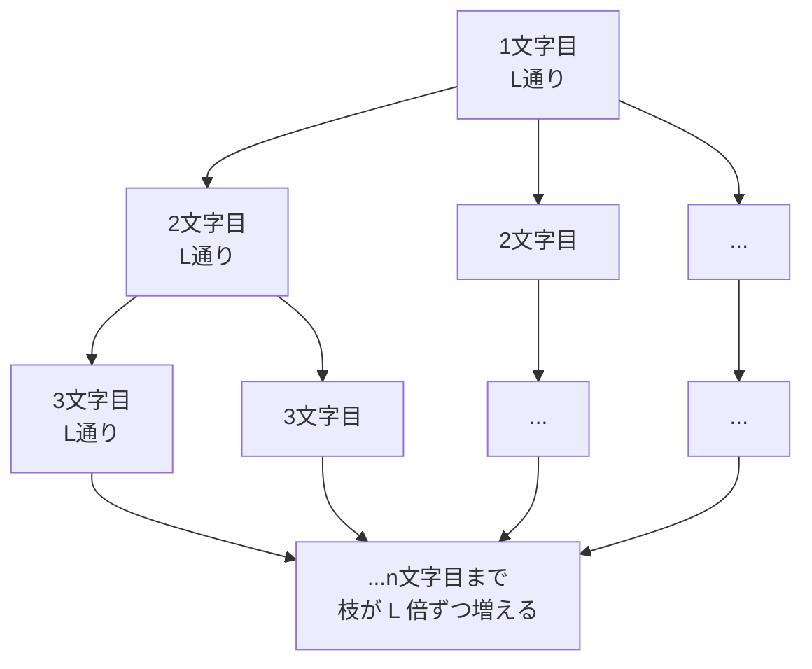
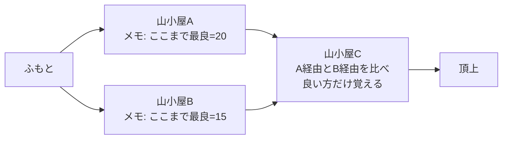
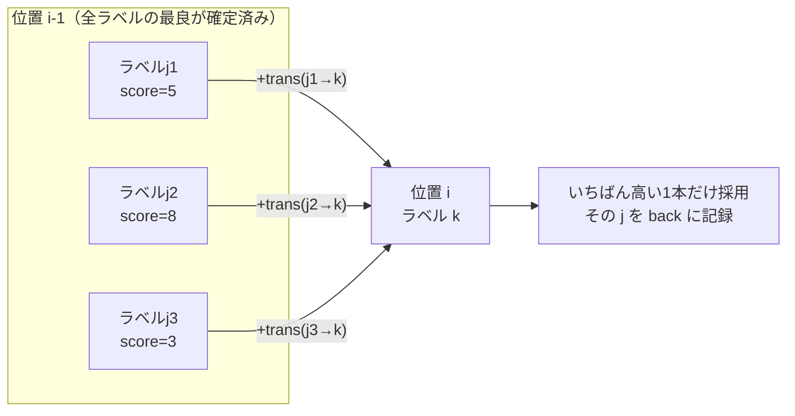
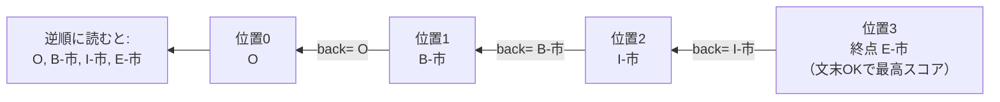
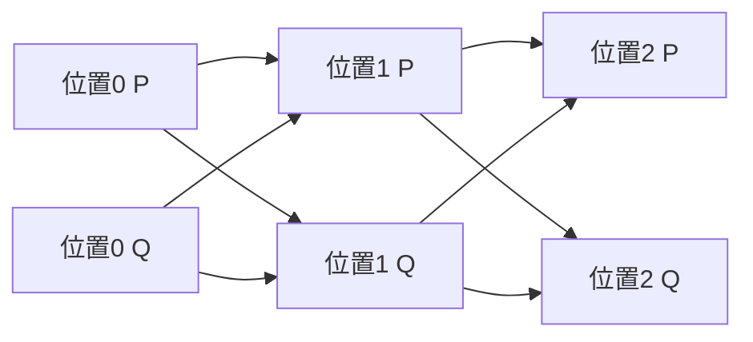

# 第10章　Viterbi と動的計画法（最良の道を、ズルせず一瞬で）

> **この章のゴール**
> - ラベルの並べ方は「文字数ぶんのかけ算」で爆発する（L^n 通り）と実感する
> - **動的計画法（DP）**＝「とちゅうの最良結果を覚えて使い回す」工夫だと分かる
> - **Viterbi（ビタビ）**が「各位置×各ラベルの最良スコアだけ覚える」DP で、計算量を L^n から n×L×L に激減させると分かる
> - BIOES の合法性マスク（`allowed`/`allowedStart`/`allowedEnd`）が「壊れた並び」を排除するしくみをつかむ

> **登場人物**：みどり先生、ツムギ、ゲンタ、バーティ

---

## いちばん良い「並べ方」を、どうやって見つける？

**みどり先生**：第9章で、住所の文字には「並び順のルール」があると学んだね。
「県の次にいきなり号は来ない」とか。それを `trans`（遷移）の重みで覚えさせた。

**ツムギ**：はい。じゃあ、あとは住所が来たら、ぜんぶの並べ方を試して、
いちばんスコアが高い並びを選べばいいんですよね？

**みどり先生**：……それができたら苦労はないんだ。あわてない、あわてない。
そこに、今日の主役が飛んでくるよ。

**バーティ**：チュンッ！　ぼく、バーティ！　「いちばん良い道」を見つける小鳥だよ。
ぜんぶ試す？　それ、やめたほうがいい。**地球が滅びるまで終わらない**から！

**ゲンタ**：は？　おおげさだろ。それ、意味あるの？

**バーティ**：おおげさじゃないよ。数えてみようよ。

---

## 問題：ラベルの並べ方は「爆発」する

**みどり先生**：ラベルの種類が `L` 個、文字が `n` 個あるとする。
1文字目に L 通り、2文字目にも L 通り、3文字目にも……。

**みどり先生**：だから並べ方の総数は——

$$
\underbrace{L \times L \times L \times \cdots \times L}_{n\,\text{個}} = L^{n}
$$

> 📌 **読み方メモ**
> - `L^n`（エル・の・エヌ乗）＝「L を n 回かけた数」。
> - `Π`（パイ）と同じで「かけ算」の世界。足し算とちがって、**ものすごい勢いで大きくなる**。

**みどり先生**：たとえば、ラベルが 10 種類、文字が 20 個の、短い住所でやってみよう。

```
10^20 = 100,000,000,000,000,000,000（1のあとに0が20個）
```

**ツムギ**：え……ゼロ、いくつ？　1のあとに……20個……？

**バーティ**：チュン。それ、**1秒に1億通り試せる超高速マシン**でも、
ぜんぶ終わるのに **3万年以上** かかる数だよ。住所1本でだよ？

**ゲンタ**：……うわ。たしかに地球が滅びるな。意味ある発言だったわ、ごめん。



**みどり先生**：これが**組合せ爆発（くみあわせばくはつ）**。
枝分かれが文字ごとに L 倍になって、あっという間に手に負えなくなる。
「ぜんぶ試す（総当たり）」は、原理的には正しいけど、**現実には絶対に終わらない**んだ。

---

## 動的計画法：「とちゅうの最良」を覚えて、使い回す

**ツムギ**：じゃあ、どうするんですか……？　全部試せないのに、いちばん良い並びなんて分かるの？

**バーティ**：分かるんだなあ。コツはね、**「同じ計算を二度しない」**こと！

**みどり先生**：これを **動的計画法（どうてきけいかくほう、dynamic programming, DP）**という。
名前はいかついけど、気持ちはすごく素朴だよ。たとえ話をしよう。

**みどり先生**：山のふもとから頂上まで、いくつもの分かれ道がある登山を考えて。
「いちばん楽な道」を知りたい。バカ正直なやり方は、ふもとから頂上までの
**全ルートを1本ずつ最後まで歩く**こと。これは L^n の総当たりと同じだ。

**みどり先生**：でも、かしこい登山者はこうする。途中の山小屋に着くたびに、
**「この山小屋まで、いちばん楽に来る方法はコレ」とメモを貼る**。
次の山小屋では、手前のメモを見るだけ。**その手前までどう来たかは、もう考え直さない**。



**ツムギ**：あ、なるほど！　「山小屋Cまでの最良」が分かれば、
そこから先は、Cより手前のことはもう忘れていいんだ。

**みどり先生**：そのとおり！　**「とちゅうの地点までの最良結果を覚えておいて、その先で使い回す」**。
これがDPの心臓。同じ計算（山小屋までの道のり）を、何度もやり直さなくて済む。

---

## Viterbi：系列の最良ラベル列を見つけるDP

**バーティ**：チュンッ！　ここでぼくの出番！
住所の「文字の並び」に、このDPを当てはめたのが **Viterbi（ビタビ）**だよ。

**みどり先生**：山小屋にあたるのが「**位置 i ×ラベル k**」。
たとえば「3文字目が `市の中（I-市）` だったとき、そこまでの最良スコアはいくつ？」を覚えておく。
覚えるものは、たった2つだけ。

> **Viterbi が各「位置 i × ラベル k」について覚えるもの**
> - `score[i][k]` … 「i 番目の文字を ラベル k で終えるとき、そこまでの**最良スコア**」
> - `back[i][k]` … 「そのとき、**直前（i-1 番目）が何ラベルだったか**」（来た道のメモ）

**ゲンタ**：`score` が「山小屋までの最良の楽さ」で、`back` が「どっちから来たか」のメモか。

**みどり先生**：完璧だ。そして、次の位置の値は、**前の位置の最良からスコアを伸ばすだけ**で計算できる。



**バーティ**：位置 i のラベル k に来る道は、前の位置の L 本のラベルからしかない。
だからその L 本を比べて、**いちばん高い1本だけ残す**。残りは捨てる！

**みどり先生**：捨てていいのがミソだよ。なぜなら、k を通る最良の道は、
**「k の手前までを最良で来た道」の続きに決まっている**から。
手前で損している道を、あとから挽回することはできない。だから手前の最良だけ覚えればいい。

---

## スコアの中身（第8・9章とのつながり）

**みどり先生**：では `score[i][k]` の中身を、第8・9章の言葉で書こう。
覚えているかな。スコアは2種類の重みでできていた。

- **emission（エミッション）**＝「その文字そのものの手がかりから来る、ラベル k っぽさ」（第8章、`emis`）
- **trans（遷移）**＝「直前ラベル j から ラベル k へ、つながりやすさ」（第9章）
- **start（スタート）**＝「文頭にラベル k が来やすいか」（第9章）

**みどり先生**：これを使うと、Viterbi の更新式はこう書ける。読み方つきだよ。

$$
\text{score}[i][k] = \Big(\max_{j}\ \big(\text{score}[i-1][j] + \text{trans}[j][k]\big)\Big) + \text{emission}(i,\,k)
$$

> 📌 **読み方メモ**
> - `max_j (……)`（マックス・じぇい）＝「j を全ラベルで動かして、いちばん大きい値をとる」。
>   気持ちは「**前のどのラベルから来るのが、いちばん得か**を選ぶ」。
> - `score[i-1][j] + trans[j][k]` ＝「前の最良スコア」＋「j から k への移りやすさ」。
> - 最後に `+ emission(i,k)` ＝「いまの文字 i の手がかりぶんの、k っぽさ」を足す。

**みどり先生**：いちばん最初（i=0、文頭）だけは前がないので、`trans` のかわりに `start` を使う。

$$
\text{score}[0][k] = \text{start}[k] + \text{emission}(0,\,k)
$$

**ツムギ**：「前の最良 ＋ つながりやすさ」のいちばん良いのを選んで、
そこに「いまの文字らしさ」を足す。山小屋のメモと、まったく同じ形だ！

**みどり先生**：そう。第4章の「内積（かけて足す）」も、第8章の重み更新も、
ぜんぶここに集まってくる。今日でつながるんだ。

---

## BIOES の合法性マスク：壊れた並びを「−∞」で消す

**ゲンタ**：でもさ、ラベルって BIOES（ビオエス）だったよね。`B-市`（始め）、`I-市`（中）、
`E-市`（終わり）、`S-市`（単独）、`O`（外）。これ、変な並びがありえない？
たとえば、いきなり `I-市`（市の途中）から始まったら、おかしくない？

**みどり先生**：鋭い。まさにそれを防ぐのが、Viterbi の **合法性マスク**だ。
ルールはこの3つ。

> **BIOES の並びルール**
> - **文頭**に来ていいのは `O` / `B-…` / `S-…` だけ（途中や終わりからは始まれない）
> - **文末**に来ていいのは `O` / `E-…` / `S-…` だけ（始まりや途中で終われない）
> - `I-X` や `E-X`（中・終わり）は、**同じラベル X の `B-X` か `I-X` の直後だけ**許す

**みどり先生**：kugiri の `PerceptronTagger.java` に、そのまま書いてある。

```java
// startOk：文頭に来ていいラベルか（O / B / S のみ）
private static boolean startOk(String cur) {
    String p = split(cur)[0];
    return p.equals("O") || p.equals("B") || p.equals("S");
}

// endOk：文末に来ていいラベルか（O / E / S のみ）
private static boolean endOk(String cur) {
    String p = split(cur)[0];
    return p.equals("O") || p.equals("E") || p.equals("S");
}

// transOk：prev の直後に cur が来ていいか
private static boolean transOk(String prev, String cur) {
    String[] pp = split(prev), pc = split(cur);
    String ppos = pp[0], cpos = pc[0];
    if (cpos.equals("O") || cpos.equals("B") || cpos.equals("S")) return true;
    // I/E は同ラベルの B/I の後のみ（pp[1]==pc[1] が「同じラベル名」のチェック）
    boolean cont = (ppos.equals("B") || ppos.equals("I")) && pp[1].equals(pc[1]);
    return cont;
}
```

**みどり先生**：このチェックは、起動時にいちど表（マトリクス）にまとめられる。
`allowed[j][k]`（j→k はOK？）、`allowedStart[k]`（文頭OK？）、`allowedEnd[k]`（文末OK？）だ。

```java
// コンストラクタで、全ラベルの組み合わせを先に表にしておく
for (int j = 0; j < L; j++) {
    allowedStart[j] = startOk(labels.get(j));
    allowedEnd[j]   = endOk(labels.get(j));
    for (int k = 0; k < L; k++)
        allowed[j][k] = transOk(labels.get(j), labels.get(k));
}
```

**ツムギ**：で、違反する並びはどうするんですか？　禁止って、どうやって機械に伝えるの？

**バーティ**：チュン、かんたん！　違反する道のスコアを **−∞（マイナス無限大）**にしちゃうんだ！
スコアが「ありえないほど低い」道は、`max`（いちばん高いの選ぶ）で**絶対に選ばれない**でしょ？

**みどり先生**：コードでは `NEG`（= `Double.NEGATIVE_INFINITY`、マイナス無限大）を使う。
Viterbi の中を見てみよう。

```java
double NEG = Double.NEGATIVE_INFINITY;

// 文頭：合法なラベルだけ start+emission、ダメなら NEG
for (int k = 0; k < L; k++)
    score[0][k] = allowedStart[k] ? start[k] + emit0[k] : NEG;

for (int i = 1; i < n; i++) {
    for (int k = 0; k < L; k++) {
        double best = NEG; int arg = 0;
        for (int j = 0; j < L; j++) {
            // 遷移が違法 or 前が NEG（行き止まり）なら、その道は無視
            if (!allowed[j][k] || score[i - 1][j] == NEG) continue;
            double v = score[i - 1][j] + trans[j][k];
            if (v > best) { best = v; arg = j; }   // いちばん高い j を覚える
        }
        score[i][k] = (best == NEG) ? NEG : best + emit[k];
        back[i][k]  = arg;                          // 来た道メモ
    }
}
```

**ゲンタ**：`if (!allowed[j][k] || score[i-1][j] == NEG) continue;` ——
これが「違法な道と、行き止まりの道は、そもそも比べない」ってことか。
だから `I-市` が単独で始まる、みたいな**壊れた並びは、最初から候補に残らない**。

**みどり先生**：そういうこと。マスクのおかげで、Viterbi が選ぶ道は
**必ず BIOES として正しい並び**になる。これは総当たりにはない、うれしいおまけだ。

---

## 経路復元（backtrack）：メモをたどって、答えを組み立てる

**ツムギ**：`score` で最良スコアは分かったけど、**実際のラベルの並び**はどう取り出すんですか？

**みどり先生**：そこで `back` のメモが効いてくる。これが **経路復元（けいろふくげん、backtrack）**だ。
やることは2ステップ。

> **経路復元の手順**
> 1. 最後の文字（位置 n-1）で、**文末OKかつスコア最大**のラベルを選ぶ → これが終点
> 2. 終点から `back` をたどって、**直前ラベル → そのまた直前ラベル……と逆向きに**並べていく



**みどり先生**：コードでもこの通り。最後を選んで、`back` を逆向きにたどるだけ。

```java
// 1. 文末OKの中から、いちばんスコアの高いラベルを終点に
double best = NEG; int last = 0;
for (int k = 0; k < L; k++) {
    if (!allowedEnd[k] || score[n - 1][k] == NEG) continue;
    if (score[n - 1][k] > best) { best = score[n - 1][k]; last = k; }
}

// 2. back をたどって逆向きに復元
int[] path = new int[n];
path[n - 1] = last;
for (int i = n - 1; i > 0; i--)
    path[i - 1] = back[i][path[i]];   // 「直前に何だったか」をさかのぼる
return path;
```

**バーティ**：チュンッ！　行きは「最良スコアを前へ前へ伸ばす」、
帰りは「メモを逆向きにたどる」。これでズルなしで、いちばん良い道が一瞬で出る！

---

## 計算量：L^n から n×L×L へ

**みどり先生**：さあ、いちばん大事なところ。Viterbi の計算量を数えよう。

**みどり先生**：位置は `n` 個。各位置で、ラベル k が `L` 通り。
その k ごとに、前のラベル j を `L` 通り見比べる。だから——

$$
n \times L \times L
$$

> 📌 **読み方メモ**：`n×L×L`（エヌ・かける・エル・かける・エル）＝
> 「位置の数 × いまのラベル × 前のラベル」。**かけ算3つの足し算的な伸び方**で、おだやか。

**ゲンタ**：さっきの総当たりが `L^n`（L の n 乗、爆発）で、Viterbi が `n×L×L`……
全然ちがうな。`n` が指数（肩の上）から、ただのかけ算に降りてきてる。

**みどり先生**：さっきの「L=10、n=20」でくらべよう。

| やり方 | 計算量 | だいたいの回数 |
|---|---|---|
| 総当たり | `L^n` = 10^20 | 1のあとに0が20個（3万年級） |
| Viterbi | `n×L×L` = 20×10×10 | **2000回**（一瞬） |

**ツムギ**：3万年が、2000回！？　……魔法じゃん。

**バーティ**：魔法じゃないよ、**かしこいだけ**！　**ズルじゃないよ、かしこいだけ！**
「とちゅうの最良を覚えて、ムダな道を考え直さない」——それだけでこうなるんだ。チュンッ！

---

## 手を動かそう：小さなトレリスで最良経路をたどる

実際の Viterbi が使う「**トレリス（格子）**」を、ちいさい例で手でたどってみましょう。
（`PerceptronTagger.viterbi` の `score` / `back` をミニチュアにしたものです）

**設定**
- ラベルは2種類だけ：`P` と `Q`
- 文字は3個：位置 0、1、2
- 合法性マスクは今回ぜんぶOK（壊れた並びは考えない、純粋にスコアだけで選ぶ練習）

**スコア表（与えられた数）**

```
emission（その位置・そのラベルらしさ）
        位置0   位置1   位置2
  P       2      1       0
  Q       0      2       3

start（文頭の出やすさ）：  P=1,  Q=0
trans（前→次のつながりやすさ）：
  P→P = 1    P→Q = 0
  Q→P = 0    Q→Q = 2
```

トレリスの絵（格子の各マスが `score[i][k]`、矢印が `back`）：



**問題**：`score[0]` から順に `score[2]` まで計算し、文末で最良の終点を選び、
`back` をたどって最良ラベル列（位置0→1→2）を求めなさい。

<details>
<summary>こたえ（計算の手順つき）</summary>

**位置0（文頭：start + emission）**
- `score[0][P]` = start(P) + emis(0,P) = 1 + 2 = **3**
- `score[0][Q]` = start(Q) + emis(0,Q) = 0 + 0 = **0**

**位置1（max_j(前 + trans) + emission）**
- k=P：候補は
  - P→P：3 + trans(P→P=1) = 4
  - Q→P：0 + trans(Q→P=0) = 0
  - 最大は **4**（来た道 back=P）。+ emis(1,P)=1 → `score[1][P]` = **5**、back=P
- k=Q：候補は
  - P→Q：3 + trans(P→Q=0) = 3
  - Q→Q：0 + trans(Q→Q=2) = 2
  - 最大は **3**（来た道 back=P）。+ emis(1,Q)=2 → `score[1][Q]` = **5**、back=P

**位置2**
- k=P：
  - P→P：5 + 1 = 6
  - Q→P：5 + 0 = 5
  - 最大 **6**（back=P）。+ emis(2,P)=0 → `score[2][P]` = **6**、back=P
- k=Q：
  - P→Q：5 + 0 = 5
  - Q→Q：5 + 2 = 7
  - 最大 **7**（back=Q）。+ emis(2,Q)=3 → `score[2][Q]` = **10**、back=Q

**終点を選ぶ**：`score[2][P]`=6 と `score[2][Q]`=10 → **Q が終点**（スコア10）。

**back をたどる（逆向きに復元）**
- 位置2 = Q　→ back[2][Q] = **Q**
- 位置1 = Q　→ back[1][Q] = **P**
- 位置0 = P

**最良ラベル列：`P, Q, Q`（スコア10）** 🐦

総当たりなら 2^3 = 8 通り全部足して比べることになりますが、Viterbi は各マスで
「いちばん良い1本」だけ残したので、ムダなく同じ答えにたどり着けました。

</details>

---

## 今日のまとめ

- ラベルの並べ方は `L^n` 通りで**組合せ爆発**する。総当たりは現実には終わらない。
- **動的計画法（DP）**＝「とちゅうの最良結果を覚えて使い回す。同じ計算を二度しない」。
- **Viterbi** は系列の最良ラベル列を見つける DP。各「位置 i ×ラベル k」について
  `score[i][k]`（そこまでの最良スコア）と `back[i][k]`（直前ラベル）だけ覚える。
- スコアは `score[i][k] = max_j(score[i-1][j] + trans[j][k]) + emission(i,k)`。
  文頭は `start[k] + emission`。第8・9章の重みがここで合流する。
- **BIOES 合法性マスク**（`allowed`/`allowedStart`/`allowedEnd`）が、違反する道のスコアを
  **−∞（NEG）**にして、壊れた並び（`I-` が単独で始まる等）を排除する。
- **経路復元（backtrack）**：文末で最良の終点を選び、`back` を逆向きにたどって並びを組み立てる。
- 計算量は `L^n` → **`n×L×L`** に激減。3万年級が一瞬になる。「ズルじゃないよ、かしこいだけ！」

---

## アザミメーター

```
アザミの見え具合：██████░░░░ 58%
（コメント：最良の道を一瞬で選ぶ目を手に入れた。アザミの体の輪郭が、はっきり見えてきた！）
```

---

## 次回予告

**みどり先生**：これで、住所に正しい並びの旗（ラベル）を立てられるようになった。
でも——その旗、**どれくらい当たってるの？**　ちゃんと測らないとね。

**ツムギ**：「正解率」でいいんじゃないですか？　当たった割合でしょ？

**みどり先生**：それがね、正解率だけ見ると、**コロッとだまされる**ことがあるんだ。
次の章で「適合率・再現率・F1」という、ちゃんとしたものさしを学ぼう。あわてない、あわてない。

[← 第9章](09-structured-perceptron.md) ・ [第11章 →](11-hyouka-f1.md)
