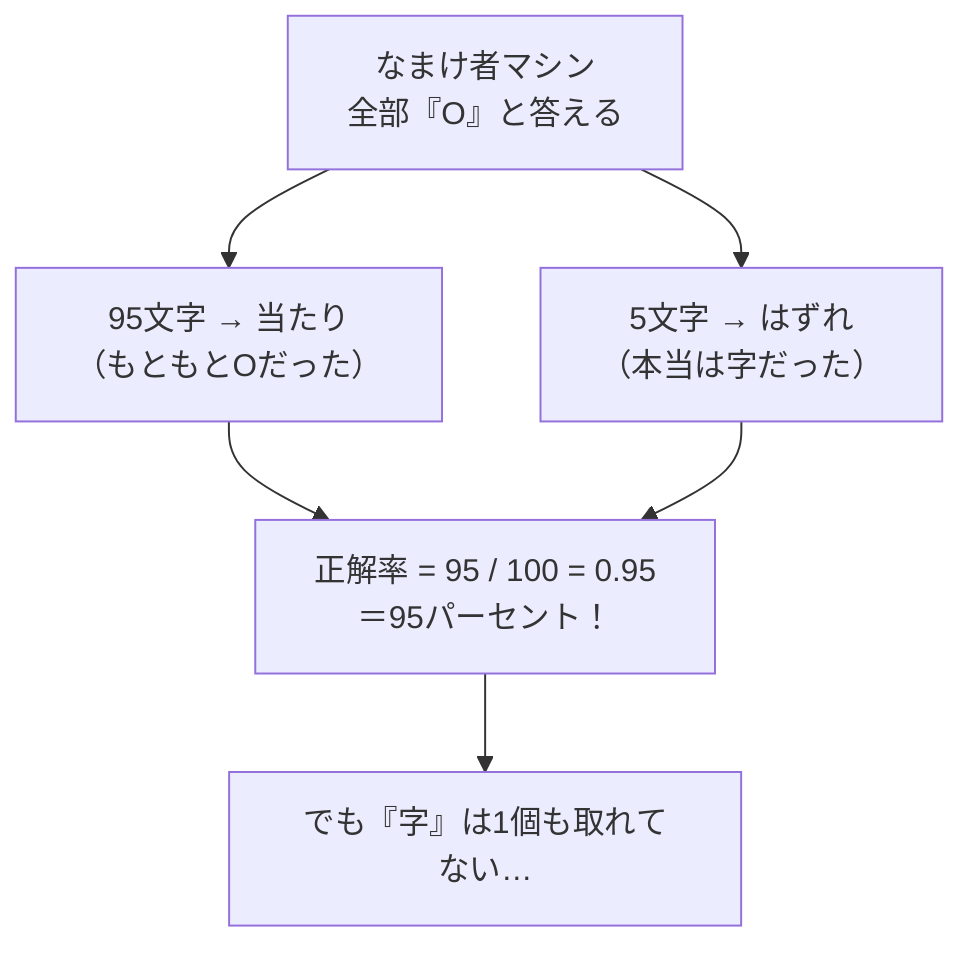
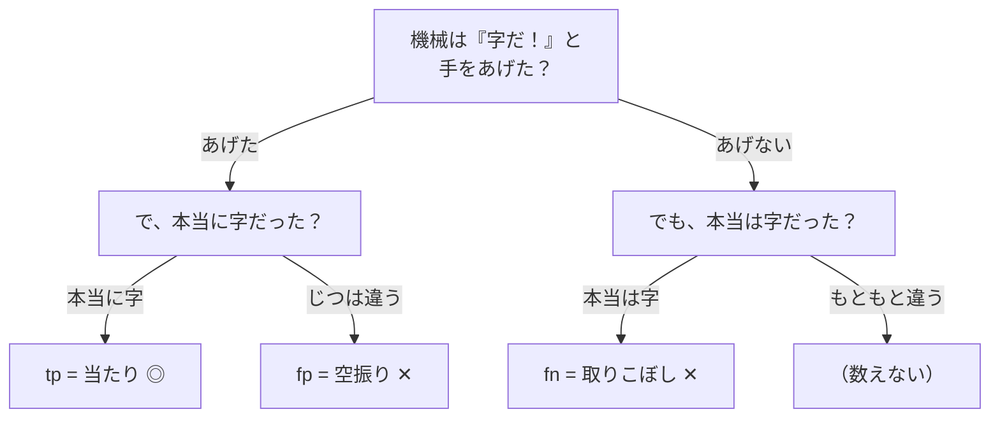
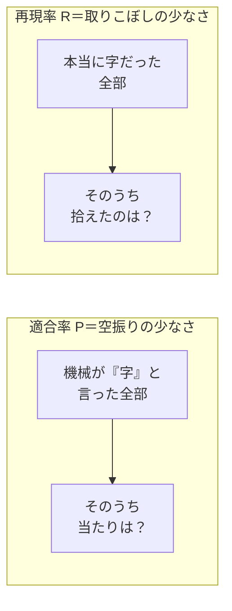
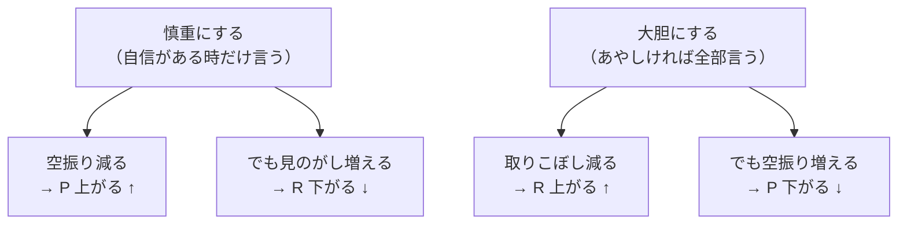
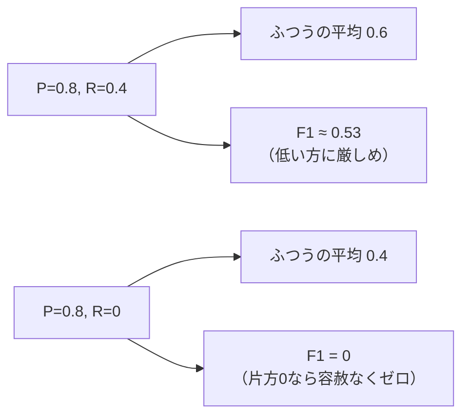

# 第11章　評価：適合率・再現率・F1（正解率じゃダメな理由）

> **この章のゴール**
> - 「機械がどれくらい賢いか」を**数字で測る**（評価、evaluation）大切さがわかる
> - **正解率（accuracy）だけではダメ**な理由を、たとえ話でつかむ
> - **適合率 P・再現率 R・F1** の3つを、自分で計算できるようになる
> - kugiri の `AddressParser.evaluate` が「文字（token）単位」で P/R/F1 を数えていることを読める

> **登場人物**：みどり先生、ツムギ、ゲンタ、アザミ

---

## 学んだあと、どうやって「賢さ」を測る？

**ツムギ**：先生！　前の章までで、パーセプトロンとViterbiで住所に旗（ラベル）を立てられるようになりました！　もう完成ですよね？

**みどり先生**：あわてない、あわてない。機械を作ったら、次に必ずやることがある。
**「で、それ、どれくらい当たってるの？」**を測ることだよ。これを **評価（ひょうか、evaluation）** という。

**ゲンタ**：当たってるかどうかなんて、正解と見くらべて、合ってた割合を数えればいいんじゃないの？　それ、意味あるの、わざわざ章にするほど？

**みどり先生**：その「合ってた割合」を **正解率（せいかいりつ、accuracy）** っていうんだ。
ゲンタの言うとおり、いちばん素直な測り方だよ。でもね……これだけだと、**だまされる**んだ。

**ツムギ**：だまされる！？　数字なのに？

**みどり先生**：そう。数字こそ、見方をまちがえるとウソを言う。今日はそこを、じっくりやろう。

---

## 正解率のおとしあな

**みどり先生**：まず、住所のラベルを思い出して。1文字ずつに旗が立っていたよね。

**ツムギ**：はい。「岩手県」の「岩」「手」「県」にそれぞれ「都道府県」の旗、とか。

**みどり先生**：ところで、住所の文字って、**ほとんどが「O（オー、どれでもない＝OUTSIDE）」やかんたんな部分**なんだよ。
区切りの記号、「県」「市」みたいな決まりきった末尾……。本当に当てたい **「字（あざ）」や「地番」** は、ほんの一部なんだ。

**アザミ**：……わたし、いつも少ししか出てこないの……。

**みどり先生**：そこなんだ、アザミ。たとえばね、100文字のうち、本当に「字」なのが5文字、残り95文字は「O」やかんたんな部分だとする。
ここで、**ぜんぶ「O」って答えるだけ**の、なんにも学習してないバカな機械を考えてみよう。



**ツムギ**：えっ、なんにもしてないのに **95パーセント**！？　すごく賢そうに見える！

**みどり先生**：そこがワナなんだ。正解率0.95は立派に見える。でも、この機械は**いちばん大事な「字」を1個も拾えていない**。アザミは、まったく見つけてもらえていないんだよ。

**アザミ**：……95パーセントって言われても、わたしは見えないままなのね……。

**ゲンタ**：なるほど……。簡単な多数派（O）を当てるだけで点が稼げちゃうから、肝心のレアな部分ができてるか分からない、と。それは確かにダメだ。

**みどり先生**：そういうこと。だから、**ラベルごとに、もっと細かく**測る道具がいる。それが、これから話す3つだ。

---

## まず「3つの数」を数える：tp / fp / fn

**みどり先生**：あわてない、あわてない。むずかしくないよ。
ある1つのラベル、たとえば「字」に注目する。機械の答えと正解を見くらべて、**3種類の数**を数えるんだ。

> **混同の3カウント**（あるラベルについて）
> - **tp**（ティーピー、true positive＝当たり）：機械が「字」と言って、**本当に字**だった
> - **fp**（エフピー、false positive＝空振り）：機械が「字」と言ったけど、**じつは字じゃなかった**
> - **fn**（エフエヌ、false negative＝取りこぼし）：本当は字なのに、機械が**字と言わなかった**

**ツムギ**：tp、fp、fn……。p（ポジティブ）は「機械が『字だ！』と手をあげたか」で、t（トゥルー）/f（フォルス）は「その手あげが合ってたか」ってこと？

**みどり先生**：ばっちり。整理すると、こうなる。



**ゲンタ**：「もともと字じゃなくて、機械も字と言わなかった」やつは数えないの？

**みどり先生**：鋭い。それは **tn（true negative）** といって、ふつう数えない。
なぜなら、それって「Oを正しくOと言えた」みたいな、**さっきの『なまけ者でも稼げる多数派』**だからね。
P・R・F1は、わざとそこを**勘定に入れない**。だから多数派でズルできないんだ。

**ツムギ**：あ！　だから正解率のワナにかからないのか！

---

## 適合率 P：空振りの少なさ

**みどり先生**：では1つめの指標。**適合率（てきごうりつ、precision、ピー）** だ。式はこれ。

$$
P = \frac{tp}{tp + fp}
$$

> 📌 **読み方メモ**
> - `P`（ピー）＝適合率。分数の **横線は「割る」**。
> - 分母 `tp + fp` ＝「機械が**『字だ！』と手をあげた回数**ぜんぶ」（当たり＋空振り）。
> - だから P ＝「**手をあげたうち、本当に当たってた割合**」。
> - 気持ち：**空振りの少なさ**。あわてて手をあげない、慎重さの点数。

**みどり先生**：たとえば、機械が「字だ！」と10回手をあげて、そのうち8回が本当に字なら——

```
P = 8 / (8 + 2) = 8 / 10 = 0.8
```

**ツムギ**：手をあげた10回のうち8回当たり。だから0.8。わかりやすい！

**みどり先生**：Pが高い機械は「**言ったことは信用できる**」。でも、Pだけ見てると落とし穴があってね……次に行こう。

---

## 再現率 R：取りこぼしの少なさ

**みどり先生**：2つめ。**再現率（さいげんりつ、recall、アール）**。

$$
R = \frac{tp}{tp + fn}
$$

> 📌 **読み方メモ**
> - `R`（アール）＝再現率。
> - 分母 `tp + fn` ＝「**本当に字だった文字**ぜんぶ」（拾えた＋取りこぼした）。
> - だから R ＝「**本当の正解のうち、ちゃんと拾えた割合**」。
> - 気持ち：**取りこぼしの少なさ**。見のがさない、もれの無さの点数。

**みどり先生**：本当の「字」が全部で20文字あって、機械が拾えたのが8文字なら——

```
R = 8 / (8 + 12) = 8 / 20 = 0.4
```

**ツムギ**：あ、こっちは低い。20個あるのに8個しか拾えてないから……。

**みどり先生**：そう。さっきの機械、Pは0.8で「言ったことは正しい」けど、Rは0.4で「**たくさん見のがしてる**」。
PとRは、**見ている方向がちがう**んだ。図にするよ。



**ゲンタ**：Pは「自分が言ったこと」を分母にして、Rは「本当の正解」を分母にしてるんだな。同じ tp なのに、見る角度がちがう。

**みどり先生**：その通り。だから片方だけ高くても安心できない。

---

## PとRはトレードオフ（あちらを立てればこちらが立たず）

**ツムギ**：じゃあ両方100パーセントにすればいいじゃん！

**みどり先生**：それがなかなか難しくてね。PとRは、よく **トレードオフ**——つまり「**あちらを立てればこちらが立たず**」の関係になるんだ。

**みどり先生**：たとえば、機械を**慎重**にして「よっぽど自信がある時だけ『字だ！』と言う」ようにすると——



**ツムギ**：慎重にすると空振りは減るけど、見のがしが増える……。逆に、なんでもかんでも「字だ！」って言えば取りこぼしは減るけど、空振りだらけ。

**みどり先生**：そういうこと。だから、**PとRの両方をバランスよく見たい**。
そこで生まれたのが、3つめの指標——**F1** だ。

---

## F1：PとRの「調和平均」

**みどり先生**：**F1（エフワン、F1 score）** は、PとRをひとつの数にまとめたものだよ。式はこれ。

$$
F_1 = \frac{2 \times P \times R}{P + R}
$$

> 📌 **読み方メモ**
> - `F1`＝PとRを合体させた総合点。0から1で、高いほど良い。
> - これは **調和平均（ちょうわへいきん、harmonic mean）** という、ちょっと特別な平均。
> - 気持ち：**PとRが両方そろって高くないと、高くならない**。片方サボると、すぐバレる。

**ツムギ**：なんで、ふつうに足して2で割る平均（`(P+R)/2`）じゃダメなんですか？

**みどり先生**：いい「なんで？」だ！　くらべてみよう。
さっきの機械、**P = 0.8、R = 0.4** だったね。

```
ふつうの平均：(0.8 + 0.4) / 2          = 0.6
F1（調和平均）：2 × 0.8 × 0.4 / (0.8 + 0.4)
              = 0.64 / 1.2            ≈ 0.53
```

**ゲンタ**：F1のほうが低く出るな。0.6 と 0.53。

**みどり先生**：そう。**調和平均は、低いほうに引っぱられる**。「Rが0.4とサボってるね、総合点はもっと厳しめにするよ」ってわけだ。
いちばん極端な例を見せよう。**片方が0**だったら？

```
もし R = 0 のとき
ふつうの平均：(0.8 + 0) / 2 = 0.4   ← まだ点がある
F1：2 × 0.8 × 0 / (0.8 + 0) = 0 / 0.8 = 0   ← ゼロ！
```

**ツムギ**：F1だと、片方が0なら**ピシャッと0**になる！

**みどり先生**：そこが調和平均の厳しくて、えらいところ。
「**取りこぼしが全部（R=0）なら、いくら言ったことが正しくても（P高い）、その機械は使いものにならない**」——それを数字でちゃんと言ってくれる。



**みどり先生**：だから kugiri でも、機械の本当の実力は **F1** で見る。
正解率にだまされず、PとRを両方そろえてはじめて、F1という総合点がもらえるんだ。

---

## 手を動かそう

ここで、実際の kugiri のソースを読んでみましょう。
ファイルは `src/main/java/org/unlaxer/kugiri/tagger/AddressParser.java`、メソッドは **`evaluate`** です。

まず、ラベルごとに `[tp, fp, fn]` を入れる箱を用意します。

```java
// AddressParser.evaluate より
long correct = 0, total = 0;
Map<String, long[]> stat = new LinkedHashMap<>(); // label -> [tp,fp,fn]
for (String lab : Labels.SURFACE) stat.put(lab, new long[3]);
```

`stat` は「ラベル名 → `[tp, fp, fn]` の3つ組」の表です。さっきの3カウントそのものですね。

つぎに、データの1文字ずつ、正解 `g`（gold）と機械の予想 `p`（pred）を見くらべます。

```java
for (Example ex : data) {
    List<String> pred = tagger.predict(ex.chars());
    for (int i = 0; i < ex.tags().size(); i++) {
        String g = ex.tags().get(i), p = pred.get(i);   // 正解 と 予想
        total++; if (g.equals(p)) correct++;            // ← これが「正解率」用の数え
        String gl = surface(g), pl = surface(p);        // 表層ラベル（B-/E-などを外す）
        if (gl != null && gl.equals(pl)) stat.get(gl)[0]++;  // tp（当たり）
        else {
            if (pl != null) stat.get(pl)[1]++;          // fp（空振り）：言ったラベルに+
            if (gl != null) stat.get(gl)[2]++;          // fn（取りこぼし）：正解ラベルに+
        }
    }
}
```

> 📌 **ここが大事**：このループは **1文字（codepoint）ずつ** 見ています。
> つまり、これは **token（文字）単位**の P/R/F1 です。
> 「『字』というかたまり丸ごと当たったか」を見る *entity単位* とは別物だよ、と覚えておいてください（伏線です）。

`correct / total` が正解率（tag accuracy）。`surface` は `B-字` や `E-字` から表層の「字」を取り出すヘルパで、`O`（OUTSIDE）のときは `null`（数えない＝さっきの tn と同じ理由）を返します。

最後に、ラベルごとに P・R・F1 を計算して文字列にします。**さっきの式が、そのままコードに**なっています。

```java
sb.append(String.format("tag accuracy = %.4f (%d/%d)%n",
        (double) correct / total, correct, total));         // ← 正解率
for (Map.Entry<String, long[]> e : stat.entrySet()) {
    long tp = e.getValue()[0], fp = e.getValue()[1], fn = e.getValue()[2];
    if (tp + fp + fn == 0) continue;                         // 一度も出ないラベルは飛ばす
    double pr = tp + fp == 0 ? 1 : (double) tp / (tp + fp);  // P = tp/(tp+fp)
    double rc = tp + fn == 0 ? 1 : (double) tp / (tp + fn);  // R = tp/(tp+fn)
    double f1 = pr + rc == 0 ? 0 : 2 * pr * rc / (pr + rc);  // F1 = 2PR/(P+R)
    sb.append(String.format("%-14s %6.3f %6.3f %6.3f%n", e.getKey(), pr, rc, f1));
}
```

**ゲンタ**：ほんとだ、`2 * pr * rc / (pr + rc)` ……F1の式そのままじゃん。

**みどり先生**：そう。今日やった算数が、そのままここに住んでいるんだよ。

---

### 計算練習（紙とえんぴつで）

機械が出した `tp / fp / fn` から、P・R・F1を計算してみましょう。

**問題1**：ラベル「地番」で、**tp = 6、fp = 2、fn = 2**。P, R, F1 は？

<details>
<summary>こたえ</summary>

- P = tp / (tp+fp) = 6 / (6+2) = 6 / 8 = **0.75**
- R = tp / (tp+fn) = 6 / (6+2) = 6 / 8 = **0.75**
- F1 = 2×0.75×0.75 / (0.75+0.75) = 1.125 / 1.5 = **0.75**

PとRが同じときは、F1も同じ値になります（バランスが取れている状態）。

</details>

**問題2**：ラベル「字」で、**tp = 3、fp = 1、fn = 6**（取りこぼしが多い！）。P, R, F1 は？

<details>
<summary>こたえ</summary>

- P = 3 / (3+1) = 3 / 4 = **0.75**（言ったことはわりと正しい）
- R = 3 / (3+6) = 3 / 9 ≈ **0.33**（でも6個も取りこぼし…）
- F1 = 2×0.75×0.33 / (0.75+0.33) = 0.495 / 1.08 ≈ **0.46**

参考：ふつうの平均なら (0.75+0.33)/2 = 0.54。
F1（0.46）はそれより低く、**取りこぼしの多さ**をちゃんと罰しています。アザミがまだ拾いきれていない、という警告ですね。

</details>

---

## ちょっとだけ伏線：合成データだと、数字が良く出すぎる

**ツムギ**：先生、デモ（`SynthDemo`）を動かしたら、F1が **1.000** って出ました！　完璧じゃないですか！

**みどり先生**：……あわてない、あわてない。そこなんだ、いちばん気をつけてほしいのは。
あれは **合成データ（人工的に作った住所）** だから、規則がきれいすぎて、簡単に当てられてしまうんだよ。**1.000は実力じゃない**。

**ゲンタ**：じゃあ、本当の力はどうやって測るの？

**みどり先生**：**hold-out（ホールドアウト）**——学習に使わず**取り分けておいた、見たことのないデータ**で測るんだ。
本番の住所みたいな「見たことのない」相手にどれだけF1が出るか。それが本当の実力。くわしくは **第18章** でやろう。

**アザミ**：……合成だと、わたし、簡単に見つかったふりをされちゃうのね……。

**みどり先生**：そう。だから本物のデータで、ちゃんとアザミを拾えてはじめて「できた」と言える。いいゴールだろう？

---

## 今日のまとめ

- 機械を作ったら、必ず **評価（evaluation）** で「どれくらい賢いか」を数字で測る。
- **正解率（accuracy）だけではダメ**。「O」など簡単な多数派が多いと、**全部Oでも高得点**になり、肝心の「字」「地番」が取れているか分からない。
- ラベルごとに **tp（当たり）/ fp（空振り）/ fn（取りこぼし）** を数える。多数派（tn）はわざと数えない。
- **適合率 P = tp/(tp+fp)**＝空振りの少なさ。**再現率 R = tp/(tp+fn)**＝取りこぼしの少なさ。両者は **トレードオフ**。
- **F1 = 2PR/(P+R)**＝PとRの **調和平均**。片方が0ならF1も0になる、厳しめの総合点。
- kugiri の `AddressParser.evaluate` は、これを **文字（token）単位** で数えている。
- 合成データのF1 1.000 は実力ではない。本当の力は **hold-out** で測る（第18章）。

---

## アザミメーター

```
アザミの見え具合：██████░░░░ 62%
（コメント：『どれくらいアザミを拾えたか』を正しく測るものさしを手に入れた。
　ごまかしのきかない目で見るほど、アザミの輪郭がくっきりしてきた！）
```

---

## 次回予告

**みどり先生**：さあ、ここからが本番だ。いよいよ **アザミを探す旅（Part 4）** に入るよ。
住所から、県・市・町・番地をぜんぶ取りのぞくと……まんなかに、名前のついていない「すきま」が残る。

**ツムギ**：そのすきまが……アザミの居場所！

**みどり先生**：そう。その「**残ったところ＝残差スロット**」を作るのが、次の章だ。あわてない、あわてない。

[← 第10章](10-viterbi.md) ・ [第12章 →](12-zansa-slot.md)
