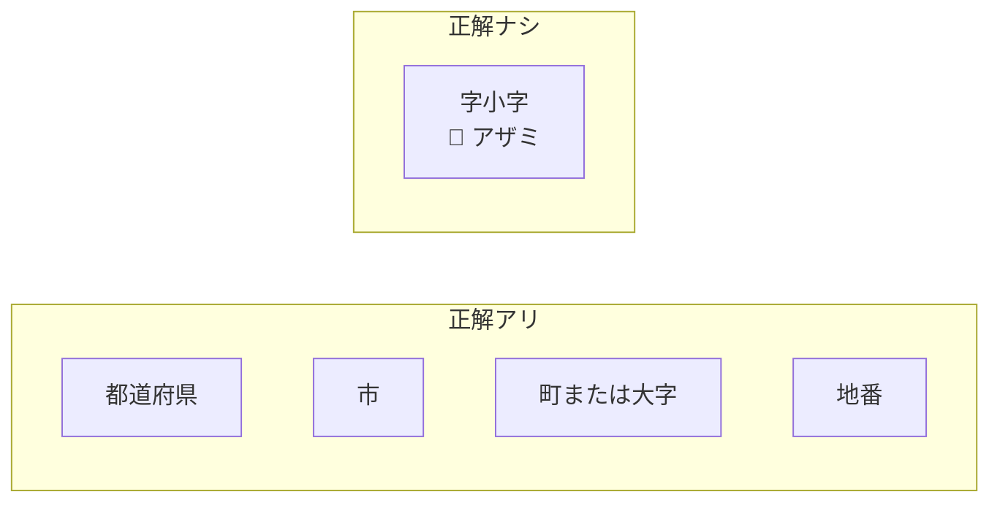
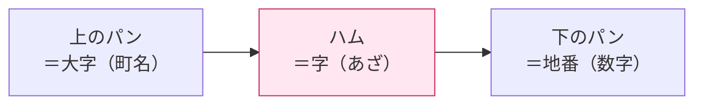
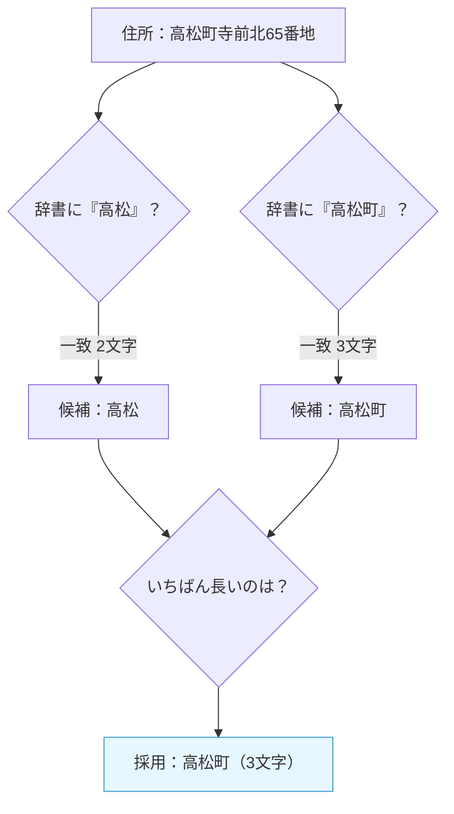
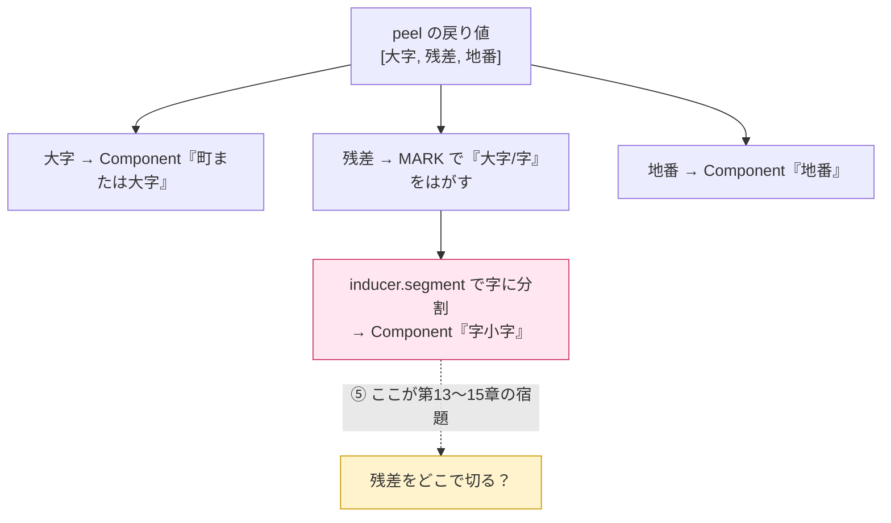
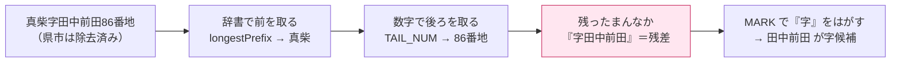

# 第12章　残差スロット：字の居場所をつくる

> **この章のゴール**
> - 「字（あざ）」には正解ラベルが無い、という第0章の宿題を思い出す
> - 「字そのもの」は分からなくても「字の**まわり**」は分かる、という発想をつかむ
> - kugiri の `Aza.peel` が住所を **[大字 ｜ 残差 ｜ 地番]** の3つに割るしくみを読む

> **登場人物**：みどり先生、ツムギ、ゲンタ、アザミ

> 📦 **コードの置き場所メモ**：この章以降で解説する字推定アルゴリズムの本体は、
> 共有ライブラリ **japanese-parser-common 0.2.0 の `org.unlaxer.jaddress.aza`**
> （`Aza` / `AzaInducer` / `AzaParse`）に移設されました。kugiri 側の
> `aza/Aza.java` は、その結果を kugiri の `Component` に詰め替えるだけの薄い
> アダプタです。**しくみの説明はそのまま有効**で、コードが住む場所が変わっただけ、
> と思って読んでください。

---

## ここから Part4。アザミが、いよいよ主役

**みどり先生**：さあ、ここからは Part4「**アザミを探せ**」だ。
これまで学んだパーセプトロンや Viterbi は、いわば**前座**。本番はここからだよ。

**アザミ**：……わたしの、お話なの？

**ツムギ**：アザミ、さっきよりちょっとだけ、はっきり見える気がする！

**アザミ**：ふふ……みんなが県や市や番地を、ちゃんと切れるようになったから。
わたしの**まわり**が、きれいになってきたのよ。

**ゲンタ**：まわりが、きれい？　それ、意味あるの？

**みどり先生**：あわてない、あわてない。じつはそれが、今日のいちばん大事なヒントなんだ。

---

## 復習：字だけは「正解」が無い

**みどり先生**：第0章を思い出そう。住所の部品には、ぜんぶ名前（ラベル）がついていたね。
県、市、区、町、丁目、番地、号……。でも、ひとつだけ仲間はずれがいた。

**ツムギ**：あ、字（あざ）！

**みどり先生**：そう。国が配っている住所データ（ABRや郵便番号データ）には、
県・市・町・番地は**きちんと分かれて**入っている。
でも「字」は町名の中にまぎれていて、**どこからどこまでが字か、だれも区切ってくれていない**。



**ゲンタ**：正解が無いってことは……第8章でやったパーセプトロンが使えないじゃん。
あれ、「正解を見せて、まちがえたら直す」だったろ？

**みどり先生**：鋭い。正解（教師）が無いと、ふつうの学習はできない。
これを **教師なし（きょうしなし、unsupervised）** の問題という。
じゃあ、お手上げ？……いや、ちがう。**まわりから攻める**んだ。

---

## アイデア：まわりを取り除けば、まんなかが字

**みどり先生**：ここで、たとえ話。ツムギ、サンドイッチを思いうかべて。
パンと、パンの間にハム。「ハムって何センチ？」って聞かれたら、どうする？

**ツムギ**：えーと……ハムを直接はかるんじゃなくて、
**サンドイッチ全部から、上のパンと下のパンをのければ**、残りがハム！

**みどり先生**：それ！　まさにそれが今日の作戦だ。
住所も同じ。**字の前**には県・市・町（大字）がある。**字の後ろ**には番地（数字）がある。



**みどり先生**：だから、**前のパン（大字）と後ろのパン（地番）を取り除けば、
残ったまんなかが「字の候補」になる**。
この「のこったまんなか」を、**残差（ざんさ、residual）スロット**と呼ぶよ。

**ゲンタ**：残差……「引き算してのこったもの」って意味か。

**みどり先生**：そのとおり。`全体 − 前 − 後ろ = 残差`。
ここがすごいのは——**字の正解を一度も使っていない**こと。
前は辞書、後ろは数字のパターン。**まわりの構造だけ**で、字の居場所が決まるんだ。

**アザミ**：……わたしの「居場所」を、つくってくれるのね。

---

## `Aza.peel`：住所を3つにむく

**みどり先生**：では実物を見よう。kugiri では `aza/Aza.java` の `peel`（ピール、＝皮をむく）が、
この「サンドイッチをむく」仕事をしている。

```java
// Aza.java より
/** (大字, 残差=字候補, 末尾数字=地番)。頭の ZIP/都道府県/市区町村は除去済み想定。 */
public static String[] peel(String text, Set<String> oazaDict) {
    String oaza = longestPrefix(text, oazaDict);          // ① 前のパン
    String rest = text.substring(oaza.length());          // 残り
    Matcher m = TAIL_NUM.matcher(rest);                    // ② 後ろのパン
    if (m.find()) return new String[]{oaza, rest.substring(0, m.start()), rest.substring(m.start())};
    return new String[]{oaza, rest, ""};                   // 数字が無ければ残り全部がハム
}
```

**ツムギ**：戻り値が `String[]` ……3つ入った箱が返ってくるんだね。
`[大字, 残差, 末尾数字]`。サンドイッチの3層だ！

**みどり先生**：そう。ここで「頭の ZIP・都道府県・市区町村は**除去済み**」と書いてあるね。
これは Part3 で作ったパーセプトロンが先に切ってくれた、という前提。
**だから前座が大事だった**んだよ。

---

### ① 前のパン：`longestPrefix`（最長一致）

**みどり先生**：まず前のパン、つまり大字（おおあざ、町名）を取る。
使うのは `longestPrefix` ——名前のとおり「**いちばん長く先頭に一致する**」町名を辞書から選ぶ。

```java
// Aza.java より
public static String longestPrefix(String text, Set<String> dict) {
    String best = "";
    for (String w : dict)
        if (text.startsWith(w) && w.length() > best.length()) best = w;  // 先頭一致のうち最長
    return best;
}
```

**ゲンタ**：`text.startsWith(w)` で「先頭が辞書の言葉 `w` で始まってる？」を見て、
そのうち**いちばん長い `w`** を選ぶのか。なんで「最長」なの？

**みどり先生**：いい「なんで？」だ。たとえば辞書に「高松」と「高松町」の両方があったとする。
住所が「高松町…」なら、短い「高松」も一致してしまう。
でも本当に取りたいのは長い「高松町」のほうだよね。**長いほうが、より正確**。



**ツムギ**：辞書を**ぜんぶ見て、長い順に勝ち残り**ってことか。なるほど。

---

### ② 後ろのパン：`TAIL_NUM`（末尾の数字）

**みどり先生**：次は後ろのパン、地番（じばん、番地の数字）だ。
これは辞書じゃなくて、**数字のパターン**で取る。`TAIL_NUM` という正規表現を使うよ。

```java
// Aza.java より
private static final String NUM = "0-9０-９一二三四五六七八九十百千";
private static final Pattern TAIL_NUM = Pattern.compile(
        "[" + NUM + "][" + NUM + "\\-ー‐−－のノ]*(?:番地|地割|番|号|丁目)?.*$");
```

**ツムギ**：うっ、急にむずかしそう……。

**みどり先生**：あわてない、あわてない。ひとつずつほどこう。
`NUM` は「数字とみなす文字」のリスト。よく見て。

- `0-9` … ふつうの半角数字（`1` `2` `3`）
- `０-９` … 全角数字（`１` `２` `３`）。第1章で「見た目は同じでも codepoint がちがう」をやったね
- `一二三…千` … 漢数字（`一` `二` `十` `百`）

**ゲンタ**：日本の住所、`1番地` も `一番地` も `１番地` もあるからな。全部ひろうのか。

**みどり先生**：そう。正規表現の本体はこう読む。

| 部分 | 読み方 | 気持ち |
|---|---|---|
| `[NUM]` | 数字が1個 | 「ここから数字が始まるよ」 |
| `[NUM\-ー‐−－のノ]*` | 数字・ハイフン・「の/ノ」が0個以上 | `1-2` や `3の4` もまとめてひろう |
| `(?:番地｜地割｜番｜号｜丁目)?` | これらの接尾辞が、あれば1個 | 「番地」「号」などのオマケ |
| `.*$` | のこり全部、行末まで | それ以降は丸ごと地番あつかい |

**ツムギ**：`*` は「0個以上」、`?` は「あっても無くてもいい」だっけ。
つまり「**数字で始まって、そのあと数字やハイフンが続いて、番地とかがついてるかも**」を見つける!

**みどり先生**：満点。`m.find()` でそのパターンが見つかったら、
`m.start()`（＝数字が始まった位置）で残りをスパッと2つに割る。

```java
return new String[]{oaza, rest.substring(0, m.start()), rest.substring(m.start())};
//                        ↑ 数字の手前まで＝残差        ↑ 数字から先＝地番
```

**ゲンタ**：もし数字が1個も無かったら？

**みどり先生**：そのときは `if (m.find())` が外れて、最後の行——
`return new String[]{oaza, rest, ""}` ——が動く。
**残り全部がハム（残差）**、地番は空っぽ、ということだ。

---

## `inferComponents`：3層を「部品」に組み立てる

**みどり先生**：`peel` で3つにむいたら、それを kugiri の正式な「部品（`Component`）」に組み立てる。
それが `inferComponents`（インファー＝推定する）だ。

```java
// Aza.java より
public static List<Component> inferComponents(String text, Set<String> oazaDict, AzaInducer inducer) {
    String[] p = peel(text, oazaDict);                       // ① 3層にむく
    List<Component> comps = new ArrayList<>();
    if (!p[0].isEmpty()) comps.add(new Component("町または大字", p[0]));  // ② 前のパン → 大字
    String name = MARK.matcher(p[1]).replaceFirst("");        // ③ 残差から「大字」「字」マークを除く
    if (!name.isEmpty())
        for (String piece : inducer.segment(name))            // ④ 残差を字に分割（次章以降！）
            comps.add(new Component("字小字", piece));
    if (!p[2].isEmpty()) comps.add(new Component("地番", p[2]));          // ⑤ 後ろのパン → 地番
    return comps;
}
```

**ツムギ**：③の `MARK` ってなに？

**みどり先生**：これだよ。残差の**先頭**についている「大字」「字」という文字を、はがす役。

```java
private static final Pattern MARK = Pattern.compile("^(?:大字|字)?");
```

**みどり先生**：たとえば残差が「字寺前北」だと、頭の「字」は字そのものの名前じゃなくて
「ここから字ですよ」という**目印**にすぎない。だから取りのぞいて、純粋な名前「寺前北」にする。



**ゲンタ**：④の `inducer.segment(name)` ——残差を `for` でまわして、いくつかの `piece` に分けてる。
これが「字をさらに細かく切る」ところだな。中身は？

**みどり先生**：それが——**まだ説明していない**んだ。今日はそこには踏みこまない。

---

## 大事なこと：ここまで「正解ラベル」をゼロ回しか使っていない

**みどり先生**：もう一度、全体をながめよう。`peel` がやったことは、たった2つの道具だけ。



**みどり先生**：前は**辞書**、後ろは**数字のパターン**。
字そのものの「正解」は、一度も見ていない。**まわりの構造だけ**で字の居場所が決まった。
これが、教師なしの**土台**なんだ。

**アザミ**：……わたしの「居場所」が、できたのね。うれしい……。

**ツムギ**：でも先生、「田中前田」って、`田中` と `前田` の2つに分けるべきじゃない？

**みどり先生**：そこ！　それが**残された大問題**だ。
残差は見つかった。でも「**残差の中を、どこで切るか**」は、まだ全然わからない。
`inducer.segment` の中身——それが次の3章のテーマだよ。

---

## 手を動かそう

実物は `aza/Aza.java` の **`peel`** メソッド。手で動かしてみよう。

**お題**：住所 `高松寺前北65番地` を `peel` する。
ただし、大字辞書 `oazaDict` には `高松` が入っているとする（県・市は除去済みと考える）。

順番に追ってみましょう。

1. **`longestPrefix("高松寺前北65番地", {…,高松,…})`**
   先頭に一致する辞書の言葉のうち最長 → `"高松"`（2文字）。
2. **`rest`** ＝ 大字をのぞいた残り → `"寺前北65番地"`。
3. **`TAIL_NUM` を `rest` にあてる**
   `寺前北` には数字が無い。最初の数字 `6` は4文字目（0から数えて `m.start() == 3`）。
   `65番地` 全体がパターンに一致する。
4. **3つに割る**：

```
peel("高松寺前北65番地", {高松}) =
   [ "高松",        ← 大字（前のパン）
     "寺前北",      ← 残差＝字候補（ハム）
     "65番地" ]     ← 地番（後ろのパン）
```

**確認問題**：上の結果を `inferComponents` に渡すと、`Component` はこう並びます。

```
町または大字：高松
字小字：（寺前北 を inducer.segment で分割したもの）
地番：65番地
```

**考えてみよう（答えは次章）**：
残差 `寺前北` は、字としてどこで切るのが正しいでしょう？

- `寺前北`（まるごと1つの字）？
- `寺前｜北`？
- `寺｜前北`？

**ツムギ**：うーん……`寺前` で1つの地名っぽい気もするし、`寺前北` で1つかも……決められない！

**みどり先生**：それでいい。今は**決められなくて正解**。
人間でも辞書なしには迷うこの問題を、機械に**正解を使わず**やらせる——
そのための道具を、次の章から1つずつ手に入れていくよ。あわてない、あわてない。

---

## 今日のまとめ

- 字（あざ）には正解ラベルが無い。だから**まわりから攻める**。
- 字の**前**は大字（辞書で取る）、**後ろ**は地番（数字パターンで取る）。
  前後を取り除いて**のこったまんなか**が字の候補 ＝ **残差スロット**。
- `Aza.peel` は住所を **[大字 ｜ 残差 ｜ 地番]** の3つにむく。
  - 前：`longestPrefix`（辞書から**最長一致**で大字を取る）
  - 後ろ：`TAIL_NUM`（半角・全角・漢数字＋番地/号などの接尾辞）
- `inferComponents` は3層を `Component`（町または大字／字小字／地番）に組み立てる。
  先頭の「大字」「字」マークは `MARK` ではがす。
- ここまで**正解ラベルを一切使っていない**。辞書と数字、構造だけで字の居場所が決まる。
  これが教師なしの土台。
- **未解決**：残差の中を「どこで切るか」（`inducer.segment` の中身）→ 第13〜15章。

---

## アザミメーター

```
アザミの見え具合：███████░░░ 68%
（コメント：字の「居場所」がはっきり決まった！　あとは、その中をどこで切るか。輪郭がぐっと濃くなってきた。）
```

---

## 次回予告

**みどり先生**：残差「寺前北」を、どこで切るか。
ヒントは「**ことばの切れ目では、次に来る文字の種類が、急にバラバラになる**」こと。

**ゲンタ**：……どういうこと？

**みどり先生**：次の章で「**分岐エントロピー**」という、切れ目をかぎ分ける道具を手に入れよう。
むずかしい名前だけど、中身は数えて割るだけ。あわてない、あわてない。

[第13章　分岐エントロピー：区切り目はどこ？ →](13-bunki-entropy.md)

---

[← 第11章](11-hyouka-f1.md) ・ [第13章 →](13-bunki-entropy.md)
