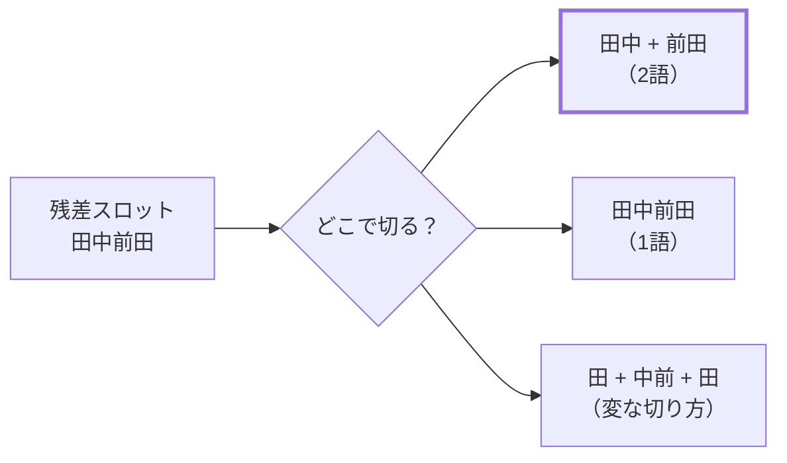
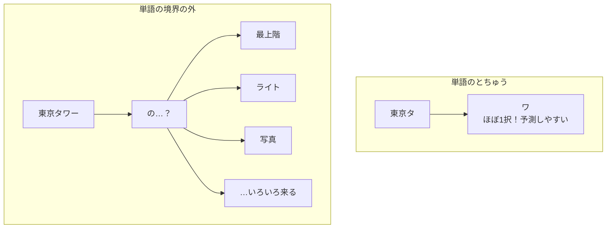
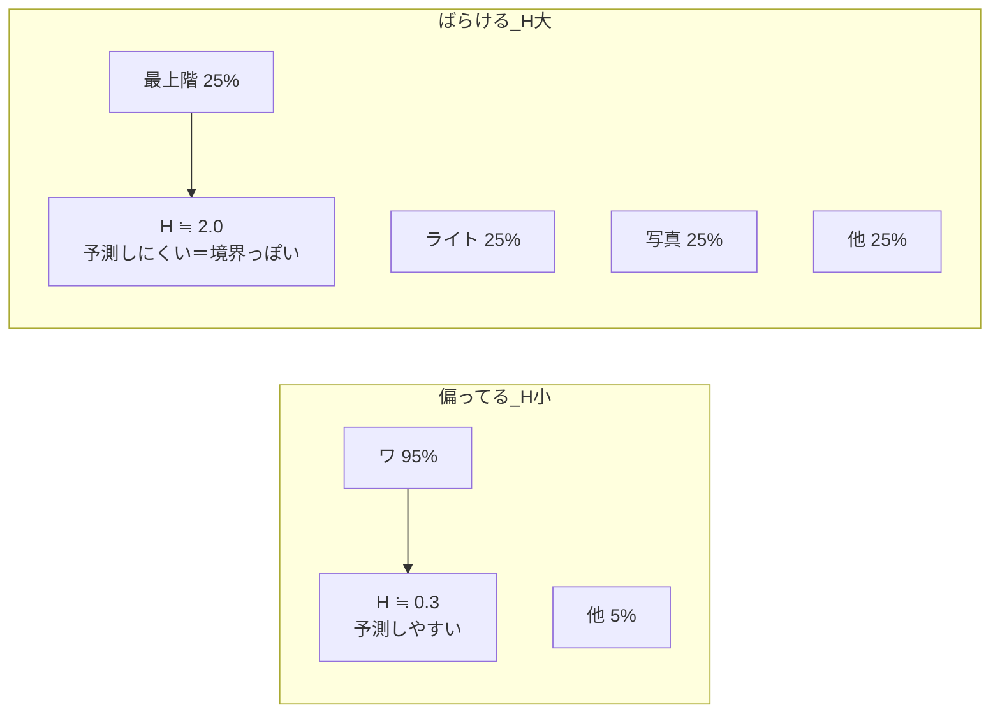
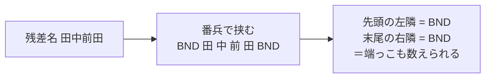
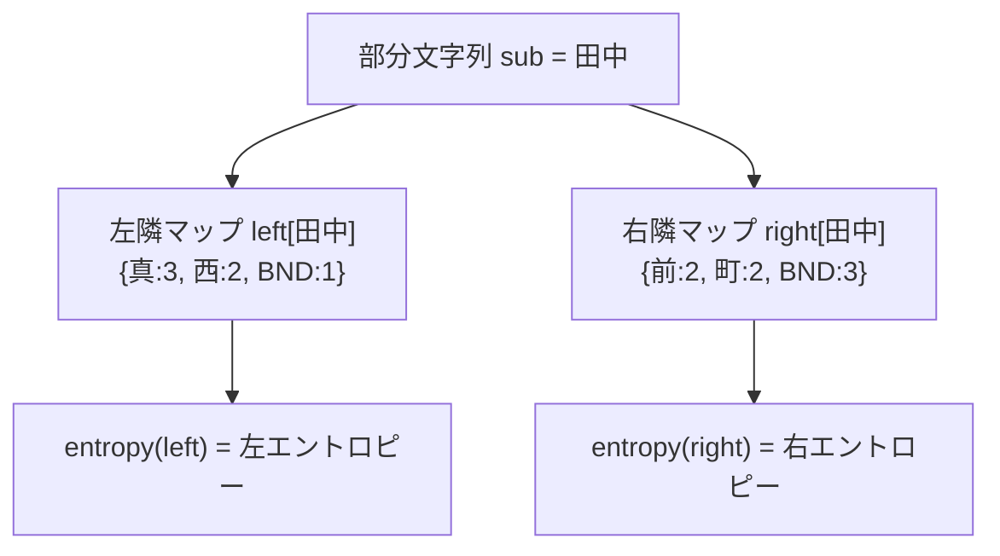
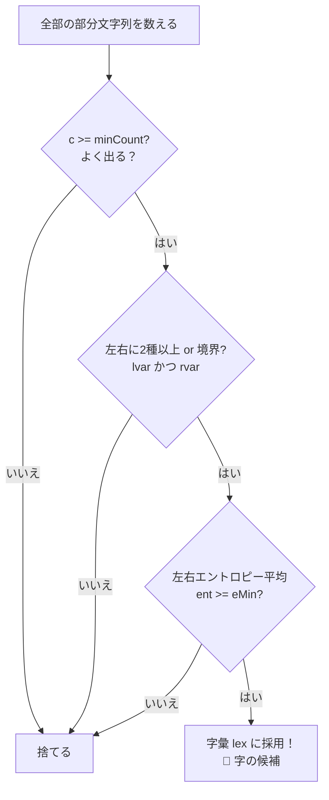

# 第13章　分岐エントロピー：区切り目はどこ？

> **この章のゴール**
> - 残差スロット（第12章）の中身を、教師なしで「どこで切るか」を見つける道具を知る
> - **エントロピー**＝「ばらつき・予測しにくさ・平均情報量」だと、式と気持ちの両方でつかむ
> - kugiri の `AzaInducer.fit`（前半）が「よく出る × 左右にいろんな文字が来る」部分文字列を字の候補に集めている、と読めるようになる

> **登場人物**：みどり先生、ツムギ、ゲンタ、アザミ

---

## 残ったまんなかを、どこで切る？

**ツムギ**：先生、前の章（第12章）で「残差スロット」っていうのをやりましたよね。
県・市・町・番地はデータから分かるから、**残ったまんなか**が「字（あざ）」だ、って。

**みどり先生**：そう。たとえば `真柴字田中前田86番地` だと、県・市・町・番地をはがした残りは——

**アザミ**：……`田中前田`……わたしのいる場所ね。

**ゲンタ**：でもさ、それ「田中」と「前田」の2つに分けるべきなの？　それとも「田中前田」で1つ？
誰も正解を教えてくれないんでしょ。それ、どうやって決めるの？　意味あるの？

**みどり先生**：そこだよ、ゲンタ。今日の主役は、その**「どこで切るか」を教師なしで当てる道具**——
**分岐エントロピー（ぶんきエントロピー、branching entropy）**だ。



**みどり先生**：人間なら「田中＋前田だろうな」と思う。でも機械にはラベルが無い。
だから、**文字の並びのクセ（かたより）だけ**を手がかりに、境界を見つけるんだ。

---

## 直感：単語のとちゅうは「予測しやすい」

**みどり先生**：あわてない、あわてない。まずクイズだ。ツムギ、
「東京タ□」——□に入る文字、当てられる？

**ツムギ**：かんたん！「ワ」でしょ。「東京タワー」。

**みどり先生**：そう、ほぼ100％当たる。**単語のとちゅうは、次に来る文字がほぼ決まってる**んだ。
じゃあ、「東京タワーの□」——□は？

**ツムギ**：えー……「東京タワーの**最上階**」「東京タワーの**ライト**」「東京タワーの**写真**」……
いろいろありすぎて当てられない！

**みどり先生**：それがポイント。**単語の境界の外側では、いろんな文字が来る**。予測しにくいんだ。
このちがいを図にするとこう。



**ゲンタ**：なるほど。「次に来る文字のバラつきが大きい場所」が、単語の切れ目っぽいってことか。

**みどり先生**：大正解。じゃあ、その「バラつきの大きさ」を**数で測れたら**、
機械でも境界が分かるよね。その「ものさし」が——**エントロピー**だ。

---

## エントロピー：ばらつきを測るものさし

**ツムギ**：エントロピー……名前がもう強そう。

**みどり先生**：あわてない、あわてない。第5章で「情報量」をやったの、覚えてる？
**めったに起きないことほど、起きたときの情報量が大きい**。式は `情報量 = -log₂(確率)` だった。

**ツムギ**：あ、log₂は「2を何回かけたか」を測るものさしでしたね。底2だと**単位はビット**。

**みどり先生**：そのとおり！　**エントロピー**は、その情報量の**平均**なんだ。
つまり「**ふだんどれくらい予測しにくいか**」の平均点。式はこう。

$$
H = -\sum_{i} p_i \log_2 p_i
$$

> 📌 **読み方メモ**
> - `H`（エイチ）＝エントロピーの値。大きいほど「ばらつき大／予測しにくい」。
> - `Σ`（シグマ）＝「**ぜんぶ足す**」記号。
> - `pᵢ`（ピー・アイ）＝ i 番目のことが起こる確率。「100回やったら何回」。
> - `log₂ pᵢ`＝その確率のときの「だいたい何桁か」。確率は1より小さいので log はマイナス。
> - だから先頭に `−`（マイナス）をつけて、全体をプラスに戻している。
>
> **読み下し**：「それぞれの起こりやすさ `pᵢ` に、その情報量 `−log₂ pᵢ` をかけて、ぜんぶ足す」。
> **気持ち**：みんな同じくらいの確率（バラバラ）だと **H は大きく**、
> 1つに偏ってる（ほぼ決まり）と **H は小さく**なる。

**みどり先生**：図で気持ちをつかもう。



**ゲンタ**：偏ってると小さい、ばらけると大きい。……「サイコロの目が当てにくい度」みたいなもんか。

**みどり先生**：いい例えだ。1の目だけ出るイカサマサイコロは予測しやすい（H小）。
ぜんぶ等しく出る正しいサイコロは予測しにくい（H大）。それがエントロピーだ。

---

## kugiri の `entropy` メソッドを読む

**みどり先生**：では本物のコードを見よう。`aza/AzaInducer.java` の `entropy` メソッドだ。

```java
// AzaInducer.entropy：起きた回数の表（counter）から H を計算する
private static double entropy(Map<String, Integer> counter) {
    int tot = 0;
    for (int v : counter.values()) tot += v;        // ① ぜんぶ何回起きたか（合計）
    if (tot == 0) return 0;
    double h = 0;
    for (int v : counter.values()) {
        double p = (double) v / tot;                 // ② 確率 p = その回数 ÷ 合計
        h -= p * (Math.log(p) / Math.log(2));        // ③ -p log₂(p) を足していく
    }
    return h;
}
```

**みどり先生**：3ステップだけだ。さっきの式 `H = -Σ p log₂ p` の、ほぼ写し書き。

**ツムギ**：①で「全部で何回」を数えて、②でそれぞれを割って確率 `p` にして、③で `-p log₂(p)` を足す……
あ、式とぴったり同じだ！

**ゲンタ**：`Math.log(p) / Math.log(2)` は何これ？

**みどり先生**：いいところに気づいた。Java の `Math.log` は **自然対数（ln）** で、底が2じゃないんだ。
だから「**底を変える公式**」で2に直してる。`log₂(p) = ln(p) ÷ ln(2)`。

> 📌 **底の変換**：`log₂(p) = log(p) ÷ log(2)`。
> どんな底の log でも、同じ底どうしで割れば好きな底に変えられる。
> kugiri のエントロピーは**底2（単位ビット）**で測る、という約束。

---

## `fit` の前半：番兵で挟んで、左右の隣を数える

**みどり先生**：さあ、このエントロピーを使って、字の候補を集める本体——`AzaInducer.fit` の前半を読もう。
まず、ひとつ仕掛けがある。**番兵（ばんぺい）** だ。

```java
// AzaInducer.fit より（前半・抜粋）
for (String r : residuals) {
    String name = stripMark(r);
    String s = BND + name + BND;   // ★ 名前を番兵 BND で前後から挟む
    ...
```

ここで `BND` は `private static final String BND = "\u0000"`。
**ふだん住所には絶対出てこない特別な文字**（ヌル文字）を「番兵」として、名前の前と後ろに置く。

**ツムギ**：番兵……見張り番ってこと？　なんで挟むの？

**みどり先生**：いい「なんで？」だ。**端っこ（文字列の先頭・末尾）も「多様性」として数えたい**からだよ。
たとえば「田中」が、いろんな残差で**いつも末尾**に来てたとする。そのとき右隣は……

**アザミ**：……いつも「おしまい」……何も来ない……。

**みどり先生**：そう。番兵を置いておくと「右隣はいつも番兵 BND だった」と記録できる。
番兵が来る＝「ここで単語が終わってる証拠」として、ちゃんとカウントできるんだ。



**みどり先生**：次に、`minLen`〜`maxLen` の長さの**部分文字列を全部**取り出して数える。

```java
for (int len = minLen; len <= maxLen; len++) {
    for (int i = 1; i < s.length() - len; i++) {
        String sub = s.substring(i, i + len);
        if (sub.contains(BND)) continue;            // 番兵をまたぐ断片は捨てる
        cnt.merge(sub, 1, Integer::sum);            // ① 出現回数を +1
        // ② 左隣の文字を集計
        left.computeIfAbsent(sub, k -> new HashMap<>())
            .merge(String.valueOf(s.charAt(i - 1)), 1, Integer::sum);
        // ③ 右隣の文字を集計
        right.computeIfAbsent(sub, k -> new HashMap<>())
            .merge(String.valueOf(s.charAt(i + len)), 1, Integer::sum);
    }
}
```

**ゲンタ**：`sub` が部分文字列で、`cnt` がその出現回数。`left` と `right` は……
その部分文字列の「左隣にどんな文字が、何回来たか」「右隣に何が来たか」の表か。

**みどり先生**：そのとおり。`left` と `right` は `Map<部分文字列, Map<隣の文字, 回数>>`。
さっきの `entropy` メソッドに渡すのが、まさにこの**内側の表**（隣の文字 → 回数）なんだ。



---

## 採用条件：「よく出る」かつ「左右がばらける」

**みどり先生**：集計が終わったら、いよいよ字の候補を選ぶ。ここが `fit` 前半のクライマックスだ。

```java
for (Map.Entry<String, Integer> e : cnt.entrySet()) {
    String sub = e.getKey(); int c = e.getValue();
    if (c < minCount) continue;                          // ① よく出る（c が minCount 以上）
    Map<String, Integer> lm = left.get(sub), rm = right.get(sub);
    boolean lvar = lm.size() >= 2 || lm.containsKey(BND); // ② 左に2種以上 or 境界が来る
    boolean rvar = rm.size() >= 2 || rm.containsKey(BND); // ③ 右に2種以上 or 境界が来る
    double ent = (entropy(lm) + entropy(rm)) / 2;         // ④ 左右エントロピーの平均
    if (lvar && rvar && ent >= eMin) lex.put(sub, c);     // ⑤ 全部満たせば字彙に採用！
}
```

**みどり先生**：条件は3つ。全部そろって初めて、その部分文字列を
**字彙（じい＝字の語彙、lexicon）** `lex` に採用する。

| 条件 | コード | 気持ち |
|---|---|---|
| ① よく出る | `c >= minCount` | たまたま1回出ただけのゴミを捨てる |
| ② 左右に多様 | `lvar && rvar` | 左にも右にも「いろんな文字」or 境界が来る＝独立した単語っぽい |
| ③ エントロピー高い | `ent >= eMin` | 左右の予測しにくさの平均が、しきい値以上 |

**ツムギ**：②の `lvar`、「左に2種以上 **or** 境界 BND が来る」になってる。
境界が来るのも「アリ」なんですね。

**みどり先生**：そう。番兵が効いてるところだ。**いつも単語の先頭に来る**なら、左隣はいつも BND。
それは「左でちゃんと切れてる証拠」だから、多様性アリと認める。さっき番兵を挟んだ理由がここで効く。

**ゲンタ**：つまり、**「よく出る」かつ「左右にいろんな文字が来る（＝前後で独立してる）」部分文字列**を、
字の候補として自動で集めてるわけか。ラベルなしで。

**みどり先生**：その一文がこの章の全部だ。よく言えた。
「田中」みたいに、いろんな住所で前後にいろんな文字をくっつけて何度も出てくる文字列は、
**それ自体が1つの独立した単語（字）**くさい。だから候補にする。



**みどり先生**：このあと（`pruneCollocations`）で「田中前田みたいな**くっつき過ぎ**を切り離す」処理が入るけど、
それは次の第14章「PMI」の話。今日は「**よく出て、左右がばらける＝字の候補**」までで100点だ。

**アザミ**：……ラベルが無くても……文字の並びのクセだけで……わたしを見つけてくれるのね……。

---

## 手を動かそう

実際の数えあげを、小さな例で体感してみましょう。
ファイルは `aza/AzaInducer.java` の `fit`（左右隣の集計）と `entropy`（ばらつき計算）。

次の4つの残差名があるとします（番兵 BND は □ で表します）。

```
□田中前□
□田中町□
□西田中□
□田中□
```

部分文字列 **「田中」** に注目します。それぞれで「田中」の**右隣の文字**を書き出すと：

1. `□田中前□` → 右隣は「前」
2. `□田中町□` → 右隣は「町」
3. `□西田中□` → 右隣は「□（境界 BND）」
4. `□田中□`   → 右隣は「□（境界 BND）」

**問1**：右隣マップ `right["田中"]` は `{ 前:?, 町:?, □:? }`。それぞれ何回？
**問2**：右隣に来た文字の「種類」は何種類？　境界 BND は来ている？（→ `rvar` は成り立つ？）
**問3**：右隣エントロピー `entropy(right["田中"])` を、底2の log で計算してみよう。
（ヒント：`log₂(1/2)=−1`、`log₂(1/4)=−2`）

<details>
<summary>こたえ</summary>

**問1**：`{ 前:1, 町:1, □:2 }`（前が1回、町が1回、境界が2回）。合計 `tot = 4`。

**問2**：種類は「前・町・□」の **3種類**。境界 BND も来ている。
→ 2種以上だし境界も来てるので、`rvar`（右の多様性）は**成り立つ**。

**問3**：確率は `前:1/4`, `町:1/4`, `□:2/4=1/2`。
$$
H = -\left(\tfrac14\log_2\tfrac14 + \tfrac14\log_2\tfrac14 + \tfrac12\log_2\tfrac12\right)
$$
$$
= -\left(\tfrac14\times(-2) + \tfrac14\times(-2) + \tfrac12\times(-1)\right)
= -\left(-\tfrac12 -\tfrac12 -\tfrac12\right) = \mathbf{1.5}\ \text{ビット}
$$

右隣が「いろんな文字＋境界」でばらけているので、エントロピーは大きめ（1.5）。
**＝「田中」の右側は、単語の境界っぽい！**　という証拠になる。

（おまけ：もし右隣がいつも「前」だけだったら `p=1` で `H = -1×log₂1 = 0`。
「田中前」で1単語かも、と疑う材料になる。これを切り離すかどうかは次章の PMI が決める。）

</details>

---

## 今日のまとめ

- 残差スロットの中をどこで切るかは、**文字の並びのクセ（かたより）**だけで当てられる。
- 直感：**単語のとちゅうは予測しやすい**（次の文字がほぼ決まる）。
  **境界の外はいろんな文字が来る＝予測しにくい**。このばらつきを測れば境界が分かる。
- **エントロピー** `H = -Σ p log₂ p` ＝「ばらつき・予測しにくさ・平均情報量」。
  読み下し：「起こりやすさ `p` に情報量 `−log₂ p` をかけて、ぜんぶ足す」。
  偏ると小さく、ばらけると大きい。kugiri は**底2（ビット）**で測る。
- `AzaInducer.fit` の前半は、各残差名を**番兵 BND で挟み**、`minLen`〜`maxLen` の部分文字列を全部数え、
  左隣・右隣の出方も集計する。
- 採用条件は **①よく出る（`c >= minCount`）× ②左右が多様（`lvar && rvar`）× ③左右エントロピー平均が高い（`ent >= eMin`）**。
  全部満たした部分文字列を**字彙 `lex`** に採用する。
- つまり「**よく出る × 左右にいろんな文字が来る（独立した単語っぽい）**」断片を、教師なしで字の候補に集めている。

---

## アザミメーター

```
アザミの見え具合：████████░░ 76%
（コメント：今日「どこで切れるか＝分岐エントロピー」がわかったので、アザミの体の輪郭がほぼ見えてきた！）
```

---

## 次回予告

**みどり先生**：今日は「田中」みたいな候補を集めた。でも「田中前田」って、
くっつけて1単語にすべき？　それとも「田中」＋「前田」に切る？

**ツムギ**：あー、それさっき保留にしたやつ！

**みどり先生**：そこを決めるのが「**一緒に出てる？　それとも、たまたま？**」を測る道具——
**PMI（ピーエムアイ）**だ。次の章で、`pruneCollocations` のなぞを解こう。

[← 第12章](12-zansa-slot.md) ・ [第14章 →](14-pmi.md)
