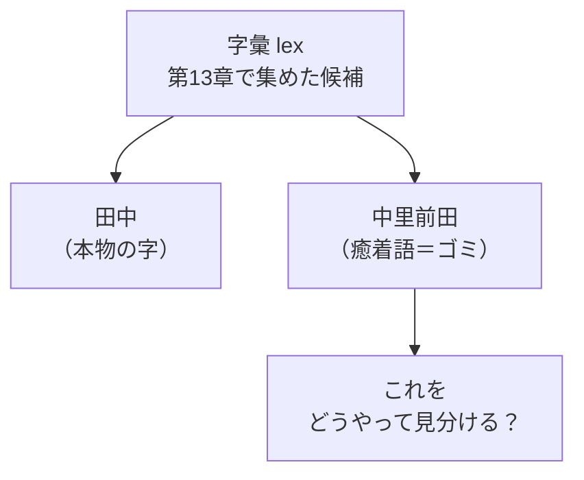
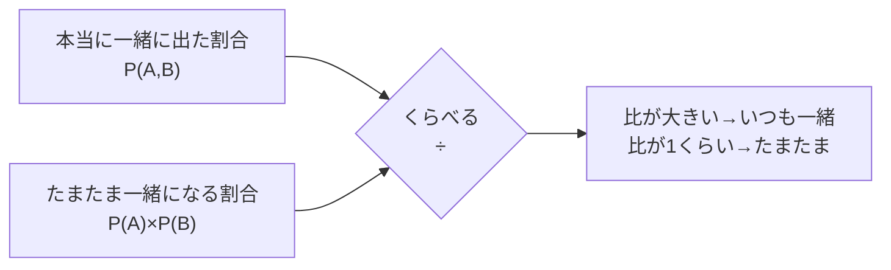
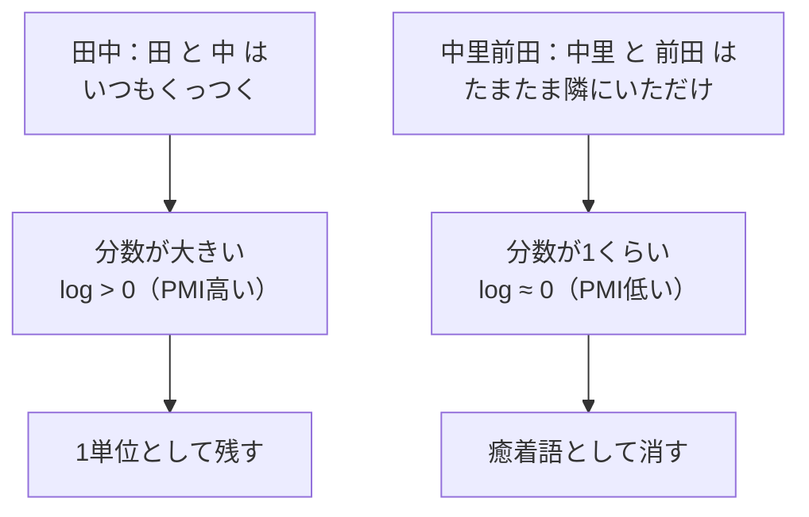
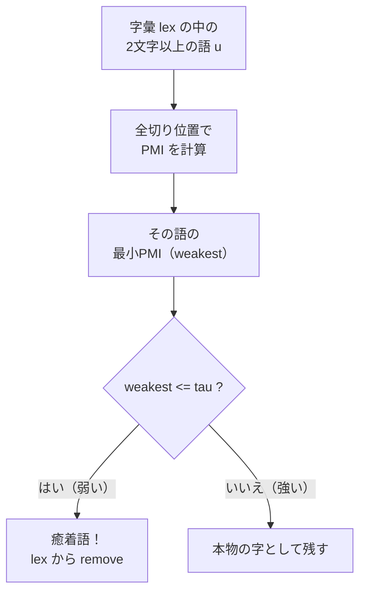

# 第14章　PMI：一緒に出てる？それとも、たまたま？

> **この章のゴール**
> - 「いつも一緒に出る2語」と「たまたま隣にいただけの2語」を見分ける考え方をつかむ
> - **PMI（ピーエムアイ、自己相互情報量 Pointwise Mutual Information）** が「比べる」道具だと分かる
> - kugiri の `pruneCollocations` が、PMI で **癒着語（ゆちゃくご）** を字彙から取りのぞくしくみを読める

> **登場人物**：みどり先生、ツムギ、ゲンタ、アザミ

---

## 第13章で集めた字彙には、ゴミが混じる

**アザミ**：……みんな、見て。第13章で、わたしの「字（あざ）」の候補をたくさん集めてくれたでしょう？

**ツムギ**：うん！　頻出する部分文字列のなかから、区切り目っぽい（分岐エントロピーが高い）やつを選んで、字の候補を集めたんだよね。

**みどり先生**：そう。あの集まりを **字彙（じい、lexicon）** と呼ぶ。kugiri のコードでは `lex` という名前で、「字の候補 → 出た回数」の表になっている。

**ゲンタ**：でもさ、それ、ぜんぶ本物の「字」なの？　なんか怪しいのが混ざってない？

**みどり先生**：鋭い。じつは、混ざってるんだ。たとえば、こんなのが。

```
中里前田  ← これ、ひとつの字？
```

**ツムギ**：「中里」と「前田」……あれ、これって、2つの地名がただ隣にいるだけじゃない？

**みどり先生**：そのとおり！　これを **癒着語（ゆちゃくご）** という。
本当は別々の2つの語が、たまたま隣り合っていただけなのに、くっついて1語に見えてしまったもの。
こういうゴミを、字彙から取りのぞきたいんだ。



**みどり先生**：上の図、`田中` は残したい。`中里前田` は消したい。
さあ、どうやって機械に見分けさせよう？

---

## カギは「たまたま？」を計算で出すこと

**みどり先生**：あわてない、あわてない。ヒントは第3章の確率だ。
「**AとBが、一緒に出る**」って、どれくらい起こることだと思う？

**ツムギ**：うーん……AとBが、それぞれよく出る言葉なら、たまたま隣り合うことも多そう。

**みどり先生**：その「たまたま隣り合う」感覚、まさにそこ！
2つのことが **無関係（独立）** なら、一緒に出る確率は **それぞれの確率のかけ算** になる——これは第3章でやったね。

> 📌 **思い出そう（第3章）**
> コインを2回投げて両方オモテ＝ `1/2 × 1/2 = 1/4`。
> 別々の出来事が「両方そろう」確率は、**かけ算**。

**みどり先生**：だから「もしAとBが無関係（たまたま）だったら」、一緒に出る確率は

```
P(A) × P(B)
```

になるはず。これが「**たまたま一緒になる割合**」だ。

**ゲンタ**：で、本当に観測した「一緒に出た割合」はべつに数えられる、と。

**みどり先生**：そう。それを `P(A,B)`（エー、ビーが一緒に出る確率）と書く。
あとは、この **2つを比べるだけ**。



**ツムギ**：割り算！　「本当 ÷ たまたま」だ。

**みどり先生**：その比が、PMI の心臓部だよ。

---

## PMI ＝「本当 ÷ たまたま」を log にしたもの

**みどり先生**：いよいよ式だ。こわがらないで。**PMI**（自己相互情報量）はこう書く。

$$
\mathrm{PMI}(A,B) = \log\!\left(\frac{P(A,B)}{P(A)\times P(B)}\right)
$$

> 📌 **読み方メモ**
> - `PMI(A,B)`（ピーエムアイ・エー・ビー）＝「AとBの結びつきの強さ」
> - `P(A,B)`（ピー・エー・ビー）＝AとBが**一緒に出る**割合
> - `P(A)×P(B)`＝もし無関係なら期待される、**たまたま一緒になる**割合
> - `log`（ログ、第5章）＝「だいたい何桁か」を測るものさし。ここでは**割り算の大小をそのまま大小で映す**ために使う

**みどり先生**：中の分数を、ことばにするとこう。

> **分数の気持ち**
> $$\frac{\text{本当に一緒に出た割合}}{\text{たまたま一緒になる割合}}$$

**ツムギ**：あ、さっきの「本当 ÷ たまたま」だ！

**みどり先生**：そう。で、この分数を見ると——

- 分数が **1より大きい**（`log > 0`）→ たまたま以上に一緒に出てる ＝ **結びつきが強い（いつも一緒）**
- 分数が **1くらい**（`log ≈ 0`）→ たまたまと同じくらい ＝ **ただの偶然**
- 分数が **1より小さい**（`log < 0`）→ たまたまより少ない ＝ むしろ避け合ってる



**ゲンタ**：なるほど。`田中` は PMI 高いから残す、`中里前田` は PMI 低いから消す、と。

**みどり先生**：そういうこと。ところで——

> ⚠️ **kugiri は自然対数 ln を使う**
> 第5章では log の底を2で説明したけど、`pruneCollocations` の中身は `Math.log`、
> つまり **自然対数 ln（底が e ≒ 2.718）** だ。
> でも安心して。**底がちがっても、大きい・小さいの順番は変わらない**から、
> 「PMI が大きいほど結びつきが強い」という判定はそのまま使える。

**ツムギ**：底がちがっても、勝ち負けは変わらないってことか。

**みどり先生**：そう。比べるのが目的だから、底は何でもいい。第13章のエントロピーは「ビット数」を測りたかったから底2だったけど、ここは比べるだけなので `Math.log` のままでOKなんだ。

---

## 手を動かそう

### 実コードを読む：`pruneCollocations`

`aza/AzaInducer.java` の `pruneCollocations` メソッドが、まさにこの「癒着語の剪定（せんてい、刈り取り）」をやっています。

```java
// AzaInducer.java の pruneCollocations より
/** 既知2単位 u1+u2 に分解でき、その結合が偶然並み(PMI<=tau)の単位を剪定。 */
private void pruneCollocations() {
    List<String> multi = new ArrayList<>();
    for (String w : lex.keySet()) if (w.length() >= 2) multi.add(w); // ① 2文字以上の語を集める
    for (String u : multi) {
        int cu = lex.get(u);                       // u の出現回数
        double weakest = Double.POSITIVE_INFINITY;
        for (int k = 1; k < u.length(); k++) {     // ② 全部の切り位置をためす
            Integer ca = lex.get(u.substring(0, k)), cb = lex.get(u.substring(k));
            if (ca != null && cb != null) {        // 左片・右片が両方とも既知の字なら
                double pmi = Math.log(((double) cu * N) / ((double) ca * cb)); // ③ PMI
                weakest = Math.min(weakest, pmi);  // ④ いちばん弱い結びつきを覚える
            }
        }
        if (weakest <= tau) lex.remove(u);         // ⑤ 弱すぎたら癒着語として削除
    }
}
```

**みどり先生**：①から⑤まで、ことばで追っていこう。

**① 2文字以上の語だけ見る**
1文字の語は「分けようがない」から、そもそも癒着のしようがないね。だから2文字以上 `w.length() >= 2` だけを対象にする。

**② 全部の切り位置をためす**
たとえば `中里前田`（4文字）なら、切れ目は
`中|里前田`、`中里|前田`、`中里前|田` の3か所。
それぞれを「左片」と「右片」に分けて、**両方とも字彙に入っている（既知の字）**ときだけ調べる。

**③ PMI を頻度で計算する**

```java
double pmi = Math.log(((double) cu * N) / ((double) ca * cb));
```

**ツムギ**：あれ、さっきの `P(A,B) / (P(A)×P(B))` と形がちがう……？

**みどり先生**：ちがって見えるけど、**同じ式**なんだ。たねあかしをしよう。
確率は「回数 ÷ 全体」だったね（第3章）。`N` を全体の数とすると：

- `P(u)`（uが一緒に出た割合）＝ `cu / N`
- `P(u1)`＝ `ca / N`、`P(u2)`＝ `cb / N`

これを分数に入れると：

$$
\frac{P(u)}{P(u_1)\times P(u_2)}
= \frac{cu / N}{(ca/N)\times(cb/N)}
= \frac{cu \times N}{ca \times cb}
$$

**ゲンタ**：おお、`N` が約分されて、`cu × N / (ca × cb)` になった！　コードと同じだ。

**みどり先生**：そう。**確率の式を「回数」で書き直しただけ**。
記号の意味はこう。

| 記号 | 意味 |
|---|---|
| `cu` | u（つながった語）の出現回数 |
| `ca` | 左片 u1 の出現回数 |
| `cb` | 右片 u2 の出現回数 |
| `N` | 残差の総数（全体の大きさ） |

**④ いちばん弱い結びつきを覚える**
切り位置が複数あるとき、`weakest = Math.min(...)` で **最小の PMI** を覚えておく。
「いちばん弱いところ」が、その語の「いちばんあやしい継ぎ目」だからね。

**⑤ 弱すぎたら消す**

```java
if (weakest <= tau) lex.remove(u);
```

`tau`（タウ、しきい値）以下なら、「ただ隣り合っただけ＝癒着語」とみなして字彙 `lex` から削除する。`AzaInducer` の初期値だと `tau = 0.2` だ。



---

### 計算してみよう

実際に PMI を計算して、残す／消すを判定してみましょう。式はこれ：

```
PMI = ln( (cu × N) / (ca × cb) )
```

しきい値は `tau = 0.2` とします。`weakest <= tau` なら **消す**、そうでなければ **残す**。
（`ln` は自然対数。電卓の `ln` ボタン、または `Math.log`。）

**問1：「中里前田」**　唯一の有効な切り位置は `中里|前田`。
`cu = 5`（中里前田）、`ca = 50`（中里）、`cb = 40`（前田）、`N = 10000`。
PMI は？　残す？　消す？

**問2：「田中」**　切り位置は `田|中`。
`cu = 200`（田中）、`ca = 80`（田）、`cb = 90`（中）、`N = 10000`。
PMI は？　残す？　消す？

<details>
<summary>こたえ</summary>

**問1：中里前田**
```
分数 = (cu × N) / (ca × cb)
     = (5 × 10000) / (50 × 40)
     = 50000 / 2000
     = 25
PMI = ln(25) ≒ 3.22
```
……あれ、3.22？　`tau = 0.2` より大きいから「残す」になっちゃう？

実はこの数字設定だと残ってしまいます。**ポイントは比の大きさ**。
癒着語というのは、本来 `cu`（つながって出る回数）が `ca`・`cb`（バラバラに出る回数）に比べて
**ずっと小さい**ものを言います。たとえば癒着らしく `cu = 2`、`ca = 300`、`cb = 250` なら：
```
分数 = (2 × 10000) / (300 × 250) = 20000 / 75000 ≒ 0.267
PMI  = ln(0.267) ≒ -1.32   →  -1.32 <= 0.2  →  消す！
```
「中里」も「前田」も単独ではよく出るのに、つながった「中里前田」はめったに出ない
→ 分数が1より小さく、PMI がマイナス → **癒着語として削除**。これが本来ねらった挙動です。

**問2：田中**
```
分数 = (cu × N) / (ca × cb)
     = (200 × 10000) / (80 × 90)
     = 2000000 / 7200
     ≒ 277.8
PMI  = ln(277.8) ≒ 5.63   →  5.63 > 0.2  →  残す！
```
「田」「中」が単独で出る回数のわりに、「田中」というつながりがとても多い
→ 分数がうんと大きく、PMI も大きい → **1単位の字として保持**。

**まとめ**：見るべきは PMI が `tau` より上か下か。
癒着語は「片方ずつはよく出るのに、つながると激減」＝ 分数が小さく PMI が低い、という形で正体を現します。

</details>

---

## 字彙が「本物の字」に近づいた

**みどり先生**：これで、`中里前田` のような癒着語が字彙から消えて、`田中` のような本物の字が残った。
字彙がぐっと「本物」に近づいたわけだ。

**アザミ**：……うれしい。わたしの形から、ゴミが取れていく感じがするの……。

**みどり先生**：最後にひとつ、次章への橋渡しを。
剪定で字彙の中身が変わったから、**確率の土台もやり直し**ておく必要がある。
コードでは `fit` のおしまいで、こうなっている。

```java
// AzaInducer.fit の末尾
Z = sum(lex); pruneCollocations(); Z = sum(lex);
```

**ツムギ**：`Z = sum(lex)` が2回ある！

**みどり先生**：そう。`sum(lex)` は字彙の **総出現数**（ぜんぶ足したもの。`Z`＝ゼット）を計算する関数だ。
剪定の前に1回、剪定でいくつか語を消したあとに **もう1回** 計算し直している。
この `Z` が、次章で「ある語が出る確率」を出すときの **分母（土台）** になるんだよ。

> 📌 **読み方メモ**
> `Z = sum(lex)` ＝「字彙の語の回数を、ぜんぶ足す（Σ、シグマ）」。
> 確率 `P(語) = その語の回数 / Z` の、割り算の分母になる。

**ゲンタ**：消したあとで足し直さないと、分母がズレるもんな。なるほど、意味あるわ。

---

## 今日のまとめ

- 第13章で集めた字彙には、`中里前田` のような **癒着語**（たまたま隣り合った2語）が混じる。
- **PMI**＝「**本当に一緒に出た割合 ÷ たまたま一緒になる割合**」を log にしたもの。
  `PMI = log( P(A,B) / (P(A)×P(B)) )`。1より大きければ結びつきが強い、1くらいならたまたま。
- kugiri は **自然対数 ln（`Math.log`）** を使う。底がちがっても大小判定は同じ。
- `pruneCollocations` は、各語を全切り位置で `pmi = ln( (cu×N)/(ca×cb) )` と計算し、
  **最小PMIが `tau` 以下なら癒着語として `lex` から削除**する。
- 剪定後は `Z = sum(lex)` で字彙の総出現数を計算し直し、次章の確率の土台にする。

---

## アザミメーター

```
アザミの見え具合：████████░░ 82%
（コメント：「たまたま」と「いつも一緒」を見分けられた。ゴミが取れて、アザミの輪郭がくっきり！）
```

---

## 次回予告

**みどり先生**：字彙がきれいになった。さあ、いよいよ本番。
「真柴字田中前田」みたいな残差を、`田中` `前田` に **どう切るのがいちばんありそうか**——
それを計算で決めたい。

**ツムギ**：切り方なんて、たくさんあるのに？

**みどり先生**：そこで「**言語モデル**」と、第10章のあの子——**バーティ（Viterbi）** がもう一度活躍する。
いちばんありそうな切り方を、ズルせず一瞬で見つけるんだ。次の章へ。

[← 第13章](13-bunki-entropy.md) ・ [第15章 →](15-gengo-model-viterbi.md)
