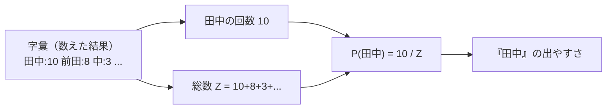
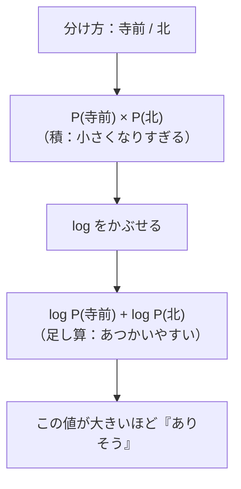
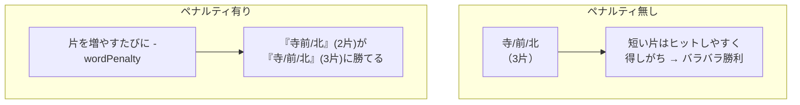
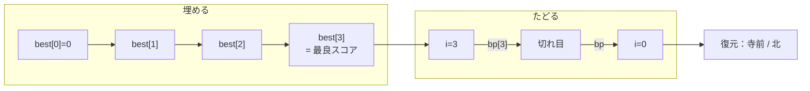

# 第15章　言語モデルと最尤分割（いちばんありそうな切り方）

> **この章のゴール**
> - 言語モデル（LM）＝「この単語（並び）はどれくらい出やすいか」を確率で言うもの、と分かる
> - 「分け方の良さ」＝各片の確率の積、を **log で足し算**に変えて測れる（第5章の応用）
> - 最尤分割（さいゆうぶんかつ）を **Viterbi/DP**（第10章と同じ仕組み）で一瞬で求める、を体感する

> **登場人物**：みどり先生、ツムギ、ゲンタ、バーティ、アザミ

---

## 字彙はそろった。でも、どう切る？

**みどり先生**：さて、第13章（分岐エントロピー）と第14章（PMI）で、ついに
**字彙（じい、字の語彙リスト）**ができたね。「田中」「前田」「中」みたいな、
字（あざ）になりそうな単語たちが、出現回数つきで手に入った。

**ツムギ**：やったー！　……で、これをどう使うんでしたっけ？

**みどり先生**：いい「で？」だ。たとえば、残差（県・市・町・番地をはがした、まんなかの部分）に
こんな文字列が残ったとする。

```
寺前北
```

**ゲンタ**：「寺前北」……。これ、「寺前 / 北」なの？　「寺 / 前北」なの？
それとも「寺前北」でひとかたまり？

**みどり先生**：そう、そこが問題だ。**いちばんありそうな切り方**を選びたい。
そのために、字彙を「**言語モデル**」として使うんだよ。

**アザミ**：……わたしの名前（字の名前）を、ちゃんと切り出してくれるのね……。

---

## 言語モデル（LM）＝「出やすさ」を確率で言うもの

**みどり先生**：**言語モデル（げんごモデル、language model, LM）**っていうのはね、
むずかしく考えなくていい。「**この単語（や並び）が、どれくらい出やすいか**」を
**確率**で答えてくれる箱だと思って。

**ツムギ**：確率って、第3章の「100回やったら何回起きるか」ですよね。

**みどり先生**：そのとおり。ここでは、いちばん単純な
**ユニグラム（unigram）LM**を使う。ユニ＝1。
「単語1個ずつの出やすさ」を、第3章の **数えて割る** で出すだけ。

> **ユニグラムLMの確率**
> ある単語 w の確率 ＝ （w の出現回数）÷（ぜんぶの回数 Z）
>
> $$ P(w) = \frac{\text{count}(w)}{Z} $$
>
> 読み方：「ピー・オブ・ダブリュー」＝「w が出る確率」。
> 気持ち：**たくさん出てきた単語ほど確率が高い**。ただそれだけ。

**みどり先生**：`Z`（ゼット）は字彙の出現回数を全部足した数。「総数」だね。
コードでは、字彙を全部足したものになっている。



**みどり先生**：上の図がユニグラムLMの全部。**回数を総数 Z で割る**と、確率になる。
「田中」がたくさん出ていれば P(田中) は大きい＝「ありそう」。

**ゲンタ**：第3章そのまんまだ。数えて割るだけ。

---

## 分け方の良さ＝「各片の確率の積」……だけど

**みどり先生**：では「寺前北」を「寺前 / 北」と切ったとする。
この分け方の良さを、どう測ろう？

**みどり先生**：答えは、**出てきた片それぞれの確率を、ぜんぶかける**んだ。

```
良さ = P(寺前) × P(北)
```

**ツムギ**：かけ算？　なんで足し算じゃないの？

**みどり先生**：「**寺前も出て、かつ、北も出る**」――この「かつ」が、かけ算なんだ（第3章）。
両方そろってはじめて、その分け方になるからね。

**ゲンタ**：……でも先生、第4章の終わりで言ってたやつ。
確率は小さい数だから、かけ算すると**どんどん小さく**なって、コンピュータが困るって。

**みどり先生**：覚えてたか、えらい！　そのとおり。
0.001 × 0.0008 × … なんてやると、あっという間にゼロみたいな数になる。
そこで——第5章の **log（ログ）** の出番だ。

> **第5章の復習**：かけ算した確率は小さくなりすぎる。
> だから **log にして足し算に変える**。
> log は「だいたい何桁か」を測るものさし。
> 大事な性質：$\log(a \times b) = \log a + \log b$（かけ算が足し算になる！）

**みどり先生**：つまり、こうする。

```
良さ（log版）= log P(寺前) + log P(北)
```

**ツムギ**：かけ算が足し算になった！　これなら小さくなりすぎない。



---

## 知らない片はどうする？――フロア値

**ゲンタ**：先生、もし字彙に **載ってない**片が出てきたら？　たとえば「寺前北」を丸ごと
1単語として試したとき、字彙に「寺前北」が無かったら、回数ゼロで P＝0、log は……マイナス無限大?

**みどり先生**：鋭い。あわてない、あわてない。そこで kugiri は、知らない片には
**小さな床（フロア）の確率**を与える。「ありえなくはないけど、すごく低い」ってことにするんだ。
実物のコードを見てみよう。

```java
// AzaInducer.java の logp：1つの片のlog確率を返す
private double logp(String piece) {
    Integer c = lex.get(piece);
    if (c != null) return Math.log(c / Z);                 // 既知：log(回数 / 総数Z)
    return Math.log(1.0 / (Z * 1000)) * piece.length();    // 未知：小さなフロア値 × 長さ
}
```

**みどり先生**：上の段が**既知**の片。`lex`（字彙）に回数 `c` があれば、`log(c / Z)`。
さっきのユニグラム確率の log だね。

**みどり先生**：下の段が**未知**の片。`log(1 / (Z × 1000))` ――
Z よりさらに1000倍小さい確率、つまり「とても出にくい」ことにする。
しかも `* piece.length()`、**長さの分だけかける**のがミソだ。

**ツムギ**：なんで長さでかけるの？

**みどり先生**：たとえ話。知らない単語が4文字あったら、それは
「知らない文字が4回続いた」くらい珍しい、と考えるんだ。
だから**長い未知語ほど、どんどん不利**になる。log の値（マイナス）が大きく積もっていくからね。

**ゲンタ**：なるほど。長い知らない単語を「えいやっ」と1個にされたら困るから、
長さでペナルティをかけてるのか。意味あるわ。

---

## 単語ペナルティ：細かく切りすぎを止める「重し」

**みどり先生**：もうひとつ大事な仕掛けがある。**単語ペナルティ（wordPenalty）**だ。
**片を1つ増やすたびに、スコアからちょっと引く**。

**ツムギ**：なんでそんなことを？

**みどり先生**：これが無いとね、**「1文字ずつバラバラ」が得しがち**になっちゃうんだ。
考えてみて。短い片は字彙にヒットしやすいし、フロアも軽い。
だから「寺 / 前 / 北」みたいに細かく切ったほうがスコアが高くなりがち。

**ゲンタ**：でも字（あざ）の名前として切りたいのに、1文字ずつにされたら意味ないよね。

**みどり先生**：そう。だから「片を増やすこと自体にコストをかける」。
それが wordPenalty という**重し**だ。コードでは、片を足すたびに引かれている（次で見る）。



**みどり先生**：フロア値が「長い未知語はダメ」と言い、
wordPenalty が「細かく切りすぎもダメ」と言う。
この**2つの重しのバランス**で、ちょうどいい切り方に落ち着くんだ。

---

## 最尤分割：いちばんスコアが高い切り方を、ズルせず見つける

**みどり先生**：さあ、いよいよ本題。
スコア（log確率の合計 − ペナルティ）が**最大**になる切り方を選ぶ。これを
**最尤分割（さいゆうぶんかつ、maximum likelihood segmentation）**という。
「尤」は「もっともらしい」の意味。**いちばんもっともらしい分け方**だ。

**ツムギ**：全部の切り方を試して、いちばん高いのを選べばいいんですよね？

**みどり先生**：原理はそう。でも、文字数が増えると切り方の数が**爆発**する。
n文字なら 2ⁿ⁻¹ 通り。総当たりは大変だ。そこで――

**バーティ**：ぼくの出番だね！　チチチッ。

**ツムギ**：あ、第10章の小鳥！　バーティ！

**バーティ**：そう、Viterbi（ビタビ）のバーティ。
**動的計画法（DP）**で「いちばん良い道」を一瞬で見つける番人だよ。
**ズルじゃないよ、かしこいだけ！**　第10章でやったのと、まったく同じ仕組みなんだ。

**みどり先生**：第10章では「ラベルの並び」で最良の道を探したね。
今回は「**どこで切るか**」で最良の道を探す。形は同じ。
左から順に「**ここまでの最良スコア**」を埋めていって、
あとから「**どこで切ったか**」を逆にたどって復元する。

実物のコードを見よう。これが心臓部だ。

```java
// AzaInducer.java の segment：ユニグラムLM + 単語ペナルティで最尤分割(Viterbi)
public List<String> segment(String name) {
    int n = name.length();
    List<String> out = new ArrayList<>();
    if (n == 0) return out;
    double[] best = new double[n + 1];   // best[i] = 先頭からi文字目までの最良スコア
    int[] bp = new int[n + 1];           // bp[i]   = i文字目の直前は、どこで切ったか
    Arrays.fill(best, Double.NEGATIVE_INFINITY);
    best[0] = 0; bp[0] = -1;             // スタート地点：0文字なら 0点
    for (int i = 1; i <= n; i++) {
        for (int j = Math.max(0, i - maxLen); j < i; j++) {  // 片 name[j..i] を試す
            if (best[j] == Double.NEGATIVE_INFINITY) continue;
            String piece = name.substring(j, i);
            double cand = best[j] + logp(piece) - wordPenalty; // ここまで最良 + 片の良さ - 重し
            if (cand > best[i]) { best[i] = cand; bp[i] = j; } // もっと良ければ更新
        }
    }
    int i = n;
    Deque<String> stack = new ArrayDeque<>();
    while (i > 0) { int j = bp[i]; stack.push(name.substring(j, i)); i = j; } // bpを逆にたどる
    out.addAll(stack);
    return out;
}
```

**みどり先生**：順番に読み解こう。あわてない、あわてない。

- `best[i]`：「先頭から **i 文字目まで**を切ったときの、最良スコア」。最初は全部マイナス無限大（＝まだ未定）。`best[0] = 0` だけ確定（0文字なら0点からスタート）。
- `bp[i]`：**バックポインタ**。「i 文字目で終わる最良の道では、**最後の片はどこ（j）から始まったか**」を覚えておくメモ。
- 真ん中の二重ループ：i を 1 から n まで動かしつつ、`j` を `i - maxLen` から `i` まで動かして、**片 `name[j..i]` を試す**。`maxLen`（字彙の最大長）より長い片は試さない（無駄だから）。
- `cand = best[j] + logp(piece) - wordPenalty`：「**j までの最良スコア** ＋ **その片の log確率** − **重し（ペナルティ）**」。これが「j で区切って、次に piece を置く道」のスコア。
- `if (cand > best[i])`：もっと良ければ `best[i]` を更新し、`bp[i] = j` で「どこで切ったか」を記録。

**ゲンタ**：最後の `while` は？

**みどり先生**：**復元**だ。一番うしろ（i = n）から `bp` を逆にたどって、
「ここで切った、その前はここで切った……」と片を拾いながら `stack` に積む。
`push` で積むから、取り出すと自然に**前から順**に並ぶ。きれいだろう？



**バーティ**：左から `best[]` を埋めて、右から `bp[]` をたどる。これでおしまい！
全部の切り方を試さなくても、**かしこく最良の1本**が見つかる。チチチッ。

---

## 例：「寺前北」はどう切れる？

**みどり先生**：では「寺前北」。字彙に「寺前」と「北」がそこそこの回数で入っていて、
「寺前北」が丸ごとは入っていない、としよう。

- 「寺前北」を1片：未知だから **フロア値 × 長さ3**。すごく不利。
- 「寺 / 前 / 北」を3片：ヒットするかもだが、**ペナルティ × 3回**で重しが効く。
- 「寺前 / 北」を2片：両方ヒットして、ペナルティは × 2回。

**ツムギ**：「寺前 / 北」が、ちょうど良さそう！

**みどり先生**：そう、**字彙とペナルティのバランス**で、たいてい「寺前 / 北」が選ばれる。
これがアザミ＝字の名前を切り出した瞬間だ。

**アザミ**：……「寺前」って、ちゃんと呼んでもらえた……。うれしい……。

---

## 手を動かそう

実際の `AzaInducer.java`（`logp` と `segment`）で起きる計算を、紙でなぞってみましょう。

**小さな字彙**（数えた結果。総数 Z はこれらの合計）：

| 単語 | 回数 |
|---|---|
| 田中 | 10 |
| 前田 | 8 |
| 中 | 3 |
| 田 | 3 |
| 前 | 2 |

総数 **Z = 10 + 8 + 3 + 3 + 2 = 26**。
ここでは話を簡単にするため、**単語ペナルティ wordPenalty = 0** とします（ペナルティ無し）。

**問題**：「田中前田」を、次の2通りの切り方で log スコアを比べてください。
どちらが「いちばんありそう」？

- (A) 「田中 / 前田」（2片）
- (B) 「田 / 中 / 前田」（3片）

`logp` の既知の片は `log(回数 / Z)`。電卓があれば `ln`（自然対数）で計算してみましょう。

<details>
<summary>こたえ</summary>

各片の log 確率（自然対数 ln、Z = 26）：

- log P(田中) = ln(10/26) = ln(0.3846) ≈ **−0.955**
- log P(前田) = ln(8/26) = ln(0.3077) ≈ **−1.179**
- log P(田)  = ln(3/26) = ln(0.1154) ≈ **−2.159**
- log P(中)  = ln(3/26) = ln(0.1154) ≈ **−2.159**

**(A) 田中 / 前田**：
−0.955 + (−1.179) = **−2.134**

**(B) 田 / 中 / 前田**：
−2.159 + (−2.159) + (−1.179) = **−5.497**

スコアは大きい（0に近い）ほど「ありそう」。
−2.134 ＞ −5.497 なので、**(A)「田中 / 前田」の勝ち**！

ポイント：ペナルティ0でも、「田中」が10回も出ている＝確率が高い（log が浅い）ので、
細かく「田 / 中」に切るより、まとめて「田中」にしたほうがスコアが高い。
さらに wordPenalty を足せば、片の少ない (A) はもっと有利になります。

</details>

**おまけ**：もし「田中」が字彙に**無かった**ら、(A) の「田中」は未知になり、
`logp` の下の段（フロア値 × 長さ2）になって、ぐっと不利になります。
**字彙に何が入っているか**で、切り方が変わるのです。だから第13・14章で字彙を作るのが大事だったんですね。

---

## 今日のまとめ

- **言語モデル（LM）**＝「単語（並び）の出やすさ」を確率で言うもの。ここでは最も単純な**ユニグラムLM**。
- ユニグラムの確率＝**回数 ÷ 総数 Z**（第3章「数えて割る」）。`logp` の既知の段がこれ。
- 分け方の良さ＝各片の確率の**積**。小さくなりすぎるので **log で足し算**に変える（第5章）。
- 未知の片には**フロア値**（とても低い確率）を、しかも**長さ分かける**ので、長い未知語ほど不利。
- **単語ペナルティ**は「細かく切りすぎ」を止める重し。これが無いとバラバラが得しがち。
- **最尤分割**は、スコアが最大の切り方。総当たりは大変なので **Viterbi/DP**（第10章と同じ）で `best[]` と `bp[]` を埋め、`bp` を逆にたどって復元する（`segment`）。

---

## アザミメーター

```
アザミの見え具合：█████████░ 88%
（コメント：字彙を使って『いちばんありそうな切り方』ができた。アザミの全身が、もうほとんど見える！）
```

---

## 次回予告

**みどり先生**：分岐エントロピー（13章）、PMI（14章）、そして今日の最尤分割（15章）。
**字を見つける道具が、ぜんぶそろった**。

**ゲンタ**：じゃあ次は……いよいよ全部つなぐ？

**みどり先生**：そう。残差を取り出して、字彙を誘導して、剪定して、最尤分割する――
**教師なし字推定の全工程**を、頭からおしまいまで通して見る。

**アザミ**：……次で、わたし……ちゃんと、見えるようになるの……？

**みどり先生**：ああ。次の章で、君を取りもどすよ。あわてない、あわてない。

[← 第14章](14-pmi.md) ・ [第16章 →](16-aza-zentai.md)
