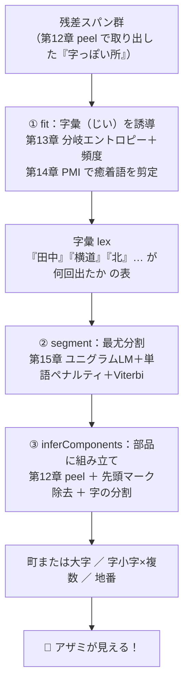
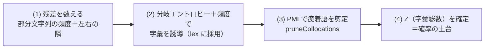
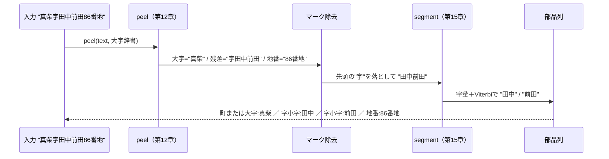
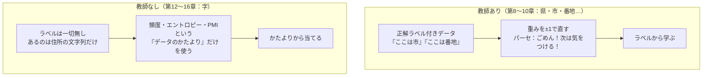
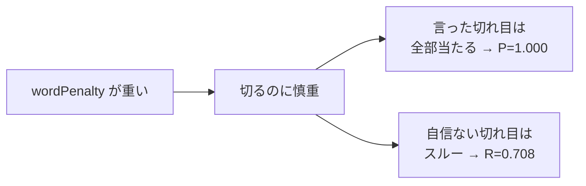
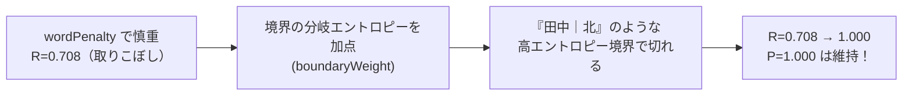

# 第16章　教師なし字推定の全工程（アザミ、復活）

> **この章のゴール**
> - 第12〜15章を **1本の流れ** につなげて、「字」を当てる全工程を最初から最後まで見とおす
> - `AzaInducer.fit` → `segment` → `Aza.inferComponents` の3段が、どう手をつなぐか分かる
> - **正解ラベルゼロ** でも F1≈0.83・完全一致88% まで届くことを、実際の数値で確かめる

> **登場人物**：みどり先生、ツムギ、ゲンタ、アザミ、バーティ

> 📦 **コードの置き場所メモ**：ここで解説する `AzaInducer`（fit / segment）と
> 残差分解は、共有ライブラリ **japanese-parser-common 0.2.0 の
> `org.unlaxer.jaddress.aza`** に移設されています（回帰テスト付き）。kugiri 側の
> `aza/Aza.java` は、字推定の結果を kugiri の `Component` に詰め替える薄いアダプタ
> （`inferComponents`）だけを残しています。**アルゴリズムの中身は不変**で、本章の
> 説明はそのまま通用します。

---

## 旅は、いよいよクライマックス

**ツムギ**：先生……ここまで長かったですね。第12章で「字の居場所」をつくって、第13章で「区切り目」をエントロピーで探して、第14章で PMI、第15章で言語モデルと最尤分割……。

**みどり先生**：よく登ってきたね。今日はね、**そのぜんぶを1本につなぐ日**だ。バラバラに学んだ道具を組み立てると——

**アザミ**：……（うっすら、でもさっきより輪郭がはっきりしている）……わたし、ちゃんと見えるようになる、の？

**ゲンタ**：先生、いっこ確認していい？　これ、**正解ラベルは一切使わない**んだよね。「ここが字だよ」って誰も教えてくれてないのに、当てられるの？　それ、ほんとに意味あるの？

**みどり先生**：あわてない、あわてない。今日その「ほんとに?」に、**数値で**答える。最後まで読むと、君もアザミが見えるよ。

---

## 全体像：3つの段が手をつなぐ

**みどり先生**：まず地図だ。教師なし字推定は、大きく **3段** でできている。



**みどり先生**：①で「どんな字名がこの世にあるか」の辞書（**字彙**）を、データのかたよりだけから作る。②でその辞書を使って、まんなかの文字列を「いちばんありそうな切り方」に切る。③で全体を住所の部品にならべる。

**ツムギ**：①が辞書づくり、②が切る、③がならべる……の3段ですね。

**みどり先生**：そのとおり。ひとつずつ、実コードで見ていこう。

---

## ① fit：データのかたよりから「字彙」を誘導する

**みどり先生**：これが `AzaInducer.fit` の全体だ。長く見えるけど、やってることは4つだけ。

```java
// AzaInducer.fit より（org/unlaxer/kugiri/aza/AzaInducer.java）
public AzaInducer fit(List<String> residuals) {
    N = Math.max(1, residuals.size());
    Map<String, Integer> cnt = new HashMap<>();                       // 部分文字列 -> 出現回数
    Map<String, Map<String, Integer>> left = new HashMap<>(), right = new HashMap<>(); // 左右の隣
    for (String r : residuals) {
        String name = stripMark(r);             // 「字」「大字」の先頭マークを落とす
        String s = BND + name + BND;            // 前後に番兵(BND=\u0000)をつける
        for (int len = minLen; len <= maxLen; len++) {
            for (int i = 1; i < s.length() - len; i++) {
                String sub = s.substring(i, i + len);
                if (sub.contains(BND)) continue;
                cnt.merge(sub, 1, Integer::sum);                        // (1) 残差を数える
                left .computeIfAbsent(sub, k -> new HashMap<>()).merge(...);  // 左の隣を記録
                right.computeIfAbsent(sub, k -> new HashMap<>()).merge(...);  // 右の隣を記録
            }
        }
    }
    for (Map.Entry<String, Integer> e : cnt.entrySet()) {
        String sub = e.getKey(); int c = e.getValue();
        if (c < minCount) continue;                                     // 頻度が低すぎるのは捨てる
        Map<String, Integer> lm = left.get(sub), rm = right.get(sub);
        boolean lvar = lm.size() >= 2 || lm.containsKey(BND);           // 左の隣がバラける？
        boolean rvar = rm.size() >= 2 || rm.containsKey(BND);           // 右の隣がバラける？
        double ent = (entropy(lm) + entropy(rm)) / 2;                   // (2) 分岐エントロピー
        if (lvar && rvar && ent >= eMin) lex.put(sub, c);               //     合格なら字彙に採用
    }
    Z = sum(lex); pruneCollocations(); Z = sum(lex);                    // (3) PMI剪定 (4) Z確定
    return this;
}
```

**みどり先生**：4つの仕事に名前をつけると、こうだ。



### (1) 残差を数える ——第13章

**みどり先生**：まず、すべての残差（「田中前田」「横道北」みたいな、字っぽい所）から、長さ1〜6の **部分文字列** を全部切り出して、何回出たかを数える。それと同時に、その部分文字列の**左どなり・右どなりに来た文字**も記録する。

**ツムギ**：あの、`BND` の `\u0000`（ユーゼロゼロゼロゼロ、コードポイント0番）って何ですか？

**みどり先生**：これは **番兵（ばんぺい）** だよ。文字列の前後にこっそり置く「ここは端っこですよ」という目印。これがあると「左に何も無い＝文字列の先頭だった」も、`right` / `left` の表にちゃんと数えられる。`lm.containsKey(BND)` がそれを見ている。

### (2) 分岐エントロピー＋頻度で字彙を誘導 ——第13章

**みどり先生**：採用の条件は3つ全部そろうこと。

> **字彙に採用する条件**
> - `c >= minCount`：そこそこ **頻度** がある（minCount=3）
> - `lvar && rvar`：左も右も、隣が **2種類以上にバラける**（または端っこに来る）
> - `ent >= eMin`：左右の **分岐エントロピーの平均** が下限以上

**ツムギ**：エントロピー、第13章でやりましたね。`entropy` のコード、これ底2の log でしたっけ。

**みどり先生**：よく覚えてた。これだ。

```java
// AzaInducer.entropy：左（または右）の隣の「散らばり具合」をビットで測る
private static double entropy(Map<String, Integer> counter) {
    int tot = 0; for (int v : counter.values()) tot += v;
    if (tot == 0) return 0;
    double h = 0;
    for (int v : counter.values()) {
        double p = (double) v / tot;
        h -= p * (Math.log(p) / Math.log(2));   // ★ Math.log(p)/Math.log(2) = 底2のlog
    }
    return h;
}
```

> 📌 **読み方メモ**
> - `H = -Σ p·log₂p`（エイチ・イコール・マイナス・シグマ・ピー・かける・ログ2ピー）
> - `Σ`（シグマ）＝「ぜんぶ足す」、`log₂`（ログにてい2）＝「2を何回かけたか」を測るものさし
> - **気持ち**：隣に来る文字が「いつも同じ」なら散らばってない＝エントロピー小。**いろんな文字が来る**なら散らばってる＝エントロピー大。**字の切れ目では「次に何が来るか読めない＝エントロピーが大きい」** ——だから区切り目だと分かる。

**ゲンタ**：なるほど。「田中」のあとには「北」も来るし「前田」も来るし番地（端っこ）も来る＝右がバラける。だから「田中」は1単語として独立してる、って判断できるのか。

**みどり先生**：そういうこと。第13章でやった「自由度」がそのまま効いている。

### (3) PMI で癒着語を剪定 ——第14章

**みどり先生**：ところがね、頻度とエントロピーだけだと、**たまたま並んでくっついた語**まで1単語として拾ってしまうことがある。たとえば「中里」と「前田」がよく続けて出ると、「中里前田」まで字彙に入ってしまう。これを掃除するのが `pruneCollocations`。

```java
// AzaInducer.pruneCollocations：既知2単位に分解でき、その結合が偶然並み(PMI<=tau)なら剪定
private void pruneCollocations() {
    List<String> multi = new ArrayList<>();
    for (String w : lex.keySet()) if (w.length() >= 2) multi.add(w);
    for (String u : multi) {
        int cu = lex.get(u);
        double weakest = Double.POSITIVE_INFINITY;
        for (int k = 1; k < u.length(); k++) {
            Integer ca = lex.get(u.substring(0, k)), cb = lex.get(u.substring(k));
            if (ca != null && cb != null) {
                double pmi = Math.log(((double) cu * N) / ((double) ca * cb)); // ★ 自然対数 ln
                weakest = Math.min(weakest, pmi);
            }
        }
        if (weakest <= tau) lex.remove(u);   // 結合が弱い（偶然並み）なら字彙から削除
    }
}
```

> 📌 **読み方メモ**
> - `PMI = ln( (cu·N) / (ca·cb) )`（ピーエムアイ）
> - ここの `log` は **自然対数 ln**（てい e の log）。第14章の PMI と同じ。
> - **気持ち**：`ca·cb` は「もし2つが**たまたま無関係**に並んだら、これくらいの回数になるはず」という予想。それより実際の `cu` が **ずっと多い** なら PMI はプラス＝「ほんとに仲良し（1単語）」。同じくらいなら PMI ≈ 0＝「たまたま並んだだけ」＝剪定。

**みどり先生**：「田中」みたいに、左右の自由度が高くて、分解しても強く結びつく語は残る。「中里前田」みたいに、2つの独立した語がたまたま並んだだけのものは消える。**頻度・エントロピー（第13章）が拾いすぎたものを、PMI（第14章）が冷静に間引く**——この二人三脚が肝心だ。

### (4) Z（字彙総数）を確定する

**みどり先生**：最後に `Z = sum(lex)`。これは字彙に残った語の出現回数を全部足したもの。**確率の土台（分母）** になる。

```java
private static double sum(Map<String, Integer> m) {
    double s = 0; for (int v : m.values()) s += v; return s == 0 ? 1 : s;
}
```

**ツムギ**：なんで剪定の前と後で2回 `Z = sum(lex)` してるんですか？

**みどり先生**：いい「なんで?」だ。`pruneCollocations` の中で「ある語が単語か?」を `lex.get(...)` で見る必要があるから、剪定する前に一度 Z を仮置きする。そして**剪定で語が消えると総数が変わる**から、剪定が終わったあと **もう一度** 正しい Z を確定させているんだよ。

---

## ② segment：いちばんありそうな切り方に切る ——第15章

**みどり先生**：辞書（字彙）ができたら、いよいよ切る。「田中前田」を「田中／前田」に分ける仕事だ。第15章でやった **ユニグラム言語モデル＋単語ペナルティ＋Viterbi** がそのまま入っている。

```java
// AzaInducer.segment：ユニグラムLM + 単語ペナルティで最尤分割(Viterbi)
public List<String> segment(String name) {
    int n = name.length();
    List<String> out = new ArrayList<>();
    if (n == 0) return out;
    double[] best = new double[n + 1];     // best[i] = 先頭からi文字目までの最良スコア
    int[] bp = new int[n + 1];             // bp[i] = そのとき直前の切れ目はどこか
    Arrays.fill(best, Double.NEGATIVE_INFINITY);
    best[0] = 0; bp[0] = -1;
    for (int i = 1; i <= n; i++) {
        for (int j = Math.max(0, i - maxLen); j < i; j++) {
            if (best[j] == Double.NEGATIVE_INFINITY) continue;
            String piece = name.substring(j, i);
            double cand = best[j] + logp(piece) - wordPenalty;   // ★足し算（log化済み）
            if (cand > best[i]) { best[i] = cand; bp[i] = j; }   // よりよい道を採用
        }
    }
    int i = n;
    Deque<String> stack = new ArrayDeque<>();
    while (i > 0) { int j = bp[i]; stack.push(name.substring(j, i)); i = j; } // 道をたどり直す
    out.addAll(stack);
    return out;
}
```

**バーティ**：チチッ！　ここはぼくの出番！　`best[]` を左から右へ埋めていって、最後に `bp[]`（バックポインタ）を逆にたどると、**いちばん良い切り方**が一発で出るんだ。ぜんぶの切り方を試さなくていい。ズルじゃないよ、かしこいだけ！

**みどり先生**：スコアの中身が `logp(piece)` だ。

```java
private double logp(String piece) {
    Integer c = lex.get(piece);
    if (c != null) return Math.log(c / Z);                       // 字彙にある：log(出た回数/総数)
    return Math.log(1.0 / (Z * 1000)) * piece.length();          // 未知語のフロア（罰）
}
```

> 📌 **読み方メモ**
> - `logp = log(c / Z)`：その語が出た確率の **log**（自然対数）。確率はかけ算だと小さくなりすぎるので、**log にして足し算に変える**（第5章のあれ！）。
> - 字彙に無い語は `1/(Z·1000)` という**とても小さい確率**を、長さの分だけ重ねる＝「知らない切り方は損」というペナルティ。
> - `- wordPenalty`：語をひとつ増やすたびに引かれる罰。これが無いと「1文字ずつ」にバラバラに切るのが得になってしまう。**むやみに細かく切らせない重し**だ。

**ツムギ**：`best[j] + logp(piece) - wordPenalty`……足したり引いたりだけ。第15章でやったとおりだ！

**みどり先生**：そう。「いちばん確率が高い（＝logの合計がいちばん大きい）切り方」をバーティが見つけてくれる。これが ② segment。

---

## ③ inferComponents：住所の部品に組み立てる ——第12章＋総仕上げ

**みどり先生**：最後の③。`Aza.inferComponents` が、ここまでの道具を **1本につないで** 住所の部品列を作る。短いけど、全工程の合流点だ。

```java
// Aza.inferComponents（org/unlaxer/kugiri/aza/Aza.java）
public static List<Component> inferComponents(String text, Set<String> oazaDict, AzaInducer inducer) {
    String[] p = peel(text, oazaDict);                         // ① 第12章 peel：大字 / 残差 / 地番 に割る
    List<Component> comps = new ArrayList<>();
    if (!p[0].isEmpty()) comps.add(new Component("町または大字", p[0]));
    String name = MARK.matcher(p[1]).replaceFirst("");         // ② 先頭の「字」「大字」マークを除去
    if (!name.isEmpty())
        for (String piece : inducer.segment(name))             // ③ segment で字を分割
            comps.add(new Component("字小字", piece));          //    → 字小字を必要なだけ並べる
    if (!p[2].isEmpty()) comps.add(new Component("地番", p[2])); // ④ 末尾数字は地番
    return comps;
}
```

**みどり先生**：`peel`（第12章）はこうだったね。大字辞書の最長一致で頭を取り、末尾の数字で地番を取り、**残った真ん中** が字候補だった。

```java
// Aza.peel：頭の ZIP/都道府県/市区町村は除去済み想定。(大字, 残差=字候補, 末尾数字=地番)
public static String[] peel(String text, Set<String> oazaDict) {
    String oaza = longestPrefix(text, oazaDict);
    String rest = text.substring(oaza.length());
    Matcher m = TAIL_NUM.matcher(rest);
    if (m.find()) return new String[]{oaza, rest.substring(0, m.start()), rest.substring(m.start())};
    return new String[]{oaza, rest, ""};
}
```



**ゲンタ**：①数える→②エントロピー→③PMI→④Z（ここまで fit）、で辞書を作って、segment で切って、peel と合わせて並べる。ぜんぶつながった。**この間、正解ラベルは一回も登場してない**んだな。

**みどり先生**：そこが今日いちばん大事なところだ。よく見抜いた。

---

## 教師あり と 教師なし のちがい

**みどり先生**：第8〜10章のパーセプトロンと、今日の字推定。どう違うか並べてみよう。



**ツムギ**：教師ありは「正解を見せてもらって直す」、教師なしは「正解は無いけど、データのクセから当てる」……。

**みどり先生**：そう。アザミには正解ラベルが無い。だから教師あり学習は使えない。でも「字名は全国で何度も反復する」「字の切れ目では次の文字が読めない（エントロピー大）」「ほんとうの単語は分解しても強く結びつく（PMI高）」——こういう **データのかたより** が残っている。それを手がかりに当てるんだ。

**アザミ**：……わたしのこと、誰も名前をつけてくれなかったのに……それでも、見つけてくれるの……？

**みどり先生**：見つけるよ。さあ、数値で見せよう。

---

## 手を動かそう

**みどり先生**：実際に動かしてみよう。ターミナルで：

```bash
mvn -q compile
mvn -q exec:java -Dexec.mainClass=org.unlaxer.kugiri.demo.AzaDemo -Dstdout.encoding=UTF-8
```

`AzaDemo` は、字を隠して住所を400件つくり → ラベル無しで推定し → 隠しておいた正解で採点する、という流れだ（`demo/AzaDemo.java`）。出てくるのがこれ。

```
=== 字推定スコア（教師ラベル不使用） ===
  従来 (boundaryWeight=0)           P=1.000 R=0.708 F1=0.829  字スパン完全一致 353/400=0.883
  分岐エントロピー併用 (0.5・既定)   P=1.000 R=1.000 F1=1.000  字スパン完全一致 400/400=1.000

=== 推定例(既定設定・教師ラベル不使用) ===
  高松寺前北65番地
     正解字=[寺前, 北]  ->  推定: 町または大字:高松 / 字小字:寺前 / 字小字:北 / 地番:65番地 /
  真柴字田中前田86番地
     正解字=[田中, 前田]  ->  推定: 町または大字:真柴 / 字小字:田中 / 字小字:前田 / 地番:86番地 /
  山目田中235番地
     正解字=[田中]  ->  推定: 町または大字:山目 / 字小字:田中 / 地番:235番地 /
```

> 📦 **2行ある？**：いまの `AzaDemo` は「**従来**」と「**分岐エントロピー併用**」の2つを
> 並べて採点する（理由はこのすぐ後で！）。まずは上の「従来」の行で読み方を覚えよう。

### 出力の読み方

**みどり先生**：「従来」の行の3つの数字は、第11章でやった **P / R / F1** だ。ここでは「**字の内部の切れ目（区切り位置）**」が当たったかで測っている。

> 📌 **読み方メモ**
> - `P=1.000`（適合率, Precision）＝「**切れ目だと言った所**は、**ぜんぶ本当に切れ目**だった」。一個も間違えていない！
> - `R=0.708`（再現率, Recall）＝「**本当の切れ目のうち**、**70.8%を見つけられた**」。3割ほど取りこぼした。
> - `F1=0.829`＝PとRのバランス点（調和平均）。
> - `353/400 = 0.883`＝**400件のうち353件は、字の分け方が完全に正解と一致**した。

**ツムギ**：「真柴字田中前田86番地」が、ちゃんと **田中／前田** に分かれてる……！　しかも先頭の「字」マークもちゃんと消えてる！

**ゲンタ**：「山目田中235番地」は1つの字「田中」だけ。「高松寺前北65番地」は「寺前／北」の2つ。**件によって字の数が変わるのに、ちゃんと当ててる**じゃん。……これ、正解ラベル一個も使ってないんだよな？

**みどり先生**：一個も。`AzaDemo` の中で、正解（`goldParts`）は **採点のためにだけ** 取り出していて、推定する `inferComponents` には渡していない。**正解ゼロで、F1≈0.83、完全一致88%**。これが教師なし学習の力だ。

**アザミ**：……（はっきりと、色をともなって姿が浮かび上がる）……見える……！　わたし、ちゃんと、ここにいる……！　みんなが、データのかたよりから、わたしを見つけてくれたのね……！

**ツムギ**：アザミ……！　ちゃんと見える！

---

## 正直に：完璧ではない（限界）

**みどり先生**：でもね、あわてない、あわてない。**完璧ではない**ことも、ちゃんと言っておく。

**ゲンタ**：`R=0.708`。3割近く取りこぼしてる。これ何で?

**みどり先生**：`P=1.000` で `R=0.708` ——これは「**慎重すぎる**」状態なんだ。`wordPenalty`（語を増やす罰）が効いていて、「切るぞ」と言うときは確実な所だけ。だから言ったことは全部当たる（P高）。でも、自信が持てない切れ目は**切らずにスルー**してしまう。だから取りこぼす（R低）。



**みどり先生**：これは今の合成データ・今のパラメータでの数字だ。`minCount` `eMin` `wordPenalty` `tau` をいじったり、もっと本物に近いデータ（第17章のABR／KEN_ALL）で字彙を作れば、まだ伸びる余地がある。

---

## そして答え：第13章の「分岐エントロピー」で取りこぼしを救う

**ツムギ**：あれ、さっきの出力、2行目に「**分岐エントロピー併用 P=1.000 R=1.000 F1=1.000**」ってある！　取りこぼし、ゼロになってる！？

**みどり先生**：よく見つけた。じつはね、**第13章で学んだ分岐エントロピー**——「単語の境目では、いろんな文字が来る（予測しにくい）」というあれ——を、分割のときの**境界のごほうび**として足すと、慎重すぎた `segment` が「ここは境目っぽいぞ」と背中を押されて、ちゃんと切れるようになるんだ。



**ゲンタ**：第13章の道具が、第15章の分割をそのまま強くするのか。伏線回収じゃん。

**みどり先生**：そういうこと。これは共有ライブラリ側（japanese-parser-common 0.3.0）の
`AzaInducer` に `boundaryWeight`（既定 0.5）として実装されている。大きくしすぎると今度は
**切りすぎ**て P が落ちる（0.7で P=0.81）。だから「**ちょうど切れるけど切りすぎない**」
0.5 を選んである。第8章の「少しずつ」と同じ、さじ加減の話だね。

**ツムギ**：取りこぼしの理由（第13章で習った『境目は予測しにくい』）が、そのまま解決策になってる……！

> 📌 注意：このデモは **合成データ**（規則的に作った住所）だ。第18章でやるように、合成の数字（とくに今回の 1.000）は本物の実力そのものではない。本当の評価は、本物データの hold-out（取り置き）でやる（第11章の評価基盤＝`EvalDemo`）。それでも「教師なしで字が当たる」という**仕組みの正しさ**は、ここでしっかり見えている。

**みどり先生**：チューニングや本番データへの差し替えは **第19章** と、開発メモの `docs/HANDOFF.md` に続く。今日は「**正解ゼロでも、ここまで来られる**」を確かめられた。それで十分すぎる成果だよ。

---

## 今日のまとめ

- 教師なし字推定は **3段**：① `fit`（字彙を誘導）→ ② `segment`（最尤分割）→ ③ `inferComponents`（部品に組み立て）。
- `fit` の中身は4つ：**(1) 残差を数える**（頻度＋左右の隣）→ **(2) 分岐エントロピー＋頻度で誘導**（第13章, 底2のlog）→ **(3) PMIで癒着語を剪定**（第14章, 自然対数）→ **(4) Z を確定**（確率の土台）。
- `segment` は **ユニグラムLM＋単語ペナルティ＋Viterbi**（第15章, 自然対数を足し算）。バーティが最良の道を一発で見つける。
- `inferComponents` は **peel（第12章）→ マーク除去 → segment → 部品列** に合流させる。
- 結果：**正解ラベルゼロ**で、従来でも `P=1.000 / R=0.708 / F1=0.829`（完全一致 `353/400`）。「**教えてもらえなくても、データのかたよりから当てられる**」——これが教師なし学習。
- さらに **第13章の分岐エントロピーを境界スコアとして併用**（`boundaryWeight`）すると、取りこぼしが消えて `R=0.708→1.000 / F1=1.000`（合成コーパス）。問題の理由がそのまま解決策になった。
- ただし合成データの数字なので実力そのものではない。本物データの hold-out 評価（第11章 `EvalDemo`）と本番差し替えは第19章・`HANDOFF.md` へ。

---

## アザミメーター

```
アザミの見え具合：█████████░ 94%
（コメント：教師なし字推定の全工程がつながった。正解ゼロで F1≈0.83・完全一致88%！
　アザミの姿がはっきり見えた——ほとんど復活だ。あと少し。）
```

---

## 次回予告

**みどり先生**：今日は「字」を当てた。でも字彙を作るには、もっと**本物に近い字名**がほしいよね。

**ポストくん**：ピッ、確認しました。わたしの体には KEN_ALL.CSV が積んであります。これがお役に立つかと。

**みどり先生**：ありがとうポストくん。次は、ABR と KEN_ALL から「**だいたいの正解**」を作る——**弱教師（weak supervision）**の話だ。本物のデータが、いよいよ登場するよ。

[← 第15章](15-gengo-model-viterbi.md) ・ [第17章 →](17-weak-supervision-abr.md)
