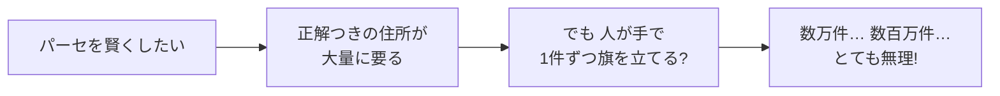
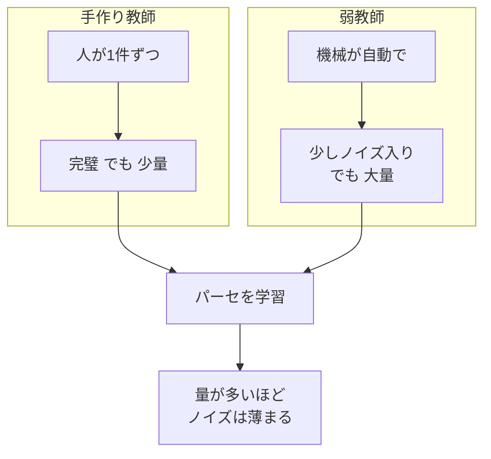
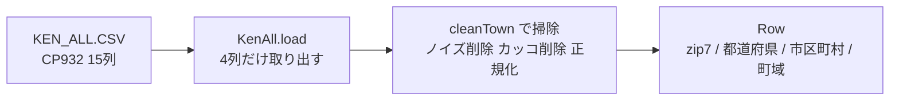
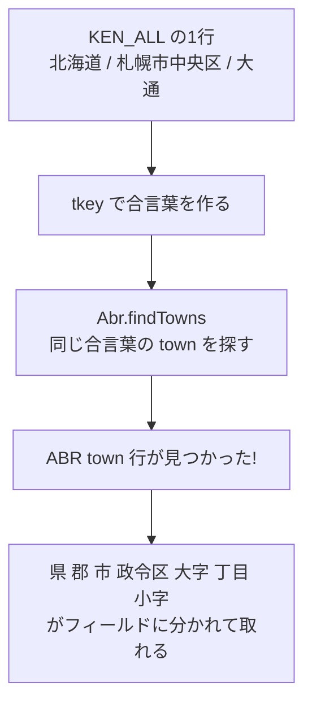
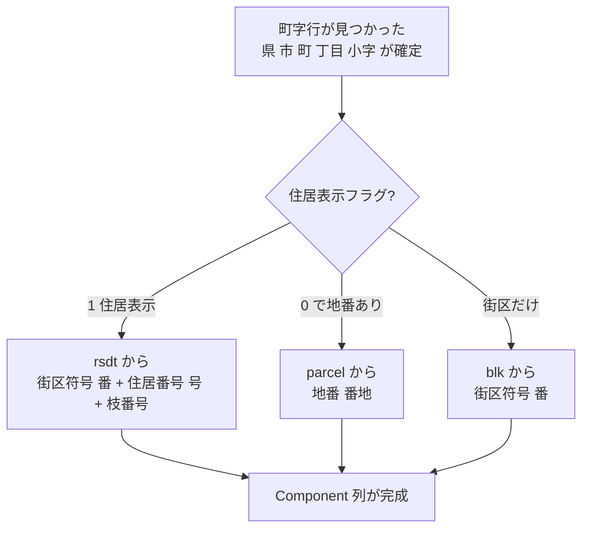
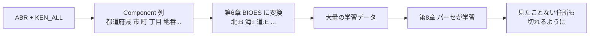

# 第17章　弱教師：ABR と KEN_ALL で「だいたいの正解」を作る

> **この章のゴール**
> - 「弱教師（じゃくきょうし、weak supervision）」＝**完璧じゃないけど大量に作れる正解**だと分かる
> - KEN_ALL（郵便番号データ）と ABR（住所マスタ）を**つき合わせる**と、住所の境界が自動で分かるしくみをつかむ
> - そうやって作った「だいたいの正解」が、第6章の BIOES タグ（学習データ）に変身することを理解する

> **登場人物**：みどり先生、ツムギ、ゲンタ、ポストくん、アザミ

---

## 復習：機械を賢くするには「正解例」が要る

**ツムギ**：先生、第8章でパーセが「まちがえたら重みを直す」って学びましたよね。でも、よく考えたら……**「まちがえた」ってどうやって分かるんですか？**

**みどり先生**：おお、いい「なんで？」だ。あわてない、あわてない。
パーセが「これは『市』だ！」と予想したとき、**本当の答え（正解）**と見くらべるよね。その正解のことを——

**ゲンタ**：**教師データ**（きょうしデータ、training data）。第9章でやった。「正解の旗が立った住所」を山ほど見せて学習させる、ってやつ。

**みどり先生**：そのとおり。でね、ここで大問題がある。



**ツムギ**：うわ……。1件ずつ「ここが県、ここが市、ここが番地」って手で印つけるの、何百万件もやるの？　死んじゃう……。

**みどり先生**：だよね。**人手で大量の正解を作るのは、お金も時間もかかりすぎる**。これが機械学習のいちばん現実的なカベなんだ。

---

## 弱教師：「だいたい正しい」を機械が大量に作る

**みどり先生**：そこで登場するのが、今日の主役。**弱教師（weak supervision）**だ。

**ツムギ**：じゃく……きょうし？　弱い、先生？

**みどり先生**：そう。「ちょっと頼りない先生」って意味。ふつうの教師データは、人間が一個ずつ丁寧に作る「完璧な正解」。でも弱教師はね——

> **弱教師（weak supervision）とは**
> 完璧ではないけれど「**だいたい正しい**」ラベルを、**機械で大量に自動生成**するやり方。
> 多少まちがい（ノイズ）が混じっても、**量でカバー**する。

**ゲンタ**：ん？　まちがいが混じってるのに、それで学習していいの？　それ、意味あるの？

**みどり先生**：いい質問だ。たとえ話をしよう。
英語のテスト勉強で、「先生が手で作った完璧な問題集10問」と、「ちょっと誤植もあるけど1万問ある問題集」、どっちがリスニング得意になると思う？

**ツムギ**：……えー、誤植はイヤだけど、1万問やったらさすがに耳が慣れそう。

**みどり先生**：そう！　**少々の誤植は、1万問の中では薄まる**。パーセも同じで、ちょっと変な例があっても、正しい例が圧倒的に多ければ、ちゃんと「だいたい正しい重み」に落ち着く。これが弱教師の発想だ。



**みどり先生**：そして kugiri では、その「だいたいの正解」を作る材料が、**2つの公的なデータ**なんだ。ポストくん、出番だよ！

---

## データ源その1：KEN_ALL（郵便番号データ）

**ポストくん**：ピッ、確認しました。郵便配達ロボット、ポストくんです。わたしの体には **KEN_ALL.CSV** が積んであります。日本郵便さんが配っている、**全国の郵便番号データ**ですよ。

**ツムギ**：ケンオール？

**ポストくん**：ピッ。「KEN（県）＋ ALL（全部）」、つまり全国分という意味です。中身はこんな表になっています。**ヘッダ（見出し行）が無くて、15個の列**が並んでいます。

```
01101,"060  ","0600000","ﾎｯｶｲﾄﾞｳ","ｻｯﾎﾟﾛｼﾁｭｳｵｳｸ",...,"北海道","札幌市中央区","以下に掲載がない場合",0,0,0,0,0,0
```

**ゲンタ**：うわ、なんか読みにくい。それに……「ﾎｯｶｲﾄﾞｳ」って半角カタカナ？　文字化けしてない？

**ポストくん**：ピッ、これは **CP932**（シーピー・きゅうさんに）という古い文字コードで書かれているのです。Windows でよく使われた、いわゆる「シフトJIS系」ですね。古風でしょう。だから読むときは「これはCP932で〜」と宣言してあげないと、化けてしまうのです。

**みどり先生**：そこが第1章でやった「文字コード」の話につながるね。同じ文字でも、コードがちがえば別物に見える。KEN_ALL は **UTF-8 じゃなくて CP932**。読むときに指定が要る、と覚えておこう。

**みどり先生**：で、この15列のうち、kugiri が使うのは**たった4つ**だけ。コードを見てみよう。

```java
// KenAll.java より
private static final int ZIP7 = 2, PREF = 6, CITYWARD = 7, TOWN = 8;

public record Row(String zip7, String pref, String cityward, String town) {}
```

**みどり先生**：列の番号（0から数える）で、

- `ZIP7`＝2番目の列：**郵便番号7桁**（例 `0600000`）
- `PREF`＝6番目の列：**都道府県**（例 `北海道`）
- `CITYWARD`＝7番目の列：**市区町村**（例 `札幌市中央区`。郡や政令区も連結されている）
- `TOWN`＝8番目の列：**町域**（例 `以下に掲載がない場合`）

を取り出して、`Row`（行）という小さな入れ物に詰める。

**ツムギ**：あれ、最後の「以下に掲載がない場合」って……町の名前じゃないですよね？

**みどり先生**：よく気づいた！　それがクセモノなんだ。KEN_ALL には、こういう**ノイズ（じゃまもの）**がけっこう混じってる。だから掃除（クリーニング）が要る。それがこのメソッド。

```java
// KenAll.cleanTown
private static final Pattern PAREN = Pattern.compile("（.*?）|\\(.*?\\)");
private static final Set<String> NOISE = Set.of("以下に掲載がない場合");

static String cleanTown(String t) {
    if (NOISE.contains(t)) return "";                  // ① ノイズ語は空に
    String cleaned = PAREN.matcher(t).replaceAll("").strip(); // ② 丸カッコ内を削除
    return NFKC_CF.normalize(cleaned);                 // ③ 表記をそろえる
}
```

**みどり先生**：やってることは3つ。

1. **`以下に掲載がない場合` みたいなノイズ語**は、町名じゃないので空っぽ `""` にする。
2. **丸カッコの中身**（例 `札幌（1丁目）` の `（1丁目）`）を削る。KEN_ALL はカッコの中に補足を書く習慣があるんだ。
3. **`NFKC_CF.normalize`** で、表記のゆれをそろえる。

**ツムギ**：その最後の `NFKC_CF` っていうおまじない、何ですか？

**みどり先生**：第1章でCPねこがチラッと言ってたやつだよ。**全角と半角、大文字と小文字みたいな「見た目はちがうけど同じ」文字を、ぜんぶ1つの形にそろえる**正規化（せいきか、normalization）だ。たとえば全角の `１` と半角の `1`、`Ａ` と `a` を同じに見なす。これをやっておかないと、次の「つき合わせ」で「同じ町なのに別物」になってしまう。



**ポストくん**：ピッ、確認しました。これで「**郵便番号と、県・市・町のだいたいの名前**」がそろいました。でも……町の中の細かい「番地」や「号」までは、わたしの KEN_ALL には入っていないのです。

**ゲンタ**：じゃあ番地はどこから来るの？

**みどり先生**：そこで、もう1つのデータの出番だ。

---

## データ源その2：ABR（アドレス・ベース・レジストリ）

**みどり先生**：**ABR（エービーアール、Address Base Registry）**。日本の**デジタル庁**が整備している、いわば「住所の公式マスタ台帳」だ。

**ツムギ**：マスタ……台帳？

**みどり先生**：日本中の住所を、**部品ごとにきっちり分けて**記録したデータベースだよ。KEN_ALL が「だいたいの町名」止まりなのに対して、ABR は中身がもっと細かい。kugiri が使うのは4種類のテーブル（表）。

| テーブル | 何が入ってる |
|---|---|
| **town（町字）** | 県・郡・市・政令区・大字・丁目・小字に分けた情報＋「町字id」 |
| **blk（街区）** | 「○番」の街区符号 |
| **rsdt（住居）** | 「○番○号」の住居表示（街区符号＋住居番号＋枝番） |
| **parcel（地番）** | 「○番地」の地番 |

**ゲンタ**：「町字id」ってのが、なんかキーっぽいな。

**みどり先生**：鋭い。**町字id（ちょうあざアイディー）**は、「この町のこのエリア」を指す背番号みたいなもの。これを使って town と blk/rsdt/parcel をつなぐんだ。あとでじっくり見よう。

---

## つき合わせ：KEN_ALL と ABR を「文字列で」結ぶ

**みどり先生**：いよいよ核心。**KEN_ALL の (県, 市区町村, 町域) を、ABR の town テーブルにつき合わせる（マッチさせる）**。同じ住所を指す行を見つけて、ABR 側の細かい情報を手に入れるんだ。

**ツムギ**：つき合わせ……。同じ名前の行を探す、って感じですか？

**みどり先生**：そう。トランプの神経衰弱みたいに、「県・市・町の名前が一致する札」をペアにする。コードでは、3つをくっつけた**キー（合言葉）**を作ってる。

```java
// Abr.java より
private static String tkey(String pref, String combined, String oaza) {
    return pref + "" + combined + "" + oaza;  // 県＋市区町村＋大字 を連結
}
```

**ゲンタ**：`` って何のおまじない？

**みどり先生**：それは「ふつうの住所には絶対出てこない見えない文字」で、**区切りのしるし**にしてるだけ。`北海道●札幌市中央区●大通` みたいに、3つの言葉をのり付けして1本の合言葉にしている。同じ合言葉どうしなら「同じ場所」だ、というわけ。

**ゲンタ**：ちょっと待って。住所には「団体コード」みたいな番号もあるんでしょ？　**名前じゃなくて番号で突き合わせたほうが確実**じゃないの？

**みどり先生**：おお、ゲンタ、まさにプロの視点だ。実はね——**それがワナ**なんだよ。

> **なぜ「文字列」でつき合わせるのか**
> 団体コード（自治体の番号）は、KEN_ALL では **5桁**、ABR では **6桁**（チェック数字つき）だったりして、**版やデータ源で桁数や付け方が食いちがう**ことがある。
> 番号で突き合わせると、この食いちがいで**ペアが見つからなくなる**。
> だから kugiri は、わざと「**県・市・町の名前そのもの（文字列）**」でつき合わせる。

**ツムギ**：番号って確実そうに見えて、実はバラバラなんだ……。だから名前で勝負、と。

**みどり先生**：そういうこと。だからこそ、さっきの `NFKC_CF` で表記をそろえておくのが効いてくる。名前で突き合わせるなら、名前の表記が完全にそろってないと当たらないからね。



**みどり先生**：つき合わせのコードがこれ。

```java
// Abr.findTowns：合言葉で town 行を探す
public List<Map<String, String>> findTowns(String pref, String cityward, String town) {
    List<Map<String, String>> hit = townIndex.get(tkey(pref, cityward, town));
    if (hit != null) return hit;
    return townIndex.getOrDefault(tkey(pref, cityward, ""), List.of());  // 町名なしでも探す
}
```

**みどり先生**：まず「県・市・町」フル一致で探す。見つからなければ「県・市」だけで探す（町名が空でも当てる保険）。当たれば、その町の ABR 行が手に入る。

**ツムギ**：当たらなかったら？

**みどり先生**：それは `misses`（ミス）として数える。あとで「何件つき合わせ失敗したか」を見て、データの品質をチェックするんだ。弱教師は完璧じゃないからね。「当たらなかったぶんは、潔くあきらめる」のも大事。

---

## フィールド分離：名前のかたまりが、部品にほどける

**みどり先生**：つき合わせが当たると、ABR の town 行には**もう部品ごとに分かれた情報**が入ってる。`emit`（エミット＝送り出す）メソッドで、それを Component（部品）の列に組み立てていく。

```java
// Abr.emit（前半・頭の部分を作る）
List<Component> head = new ArrayList<>();
head.add(new Component("ZIP", fmtZip(zip7)));
head.add(new Component("都道府県", pref));
if (!county.isEmpty()) head.add(new Component("群", county));     // 郡があれば
head.add(new Component(muniLabel(city, pref), city));            // 市/町村/区
if (!ward.isEmpty()) head.add(new Component("区", ward));         // 政令区があれば
head.add(new Component("町または大字", oaza));
if (!chome.isEmpty()) head.add(new Component("丁目", chome));     // 丁目があれば
if (!koaza.isEmpty()) head.add(new Component("字小字", koaza));    // 小字があれば
```

**ツムギ**：あ、`Component("都道府県", pref)` って、「これは都道府県、中身は『北海道』」っていう**ラベルつきの部品**ですね！

**みどり先生**：そのとおり。第6章でやった「部品」だ。`if (!county.isEmpty())` は「郡が空じゃなかったら入れる」。郡があったり無かったり、丁目があったり無かったり、住所によってちがうから、有るぶんだけ並べていく。

**ゲンタ**：`muniLabel` ってのは？　市/町村/区を切り替えてるみたいだけど。

**みどり先生**：市区町村の名前を見て、**ラベルを決める小さな判定**だよ。

```java
// Abr.muniLabel：末尾の字でラベルを決める
static String muniLabel(String surface, String pref) {
    if (surface.endsWith("市")) return "市";
    if (surface.endsWith("町") || surface.endsWith("村")) return "町村";
    if (surface.endsWith("区")) return pref.equals("東京都") ? "東京23区" : "区";
    return "市";
}
```

**ツムギ**：「区」で終わってても、東京都なら『東京23区』、それ以外なら『区』……って、第0章で先生が言ってた「同じ区でも別物」のやつだ！

**みどり先生**：覚えてたね。東京の特別区（世田谷区など）と、政令市の区（札幌市中央区など）は、住所の構造上べつもの。だからラベルを分けてる。これが「ルールだけじゃ難しい」のリアルな例だね。

**みどり先生**：さて、ここまでで「**頭の部分（県〜小字まで）**」ができた。残るは番地。`emit` の後半は、**住居表示フラグ**を見て、番地の入れ方を切り替える。

```java
// Abr.emit（後半・番地をつける）
String k = key(全国地方公共団体コード, 町字id);   // (団体コード, 町字id) で番地を引く合言葉
boolean rsdtFlag = g(t, "住居表示フラグ").equals("1");

if (rsdtFlag && rsdt.containsKey(k)) {            // ① 住居表示の町
    c.add(new Component("街区符号", u[0] + "番"));
    c.add(new Component("住居番号", u[1] + "号"));
    if (!u[2].isEmpty()) c.add(new Component("枝番号", "-" + u[2]));
} else if (parcel.containsKey(k)) {               // ② 地番の町
    c.add(new Component("地番", num + "番地"));
} else if (blk.containsKey(k)) {                  // ③ 街区だけ分かる町
    c.add(new Component("街区符号", b + "番"));
}
```

**みどり先生**：ここで使う合言葉 `k` は、さっきと違って**(団体コード, 町字id) の組**だ。「どの自治体の、どの町字エリアか」を指して、そのエリアの番地リスト（blk/rsdt/parcel）を引く。

- **住居表示フラグが 1**（住居表示の町）→ rsdt から「○番○号（＋枝番）」
- そうでなく **parcel がある** → 「○番地」
- それも無く **blk だけある** → 「○番」だけ

**ゲンタ**：「○番○号」と「○番地」って、なんで分かれてるの？　同じ番地じゃないの？

**みどり先生**：これがまた日本住所の奥深いところでね。**住居表示**を実施した地域は「街区符号＋住居番号」で「1番2号」みたいに表す。実施してない地域は昔ながらの**地番**で「1234番地」と表す。**同じ「番地」っぽくても、制度がちがう**。だからラベルも別。フラグで切り替えてるのは、その制度のちがいなんだ。



**みどり先生**：そして、これら全部をまとめて回すのが `buildRecords`。

```java
// Abr.buildRecords：KEN_ALL を1行ずつ ABR で展開
for (KenAll.Row row : KenAll.load(kenall, kenallCs)) {
    List<Map<String, String>> ts = abr.findTowns(row.pref(), row.cityward(), row.town());
    if (ts.isEmpty()) { misses++; continue; }        // つき合わせ失敗は数えて飛ばす
    for (Map<String, String> t : ts)
        records.addAll(abr.emit(row.zip7(), t, maxUnits));  // 当たったら Component 列を量産
}
```

**ツムギ**：KEN_ALL の行を1個ずつ持ってきて、ABR でつき合わせて、当たったら番地つきの部品列をどんどん作っていく……。これを全国分回したら、**人手ゼロで、ものすごい数の「区切り済み住所」**ができますね！

**みどり先生**：それが弱教師の正体だよ。**機械が、データとデータをつき合わせて、勝手に正解を量産する**。

---

## ちょっと寄り道：CSV の読み取りは「依存ゼロ」

**ゲンタ**：ところで先生、CSV を読むのって、ライブラリ使うんじゃないの？

**みどり先生**：CLAUDE.md の設計原則、覚えてる？　kugiri は「**依存は最小、本体は純 JDK**」。だから CSV パーサも、外部ライブラリを使わず**自前で素朴に書いてある**んだ。`Csv.java` だね。

```java
// Csv.read：1行ずつ読んで、splitLine でカンマ分割するだけ
while ((line = br.readLine()) != null) {
    if (line.isEmpty()) continue;
    rows.add(splitLine(line));
}
```

**みどり先生**：ポイントは2つ。

- **ヘッダ無しCSV（KEN_ALL）** は、列番号で読む（`KenAll` が `r[2]`, `r[6]` のように）。
- **ヘッダありCSV（ABR）** は、`dicts` メソッドが「1行目を見出しにして、列名→値の辞書」に変える。だから `g(d, "都道府県名")` のように**列名で読める**。

**ツムギ**：なんで ABR は列名で読むんですか？　番号のほうがラクそうだけど。

**みどり先生**：CLAUDE.md にも書いてある注意点だね。**ABR は版（バージョン）が変わると列が増えたり減ったり、順番が変わったりする**。番号でガチガチに読むと、版が変わったとたん全部ずれて壊れる。でも「`都道府県名` という列を探す」読み方なら、列が増えても平気。だから**ヘッダ名で読む**んだ。

**ポストくん**：ピッ。「列名で読む、コードは文字列で突き合わせる」——壊れにくさのための知恵ですね。

---

## なぜ弱教師が効くのか：BIOES への橋わたし

**みどり先生**：さあ、総仕上げ。こうして作った Component 列が、**どうやって学習データになる**か。第6章を思い出そう。ツムギ、BIOES って何だっけ？

**ツムギ**：えーと、文字に立てる旗！　**B（始め）・I（中）・E（終わり）・S（単独）・O（外）**。たとえば「北海道」なら、北＝B、海＝I、道＝E。

**みどり先生**：完璧。Component には「ラベル（都道府県）」と「中身（北海道）」が入ってる。これを1文字ずつ展開すれば——

```
都道府県「北海道」 → 北:B-都道府県  海:I-都道府県  道:E-都道府県
市「札幌市中央区」  → 札:B-市 ... 区:E-市
地番「1234番地」    → 1:B-地番 ... 地:E-地番
```

**ゲンタ**：あっ！　**Component の境界が、そのまま BIOES の旗になる**のか。ABR が「ここからここまでが市」って教えてくれてるから、旗の立てどころが分かる。

**みどり先生**：そういうこと。**人手ゼロで作った「だいたいの正解」が、第8章のパーセが学べる形（BIOES タグつきの文字列）に変身する**。これが弱教師の最終目的地だ。



**ツムギ**：人が一個も旗を立ててないのに、機械が勝手に学習データを作って、それでパーセが賢くなる……。なんか、ちょっと感動です。

**みどり先生**：いいでしょう。あわてない、あわてない、でちゃんとここまで来たね。

---

## でも……「字」だけは、ここでも分かれない

**アザミ**：……みどり先生。わたし、ずっと聞いてたのだけど……。

**ツムギ**：あ、アザミ！　さっきよりちょっとハッキリ見える気がする！

**アザミ**：ABR が、県も市も町も丁目も番地も、ぜんぶ分けてくれるのよね……。でもね、よく見て。**わたし「字（あざ）」だけは、まだ町名のなかに、まぎれたままなの**。

**ゲンタ**：……ほんとだ。`emit` のコード、`字小字` を Component に入れてるのは、**ABR の town にもともと「小字名」の列があったときだけ**だ。多くの町では、字は「大字・町名」の中にゴチャっと入ったまんまで、分かれてない。

**みどり先生**：鋭い。ABR は便利だけど万能じゃない。**「字」の境界までは、ほとんどの場合データに無い**んだ。だから弱教師でも、字だけは「だいたいの正解」すら作れない。

**アザミ**：そう……。だから、わたしはまだ完全には見えないの。でも……。

**みどり先生**：でも、第12章から第16章でやったよね。**正解が無くても、データのかたよりから「ここが字だ」を当てる**——分岐エントロピー、PMI、言語モデル。あの教師なし学習たちが、弱教師では届かない最後の1ピースを埋める。

**アザミ**：……うれしい。みんなのおかげで、わたし、もうほとんど見えてきたわ。

---

## 手を動かそう

実際に「弱教師ラベル生成」を動かしてみましょう。`AbrDemo` が、サンプルの KEN_ALL と ABR をつき合わせて Component 列を作ってくれます。

```bash
mvn -q compile
mvn -q exec:java -Dexec.mainClass=org.unlaxer.kugiri.demo.AbrDemo -Dstdout.encoding=UTF-8
```

> 📌 `-Dstdout.encoding=UTF-8` は「画面に出す文字を UTF-8 で」というおまじない。
> これを付けないと、日本語が化けることがあります（ポストくんの言う「CP932」の世界と地続きの話です）。

**読みどころ**（ソースの該当箇所）：

| 見るもの | ファイル / メソッド |
|---|---|
| KEN_ALL を4列に絞って掃除 | `abr/KenAll.java` の `load` / `cleanTown` |
| town へ文字列でつき合わせ | `abr/Abr.java` の `findTowns` / `tkey` |
| 部品列を組み立て（番地切り替え） | `abr/Abr.java` の `emit` / `muniLabel` |
| 全件を回して量産 | `abr/Abr.java` の `buildRecords` |
| 依存ゼロの CSV 読み取り | `abr/Csv.java` の `read` / `splitLine` / `dicts` |

**かんたん練習**：次の KEN_ALL 風の1行を、`cleanTown` のルールで掃除すると、町域はどうなる？

```
町域 = "中央（1丁目、2丁目）"
```

<details>
<summary>こたえ</summary>

1. ノイズ語リストには無い → そのまま
2. 丸カッコ `（1丁目、2丁目）` を削除 → `中央`
3. `NFKC_CF` で正規化（全角半角そろえ） → `中央`

掃除後の町域は **`中央`**。カッコの中の補足が消えて、つき合わせに使える素直な町名になりました。

</details>

> ⚠️ **大事な注意（CLAUDE.md 準拠）**
> - **実物の ABR / KEN_ALL の生データは、リポジトリにコミットしない**。テスト用の**サンプルだけ**を置く。本物は配布元（日本郵便・デジタル庁）から各自で取得する。
> - ABR の**列名は版で変わる**ので、番号ではなく**ヘッダ名で読む**（`g(d, "都道府県名")` のスタイル）。

---

## 今日のまとめ

- 機械学習には正解例（教師データ）が要るが、**人手で大量に作るのは大変**。
- **弱教師（weak supervision）**＝完璧じゃないけど「だいたい正しい」ラベルを**機械で大量に自動生成**する方法。ノイズは**量でカバー**する。
- 材料は2つ：**KEN_ALL**（郵便番号データ。CP932・ヘッダ無し15列。4列だけ抜いて `cleanTown` で掃除＋`NFKC_CF` 正規化）と、**ABR**（デジタル庁の住所マスタ。town / blk / rsdt / parcel）。
- KEN_ALL の (県, 市区町村, 町域) を ABR の town に**文字列でつき合わせる**（団体コードの桁ずれを避けるため番号でなく名前で）。当たれば**県・郡・市・区・大字・丁目・小字がフィールド分離**され、`emit` が住居表示フラグで番地（街区符号・住居番号・枝番／地番）を切り替えて Component 列を量産する。
- できた Component 列は、第6章の **BIOES タグに変換**でき、**人手ゼロの大量学習データ**になる。
- ただし**「字」だけは、ここでも分離されない**。だから第12〜16章の**教師なし推定**が要る。

---

## アザミメーター

```
アザミの見え具合：██████████ 97%
（コメント：人手ゼロで「県・市・町・番地」の正解が大量に作れた。
 字以外はもう全部見える。アザミの姿、あと少しで完全だ！）
```

---

## 次回予告

**みどり先生**：弱教師で、本物のデータから学習データを作れるようになった。でもね……本番データは集めるのが大変だし、めずらしいパターンが足りないこともある。

**ゲンタ**：じゃあ、足りないぶんは……自分で作る？

**みどり先生**：そう、**合成データ（ごうせいデータ）**だ。住所を機械が「でっち上げて」山ほど作る。でも、ここに落とし穴がある。「**精度1.000を信じてはいけない**」——どういう意味か、次の章で。

[← 第16章](16-aza-zentai.md) ・ [第18章 →](18-synth-data.md)
