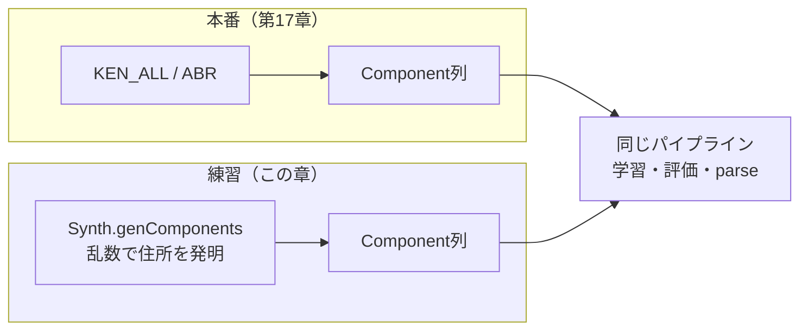
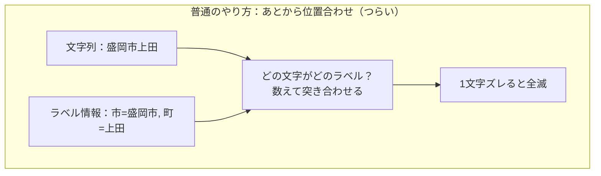
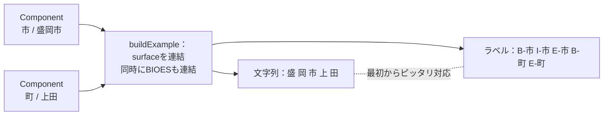
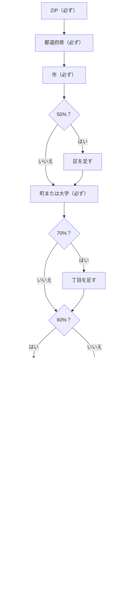
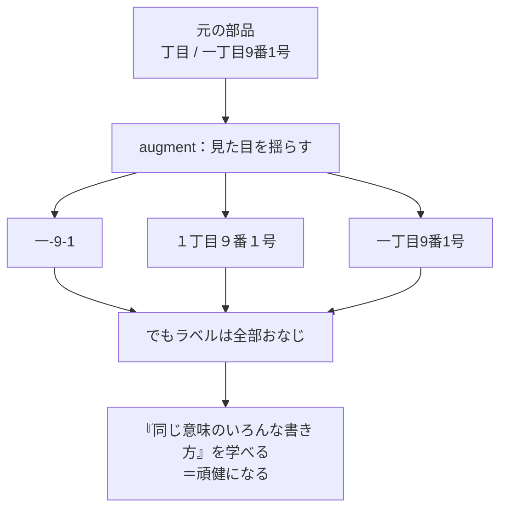
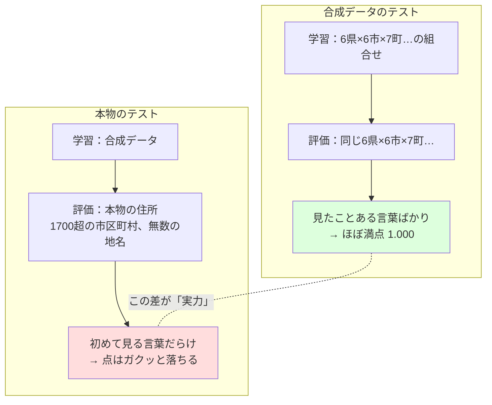
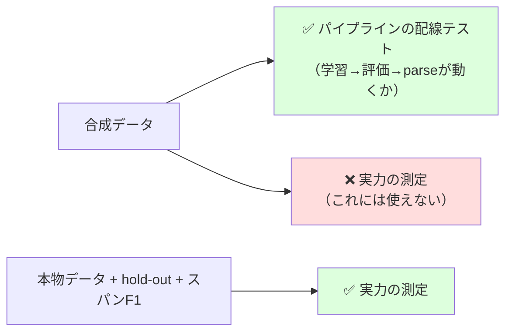

# 第18章　合成データと「精度1.000を信じてはいけない」

> **この章のゴール**
> - **合成データ（ごうせいデータ、synthetic data）**＝プログラムで自動生成した練習用データ、だと分かる
> - 「部品から組み立てる」と、文字列とラベルが**アライメント（位置合わせ）不要**で同時にできる、という合成のうまみをつかむ
> - `SynthDemo` の tag accuracy が **1.000** でも、それを「実力」と思ってはいけない理由を、自分の言葉で言えるようになる

> **登場人物**：みどり先生、ツムギ、ゲンタ、ポストくん

---

## 本物のデータが、まだ無い

**ツムギ**：先生、前の章でポストくんが ABR とか KEN_ALL から「だいたいの正解」を作ってくれましたよね。じゃあ、もうそれで機械を学習させればいいんじゃないですか？

**みどり先生**：あわてない、あわてない。それがね、いつも手元に本物のデータがあるとは限らないんだ。ダウンロードがまだだったり、規約で使えなかったり。それに——本番のコードを書いている最中は、**「配線がちゃんとつながっているか」を、何度も何度も試したい**んだよ。

**ゲンタ**：本物のデータを毎回ダウンロードして流すの、重いし面倒ですもんね。

**みどり先生**：そう。そこで登場するのが **合成データ（synthetic data）**。本物の代わりに、**プログラムで自動生成した練習用のデータ**だ。kugiri では `Synth.java` がそれを作る。

**ポストくん**：ピッ、確認しました。本物の `KEN_ALL.CSV` は、わたしのおなかの中。でも、それが無くても練習はできる、ということですね。



**みどり先生**：見てごらん。本物も合成も、出口は同じ「**Component列**（部品の列）」なんだ。だから、その先のパイプライン（学習・評価・切り分け）は**まったく同じものが使える**。合成データは「本物が来るまでの代役」だけど、配線テストにはぴったりなんだよ。

---

## 合成いちばんのうまみ：アライメントがいらない

**みどり先生**：さて、ここが今日いちばん大事なところ。`Synth.buildExample` という、たった数行のメソッドを見てほしい。

```java
// Synth.java の buildExample：コンポーネント列 -> (codepoint列, BIOESタグ列)
public static Example buildExample(List<Component> comps) {
    List<String> chars = new ArrayList<>();
    List<String> tags  = new ArrayList<>();
    for (Component c : comps) {
        List<String> cps = CodePoints.of(c.surface()); // 部品の文字を codepoint に分解
        chars.addAll(cps);                              // 文字を後ろにつなぐ
        tags.addAll(Bioes.encode(c.label(), cps.size())); // 同じ長さのラベルもつなぐ
    }
    return new Example(chars, tags);
}
```

**ツムギ**：……えーと、`Component` ってなんでしたっけ？

**みどり先生**：いい質問。これだけのものだよ。

```java
// model/Component.java
public record Component(String label, String surface) {}
//                       ↑ラベル        ↑表面に見える文字列
```

**みどり先生**：`Component("市", "盛岡市")` なら、「ラベルは『市』、見た目の文字は『盛岡市』」。住所を、こういう「**部品（ラベル付き）**」の列として持っておくわけだ。

**ゲンタ**：で、`buildExample` は何がうれしいんですか？

**みどり先生**：ふつう、機械に学習させるには「**文字列**」と「**その1文字ずつのラベル**」の2つが、ぴったり対応していないといけない。第6章でやった BIOES だね。ところが本物の住所文字列を相手にすると、この「対応をとる作業」が地獄なんだ。これを **アライメント（位置合わせ、alignment）** という。

**ツムギ**：位置合わせ……？

**みどり先生**：たとえば文字列「盛岡市上田」だけ渡されて、「『盛岡市』が市、『上田』が町だよ」と別に教えられたとする。すると機械は、**どの文字がどのラベルか、自分で数えて合わせ直さないといけない**。「盛は0番目で、岡は1番目で……『市』は2番目までで終わりだから、0〜2が市、3〜4が町」と。これがズレると全部おかしくなる。



**みどり先生**：ところが合成データは、最初から**部品ごと**に持っている。`Component("市","盛岡市")` と `Component("町または大字","上田")` を、ただ順番につないでいく。文字をつなぐと同時に、その部品の長さ分だけラベルもつないでいく。だから——



**ツムギ**：あっ！　部品を並べた瞬間に、文字とラベルが**最初からセットでくっついてくる**から、あとで合わせ直す必要がないんだ！

**みどり先生**：その通り！　**部品から組み立てるなら、アライメントは最初から取れている**。これが合成データの最大のうまみなんだ。`Bioes.encode` が、部品の長さに合わせてラベルを展開してくれる。

**ゲンタ**：`Bioes.encode("市", 3)` が `B-市, I-市, E-市` を返す、ってやつですね（第6章）。長さ1なら `S-`、長さ2なら `B-,E-`。だから `cps.size()` を渡せば、ぴったりの長さのラベル列が返ってくる、と。

**みどり先生**：完璧。文字を `chars` に足すたびに、まったく同じ個数のラベルを `tags` に足す。だから2つの列は**絶対に同じ長さ**で、**絶対にズレない**。ここが効いている。

---

## genComponents：住所を「発明」する

**みどり先生**：では、その部品列をどうやって作るのか。`Synth.genComponents` が、乱数（ランダム）で住所を一件「発明」する。

```java
// Synth.genComponents（抜粋・簡略）
private static List<Component> genComponents(Random rng) {
    List<Component> c = new ArrayList<>();
    String zip5 = String.format("%03d-%04d", 100 + rng.nextInt(900), rng.nextInt(10000));
    c.add(new Component("ZIP", zip5));                 // 必ず ZIP
    c.add(new Component("都道府県", PREF[...]));         // 必ず 都道府県
    c.add(new Component("市", CITY[...]));              // 必ず 市
    if (rng.nextDouble() < 0.5) c.add(new Component("区", WARD[...]));     // 50%で 区
    c.add(new Component("町または大字", OAZA[...]));      // 必ず 町
    if (rng.nextDouble() < 0.7)                                          // 70%で 丁目
        c.add(new Component("丁目", KANJI_NUM.charAt(...) + "丁目"));
    if (rng.nextDouble() < 0.6) {                                       // 60%で「街区＋住居」
        c.add(new Component("街区符号", (1 + rng.nextInt(30)) + "番"));
        c.add(new Component("住居番号", (1 + rng.nextInt(40)) + "号"));
        if (rng.nextDouble() < 0.2) c.add(new Component("枝番号", "-" + ...)); // たまに枝番号
    } else {
        c.add(new Component("地番", (1 + rng.nextInt(2000)) + "番地"));  // それ以外は地番
    }
    if (rng.nextDouble() < 0.5) { /* 棟、たまに 階数・部屋番号 */ }
    if (rng.nextDouble() < 0.12) { /* たまに 方書き（様方／気付） */ }
    return c;
}
```

> 📦 **T6 で増えた部品**：建物まわりを拡充し、`階数`（`3階`・`B1階`）と
> `方書き`（`田中様方`・`気付`）も生成するようにした。建物辞書も
> 荘/コーポ/レジデンス等に拡張。これで評価（第11章 `EvalDemo`）に
> `棟/階数/部屋番号/方書き` のスパン F1 が乗り、`棟→方書き` のような実際の取り違えも観測できる。

**ツムギ**：`rng.nextDouble() < 0.5` って何ですか？

**みどり先生**：`rng.nextDouble()` は「0以上1未満のサイコロ」。0.5より小さいかどうかは、**確率50%**で当たる。つまり「**この部品は半分の確率で付ける**」ということ。確率（第3章）は「100回やったら何回起きるか」だったね。`< 0.5` なら100回中だいたい50回、`< 0.7` ならだいたい70回。



**ゲンタ**：なるほど、確率で部品の有無を変えてるから、毎回ちがう形の住所ができるんだ。区のある住所、丁目のない住所、地番の住所、マンション付き……いろんなパターンが出る。

**みどり先生**：そういうこと。ただし——県や市の中身は `PREF`、`CITY` といった**短い固定リストから選んでいる**だけ。ここがあとで効いてくるので、覚えておいて。

---

## augment：意味は変えず、見た目だけ揺らす

**みどり先生**：ここまでだと、住所の「書き方」がいつもキレイすぎる。でも本物の住所は、書く人によってバラバラだよね。ツムギ、「1丁目」って、どんな書き方を見たことある？

**ツムギ**：えーと、「1丁目」「一丁目」「１丁目」……あと「1-」みたいに省略してるのも見ます！

**みどり先生**：その通り。**意味（ラベル）は同じなのに、見た目だけちがう**。これを学ばせないと、機械は「半角の1しか丁目じゃない」みたいに思い込んでしまう。そこで **augment（オーグメント／表層オーグメンテーション、augmentation）** の出番だ。「**意味は変えず、見た目だけ揺らす**」。

```java
// Synth.augment（抜粋）：同じ意味のまま表層だけ揺らす。ラベルは保持。
public static List<Component> augment(List<Component> comps, Random rng) {
    String width = pick({"half","full","keep","keep"}, rng); // 数字の幅
    String hyph  = pick(HYPHENS, rng);                       // どのハイフン記号か
    for (Component c : comps) {
        String s = digits(c.surface(), width);               // 半角⇄全角
        if (丁目/街区符号/住居番号 && rng.nextDouble() < 0.35) {
            s = s.replace("丁目", hyph).replace("番地", hyph)
                 .replace("番", hyph).replace("号", hyph) ...; // 「丁目」「番」「号」を記号に
        }
        out.add(new Component(c.label(), s));                // ★ラベルはそのまま！
    }
    if (先頭がZIP && rng.nextDouble() < 0.5)
        ZIPの頭に "〒" を付ける;
    return out;
}
```

**みどり先生**：揺らし方は4つ。

1. **数字の幅**：`１２３`（全角）⇄ `123`（半角）。`FW`（全角）と `HW`（半角）の文字を入れ替える。
2. **ハイフンの種類**：`HYPHENS = {"-","ー","−","－","‐"}` から1つ選ぶ。見た目そっくりでも、コンピュータには別の文字（第1章！）。
3. **丁目・番・号を記号に**：35%の確率で「一丁目9番1号」→「一-9-1」みたいに記号化。
4. **〒の付与**：50%の確率で郵便番号の頭に「〒」を付ける。

**ツムギ**：いちばん大事なのは、`new Component(c.label(), s)` で**ラベル `c.label()` はそのまま**ってとこですね！　見た目 `s` だけ変えてる。

**みどり先生**：よく見た！　そこが命だ。「123号」も「１２３号」も「123-」も、**ぜんぶ同じ『住居番号』というラベル**。見た目が違っても意味は同じ、と教え込む。これで機械は「いろんな書き方の同じ住所」に強くなる。これを **頑健（がんけん、robust）になる** という。



**ゲンタ**：そして `makeDataset` が、これを n 件作るんですね。

**みどり先生**：その通り。これだけ。

```java
// Synth.makeDataset：genComponents → augment → buildExample を n 件
public static List<Example> makeDataset(int n, long seed) {
    Random rng = new Random(seed);
    List<Example> data = new ArrayList<>(n);
    for (int i = 0; i < n; i++)
        data.add(buildExample(augment(genComponents(rng), rng)));
    return data;
}
```

**みどり先生**：`seed`（シード、乱数の種）を同じにすれば、**毎回まったく同じデータ**が出る。だからテストの再現ができる。`SynthDemo` では学習用に `seed=1` で1500件、評価用に `seed=99` で300件、と種を変えて作っているよ。

---

## ここが本題：精度 1.000 を信じてはいけない

**みどり先生**：さあ、今日いちばん大事な話だ。あわてない、あわてない。`SynthDemo` を動かすと、評価のスコア（第11章でやった精度）が出る。それが——

**ツムギ**：いくつになるんですか？

**みどり先生**：たぶん、ほぼ **1.000**（＝100点満点）になる。

**ツムギ**：えっ、すごい！　kugiri、天才じゃないですか！

**みどり先生**：……ふふ。ツムギ、ここが大事なところ。**その1.000を「実力」だと思ってはいけない**んだ。

**ゲンタ**：それ、意味あるの……いや、待てよ。さっきの `genComponents`、県も市も**短い固定リストから選んでた**。augment も決まった揺らし方だけ。つまり——

**みどり先生**：気づいたね、ゲンタ。**合成データは、規則性が高すぎて、簡単すぎる**んだ。第11章の「正解率の落とし穴」と同じ話だよ。

**みどり先生**：たとえてみよう。テスト前に先生が「明日のテストはこの10問から出すよ」と言って、本番もまったくその10問が出たとする。ツムギ、満点取れるよね？

**ツムギ**：取れます！　答え覚えとけばいいから……あ。

**みどり先生**：そう。それは「**この10問を覚える実力**」であって、「**初めて見る問題を解く実力**」じゃない。合成データの学習も同じ。県は6種類、市も6種類、町も7種類しかない。学習データで全部見ている。評価データ（seed違い）も、結局**同じ部品リストの組み合わせ**でできている。だから機械は、初めて見る言葉に出会わない。



**ゲンタ**：つまり 1.000 は「**問題集が簡単だった**」だけで、本物の住所に対する実力じゃない、と。

**みどり先生**：その通り。プロジェクトのルール（`CLAUDE.md`、`DESIGN.md`）にもはっきり書いてある。

> SynthDemo の tag accuracy 1.000 を「実力」として扱わない（合成の規則性）。実評価は hold-out で。

---

## じゃあ、本当の実力はどう測る？

**ツムギ**：じゃあ、ほんとの実力はどうやって測るんですか？

**みどり先生**：2つある。

1. **hold-out（ホールドアウト、取り分け）**：本物のデータの一部を「**学習に使わず、こっそり取り分けておく**」。機械が一度も見ていない未知のデータで点を測る。覚えてズルできない。
2. **実データのスパンF1（entity-level F1）**：本物の住所で、第11章の F1（適合率と再現率のバランス点）を測る。

**みどり先生**：合成データの役割は、あくまで——



**みどり先生**：**合成は「配線が正しく動くかの確認」用。実力測定用ではない**。電気工事で、本番の電気を流す前に、テスト用の弱い電流で「ちゃんとつながってるか」を確かめるよね。あれと同じ。合成データは、その「テスト用の電流」なんだよ。

**ポストくん**：ピッ、確認しました。配線テストは合成データ、実力測定は本物データ。役割を取りちがえない。記録しました。

---

## 手を動かそう

実際に `SynthDemo` を動かしてみましょう（`demo/SynthDemo.java`）。

```bash
mvn -q compile
mvn -q exec:java -Dexec.mainClass=org.unlaxer.kugiri.demo.SynthDemo -Dstdout.encoding=UTF-8
```

中で何が起きているかは、たった数行です。

```java
// SynthDemo.main（抜粋）
List<Example> train = Synth.makeDataset(1500, 1);   // 合成 学習データ 1500件（seed=1）
List<Example> test  = Synth.makeDataset(300, 99);   // 合成 評価データ 300件（seed=99）
AddressParser p = new AddressParser().fit(train, 8); // 8エポック学習（第9章）
System.out.println(p.evaluate(test));                // ← この精度が、ほぼ 1.000 になる
```

出力されるスコア（tag accuracy）は、おそらく **1.000 に近い数字**になります。

**問1**：そのスコアを見て、なぜ「これを kugiri の実力だと思ってはいけないのか」を、**自分の言葉で**説明してみましょう。
（ヒント：`genComponents` の `PREF`・`CITY`・`OAZA` は何種類ありましたか？　学習データと評価データは、結局どこから作られていましたか？）

**問2**：本当の実力を測るには、何のデータで、どんな指標（しひょう）を使えばいいでしょう。
（ヒント：hold-out と スパンF1）

<details>
<summary>こたえの方向</summary>

- **問1**：合成データは県6・市6・町7など**ごく少数の固定リスト**の組み合わせでできていて、揺らし方（augment）も決まった種類だけ。学習データも評価データも同じ部品から作られるので、機械は**初めて見る言葉に出会わない**。だから簡単すぎて、ほぼ満点が出るのは当たり前。「覚えた問題集で満点」と同じで、未知の本物住所への実力ではない。
- **問2**：本物の住所データの一部を学習に使わず取り分けておき（**hold-out**）、その未知データで **スパンF1（entity-level F1）** を測る。合成1.000は配線テスト、実力測定はこちら。

</details>

---

## 今日のまとめ

- **合成データ（synthetic data）**＝プログラムで自動生成した練習用データ。本物（ABR/KEN_ALL）が無くてもパイプラインを回せる。
- 最大のうまみ（`Synth.buildExample`）：住所を **Component列（部品＋ラベル）** で持ち、surface を連結すると、codepoint列と BIOESラベルが**アライメント不要で同時に**得られる。部品から組み立てるから、最初から位置合わせ済み。
- `genComponents` は確率で各部品の有無を変え、`augment` は**意味（ラベル）を変えず見た目だけ揺らして**頑健にする。`makeDataset` がそれを n 件作る。
- **最重要**：`SynthDemo` の tag accuracy が **1.000** でも、それは**実力ではない**。合成は規則性が高くて簡単すぎるから当然高く出る（第11章「正解率の落とし穴」と同じ）。本当の性能は **hold-out** と **実データのスパンF1** で測る。合成は「配線テスト」用、実力測定用ではない。

---

## アザミメーター

```
アザミの見え具合：██████████ 98%
（コメント：合成データという「練習場」の正体と、その点数の落とし穴がわかった。
　アザミの姿はもう、ほとんどはっきり。あと少しで全部つながる！）
```

---

## 次回予告

**みどり先生**：さあ、いよいよ最後だ。文字の分解、素性、パーセプトロン、Viterbi、評価、教師なし字推定、弱教師、そして合成データ——ここまで学んだ部品を、**ぜんぶ1本につなぐ**よ。

**ツムギ**：全部つながるんですか……！

**みどり先生**：そして、合成データという練習場から、**本番（本物のデータ）へどう差し替えるか**。アザミを救う、最後の一歩だ。あわてない、あわてない。次の章で会おう。

[← 第17章](17-weak-supervision-abr.md) ・ [第19章 →](19-zenbu-tsunagu.md)
