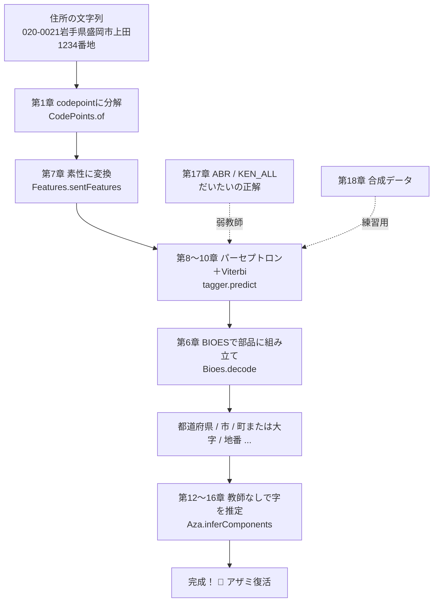
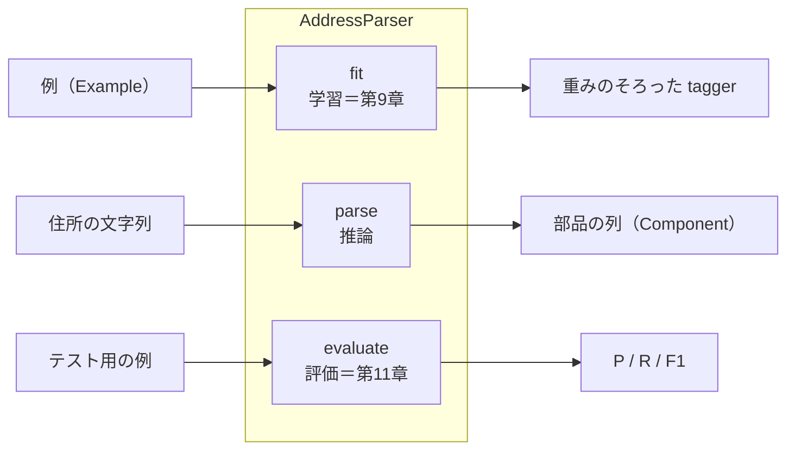
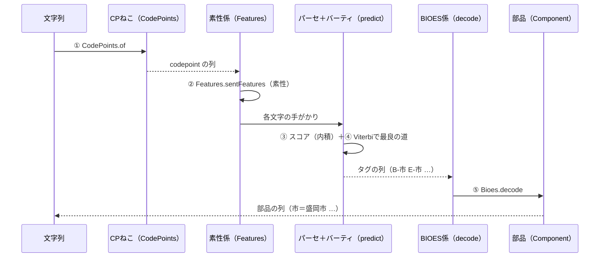
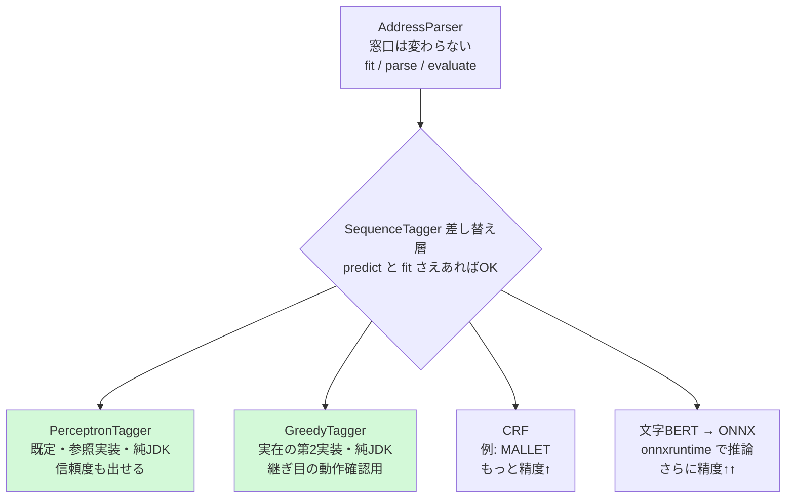

# 第19章　全部つなぐ：end-to-end と本番への差し替え

> **この章のゴール**
> - これまで学んだ部品が、`AddressParser` という1本の線でつながることが分かる
> - `parse` の流れ（文字列 → codepoint → 素性 → Viterbi → BIOES → 部品 → 字推定）を最初から最後まで追える
> - いまの実装は「動く参照実装」で、窓口を変えずに中身（tagger）だけ強くできる、という設計思想をつかむ

> **登場人物**：みどり先生、ツムギ、ゲンタ、アザミ、CPねこ、ポストくん、バーティ、パーセ（全員集合！）

---

## ついに、最終章

**ツムギ**：先生……ここまで長かった……！　第0章でアザミに会ってから、文字のしくみも、ベクトルも、log も、パーセプトロンも、Viterbi も、字の推定も、ぜんぶ……。

**みどり先生**：よくがんばったね。あわてない、あわてない——と言いつづけて、もう19章だ。
今日はね、**学んだ部品を、1本の線につなぐ**。それだけ。新しいむずかしい数式は、もう出てこないよ。

**ゲンタ**：つまり「組み立て」の回ってことか。……それ、意味あるの？　部品は全部わかってるんだろ。

**みどり先生**：いい「それ意味あるの？」だ。あるんだよ。
部品を知っているのと、**部品がどう連携して1つの仕事をするか**を知っているのは、別の理解なんだ。
車のエンジンとタイヤとハンドルを知っていても、「アクセルを踏むと、どの順で力が伝わって前に進むか」は別に説明できないとね。

**パーセ**：ぼくらマスコット全員、今日はそろい踏みだよ！

**バーティ**：いちばん良い道を、最後まで案内するよ！

**CPねこ**：codepoint から始まるにゃ。

**ポストくん**：ピッ、確認しました。データはわたしが運びます。

**アザミ**：……（だいぶ、はっきり見える姿で）……みんな、ありがとう。今日で、わたし……。

---

## まず、全体の地図をもう一度

**みどり先生**：第0章の README で見た「全体マップ」を覚えてる？　あれを、いまならぜんぶ読めるはずだ。もう一度ならべるよ。



**ツムギ**：あ……読める！　ぜんぶ、わたしたちが通ってきた章だ！

**みどり先生**：そう。今日の主役は、この図のまんなかを縦に貫く窓口クラス、**`AddressParser`（アドレスパーサ）**だ。
これが、君たちが学んだ部品を**順番に呼び出す司令塔**なんだよ。

---

## 窓口クラス `AddressParser` の3つの仕事

**みどり先生**：`AddressParser` がやることは、たった3つ。**学習・推論・評価**だ。



**ゲンタ**：`fit`・`parse`・`evaluate`……。学習して、使って、採点する。人間が勉強するのと同じ流れだな。

**みどり先生**：まさに。コードもおどろくほど短い。本物を見てみよう。

```java
// AddressParser.java — クラスの骨格
public final class AddressParser {
    private final PerceptronTagger tagger = new PerceptronTagger();   // 心臓部（第8〜10章）

    public AddressParser fit(List<Example> data, int epochs) { tagger.fit(data, epochs); return this; }
    public AddressParser fit(List<Example> data) { return fit(data, 8); }   // 既定は8エポック
    // ... parse と evaluate は後で
}
```

**ツムギ**：`PerceptronTagger tagger` を中に1個持ってるだけ……？

**みどり先生**：そう。**`AddressParser` 自身は、ほとんど何も計算しない**。
重い仕事は全部 `tagger`（パーセプトロン＋Viterbi）に任せて、自分は「入口・出口の整形係」をやるんだ。これがあとで効いてくるよ（差し替えの話でね）。

**パーセ**：`fit` がぼくの出番！　第9章でやった「まちがえて、直して、平均化」を、`epochs`（エポック＝データを何周するか）の回数ぶん回すんだ。

---

## `parse` の流れ：5つの部品が、バケツリレーする

**みどり先生**：さあ、いちばん見たかったところ。**`parse`（パース＝解析）**だ。文字列を入れると、部品の列が返ってくる。本物のコードはこれだけ。

```java
// AddressParser.parse — たった5行！
public List<Component> parse(String text) {
    List<String> chars = CodePoints.of(text);              // ① 第1章 codepoint列に
    List<String> tags  = tagger.predict(chars);            // ②③④ 第7章素性＋第8〜10章Viterbi
    List<Component> out = new ArrayList<>();
    for (String[] tl : Bioes.decode(chars, tags))          // ⑤ 第6章 BIOESを部品に戻す
        out.add(new Component(tl[1], tl[0]));              //    Component（ラベル, 表層）
    return out;
}
```

**ゲンタ**：5行……？　あれだけ勉強したのに、本体5行？

**みどり先生**：5行に**全部の章が詰まっている**んだよ。1行ずつ、バケツリレーを追ってみよう。



### ① `CodePoints.of` ＝ 文字を正しく1個ずつに（第1章）

**CPねこ**：まずはぼくにゃ。文字列をうけとって、**codepoint（コードポイント）単位**でならべ直す。
「てんてん（濁点）」や「しっぽが2本（サロゲートペア）」も、ちゃんと1個ずつ正しく数えるにゃ。`char` で切ると壊れる字も、ここで守られるにゃ。

**ツムギ**：第1章だ！　「ﾞ（てんてん）」とか外字とか、コンピュータは油断すると変な数え方するんだったよね。

### ②③④ `tagger.predict` ＝ 素性＋スコア＋Viterbi（第7〜10章）

**みどり先生**：`predict`（プレディクト＝予測）の中で、3つのことが一気に起きる。

**パーセ**：まず ② `Features.sentFeatures` で、文字1個ずつを**手がかり（素性、そせい、features）**に変える。「いまの文字は漢字」「直前は『県』」みたいなオン/オフのならびだ（第7章）。

**パーセ**：次に ③ ぼくが、手がかりとラベルごとの重みの**内積**でスコアを出す（第4章・第8章）。「ここは市っぽい度 8.2点」みたいにね。

**バーティ**：そして ④ ぼくの出番！　1文字ずつバラバラに「いちばん点が高いラベル」を選ぶと、「県の次にいきなり号」みたいな**ヘンな並び**ができちゃう。
だからぼくが**文全体でいちばん良い道**を一瞬で見つける。`B-市` の次は `E-市` か `I-市` しか許さない、という**遷移の合法性マスク**つきでね（第10章）。ズルじゃないよ、かしこいだけ！

### ⑤ `Bioes.decode` ＝ 旗を、部品に戻す（第6章）

**みどり先生**：`tagger` が返すのは `B-市 E-市 B-町または大字 …` みたいな**旗（BIOES）の列**。
これを `Bioes.decode` が読んで、「`B`（始め）から `E`（終わり）まで」を1かたまりにまとめ、`Component`（コンポーネント＝部品）に戻す。

**ツムギ**：B(始め)・I(中)・E(終わり)・S(単独)・O(外)！　第6章で旗を立てたやつ！

**みどり先生**：そう。`Component(tl[1], tl[0])` の `tl[1]` がラベル（「市」）、`tl[0]` が表層文字（「盛岡市」）。
これで、文字列が**意味のかたまりの列**になって返ってくる。`parse` 完成だ。

---

## さらに細かく：`Aza` で字を切り出す（第12〜16章）

**ツムギ**：でも先生、`parse` だと「町または大字」が大きいかたまりのまま出てきますよね。アザミの「字」は……？

**アザミ**：……そうなの。`parse` は、わたしを「町または大字」の中に閉じこめたままなの……。

**みどり先生**：そこで、最後のひと押し。**`Aza`（あざ）**の登場だ。第12〜16章でやった、**教師なしの字推定**。
`parse` が切り出した「町または大字」のかたまりを受けとって、その中をさらに**大字／字／地番**に割る。

```java
// Aza.inferComponents — 教師ラベルを一切使わずに字を切り出す
public static List<Component> inferComponents(String text, Set<String> oazaDict, AzaInducer inducer) {
    String[] p = peel(text, oazaDict);                 // 第12章 残差スロット：大字・残り・末尾数字に剥がす
    List<Component> comps = new ArrayList<>();
    if (!p[0].isEmpty()) comps.add(new Component("町または大字", p[0]));
    String name = MARK.matcher(p[1]).replaceFirst("");  // 頭の「大字/字」マークを外す
    if (!name.isEmpty())
        for (String piece : inducer.segment(name))      // 第13〜16章 誘導字彙＋言語モデルで最尤分割
            comps.add(new Component("字小字", piece));
    if (!p[2].isEmpty()) comps.add(new Component("地番", p[2]));  // 末尾数字＝地番
    return comps;
}
```

**みどり先生**：`peel`（ピール＝皮をむく）が、まず**残差スロット**を作る（第12章）。
辞書にある大字を頭から剥がし、末尾の数字（`番地`・`号`・`丁目`…）を地番として剥がす。**残ったまんなかが「字の候補」**だ。

**バーティ**：そして `inducer.segment` で、また**ぼくの仲間（Viterbi）**が、いちばんありそうな切り方を選ぶ。
ただし今度は教師ラベルがないから、**分岐エントロピー（第13章）・PMI（第14章）・言語モデル（第15章）**から作った「誘導字彙（ゆうどうじい）」を頼りにするんだ。

**アザミ**：……ここが、わたしのための章……。だれもラベルをくれなかったわたしを、データのかたよりだけで見つけてくれた場所……。

**ゲンタ**：`parse`（教師ありの本線）と `Aza`（教師なしの仕上げ）、役割がきっちり分かれてるんだな。納得した。

---

## いまの実装は「動く参照実装」：本番への差し替え

**ゲンタ**：先生。正直に聞くけど、このパーセプトロン、本番で最強なの？

**みどり先生**：いい質問だ。正直に答えると——**最強ではない**。いまの `PerceptronTagger` は「**動く参照実装（reference implementation）**」なんだ。

**ツムギ**：参照……実装？

**みどり先生**：「**しくみが全部見えて、依存ゼロで、ちゃんと動く、お手本**」って意味だよ。
このコース全体がそうだったろう？　ライブラリの中身がブラックボックスだと、君たちは学べない。だから kugiri は、わざと**純 JDK（＋ japanese-parser-common）だけ**で、全部を手で書いてある。

**みどり先生**：CLAUDE.md の設計原則を、かみくだくとこうだ。

> - **本体は軽いまま保つ**（純 JDK ＋ japanese-parser-common）。
> - **重い機械学習は、`tagger` という「差し替え層」だけに閉じこめる**。
> - **窓口（`AddressParser`）は変えずに、中身（`tagger`）だけ強くできる**。

**ゲンタ**：……あ。だから `AddressParser` は自分で計算せず、`tagger` に丸投げしてたのか。**入口と出口を固定**しておけば、中身を入れ替え放題ってことか。

**みどり先生**：その通り！　まさにそれが**差し替え（pluggable）**の発想だ。図にするよ。



**みどり先生**：そしてこの継ぎ目は、もう**口約束じゃなくて実物**だ。`tagger.SequenceTagger` という
インターフェース（`fit` と `predict` だけ）を切って、`AddressParser` はそれを受け取る形にしてある。
証拠に、純JDKの**第2実装 `GreedyTagger`**（Viterbiを使わず貪欲に切る別物）を差し込んでも、`parse` は
そのまま動く。`demo/TaggerSwapDemo` が両方を同じ API で走らせて見せる。

```bash
mvn -q exec:java -Dexec.mainClass=org.unlaxer.kugiri.demo.TaggerSwapDemo -Dstdout.encoding=UTF-8
# => Perceptron F1=0.9995（信頼度対応） / Greedy F1=0.9936（非対応）  どちらも同じ parse() で動く
```

**みどり先生**：だから将来、もっと強い切り方が欲しくなったら——
- **MALLET（マレット）の CRF**（条件付き確率場）。CRF は構造化パーセプトロンの「確率版の親戚」。
- あるいは **文字 BERT（バート）**を学習して **ONNX（オニックス）**に変換し、**onnxruntime** で推論。

——どれも `SequenceTagger` の別実装としてこの同じ穴に挿すだけ。重い依存はその実装にだけ入れて、
本体は純 JDK + jpc のまま保つ（手順は `docs/HANDOFF.md` の T5）。

**ツムギ**：中身がそんなに変わっても、`parse` の使い方は変わらない……！

**みどり先生**：そう。**窓口（`AddressParser`）は変えずに、中身（`SequenceTagger`）だけ強くできる**。
今日のあなたが学んだ「動く参照実装」は、明日のあなたが「CRF や BERT に差し替える」ための、**消えない設計図**なんだよ。

---

## アザミ、完全復活

**みどり先生**：さあ。第0章を思い出して。アザミは半透明だった。ラベルをもらえなかったから。
このコースで、君たちは何をした？

**ツムギ**：文字を codepoint で正しく数えて、素性にして、パーセプトロンとViterbiで切って、BIOESで部品にして……そして、**ラベルのない「字」を、教師なしで見つけた**！

**ゲンタ**：弱教師（ABR/KEN_ALL）と合成データで学習データまで自分でこしらえた。理屈は全部通った。意味、めちゃくちゃあったわ。

**アザミ**：……（光がはっきりと集まって、ついに、くっきりした姿で）……
みんな……見える……？　わたし、ちゃんと、見えてる……？

**ツムギ**：見える！　はっきり見える！　アザミ、こんな顔だったんだ……！

**CPねこ**：きれいに数え上げられたにゃ。

**ポストくん**：ピッ、確認しました。字、復活を確認しました。

**パーセ**：何回もまちがえて、何回も直したかいがあったね！

**バーティ**：いちばん良い道を、ちゃんと最後まで通れたよ！

**アザミ**：ありがとう……みんなが「なぜそう切れるのか」を、ひとつずつ分かってくれたから、わたし、戻ってこられたの。
これからは、もう半透明じゃないのよ。

**みどり先生**：おめでとう。これで、kugiri の全部がつながった。
あわてず、一歩ずつ。それで必ず着く、と言ったとおりだろう？

---

## 学んだことの一覧（旅のふり返り）

**みどり先生**：最後に、通ってきた道をならべておこう。これ全部、もう君たちの武器だ。

| 章 | 学んだこと | kugiri のどこ |
|---|---|---|
| 1 | codepoint で文字を正しく数える | `CodePoints` |
| 2 | 分類・文字種（ルール vs 学習） | `Features` の charType |
| 3〜5 | 確率・ベクトル・内積・log・情報量 | 道具箱 |
| A1 | 微分（少しずつ動かす理由） | 学習の裏づけ |
| 6 | 系列ラベリングと BIOES | `Hierarchy` `Labels` `Bioes` |
| 7 | 素性：手がかりを数字に | `Features.sentFeatures` |
| 8〜9 | パーセプトロン・構造化・平均化 | `PerceptronTagger.fit` |
| 10 | Viterbi（合法性マスク付き） | `PerceptronTagger.predict` |
| 11 | P / R / F1 で評価 | `AddressParser.evaluate` |
| 12 | 残差スロット（字の居場所） | `Aza.peel` |
| 13〜16 | 分岐エントロピー・PMI・言語モデル・最尤分割 | `AzaInducer` |
| 17 | 弱教師（ABR / KEN_ALL） | `Abr` `KenAll` `Csv` |
| 18 | 合成データと「精度1.000を信じない」 | `Synth` |
| **19** | **全部つなぐ・本番への差し替え** | **`AddressParser` `Aza` `demo/*`** |

---

## 手を動かそう：3つのデモを全部動かして、章と対応づける

**みどり先生**：最後の宿題だ。3つのデモを**全部動かして**、各章で学んだしくみがどこで効いているか、自分の言葉で対応づけてみよう。

```bash
mvn -q compile
mvn -q exec:java -Dexec.mainClass=org.unlaxer.kugiri.demo.SynthDemo -Dstdout.encoding=UTF-8  # 合成 end-to-end
mvn -q exec:java -Dexec.mainClass=org.unlaxer.kugiri.demo.AbrDemo  -Dstdout.encoding=UTF-8   # KEN_ALL→ABR 弱教師
mvn -q exec:java -Dexec.mainClass=org.unlaxer.kugiri.demo.AzaDemo  -Dstdout.encoding=UTF-8   # 教師なし字推定
```

### ① `SynthDemo` ＝ 本線の総まとめ（第18章 → 第6〜11章）

```java
// SynthDemo.java（ほぼ全文）
List<Example> train = Synth.makeDataset(1500, 1);   // 第18章 合成データを学習用に
List<Example> test  = Synth.makeDataset(300, 99);   //          別の種で評価用に
AddressParser p = new AddressParser().fit(train, 8); // 第9章 学習（8エポック）
System.out.println(p.evaluate(test));                // 第11章 P/R/F1で採点
for (String s : samples) for (Component c : p.parse(s)) ...  // parse の実演（第1〜6章）
```

**対応づけ**：`makeDataset` ＝第18章、`fit` ＝第8〜9章、`evaluate` ＝第11章、`parse` ＝第1章（codepoint）→第7章（素性）→第8〜10章（Viterbi）→第6章（BIOES）。

> ⚠️ **大事な釘**：このデモの `tag accuracy = 1.0000` を見ても、**ぬか喜びしないこと！**
> 合成データは規則が単純すぎて、機械にとって「カンニング楽勝」なんだ（第18章）。
> **実力は、本物のデータの hold-out（取り置き）で測る**。1.000 は実力ではない。

### ② `AbrDemo` ＝ 学習データの供給源・弱教師（第17章）

**対応づけ**：ポストくんが運ぶ `KEN_ALL.CSV` を読み（`Csv` `KenAll`）、`Abr` が「都道府県/市/区/群+町村」に**だいたいの正解（弱教師）**として割り振る。これが本線 `fit` の燃料になる。

### ③ `AzaDemo` ＝ アザミ本人・教師なし字推定（第12〜16章）

**対応づけ**：`Aza.peel` で残差スロット（第12章）→ `AzaInducer` の分岐エントロピー・PMI・言語モデル（第13〜16章）で字を分割。**教師ラベルゼロ**でここまでやる、という物語のクライマックス。

**ゲンタ**：3つ動かしたら、図のどの矢印がどのデモかピタッと分かったわ。`AbrDemo`/`SynthDemo` が学習データを供給して、`SynthDemo` が本線、`AzaDemo` が仕上げ。

---

## 今日のまとめ

- `AddressParser` は窓口クラス。仕事は3つ＝**`fit`（学習・第9章）/ `parse`（推論）/ `evaluate`（評価・第11章）**。
- `parse` はたった5行で全章を呼ぶ：**`CodePoints.of`（第1章）→ 素性（第7章）→ `predict`＝内積＋Viterbi（第8〜10章）→ `Bioes.decode`（第6章）→ `Component`**。
- `Aza.inferComponents` が「町または大字」の中を、**教師なし**でさらに大字／字／地番に割る（第12〜16章）。
- 学習データは**弱教師（ABR/KEN_ALL・第17章）**と**合成（第18章）**が供給する。
- いまの `PerceptronTagger` は「**動く参照実装**」。本体は軽く保ち、重いMLは **`tagger` 差し替え層**に閉じこめる。窓口を変えずに、将来 **CRF（MALLET）や文字BERT（ONNX＋onnxruntime）**へ差し替え可能。

---

## アザミメーター

```
アザミの見え具合：██████████ 100%
（コメント：完全復活！　文字から字推定まで、一本の線で全部つながった。アザミ、もう半透明じゃない。おかえり！）
```

---

## 次回予告

**みどり先生**：**本編（メインの物語）は、これでおしまい**。アザミは復活した。よくやった。

**ツムギ**：やりきった〜！

**みどり先生**：このコースを読み終えた君は、もう **kugiri のメンテナー**だよ。
全ソースが「なぜそう書いてあるか」説明できる。設計の全体像は [`../DESIGN.md`](../DESIGN.md)、
やることリストは [`../HANDOFF.md`](../HANDOFF.md) に書いてある。

**ゲンタ**：……で、先生。HANDOFF にあった「self-training」とか「CRF」とか、あれ結局どうなったの？

**みどり先生**：いい食いつきだ。じつは **もう実装してある**。だからここからは **発展編（Part 6）**——
復activしたアザミを「もっと賢く・もっと強く」する techniques を2つ紹介しよう。
**少しの正解＋大量の未ラベル**で伸ばす **self-training**（第20章）と、
**頭は分かるけど尻尾は分からない**住所から学ぶ **部分ラベル学習＝partial-CRF 近似**（第21章）だ。

**アザミ**：……次に困っている「ラベルのない子」がいたら、今度はあなたが助けてあげてね。

**みどり先生**：あわてない、あわてない。——よくここまで来た。発展編へ、いってみよう。

[← 第18章](18-synth-data.md) ・ [第20章 →](20-self-training.md)
