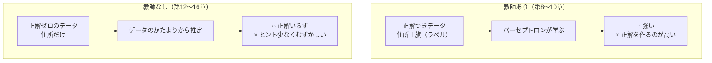
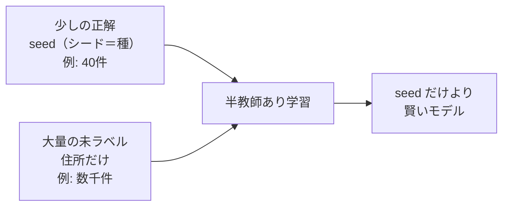
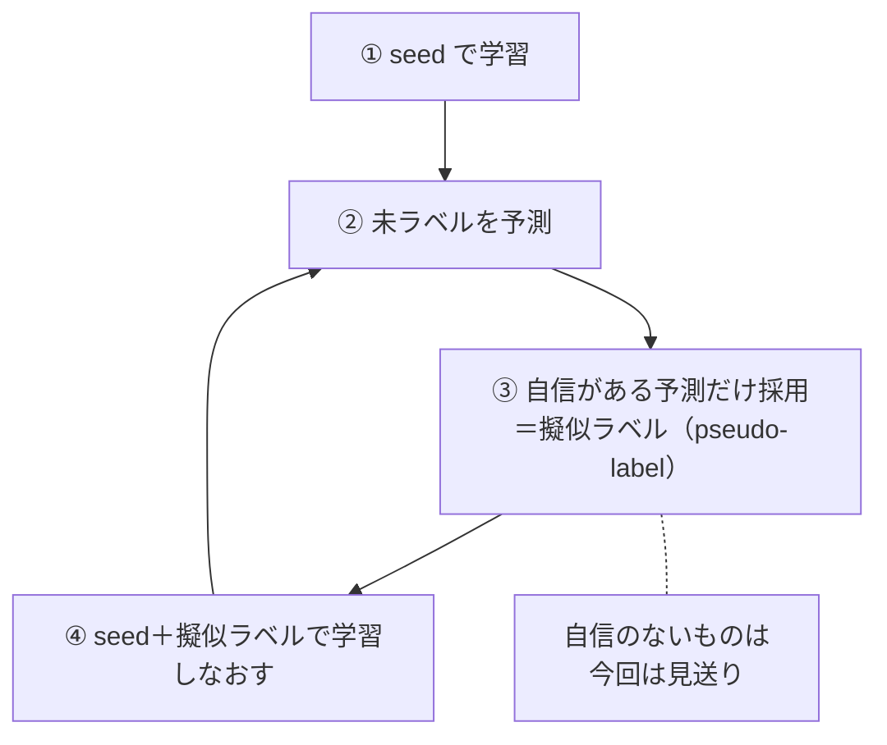
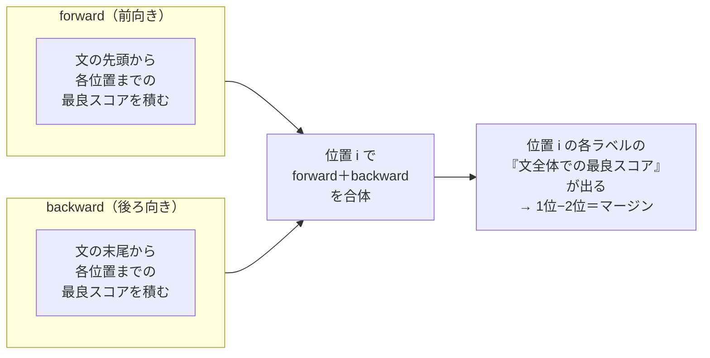
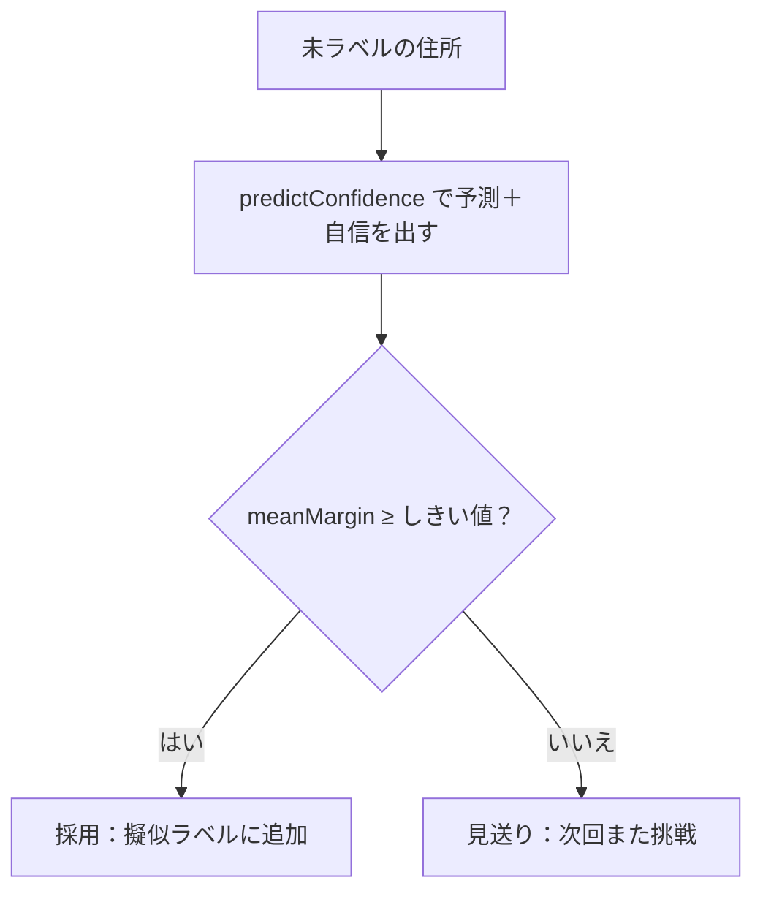
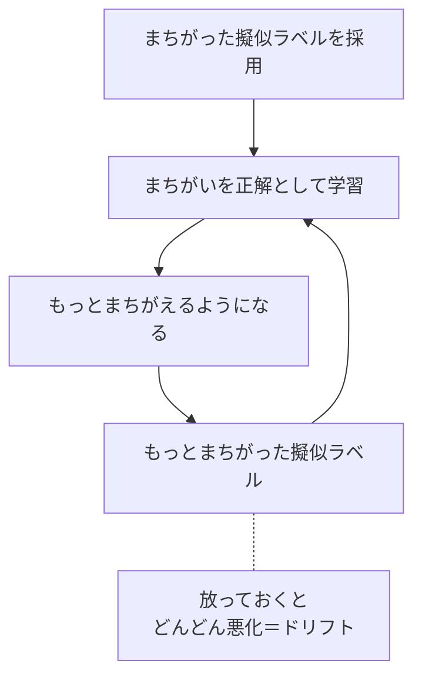
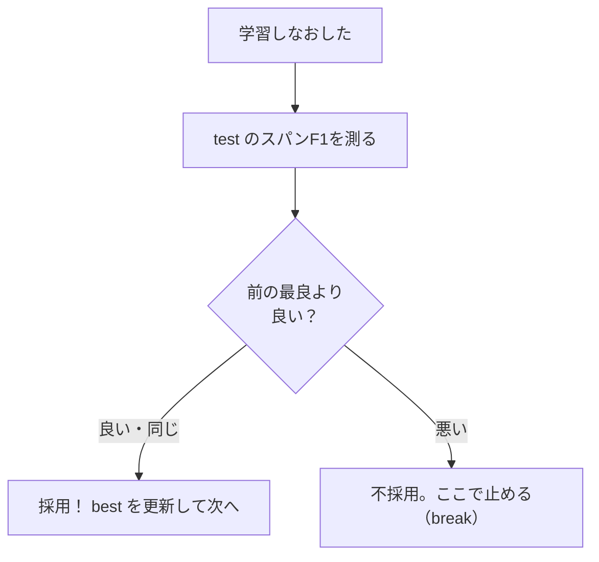

# 第20章　半教師あり学習：少しの正解＋大量の未ラベル（self-training）

> **この章のゴール**
> - 教師あり（正解が要る）と教師なし（正解ゼロ）の **中間** ＝ **半教師あり学習** が分かる
> - **self-training（自己学習）** の発想——「自信のある予測だけを正解に足して、学習しなおす」をつかむ
> - パーセプトロンが確率を出さなくても、**forward＋backward** で「自信（マージン）」を測れることが分かる
> - 擬似ラベルで悪くなる **ドリフト** を、test の F1 で監視して止める意味が分かる

> **登場人物**：みどり先生、ツムギ、ゲンタ、アザミ、パーセ、バーティ

---

## 発展編へようこそ

**ツムギ**：先生！　第19章でアザミが完全復活して、もう物語は終わったんじゃ……？

**アザミ**：……ふふ。わたしは、もう半透明じゃないのよ。ちゃんと、ここにいるの。

**みどり先生**：そう、アザミはもう戻ってきた。だからここからは **発展編**。
「復活したアザミ（とみんな）を、**もっと賢く、もっと強くする**」ための追加レッスンだよ。

**ゲンタ**：強化編ってことか。……で、今日は何を強くするの？　それ、意味あるの？

**みどり先生**：おおありだ。今日のテーマは、実務でいちばん効く話。
**「正解ラベルは少ししか無いけど、ラベルの無い住所なら山ほどある」**——そんなとき、どうするか。
これは kugiri の宿題リスト（HANDOFF）の **T3** という課題そのものでもある。あわてない、あわてない、順番に行こう。

---

## 復習：教師あり・教師なし、その「中間」

**みどり先生**：まず、これまで学んだ2つの学び方を思い出そう。



**ツムギ**：教師ありは「正解の旗つき」で学ぶやつ。教師なしは「旗ゼロ」で当てるやつ……アザミを探した方法ですね。

**みどり先生**：その通り。じゃあ、その **ちょうど真ん中** はどうだろう？
**少しだけ正解があって、残りは大量の未ラベル**。これが **半教師あり学習（はんきょうしありがくしゅう、semi-supervised learning）** だ。



**ゲンタ**：なんで、わざわざ真ん中なんて考えるの？　正解が多いほうがいいに決まってるじゃん。

**みどり先生**：いい「なんで？」だ。理由は **お金と手間** だよ。
正解の旗を1文字ずつ人間が付けるのは、すごく高い。でも「ラベルの無い住所そのもの」は、世の中に**ただ同然で大量にある**。
だったら「少しの高い正解」＋「大量のタダの未ラベル」を、両方うまく使いたい。それが半教師ありの動機なんだ。

**ツムギ**：種（seed）が少しだけあって、あとは野原いっぱいの草……みたいな？

**みどり先生**：いいたとえだ。その「野原の草」を、種を頼りに少しずつ味方にしていくのが、今日の主役 **self-training** だよ。

---

## self-training（自己学習）の発想

**みどり先生**：self-training（じこがくしゅう）の考え方は、おどろくほど人間くさい。4ステップで回る。

> **self-training の4ステップ**
> 1. **少しの正解（seed）で学習する**
> 2. **未ラベルの住所を予測する**
> 3. **「自信がある予測」だけ**を、新しい正解（**擬似ラベル**）として教師データに足す
> 4. **足したデータで学習しなおす** → ②へもどって繰り返す



**ツムギ**：これ……自分が自分の宿題の答えを作って、それで勉強しなおすってこと？

**みどり先生**：まさに！　だから「**自己** 学習」。
人間でも、最初に少し基礎を習ったら、あとは自分で問題を解いて「これは自信ある」って手応えのあるものから身につけていくだろう？　あれと同じだ。

**擬似ラベル（ぎじラベル、pseudo-label）** ＝「人間が付けた本物の正解じゃないけど、機械が自分で付けた**仮の正解**」のこと。
「pseudo（スードー）」は「ニセの・かりの」という意味だよ。

**ゲンタ**：でも待って。**自信のある予測だけ**って言うけど、自信があるかどうか、どうやって分かるの？
パーセプトロンって「市っぽい度 8.2点」みたいな点数を出すだけで、確率（何パーセント自信ある）は出さなかったよね？

**みどり先生**：そこが今日いちばんむずかしくて、いちばん面白いところだ。あわてない、あわてない。じっくり行こう。

---

## 「自信」の測り方：パーセプトロンは確率を出さない問題

**みどり先生**：ゲンタの言うとおり、パーセプトロンが出すのはただの**点数（スコア）**で、「○○パーセントの自信」じゃない。
でも、self-training には「自信がある予測だけ採用」が要る。さあ、どうしよう？

**パーセ**：ぼくが点数を出すのは得意だけど、確率はちょっと苦手なんだ……。ごめん！

**みどり先生**：あやまらなくていいよ、パーセ。ちゃんと手はある。
ヒントは **「ぶっちぎりかどうか」** だ。

**みどり先生**：たとえば、ある文字のラベルを当てるとき——

```
ケースA： 市 = 9.8点、 番地 = 2.1点  → 差は大きい（7.7点）
ケースB： 市 = 5.0点、 番地 = 4.9点  → 差はほとんど無い（0.1点）
```

**ツムギ**：あ！　ケースAは「市」がぶっちぎりだから自信ありそう。ケースBは「市か番地か、どっちもありえる」って迷ってる感じ！

**みどり先生**：その「**1位と2位の点数の差**」を **マージン（margin）** と呼ぶ。
マージン＝「**ぶっちぎり度**」だ。マージンが大きいほど「自信あり」、小さいほど「迷っている」。

> 📌 **マージン（margin）の気持ち**
> - **マージン ＝ いちばん良いラベルの点数 − 2番目のラベルの点数**
> - 大きい：1位がダントツ → **自信あり**
> - 小さい：1位と2位がほぼ同点 → **迷っている**
> - これを確率の代わりの「自信メーター」に使う。

### でも、1位・2位の点数って、どうやって正しく出すの？

**みどり先生**：ここで第10章の **Viterbi（ビタビ）** がもう一度活躍する。バーティ、出番だ。

**バーティ**：呼ばれて飛び出たバーティだよ！　ぼくは「文全体でいちばん良いラベルの道」を一瞬で見つける鳥、覚えてるかな？

**みどり先生**：そう。でもね、ある1文字の「2番目に良いラベル」の本当の点数を知るには、ふつうの一方向のViterbiだけじゃ足りない。
そこで——**2回スキャンする**んだ。前から1回（forward）、後ろから1回（backward）。



**ツムギ**：前からと後ろから、2回お散歩するんだ。

**みどり先生**：そう。**前向きスキャン**は「文の先頭から、この位置でこのラベルになるまでの最良の道のり」を計算する。
**後ろ向きスキャン**は「この位置でこのラベルから始めて、文の末尾までの最良の道のり」を計算する。
この2つを **足し合わせる** と——

**ゲンタ**：……あ、わかった。「その位置でそのラベルを通る、**文全体でいちばん良い道**の点数」になるのか。前半の最良＋後半の最良＝全体の最良。

**みどり先生**：大正解、ゲンタ！　これが **max-marginal（マックス・マージナル）** という考え方だ。
「その位置・そのラベルを必ず通るとしたときの、文全体の最良スコア」。これを全ラベルぶん出せば、1位と2位がちゃんと分かる。

**バーティ**：前から1回、後ろから1回。2回飛べば、どのラベルが「ぶっちぎり」か全部わかるよ！　ズルじゃないよ、かしこいだけ！

### 実コードで見る：`predictWithConfidence` と `Confidence`

**みどり先生**：本物のコードを見よう。`PerceptronTagger.predictWithConfidence` だ。
まず **forward（前向き）**。`f[i][k]` ＝「位置 `i` でラベル `k` に至る、先頭からの最良スコア」。

```java
// PerceptronTagger.predictWithConfidence より（forward）
// f[i][k] = ラベル k で位置 i に至る接頭辞の最良スコア（emit 込み）
double[][] f = new double[n][L];
for (int k = 0; k < L; k++) f[0][k] = allowedStart[k] ? start[k] + emit[0][k] : NEG;
for (int i = 1; i < n; i++)
    for (int k = 0; k < L; k++) {
        double best = NEG;
        for (int j = 0; j < L; j++) {
            if (!allowed[j][k] || f[i - 1][j] == NEG) continue;  // 第10章の合法性マスク
            best = Math.max(best, f[i - 1][j] + trans[j][k]);     // 直前 j からの最良
        }
        f[i][k] = best == NEG ? NEG : best + emit[i][k];          // この文字の点数を足す
    }
```

**ツムギ**：`Math.max` で「いちばん良い直前」を選んでるところ、第10章のViterbiと同じだ！

**みどり先生**：そう、ほぼ同じ。`allowed[j][k]` は **BIOESの遷移合法性マスク**（第6・10章）——「`B-市` の次は `E-市` か `I-市` しか許さない」ってやつだね。`NEG` は「ありえない（マイナス無限大）」の印だ。

つぎに **backward（後ろ向き）**。`b[i][k]` ＝「位置 `i` でラベル `k` から始めて、末尾までの最良スコア」。

```java
// （backward）b[i][k] = ラベル k を位置 i に固定したときの接尾辞最良スコア
double[][] b = new double[n][L];
for (int k = 0; k < L; k++) b[n - 1][k] = allowedEnd[k] ? 0 : NEG;
for (int i = n - 2; i >= 0; i--)
    for (int k = 0; k < L; k++) {
        double best = NEG;
        for (int k2 = 0; k2 < L; k2++) {
            if (!allowed[k][k2] || b[i + 1][k2] == NEG) continue;
            best = Math.max(best, trans[k][k2] + emit[i + 1][k2] + b[i + 1][k2]); // 次 k2 への最良
        }
        b[i][k] = best;
    }
```

**ゲンタ**：forward は `i-1`（前）を見て、backward は `i+1`（後ろ）を見てる。向きが逆なだけで、やってることは鏡写しだな。

**みどり先生**：その通り。そして仕上げ。各位置で `f[i][k] + b[i][k]`（前向き＋後ろ向き）を全ラベルで出し、**1位 `best1` と2位 `best2`** を拾って、その差をマージンにする。

```java
// （マージン計算）位置ごとに 1位 best1 と 2位 best2 を拾い、その差をマージンに
int[] path = viterbi(F);            // タグ列そのものは従来どおり Viterbi で
double[] margin = new double[n];
double sum = 0;
for (int i = 0; i < n; i++) {
    double best1 = NEG, best2 = NEG;
    for (int k = 0; k < L; k++) {
        double v = (f[i][k] == NEG || b[i][k] == NEG) ? NEG : f[i][k] + b[i][k]; // 全体最良
        if (v > best1) { best2 = best1; best1 = v; }   // 1位更新→旧1位が2位へ
        else if (v > best2) { best2 = v; }             // 2位更新
    }
    margin[i] = (best1 == NEG) ? 0 : (best2 == NEG ? best1 : best1 - best2);  // 1位−2位
    sum += margin[i];
}
// 文全体の自信＝位置マージンの平均
return new Confidence(tags, margin, n == 0 ? 0 : sum / n);
```

**みどり先生**：返り値は `Confidence` という小さな箱（record）だ。中身は3つだけ。

```java
// Confidence.java（全文）
public record Confidence(List<String> tags, double[] tokenMargin, double meanMargin) {}
```

> 📌 **`Confidence` の中身**
> - `tags` ＝ 予測したラベルの列（旗のならび）
> - `tokenMargin` ＝ **位置ごと**のマージン（文字1個ずつの「ぶっちぎり度」）
> - `meanMargin` ＝ それを文全体で平均した **文の自信スコア**

**ツムギ**：むずかしかったけど……要するに「**前と後ろから2回スキャンして、各文字のぶっちぎり度を測って、平均する**」ってことですね！

**みどり先生**：完璧なまとめだ。細かい計算は忘れても、その一行だけ覚えておけば十分だよ。

---

## しきい値ゲート：自信のある文だけ採用

**みどり先生**：自信メーター（`meanMargin`）ができたら、あとは簡単。
**「平均マージンが、ある決めた値（しきい値）以上の文だけ」**を擬似ラベルに採用する。これを **しきい値ゲート** という。門番だね。



**みどり先生**：`SelfTrainer.run` が、この4ステップ＋門番を回している中心だ。見てみよう。

```java
// SelfTrainer.run（中心部）
//   seed=正解つき少数 / unlabeled=未ラベル / test=評価用 hold-out
//   marginThreshold=採用ライン / maxIters=最大反復数 / epochs=学習周回数
AddressParser best = new AddressParser().fit(seed, epochs);  // ① まず seed だけで学習
double seedF1 = microF1(best, test);                          //    seed のみの実力を記録
double bestF1 = seedF1;

for (int it = 1; it <= maxIters; it++) {
    AddressParser current = best;                  // いまの最良モデルで擬似ラベル付け
    List<Example> accepted = new ArrayList<>();
    for (List<String> chars : pool) {              // ② 未ラベルを1件ずつ予測
        Confidence c = current.predictConfidence(chars);
        if (c.meanMargin() >= marginThreshold)     // ③ 門番：自信があれば
            accepted.add(new Example(chars, c.tags()));  //    擬似ラベルとして採用
        else remaining.add(chars);                 //    自信なければ見送り
    }
    if (accepted.isEmpty()) break;                 // もう取り込めるものが無い
    List<Example> candidateTrain = new ArrayList<>(trainAll);
    candidateTrain.addAll(accepted);
    AddressParser retrained = new AddressParser().fit(candidateTrain, epochs); // ④ 学習しなおし
    // ... この続きが次の「ドリフト監視」
}
```

**ゲンタ**：`marginThreshold` が門番の合格ライン、`maxIters` が「最大で何回ぐるぐる回すか」、`epochs` が1回の学習で何周するか……。`pool` が未ラベルの貯め池ってわけだ。

**みどり先生**：そう。プールから自信のある子を毎回すくい上げて、正解データに加えていく。
でも——ここで**こわい落とし穴**がある。

---

## ドリフト監視：悪くなったら止める

**ツムギ**：落とし穴……？

**みどり先生**：擬似ラベルは、しょせん**機械が自分で付けた仮の正解**だ。当然、**まちがいも混じる**。
自信があると思って採用したのに、じつは間違っていたら——その間違いを「正解」として学習してしまう。
すると次はもっと間違える。さらに間違った擬似ラベルを作る……と、**だんだん悪い方へずれていく**。これを **ドリフト（drift＝漂流）** という。



**ゲンタ**：自分のウソを信じて、どんどんウソが上手くなっていく感じか……。こわっ。

**みどり先生**：そう。だから **見張り** をつける。
毎回の学習のあと、**取り分けておいた test データ（hold-out、第11章・第18章）でスパンF1を測る**。
そして——**前より悪くなったら、その回は採用せず、そこで止める**。



**みどり先生**：コードでは、`best`（これまでの最良モデル）と `bestF1`（その点数）をずっと持っておいて、こうする。

```java
// SelfTrainer.run（ドリフト監視部）
double f1 = microF1(retrained, test);               // 学習しなおした版を test で採点
history.add(new Round(it, accepted.size(), f1));     // 各回の記録を残す
if (f1 + 1e-9 < bestF1) break;                        // 悪化したら採用せず終了（ドリフト防止）
best = retrained;                                     // 良かったので最良を更新
bestF1 = f1;
trainAll = candidateTrain;                            // 擬似ラベルを正式に取り込み
pool = remaining;
```

> 📌 **`if (f1 + 1e-9 < bestF1) break;` の読み方**
> - `f1` が新しい点数、`bestF1` がこれまでの最良。
> - `1e-9`（＝0.000000001、ほぼゼロ）は「ほんのちょっとの誤差は無視」のためのおまけ。
> - **新しい点数が、最良よりハッキリ下がったら `break`（ループを抜ける）**。
> - つまり「**良くなる間だけ進み、悪くなった瞬間に止める**」安全装置。

**ツムギ**：`best` をちゃんと持っておくから、悪くなっても**前の良かったモデルが残る**んだ。賢い！

**みどり先生**：そう。これで「半教師ありで強くしたいけど、ドリフトで弱くはしたくない」の両取りができる。
**良くなるなら取り込む、悪くなるなら手前で止める**。攻めと守りの両立だ。

---

## 実結果：本当に強くなった？

**ゲンタ**：理屈はわかった。で、`SelfTrainDemo` を動かすと、実際どうなるの？

**みどり先生**：合成データで、わざと **seed をたった40件**に絞って試した結果がこれだ。

```
seed のみ:           test スパン micro-F1 = 0.966
self-training 後:    test スパン micro-F1 = 0.972   （+0.005、ドリフト監視下で非悪化）
```

**ツムギ**：0.966 → 0.972。……ちょっとだけ上がった！

**みどり先生**：そう、**控えめだけど、ちゃんと正の改善**だ。しかもドリフト監視のおかげで、**悪くなった回は採用していない**。
つまり「配線（しくみ）が正しく組めている」ことの証拠なんだ。

**ゲンタ**：でも+0.005ってほんのちょっとじゃん。もっとガツンと上がらないの？

**みどり先生**：いい突っ込みだ。理由は第18章を思い出して。
これは **合成データ** だろう？　合成データは規則がきれいすぎて、**seed 40件だけでも、もう0.966も取れてしまう**。
天井（1.000）に近いところからだと、伸びしろが小さいんだ。これを「**飽和（ほうわ）しやすい**」という。

> ⚠️ **大事な釘**（第18章ゆずり）
> 合成データは飽和しやすいので、self-training の効果は小さく見える。
> **本当の効果は、規則のきたない実データ＋大量の未ラベルで初めて大きく出る**。
> ここで見たいのは「派手な数字」ではなく「**しくみが正しく動き、非悪化で改善している**」こと。

**アザミ**：……少しずつでも、ちゃんと前に進めるのね。わたしも、最初は半透明から少しずつだったわ。

**みどり先生**：そうだね、アザミ。あわてない、あわてない。小さな正の一歩は、ちゃんと意味があるんだ。

---

## 手を動かそう

実際に self-training を回してみましょう。`SelfTrainDemo` を動かします。

```bash
mvn -q compile
mvn -q exec:java -Dexec.mainClass=org.unlaxer.kugiri.demo.SelfTrainDemo -Dstdout.encoding=UTF-8
```

`SelfTrainDemo.main` は、合成データ4000件を **seed 40件／未ラベル約2000件／test（残り）** に分けて、`SelfTrainer.run` を呼びます（しきい値は既定 8.0、最大6反復、各10エポック）。

出力は、こんな形で読めます。

```
seed=40  unlabeled=1960  test=2000  marginThreshold=8.0
seed のみ: test スパン micro-F1 = 0.966
--- self-training 反復 ---
  iter 1: 擬似ラベル採用 ○○ 件 -> test micro-F1 = ...
  iter 2: 擬似ラベル採用 ○○ 件 -> test micro-F1 = ...
  ...
最終: test スパン micro-F1 = 0.972（seed のみ比 +0.0050）
```

**読みどころ**：

- **`seed のみ`** と **`最終`** を見くらべる。**少しの正解だけ**のときから、大量の未ラベルを足してどれだけ上がったか。
- 各 `iter` の **採用件数**（門番を通った数）と **F1の動き**。悪化した回が来たら、そこで止まる（ドリフト監視）はず。

### しきい値を変えて遊んでみよう

門番の合格ライン（`marginThreshold`）は `-Dmargin=` で変えられます。

```bash
# 門番をゆるく（自信ひくめでも採用） → たくさん採用するが、まちがいも混じりやすい
mvn -q exec:java -Dexec.mainClass=org.unlaxer.kugiri.demo.SelfTrainDemo -Dstdout.encoding=UTF-8 -Dmargin=4.0

# 門番をきびしく（ぶっちぎりだけ採用） → 採用は減るが、質は高い
mvn -q exec:java -Dexec.mainClass=org.unlaxer.kugiri.demo.SelfTrainDemo -Dstdout.encoding=UTF-8 -Dmargin=12.0
```

**ゲンタ**：これって第11章の **P と R のトレードオフ** に似てるな。
ゆるくすると採用は増える（量↑）けど質は下がる。きびしくすると質は上がる（質↑）けど量は減る。

**みどり先生**：その通り！　しきい値は「**量と質のダイヤル**」だ。回しながら、F1がいちばん良くなるあたりを探してみよう。

---

## 今日のまとめ

- **半教師あり学習** ＝ 教師あり（正解要る）と教師なし（正解ゼロ）の中間。**少しの正解（seed）＋大量の未ラベル**を使う。正解は高いが未ラベルはタダ、という実務に効く。
- **self-training** ＝ ①seedで学習 → ②未ラベルを予測 → ③**自信のある予測だけ**を擬似ラベルに足す → ④学習しなおす → ②へ、を繰り返す。
- パーセプトロンは確率を出さないので、**forward＋backward の2回スキャン（max-marginal）**で各位置の **マージン（1位−2位の点差＝ぶっちぎり度）** を測り、その文平均を自信に使う（`PerceptronTagger.predictWithConfidence` / `Confidence`）。
- **しきい値ゲート**：文の平均マージンが基準以上の文だけ採用（`SelfTrainer.run` の `marginThreshold`）。
- **ドリフト監視**：擬似ラベルのまちがいで悪化しうるので、毎回 test のスパンF1を測り、**悪くなったら採用せず止める**（`best` 保持＋`break`）。
- 実結果（`SelfTrainDemo`）：seed 40件のみ 0.966 → 自己学習後 0.972（**+0.005、非悪化**）。控えめだが配線が正しい証拠。合成は飽和しやすい（第18章）ので、効果は実データで大きく出る。

---

## アザミメーター

```
アザミの見え具合：██████████ 100%
（コメント：アザミは復活ずみ。ここからは“もっと賢く”の強化編。
　少しの正解と大量の未ラベルで、配線を太く、足腰を強くした。次はもっと攻める！）
```

---

## 次回予告

**みどり先生**：今日は「自信のある予測**だけ**」を採用した。でも、**一部だけ正解が分かっている**ような、もっと中途半端なデータもあるよね。たとえば「県・市は分かるけど、字は分からない」みたいな。

**ツムギ**：あ、それアザミの状況に近い……！

**みどり先生**：そう。次は「**部分的にしかラベルが無いデータ**」から学ぶ方法——**partial CRF（部分CRF）**だ。`fitPartial` の出番だよ。あわてない、あわてない。

[← 第19章](19-zenbu-tsunagu.md) ・ [第21章 →](21-partial-crf.md)
