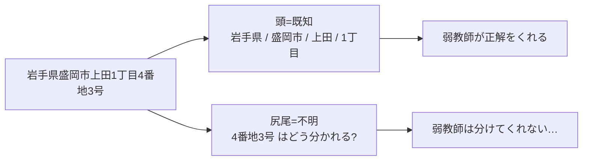
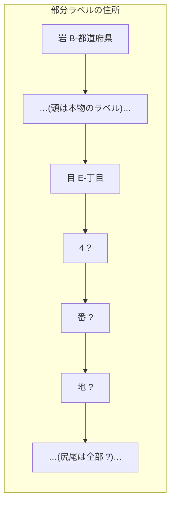
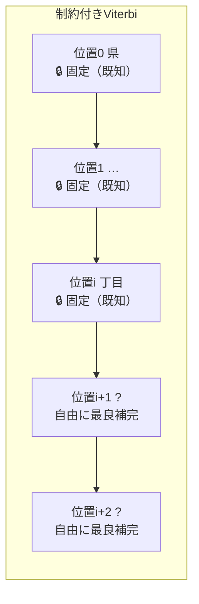
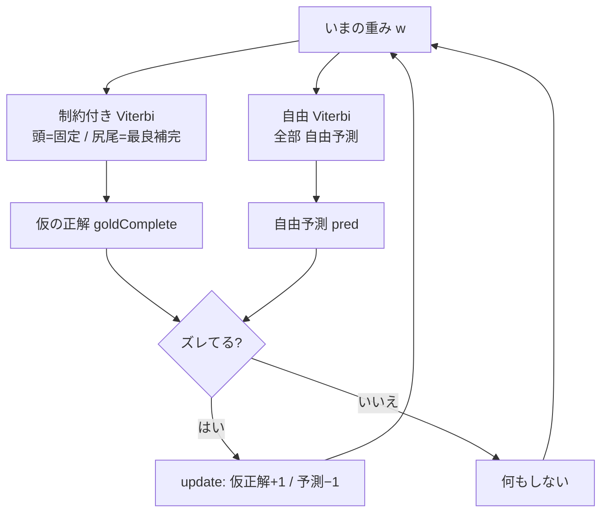
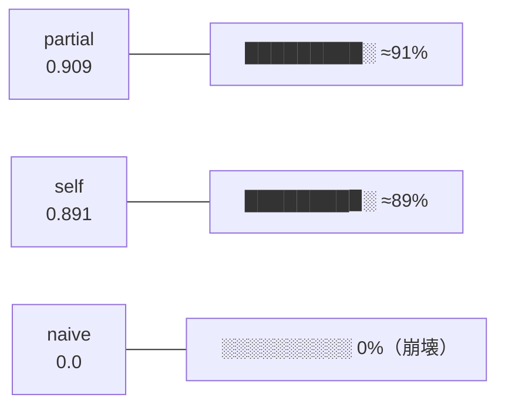

# 第21章　部分ラベル学習（partial-CRF 近似）：頭は既知・尻尾は潜在

> **この章のゴール**
> - 1つの住所の中に「**分かっている部分（頭）**」と「**分からない部分（尻尾）**」が混ざる、という現実を理解する
> - 分からない尻尾を「？（潜在）」にして、決めつけずに学ぶ **部分ラベル学習（partial-CRF の近似）** の発想をつかむ
> - 既知の頭に整合する最良補完を **制約付き Viterbi**（`viterbi(F, known[])`）で作り、それを仮の正解にして第8章と同じ ±1 更新を回す、という `fitPartial` の流れを読める
> - **アンカー（足場）が無いと全 O に崩壊して何も学べない**という、いちばん大事な落とし穴を体で覚える

> **登場人物**：みどり先生、ツムギ、ゲンタ、バーティ、ポストくん、アザミ

---

## 弱教師は「頭」しかくれない、という話のつづき

**ツムギ**：先生、前の章（第20章）で **self-training（自己学習）** をやりましたよね。自信のある文を「これは正解とみなそう」って自分で拾って、足場（seed）にする、ってやつ。

**みどり先生**：よく覚えてたね。今日はその発展編、2本目だ。あわてない、あわてない。
まず、第17章の弱教師（ABR と KEN_ALL）を思い出そう。ポストくん、弱教師って、住所のどこまで分けてくれたっけ？

**ポストくん**：ピッ、確認しました。わたしの KEN_ALL と、デジタル庁の ABR を突き合わせると——**都道府県・市・区・町（大字）・丁目まで**は、きれいに分かれた正解が手に入ります。これが住所の「**頭**」ですね。

**ゲンタ**：でも、その先は？　番地とか、号とか、建物名とか。

**ポストくん**：ピッ……。そこが、わたしの弱点なのです。「番地・号・建物・字」みたいな**細部（尻尾）は、分けてくれないことが多い**のです。

**みどり先生**：そう。ここがポイントだよ。弱教師がくれる正解は、**1つの住所のなかで「頭は完璧、尻尾は空白」**という、はんぱな形をしてる。



**ツムギ**：1つの住所のなかに、「分かってる部分」と「分からない部分」が、同居してるんだ。

**みどり先生**：そのとおり。これを **部分ラベル（partial label, ぶぶんラベル）** という。
「全部分かってる（完全ラベル）」でもなく「全部分からない（ラベルなし）」でもない。**一部だけ分かってる**、その中間の状態だ。

---

## 「分からない尻尾」を、どう扱う？

**ゲンタ**：分からない尻尾って、捨てちゃダメなの？　頭だけで学習すればいいじゃん。

**みどり先生**：もったいないんだよ、それ。だってその住所、文字としては最後まで存在してる。「上田1丁目」のあとに「4番地3号」って文字が、ちゃんと並んでるんだから。**捨てたら、その文字たちが何のラベルなのか、機械はいつまでも知らないまま**だ。

**ツムギ**：じゃあ、適当に「番地」って決めちゃう？

**みどり先生**：それも危ない。だって、本当にそこで切れるかは分からないんだよ。「4番地」かもしれないし「4番」「地3号」みたいに切れるかもしれない（ありえないけど、機械はまだ知らない）。**ウソの正解を教えると、機械はウソを覚える**。

**みどり先生**：そこで使うのが、今日の主役の考え方。
**「分からないところは、無理に決めず『？（はてな）』のまま学ぶ」**。

この「？」のことを、ちょっとかっこよく **潜在変数（せんざいへんすう、latent variable）** と呼ぶ。

> 📌 **読み方メモ：潜在変数（latent variable）**
> - 「潜在」＝「**かくれて見えない**」。「変数」＝「**まだ値が決まっていない箱**」。
> - 気持ちは「**正体は分からないけど、たしかに何かが入っている箱**」。
> - 住所でいうと「尻尾の各文字のラベルは、いま見えてないけど、本当はちゃんと存在する」。

**みどり先生**：kugiri のコードでも、この「？」がちゃんと用意されてる。`PerceptronTagger` の中だ。

```java
// PerceptronTagger.java より
/** 部分ラベルの潜在(未知)位置を表すタグ。Example.tags() のこの値は学習時に latent 扱い。 */
public static final String LATENT = "?";
```

**ツムギ**：ほんとだ、`"?"` だ！　尻尾の文字には、ラベルのかわりにこの「？」を入れとくんですね。



---

## 潜在を埋める道具は、もう持っている（第10章のViterbi）

**バーティ**：チュンッ！　「？」を埋めるなら、ぼくの出番じゃない？

**みどり先生**：まさに、バーティ。「？」のところに、いちばんつじつまの合うラベルを入れる——これって、第10章でやった「**最良の道を選ぶ**」のと、そっくりじゃないかな。

**ゲンタ**：あ、Viterbi（ビタビ）か。`score[i][k]` と `back[i][k]` を覚えて、いちばんスコアの高いラベル列を一瞬で出すやつ。

**みどり先生**：そう。でも、ふつうの Viterbi と1か所だけちがう。
今回は「頭は**もう答えが分かってる**」よね。だったら——

**ツムギ**：頭のところは、Viterbi に自由に選ばせちゃダメだ！　「ここは絶対この旗！」って固定しないと。

**みどり先生**：大正解。これが **制約付き Viterbi（せいやくつき Viterbi, constrained Viterbi）** だ。
やってることは、第10章の Viterbi に「**ここは絶対この旗**」という固定（しばり）を足しただけ。



**みどり先生**：kugiri では、`viterbi(F, known[])` がこれをやってる。`known[i]` が「位置 i の既知ラベル」を表していて、`-1` なら「？（自由）」、`0` 以上なら「そのラベルに固定」だ。

```java
// PerceptronTagger.viterbi(F, known)：known!=null のとき known[i]>=0 の位置は固定
private int[] viterbi(List<List<String>> F, int[] known) {
    // ...
    for (int k = 0; k < L; k++)
        score[0][k] = (allowedStart[k] && fixed(known, 0, k)) ? start[k] + emit0[k] : NEG;
    for (int i = 1; i < n; i++) {
        // ...
        for (int k = 0; k < L; k++) {
            if (!fixed(known, i, k)) { score[i][k] = NEG; back[i][k] = 0; continue; }
            // ...（あとは第10章の Viterbi と同じ：max_j(前 + trans) + emission）
        }
    }
    // ...
}

/** known[i] が未指定(<0) か k に一致するとき true（その位置で k を許可）。 */
private static boolean fixed(int[] known, int i, int k) {
    return known == null || known[i] < 0 || known[i] == k;
}
```

**ゲンタ**：なるほどな。`fixed` が `false` のところは `score` を `NEG`（マイナス無限大）にしてる。これ、第10章の合法性マスクとまったく同じ手口だ。**ありえない道のスコアを −∞ にして、`max` で絶対に選ばれないようにする**。

**みどり先生**：そのとおり！　第10章では「BIOES の壊れた並び」を −∞ で消したよね。今回はそこに「**既知ラベルと食いちがう道**」も −∞ で消すのを足しただけ。
だから——

- `known[i] = -1`（？）→ `fixed` はいつも `true` → そのラベルは自由に選べる（最良補完）
- `known[i] = 丁目のID` → `fixed` は `k==丁目` のときだけ `true` → そのラベルに固定

**バーティ**：チュンッ！　頭はガッチリ固定、尻尾は自由に最良補完。これで「**既知の頭に整合する、いちばんつじつまの合う尻尾の埋め方**」が一発で出るよ！

---

## hard-EM：仮の正解を作って、第8章の ±1 を回す

**ツムギ**：でも先生、Viterbi で尻尾を埋めても、それって機械が**いまの重みで適当に推測しただけ**ですよね？　本当の正解とはかぎらないのに、それで学習していいんですか？

**みどり先生**：おお、いい「なんで？」だ。あわてない、あわてない。ここが今日いちばんかしこいところ。

**みどり先生**：たしかに、その補完は「いまの実力での最良」にすぎない。でもね、こう考える。

> **部分ラベル学習のループ（hard-EM のハード版）**
> 1. いまの重みで、**既知の頭に整合する最良の尻尾の埋め方**を制約付き Viterbi で作る → これを「**仮の正解（goldComplete）**」とする
> 2. いっぽうで、**何も固定しない自由な予測**も出す（`viterbi(F, null)`）
> 3. この2つがズレてたら、第8章と同じ ±1 で重みを直す（仮の正解を +1、自由な予測を −1）
> 4. 重みが少し賢くなる → 1に戻る。次はもっと良い「仮の正解」が作れる

**ゲンタ**：……あ、ニワトリと卵だ。「いい補完」と「いい重み」が、お互いを少しずつ良くしていく。

**みどり先生**：まさに。この「**仮の正解を作る → 重みを直す → もっと良い仮の正解 → …**」をぐるぐる回すやり方を、用語では **EM（いーえむ、expectation-maximization、期待値最大化）** という。
そのうち、補完を「いちばん良い1本」にバシッと決め打ちする版が **hard-EM（ハード EM）**。kugiri の `fitPartial` は、この hard-EM を構造化パーセプトロンでやってる、と思えばいい。

> 📌 **用語だけメモ：EM / hard-EM**
> - **EM**＝「見えない部分（潜在）を、いまの実力で埋める」と「埋めた結果で実力を上げる」を交互にやる方法。
> - **hard（ハード）**＝「埋め方を1本に決め打ち」。やわらかく確率で混ぜる版（soft）もあるが、ここでは Viterbi で1本に決める。
> - 直感：**手探りで仮置きしては直し、仮置きしては直し**、だんだん良くなる。

**みどり先生**：コードで見てみよう。`fitPartial` の心臓部だけ抜き出すと、こうだ。

```java
// PerceptronTagger.fitPartial（核心の3行）
int[] goldComplete = viterbi(F, known); // ① 既知に整合する最良補完＝仮の正解
int[] pred         = viterbi(F, null);  // ② 何も固定しない自由な予測
if (!Arrays.equals(pred, goldComplete)) update(F, goldComplete, pred); // ③ ズレたら ±1
```

**ツムギ**：たった3行！　しかも `update` は第8章で見たのと同じやつですよね？

**みどり先生**：そっくり同じだよ。第8章の `fit` では「人間が用意した完璧な正解（gold）」を +1 してた。`fitPartial` では、それを「**制約付き Viterbi が作った仮の正解（goldComplete）**」に差し替えただけ。

```java
// PerceptronTagger.update（第8章と同一）：gold を +1、pred を −1
for (int i = 0; i < n; i++) {
    if (gold[i] == pred[i]) continue;
    for (String f : F.get(i)) {
        double[] wv = w(f);
        wv[gold[i]] += 1.0;   // 仮の正解ラベルを +1
        wv[pred[i]] -= 1.0;   // 自由予測のラベルを −1
    }
}
```



**ゲンタ**：頭が固定されてるから、**仮の正解は必ず頭の答えに合ってる**。で、尻尾は「頭につながる形でいちばんもっともらしい埋め方」になってる。それを正解扱いにして重みを寄せる……。たしかに、ウソの決め打ちよりはずっと安全だ。

---

## 最大の落とし穴：アンカーが無いと「全 O」に崩壊する

**みどり先生**：さあ、ここが今日いちばん大事なところ。教材で一番おいしいワナだから、しっかり聞いて。

**みどり先生**：もし、**尻尾を丸ごと「？」にして、しかも「これが尻尾の正しい姿だ」という確かな見本（アンカー）が1件も無かったら**、どうなると思う？

**ツムギ**：えーと……尻尾は全部自由に補完するんだから、なんかいい感じに埋まりそう？

**みどり先生**：それがね、**最悪の答え**にたどり着くんだ。機械はこう考えてしまう。

**パーセ的なつぶやき**：「尻尾は全部 `O`（何でもない）です！」

**ゲンタ**：は？　なんで全部 O になるの？

**みどり先生**：これがズルいところでね。尻尾に正解のアンカーが1つも無いと、機械の中では「**尻尾を全部 O にする**」のが、**自分のいまの重みと、いちばんつじつまが合ってしまう**んだ。

> **なぜ「全 O」に崩壊するのか**
> - 仮の正解は「いまの重みでの最良補完」。もし重みが「尻尾＝O」を少しでも好めば、補完も「全 O」になる。
> - すると `update` は「全 O」を正解として +1 する。**重みはますます「尻尾＝O」好きになる**。
> - 次の補完はもっと「全 O」。これがぐるぐる回って、**自分で自分を強化**してしまう。
> - 誰も「いや、ここは番地だよ」と止める人（アンカー）がいないので、**止まらない**。

**みどり先生**：結果、尻尾のラベルを1つも当てられない。スパン F1（第11章）で測ると **0.0**。何も学べなかった、ということだ。

```mermaid
flowchart TD
    subgraph 崩壊（アンカーなし）
    A1["尻尾=全部 ?<br/>正解の見本ゼロ"] --> A2["最良補完 = 全 O<br/>（一番ラク）"]
    A2 --> A3["全 O を +1"]
    A3 --> A4["重みが O 好きに"]
    A4 --> A2
    A4 --> A5["尻尾 F1 = 0.0 💀"]
    end
```

**ツムギ**：こわっ……。自由にさせすぎると、機械はいちばんサボれる答えに逃げちゃうんだ。

**みどり先生**：そう。だから必要なのが **アンカー（anchor、いかり・足場）**。
**「少しでいいから、尻尾まで完全に分かっている本物の正解」**を混ぜておくんだ。すると——

```mermaid
flowchart TD
    subgraph 防ぐ（アンカーあり）
    B0["完全ラベル seed 60件<br/>（尻尾まで本物の正解）"] --> B1["尻尾には番地・号がある<br/>と機械が知る"]
    B1 --> B2["残りの ? を埋めるとき<br/>O一色にはならない"]
    B2 --> B3["頭ラベルの手がかりも効く"]
    B3 --> B4["尻尾 F1 が立ち上がる ✅"]
    end
```

**みどり先生**：これ、第20章の self-training の seed とまったく同じ「**足場**」の話なんだ。足場ゼロでは登れない。少しの確かな正解が、崩壊を止める。

**ポストくん**：ピッ、確認しました。そして現実の弱教師でも、これは大丈夫なのです。ABR/KEN_ALL は**頭は完全にくれます**し、住居表示の町なら**尻尾の番地・号も観測できる**ことがあります。だから「頭＋一部の尻尾」が見えていて、ちゃんとアンカーになるのです。

**みどり先生**：そういうこと。「ぜんぶ潜在」ではなく「**頭は既知＋尻尾も一部は観測される**」。この整合性が、崩壊を防いでくれる。現実の住所データは、ちゃんとそうなってる。

---

## 実際にやってみた：partial は self を超える

**みどり先生**：では、`PartialCrfDemo` の結果を見よう。設定はこうだ。

> **実験の設定（`PartialCrfDemo`）**
> - 合成データ 4000 件を hold-out（第11章）で train / test に分ける。
> - **完全ラベル seed 60 件（＝アンカー）** ＋ 残りは「**頭=既知・尻尾=潜在**」。
> - 尻尾（番地・号・建物・字 等）の**スパン micro-F1**で、3つの方式を比べる。

| 方式 | 中身 | 尻尾スパン F1 |
|---|---|---|
| **(A) partial** | 潜在変数 perceptron（`fitPartial`）。頭ラベルを制約に使い切る | **0.909** |
| **(B) naive** | 尻尾を全部 `O` とみなして通常学習（潜在を無視） | **0.0（崩壊）** |
| **(C) self-training** | 完全 seed 60 件＋残りは未ラベルで第20章の自己学習 | **0.891** |

**ツムギ**：partial が 0.909 で、self が 0.891！　partial のほうが、ちょっと上だ！

**ゲンタ**：そして naive は 0.0。尻尾を「全部 O だ」って決めつけたら、そりゃ番地も号も1つも当たらないよな。当然の崩壊だ。

**みどり先生**：そこが今日の核心だよ。partial が self に勝った理由は、たった1つ。

> **partial が勝った理由**
> 弱教師がタダでくれる「**頭ラベル**」という手がかりを、**捨てずに使い切った**から。
> - **self-training** は、頭ラベルを使わず、文を「未ラベル」として丸ごと自分で予測し直す。
> - **partial** は、1文の中の「**既知の頭**」を**直接 Viterbi の制約**にする。だから尻尾の補完が、必ず頭の答えと地続きになる。
> - 「頭が県・市・町・丁目だ」と分かっていれば、「**そのすぐ後ろは番地っぽい**」という手がかりが、尻尾の補完に効く。

**ツムギ**：頭の正解は、ただでもらえる手がかりなのに、self-training は捨てちゃってたんだ。partial はそれを拾って、尻尾を当てるヒントに使った……。

**みどり先生**：そういうこと。**タダ同然の手がかりを、捨てずに使い切る**。これが勝因だ。
naive の 0.0 は「サボった答え（全 O）に逃げると、何も学べない」という、いちばん大事な教訓を見せてくれてる。



---

## partial-CRF と self-training は、何がちがう？

**ゲンタ**：先生、partial と self って、結局どっちも「正解が足りないなかで学ぶ」やつですよね。どう使い分けるの？

**みどり先生**：いいところを突くね。ちがいは「**何を足場にするか**」の1点だ。

| | self-training（第20章） | partial-CRF 近似（この章） |
|---|---|---|
| 足場の単位 | **文まるごと**「自信ある文を採用」 | **1文の中の既知部分**（頭）を制約に |
| 未知部分の扱い | 文ごと採用 or 不採用 | 既知に整合する**最良補完**で埋める |
| 頭ラベルの活用 | 使わない（未ラベル扱い） | **直接制約に使い切る** |
| 向く状況 | ラベルが文単位で有る/無い | **1文の中で頭=既知・尻尾=潜在** |

**みどり先生**：kugiri は **どっちも持ってる**。弱教師の正解が「文まるごと有る/無い」で来るなら self-training。今日みたいに「**1文の中で頭は分かるけど尻尾は分からない**」で来るなら partial。状況に合わせて選べばいい。

**ツムギ**：先生、ところで「CRF」って何ですか？　partial-**CRF** 近似、って名前についてるけど。

**みどり先生**：あわてない、あわてない。**CRF（しーあーるえふ、Conditional Random Field、条件付き確率場）** は、Viterbi の親戚だと思っていい。ちがいは「いちばん良い1本だけ見る」か「**ありえる全部の道を、確率（softmax）で混ぜて見る**」か。

> 📌 **softmax（そふとまっくす）のひとことメモ**
> - 「いちばん大きいやつだけ採る（max）」を、**やわらかくした（soft）**もの。
> - 1本に決め打ちせず「この道は60%、あの道は30%…」と**確率で重みづけ**して全部混ぜる。

**みどり先生**：今日の `fitPartial` は、その「全部混ぜる」を「**Viterbi で1本に決め打ち**」で代用した **ハード近似**だ。だから名前が「partial-CRF **近似**」。もし、ちゃんと確率で混ぜる本物の partial-CRF が要るなら——

**ゲンタ**：第19章の「差し替え層」だ。本体は純 JDK のまま、tagger だけ MALLET の CRF とかに差し替えられる、ってやつ。

**みどり先生**：その通り。本物の周辺（softmax）CRF が必要になったら、そこを差し替える。kugiri の参照実装は、依存ゼロで「**ハード近似でもここまで効く**」を見せる役だ。

---

## 手を動かそう

実際に `PartialCrfDemo` を動かして、A・B・C の尻尾 F1 を自分の目で確かめましょう。

```bash
mvn -q compile
mvn -q exec:java -Dexec.mainClass=org.unlaxer.kugiri.demo.PartialCrfDemo -Dstdout.encoding=UTF-8
```

すると、こんなふうに3方式の尻尾スパン F1 が出ます。

```
=== 尻尾（番地・建物等）のスパン micro-F1 ===
  (A) partial 潜在変数perceptron : 0.9090  ※頭ラベルのみ・全train
  (B) naive   尻尾=O 無視        : 0.0000
  (C) self    完全seed60+未ラベル : 0.8910

判定: partial >= self ? YES（0.9090 vs 0.8910）
```

**読みどころ**（ソースの該当箇所）：

| 見るもの | ファイル / メソッド |
|---|---|
| 潜在タグ `"?"` の定義 | `tagger/PerceptronTagger.java` の `LATENT` |
| 部分ラベルで学習（hard-EM の3行） | `tagger/PerceptronTagger.java` の `fitPartial` |
| 制約付き Viterbi（既知を固定） | `tagger/PerceptronTagger.java` の `viterbi(F, known)` / `fixed` |
| 頭=既知・尻尾=潜在に伏せる | `tagger/PartialLabels.java` の `maskTail` / `TAIL` |
| 尻尾だけのスパン F1 | `tagger/PartialLabels.java` の `tailMicroF1` |
| 3方式の比較ドライバ | `demo/PartialCrfDemo.java` |

**考えてみよう（自分の言葉で）**：
**なぜ (B) naive は F1 = 0.0 になるのでしょう？**

<details>
<summary>こたえの例</summary>

naive は「尻尾の文字を**全部 `O`（何でもない）にラベルし直して**」通常学習します（`PartialCrfDemo` の `tailToO`）。
つまり「番地」「号」「字」などの旗を、最初から1つも立てません。
学習データに「尻尾＝O」しか無いので、機械も「尻尾は O」と答えるのが正しいと学びます。
テストで番地や号を当てようとしても、**正解の旗が立つことが一度も無い**ので、

- 正しく当てた数（tp）＝ 0 → 適合率も再現率も 0 → **F1 = 0.0**

これが「**分からないからといって O で潰すと、機械は何も学べない（崩壊）**」という今日の教訓です。
partial は同じ尻尾を `O` で潰さず「**？（潜在）**」のまま残し、頭の制約のもとで最良補完したので、崩壊を免れました。

</details>

> ⚠️ **注意（第18章 と CLAUDE.md 準拠）**
> このデモは**合成データ**で動いています。合成は規則性が強いので、数値（0.909 など）を
> 「実力そのもの」と思い込まないこと。大事なのは**絶対値より「A・B・C の関係**」——
> **partial ≥ self ≫ naive(=0)** という**順番**です。本番は必ず hold-out の実データで測りましょう。

---

## アザミがひとこと

**アザミ**：……ねえ、わたし、気づいたの。

**ツムギ**：アザミ！　どうしたの？

**アザミ**：「字（あざ）」はね、いつも住所の**尻尾のほう**にまぎれて、誰もラベルをくれない子なの……。でも今日のやり方は、「分からない尻尾を、ムリに O で消さずに『？』のまま残す」って言ってくれた。

**みどり先生**：そうだよ、アザミ。**「分からないものを、分からないまま大事に抱えて学ぶ」**——それは、君を消さずに残す、ってことでもあるんだ。

**アザミ**：……うれしいの。わたしを「何でもないもの（O）」にしないでくれて。

---

## 今日のまとめ

- 弱教師（第17章）は住所の**頭**（都道府県〜丁目）の正解はくれるが、**尻尾**（番地・号・建物・字 等）は分けてくれない。1文の中に**既知と未知が同居**する＝**部分ラベル**。
- 分からない尻尾は決めつけず「**？（潜在変数）**」のまま扱う。`PerceptronTagger.LATENT = "?"`。
- **制約付き Viterbi**（`viterbi(F, known[])`）＝第10章の Viterbi に「**ここは絶対この旗**」の固定を足しただけ。`known[i]>=0` の位置はそのラベルに固定、`-1` は自由補完。違反は `NEG`（−∞）で消す。
- `fitPartial` は **hard-EM**：①制約付き Viterbi で「仮の正解」を作り、②自由予測と比べ、③ズレたら第8章と同じ ±1 更新。これを繰り返して「いい補完」と「いい重み」を交互に育てる。
- **最大の落とし穴**：尻尾を丸ごと潜在にして**アンカー（確かな正解）がゼロ**だと、「尻尾＝全 O」が自分内でつじつまが合い、**全 O に崩壊（F1=0.0）**。少しの**完全な正解 or 一部の観測ラベル**という足場が要る（第20章の seed と同じ）。
- 結果（`PartialCrfDemo`、合成）：尻尾スパン F1 は **partial 0.909 ≥ self 0.891 ≫ naive 0.0**。勝因は「**頭ラベルというタダ同然の手がかりを、捨てずに使い切った**」こと。
- self-training は「自信ある文を丸ごと採用」、partial は「1文の中の既知部分を直接制約に」。kugiri は両方持つ。本物の周辺（softmax）CRF が要るなら第19章の差し替え層へ。

---

## アザミメーター

```
アザミの見え具合：██████████ 100%
（発展編。分からない尻尾を O で消さず「？」のまま抱えて学ぶ——
 アザミを「何でもないもの」にしない技を覚えた。輪郭はもう完璧、芯まで見える。）
```

---

## 次回予告

**みどり先生**：potential（潜在）を Viterbi で固定したり自由にしたり——あのスコアの足し引き、じつは行列（ぎょうれつ）で書くともっとスッキリ見えるんだ。

**ツムギ**：行列……？　なんか急にむずかしそう……。

**みどり先生**：あわてない、あわてない。付録でやさしくね。emission も trans も、ぜんぶ「数字の表（行列）」のかけ算で書ける、って話だよ。

[← 第20章](20-self-training.md) ・ [付録A2 →](A2-gyouretsu.md)
