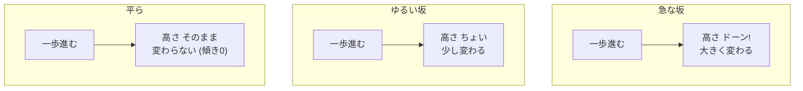
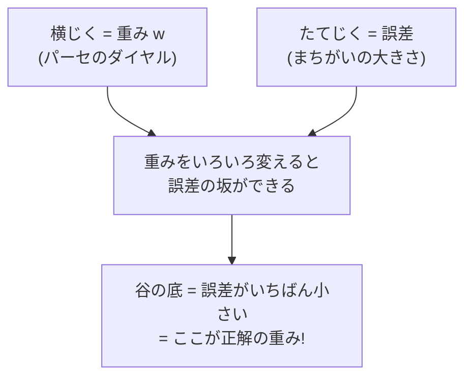
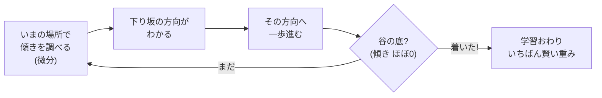
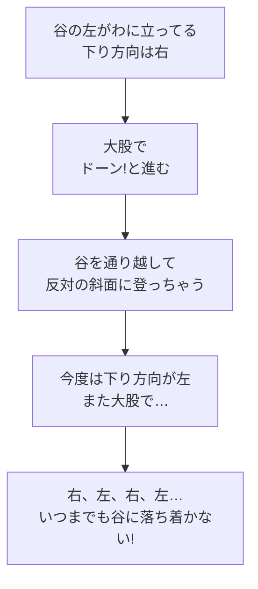
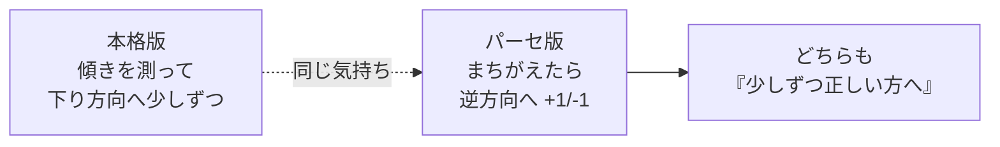

# 付録A1　微分のきほん（なぜ「ちょっとずつ」動かすの？）

> **これは「付録」です**
> この章は本筋（住所を切る機械の作り方）に**必須ではありません**。
> でも、第8章のパーセプトロンで出てきた
> 「**重みを +1 / −1 で少しずつ動かす**」——
> あの「**なぜ少しずつ？**」を、数学でちゃんと裏づける深掘りの回です。
> 飛ばしても先へ進めますが、読むと「学習」の気持ちがぐっと深くなります。

> **この章のゴール**
> - 微分＝「入力をちょっと動かしたら、出力はどれだけ変わる？」＝**傾き**だと分かる
> - 「誤差の坂を下る」＝勾配降下法のイメージをつかむ
> - 「歩幅を大きくしすぎると失敗する」＝なぜ少しずつなのかを納得する

> **登場人物**：みどり先生、ツムギ、ゲンタ、パーセ

---

## 第8章の「なんで？」が、まだ残ってる

**ツムギ**：先生、第8章でパーセが「まちがえたら重みを **+1 / −1** で直す」ってやってましたよね。

**みどり先生**：うん、よく覚えてたね。

**ツムギ**：あのとき「**少しずつ直すのがコツ**」って言ってたけど……
わたし、まだちょっとモヤッとしてて。**なんで**少しずつなんですか？　一気に直せば早くない？

**ゲンタ**：おれもそれ思った。**それ、意味あるの？**　ちょこちょこ直すの、めんどくさいだけじゃ。

**みどり先生**：あわてない、あわてない。
じつはね、その「なんで少しずつ？」にちゃんと答える数学があるんだ。
名前は——**微分（びぶん、differentiation）**。

**パーセ**：うわっ、出た。ぼくの更新ルールの、ほんとうの正体だ……！

---

## 微分って、こわい？　いや、ただの「傾き」

**ツムギ**：び……びぶん。もう名前からして無理そう。高校でやるやつですよね……？

**みどり先生**：名前にビビらないで。**微分は「傾き（slope）」のこと**だよ。
中学でやった1次関数、覚えてる？

$$
y = ax + b
$$

**みどり先生**：この `a` を、なんて呼んだ？

**ツムギ**：えっと……**傾き**！

**みどり先生**：そう、それだ。微分はその「傾き」の話を、もうちょっと広げただけなんだ。

> 📌 **読み方メモ：微分とは**
> 微分＝「**入力（x）をちょっと動かしたら、出力（y）はどれだけ変わる？**」
> その「変わり具合」を表す数が**傾き**。
> 1次関数 `y = ax + b` なら、傾きはどこでも `a` で一定。
> （でも世の中の坂は、場所によって急だったりゆるかったりする。そこを測るのが微分。）


**ゲンタ**：なんだ、傾きか。それなら知ってる。

**みどり先生**：そう、もう半分わかったようなもんだよ。あわてない、あわてない。

---

## 坂道のたとえ：急な坂と、ゆるい坂

**みどり先生**：傾きの「気持ち」を、坂道で考えよう。
君たちが坂を**一歩だけ**前に進むとするね。

- **急な坂**：一歩進んだだけで、高さがガクンと大きく変わる
- **ゆるい坂**：一歩進んでも、高さはちょっとしか変わらない
- **平ら（傾き0）**：一歩進んでも、高さは変わらない



**ツムギ**：あー、わかる！　急な坂を一歩ふみ出すと「うわっ」ってなるやつ！

**みどり先生**：その「うわっ」の大きさが、まさに**傾きの大きさ**なんだ。
傾きが大きい＝ちょっと動かしただけで結果が大きく変わる、ということ。

**ゲンタ**：じゃあ平らなところは、進んでも何も変わらない、と。傾き0だから。

**みどり先生**：そのとおり。この「平ら（傾き0）」は、あとでとっても大事になるよ。覚えておいて。

---

## 「間違いの大きさ」を坂にしてみる

**みどり先生**：さて、ここからが本題。
パーセは「まちがえる」よね。その**まちがいの大きさ**を、ここでは**誤差（ごさ、error）**と呼ぶよ。

**ツムギ**：誤差……ズレの大きさ、ってことですか？

**みどり先生**：ぴったり。正解からどれだけズレてるか、だ。
で、この**誤差を「高さ」だと思って、坂を描いてみる**。
横じくは「重み（パーセのダイヤルの値）」、たてじくは「誤差」だ。



**みどり先生**：イメージはこんな谷だ。

```
誤差（高さ）
  ＼              ／
   ＼            ／
    ＼          ／
      ＼      ／
        ＼__／   ← この谷の底がいちばん誤差が小さい
                    （＝いちばん賢い重み！）
   ────────────────→ 重み w
```

**ゲンタ**：なるほど。**谷の底にたどり着けば、いちばんまちがいが少ない**ってことか。

**みどり先生**：そう！　そして「学習」っていうのは、結局**この谷の底をめざして坂を下りていくこと**なんだ。

---

## 坂を下る方法：勾配降下法

**みどり先生**：いま、君は坂のどこかに立っている。でも**目隠し**されていて、谷がどっちか見えない。
さあ、どうやって谷へ下りる？

**ツムギ**：うーん……足で地面をさわって、**下ってる方向**に進む？

**みどり先生**：天才！　まさにそれ。
**足元の傾きを調べて、下り坂の方へ一歩ふみ出す**。これをくり返せば、いつか谷の底に着く。

この「足元の傾き」を教えてくれるのが——そう、**微分**なんだ。

> 📌 **勾配降下法（こうばいこうかほう、gradient descent）**
> 「勾配（こうばい）」＝傾きのこと。「降下（こうか）」＝下りること。
> **傾き（微分）が教える『下り方向』へ、少しずつ進んで、誤差の谷の底をめざす**方法。
> 機械学習の「学習」の、いちばん基本のやり方。



**ゲンタ**：おもしろい。傾きが教えてくれるのは「方向」なんだな。
そして谷の底は**傾き0**——さっきの「平らなところ」だ。

**みどり先生**：よく繋げたね、ゲンタ。
谷の底に着くと傾きが0になって、もう動く理由がなくなる。だから自然に止まる。うまくできてる。

---

## いよいよ核心：なぜ「少しずつ」なのか

**ツムギ**：あっ、これで第8章の「**なんで少しずつ？**」に戻れますか？

**みどり先生**：まさに今そこ。よく覚えてたね。
下り方向はわかった。でもね、**一歩の大きさ（歩幅）**が問題なんだ。

**みどり先生**：歩幅を**大きくしすぎる**と、こうなる。



**みどり先生**：絵にするとこんな感じ。大股だと、谷をまたいで反対側に登っちゃう。

```
   ＼              ／
    ＼  ①        ／
     ＼  ＼      ／  ③
      ＼  ＼    ／  ／
        ＼ ＼ ／ ／       ① 谷へ向かって大股
          ＼ ✗ ／         ✗ 谷の底を「行き過ぎ」
          ＼__／          ③ 反対側に登っちゃった！
```

**ツムギ**：あー！　これ、第8章の**的当て**と同じだ！
「右に外れた」って言われて、いきなり**大きく**左にずらしたら、今度は左に外れる、ってやつ！

**みどり先生**：大正解！　まったく同じ話なんだよ。
この「歩幅」のことを、機械学習では**学習率（がくしゅうりつ、learning rate）**という。

> 📌 **学習率（learning rate）＝歩幅**
> - **大きすぎ**：谷を通り越して「行き過ぎ（オーバーシュート）」。いつまでも落ち着かない。
> - **小さすぎ**：ちゃんと谷へ向かうけど、めちゃくちゃ遅い。
> - **ちょうどいい**：すいすい谷の底へ。
> だから「**少しずつ動かす**」のが安全で確実。第8章のパーセの気持ちと同じ。

**ゲンタ**：なるほど、**意味あるわ**。
大股が速いとは限らない。むしろ行き過ぎて失敗する。だから少しずつ、か。

---

## パーセの「+1 / −1」の正体

**パーセ**：あの……それで、ぼくの **+1 / −1** は、けっきょく何だったの？

**みどり先生**：いい質問だ、パーセ。
君の「+1 / −1」はね、**勾配降下法のいちばん素朴（そぼく）なバージョン**なんだよ。

**みどり先生**：本格的な勾配降下法は、「傾きの大きさ」に応じて歩幅を細かく変える。
でもパーセは、こう割り切ってる——
「**まちがえた方向の逆へ、決まった一歩（±1）だけ動かす**」。



**みどり先生**：難しい計算を全部はぶいて、「方向だけ合わせて、一歩だけ動かす」。
シンプルだけど、たくさんくり返せばちゃんと谷へ近づく。だから第8章のパーセは賢くなれたんだ。

**パーセ**：そっか……ぼく、知らないうちに坂を下ってたんだ！　うれしい！

**ツムギ**：パーセ、けっこうやるじゃん。

---

## 記号 dy/dx は、こわくない

**みどり先生**：最後に、記号だけ紹介しておくね。教科書でこう書いてあったら——

$$
\frac{dy}{dx}
$$

**ツムギ**：うわ、分数みたいなやつ……。

**みどり先生**：あわてない、あわてない。これ、**読み方さえ知れば終わり**だよ。

> 📌 **読み方メモ：`dy/dx`（ディーワイ・ディーエックス）**
> - `dx`＝「x を**ちょっとだけ**変えた量」（d は「ちょっと」のしるし）
> - `dy`＝「そのとき y が変わった量」
> - `dy/dx`＝「**x をちょっと変えたときの、y の変化の割合**」＝**傾き**
> つまり、この章でずっと話してきた「傾き」を、記号で書いただけ。

**みどり先生**：このコースでは、**むずかしい微分の計算公式はやらない**。
（`x²` を微分すると `2x`、みたいなやつ。あれは高校でゆっくりでいい。）
大事なのは公式じゃなくて、**「微分＝傾き＝ちょっと動かしたときの変化」**という気持ちだけ。

**ゲンタ**：計算しなくていいの？　ちょっと拍子ぬけだけど……まあ、気持ちがわかれば十分か。

**みどり先生**：そう。kugiri を作るのに、微分の公式を手で解く場面はないんだ。
でも「なぜ少しずつ動かすのか」を**わかってる**のと、ただ言われたとおりやるのとは、大ちがい。
今日でその差がついたよ。

---

## 手を動かそう：谷に向かう「向き」を当てる

実際の kugiri のコードはこの章では出てきません（微分は概念だけ）。
かわりに、**坂のどっちが谷か**を手で当てる練習をしましょう。

つかう坂は、いちばん有名な谷——**`y = x²`**（エックスの2乗）です。
これは原点（x=0）が谷の底になる、おわん型の坂です。

```
 y
  ＼              ／
   ＼            ／
    ＼          ／
      ＼      ／
        ＼__／       ← x=0 が谷の底
  ──────┼──────→ x
       x=0
```

**ルール**：いまいる場所から見て、**谷（x=0）に近づくほうへ動くべき**です。
それぞれの場所で、**「左へ」動くべきか「右へ」動くべきか**を答えてください。

1. **x = 3** にいる（谷より右がわ）。左？　右？
2. **x = -3** にいる（谷より左がわ）。左？　右？
3. **x = 1** にいる。左？　右？
4. **x = 0** にいる（もう谷の底！）。動く？

<details>
<summary>こたえ</summary>

1. **x = 3** → 谷は x=0 だから、**左へ**。
   （この場所は坂が右上がり＝傾きプラス。プラスのときは「左＝マイナス方向」へ下る。）
2. **x = -3** → 谷は x=0 だから、**右へ**。
   （この場所は坂が右下がり＝傾きマイナス。マイナスのときは「右＝プラス方向」へ下る。）
3. **x = 1** → まだ谷の右がわなので、**左へ**。
4. **x = 0** → **動かなくていい**！　もう谷の底。傾き0だから、進む理由がない。

**気づいてほしいこと**：
谷へ向かう向きは、いつも「**傾きの符号の逆**」になっています。
- 傾きがプラス（右上がり）→ 左へ（マイナス方向へ）
- 傾きがマイナス（右下がり）→ 右へ（プラス方向へ）
これがまさに、勾配降下法の「**傾きと逆の方向へ少しずつ進む**」です。
パーセの「まちがえた方向の**逆**へ±1」と、ぴったり同じ気持ちですね。

</details>

---

## 今日のまとめ

- **微分＝傾き（slope）**＝「入力をちょっと動かしたら、出力はどれだけ変わる？」。
  1次関数 `y = ax + b` の傾き `a` の仲間。
- **誤差を「高さ」にした坂**を考え、**いちばん低い谷（誤差が最小）をめざして下る**のが学習。
  これを **勾配降下法（gradient descent）** という。傾き（微分）が「下り方向」を教えてくれる。
- **歩幅（学習率）を大きくしすぎると、谷を通り越して行き過ぎる**。だから**少しずつ**動かす。
  第8章の「的当てで少しずつ直す」とまったく同じ気持ち。
- パーセの **+1 / −1** は、勾配降下法の**いちばん素朴なバージョン**だった。
- 記号 `dy/dx` は「x をちょっと変えたときの y の変化の割合」と読むだけでOK。
  難しい計算公式は、ここではやらない。

---

## アザミメーター

```
アザミの見え具合：███░░░░░░░ 26%
（コメント：『なぜ少しずつ動かすのか』が、坂と谷の絵でストンと腑に落ちた。
　学習の地面の傾きが見えてきて、アザミの足元あたりが少しはっきり！）
```

---

## 次回予告

**みどり先生**：道具箱はこれでそろった。ベクトル・内積・log・そして傾き（微分）。
いよいよここから、住所に**旗を立てる**話に入るよ。

**ツムギ**：旗？

**みどり先生**：そう。「ここからここまでが市！」「ここが番地の始まり！」って、
文字の列に目印をつけていく。その目印のしくみが **BIOES（バイオーズ）** だ。次の章へ。

[← 第5章](05-log-to-jouhou.md) ・ [第6章 →](06-sequence-bioes.md)
