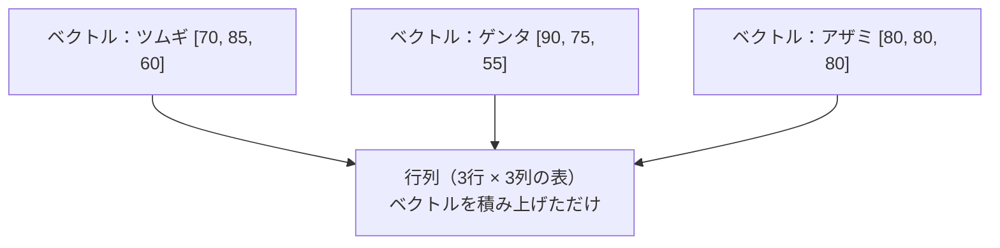
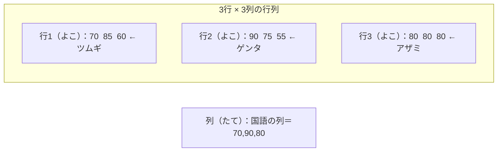
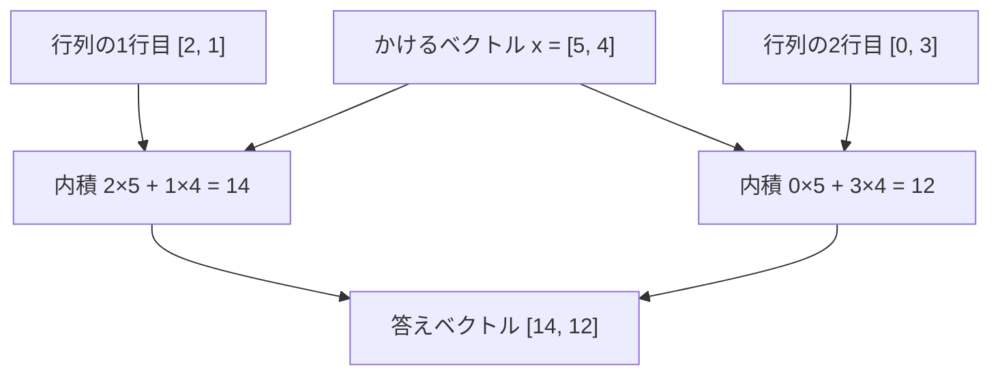
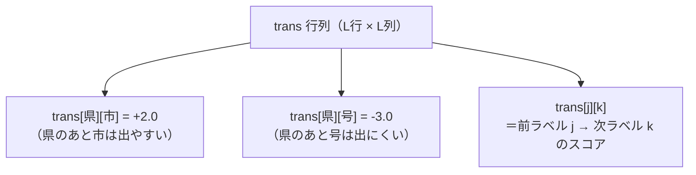
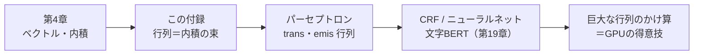

# 付録A2　行列のきほん

> **これは付録です**（第4章ベクトルの発展。本編を読み終えてからでOK）
> 第4章で「ベクトル＝数字のならび」「内積＝かけて足す」をやりました。
> この付録は、その続き。**ベクトルを何本も積み重ねた「数の表」＝行列（ぎょうれつ）** を
> やさしく紹介します。むずかしい計算（逆行列とか）はやりません。安心して読んでください。

> **この章のゴール**
> - 「行列（ぎょうれつ、matrix）」＝**数を縦横に並べた表**だと納得する
> - 「行列×ベクトル」＝**各行とベクトルの内積をならべたもの**だと計算できる
> - kugiri の `trans`（遷移スコア）が、まさに **L×L の正方行列**だと気づく

> **登場人物**：みどり先生、ツムギ、ゲンタ、パーセ

---

## ベクトルを積んだら、表になった

**ツムギ**：先生、本編ぜんぶ読み終わりました！　……でも最後に「行列」って言葉だけ何回か出てきて、スルーしてましたよね？

**みどり先生**：よく気づいたね。あわてない、あわてない。今日はその「**行列（ぎょうれつ、matrix）**」のお話だ。といっても、もう君は半分わかってる。

**ゲンタ**：半分？　まだ何も習ってないけど。

**みどり先生**：第4章で「ベクトル＝数字のならび」をやったよね。たとえば、ツムギのテストの点。

```
ツムギ = [国語70, 数学85, 英語60]
```

**みどり先生**：これがベクトル。じゃあ、ツムギ、ゲンタ、アザミ、3人ぶん並べたらどうなる？

**ツムギ**：えーと、3本のならびを……上から積む？

```
        国語  数学  英語
ツムギ [ 70    85    60 ]
ゲンタ [ 90    75    55 ]
アザミ [ 80    80    80 ]
```

**みどり先生**：それだよ！　**ベクトルを何本も積み重ねた、数の表**。これが行列。
時間割表とか、座席表とか、クラスごとの点数表とか——身のまわりの「表」は、ぜんぶ行列の仲間なんだ。



**ゲンタ**：なんだ、表か。それなら学校でいつも見てる。

**みどり先生**：そう、こわくない。**行列はただの表**。むずかしいのは名前だけだ。

---

## 行（よこ）と列（たて）、そしてサイズ

**みどり先生**：表のことばを2つだけ覚えよう。

> 📌 **読み方メモ**
> - **行（ぎょう、row）**＝**よこ**の一列。「ツムギの行」みたいに、1人ぶんのならび。
> - **列（れつ、column）**＝**たて**の一列。「国語の列」みたいに、1教科ぶんのならび。
> - **サイズ**は「**行数 × 列数**」で言う。さっきの表は **3行×3列**、だから「3×3 の行列」。

**ツムギ**：行が「よこ」で、列が「たて」……どっちがどっちか忘れそう。

**みどり先生**：いい覚え方があるよ。漢字の形を見て。

- 「**行**」く道は、よこに伸びてる道のイメージ → **よこ**
- 「**列**」は、縦に「リットウ」（刂）が立ってる → **たて**

**ゲンタ**：先生、こじつけっぽいけど……まあ覚えられる。

**みどり先生**：こじつけ上等。覚えたもん勝ちだ。



**みどり先生**：上の図で、よこの1本ずつが「行」。たての「国語だけ取り出したならび」が「列」だ。

---

## 行列×ベクトル＝「行ごとの内積」を並べるだけ

**みどり先生**：さあ、ここが今日のいちばん大事なところ。でも、もう君たちはできる。
**「行列 × ベクトル」**っていう計算があってね——これ、**第4章の内積を、行の数だけ繰り返すだけ**なんだ。

**ツムギ**：内積って、「同じ場所どうしをかけて、ぜんぶ足す」やつですよね。

**みどり先生**：そのとおり。やり方はこれだけ。

> **行列 × ベクトル のやり方**
> 1. 行列の **1行（よこ1本）** を取り出す＝これも1本のベクトル
> 2. その行と、かけるベクトルの **内積**（かけて足す）を計算する
> 3. それを **全部の行についてやって、答えをたてに並べる**

**みどり先生**：例でやろう。2×2 の行列 A と、長さ2のベクトル x。

```
A = [ 2  1 ]      x = [ 5 ]
    [ 0  3 ]          [ 4 ]
```

**みどり先生**：A の1行目は `[2, 1]`、2行目は `[0, 3]`。それぞれ x と内積する。

```
1行目の内積： 2×5 + 1×4 = 10 + 4 = 14
2行目の内積： 0×5 + 3×4 =  0 + 12 = 12

答え： [ 14 ]
       [ 12 ]
```

**ツムギ**：あ、できた！　**行ごとに第4章の内積をやって、その答えをたてに並べただけ**だ！

**みどり先生**：100点。むずかしい新しいことは、ひとつも無いんだ。



**ゲンタ**：つまり「行列×ベクトル」は、内積のセット販売ってことか。1個ずつ買うのと同じだけど、まとめて言えるから便利、と。

**みどり先生**：その理解、すばらしい。**まとめて言えるのが行列のうれしさ**なんだよ。

---

## kugiri の中の行列：`trans` は L×L の正方行列

**パーセ**：呼ばれた気がして来たよ！　ぼくのコードの中、じつは行列だらけなんだ。

**みどり先生**：パーセ、ナイスタイミング。第9章でやった `trans`（トランス、transition＝遷移スコア）を思い出そう。
「前のラベルが○○のとき、次のラベルが××になりやすい/にくい」を表す重みだったね。

**ツムギ**：県の次に、いきなり号は来ない、みたいなやつ！

**みどり先生**：そう。ここで「**ラベルが L 個ある**」とすると、遷移の組み合わせは何通り？

**ゲンタ**：前が L 通り、次も L 通りだから……L × L 通りか。

**みどり先生**：ぴったり。**「前のラベル」×「次のラベル」の全組み合わせ**だから、自然に **L行×L列の表＝正方行列（せいほうぎょうれつ、行数と列数が同じ行列）** になる。
kugiri のコードでも、まさにそう宣言してある。

```java
// PerceptronTagger.java より
private final List<String> labels = Bioes.tags();
private final int L = labels.size();        // ラベルの個数
private double[][] trans = new double[L][L]; // ← L行 × L列の行列！
```

**みどり先生**：`double[][]`（ダブル配列の配列）＝「数のならびを、さらにならべたもの」。
これがまさに「**ベクトルを積み重ねた表＝行列**」のコードでの姿なんだ。



**みどり先生**：`trans[j][k]` と書けば、「j行 k列のマス」、つまり「**前が j、次が k のときのスコア**」が一発で取れる。表だから、マスを指せばいいだけ。

**ゲンタ**：行列って、こういう「全組み合わせの一覧表」を持ちたいときにちょうどいいんだな。

**みどり先生**：そういうこと。それに `emis`（エミス、emission＝放出スコア）も、見方を変えれば巨大な行列だよ。

```java
private final Map<String, double[]> emis = new HashMap<>(); // 素性 -> ラベル別重み
```

**みどり先生**：これは「**手がかり（素性）の名前**」ごとに「**ラベルの数だけの重みベクトル**」を持っている。
手がかりがたくさんあるから、ぜんぶ積み重ねると「**素性 × ラベル**」の超でっかい表——これも立派な行列なんだ。

**ツムギ**：表が見えてくると、コードがちょっと親しみやすくなりますね。

---

## ML の主役は、じつは行列のかけ算

**みどり先生**：最後に、ちょっとだけ未来の話を。本格的な機械学習——第19章で名前だけ出た**文字BERT**みたいなニューラルネットや、CRF（シーアールエフ、もっと賢い系列モデル）——では、計算の主役が「**行列のかけ算**」になるんだ。

**ツムギ**：さっきやった「行ごとに内積」を、ものすごい回数やるってこと？

**みどり先生**：まさにそれ。何百×何百みたいな巨大な行列を、何度もかけ算する。
そして——**GPU（ジーピーユー、画像用の計算チップ）が得意なのが、この行列のかけ算**なんだ。だから今のAIはGPUで動く。



**ゲンタ**：じゃあ、ぼくらがやった「かけて足す」が、いちばん奥のAIまでずっと続いてるってこと？

**みどり先生**：その通り。**いちばん大事なところは、第4章で全部やり終えてる**んだよ。行列は、それを「束ねて言うための道具」。逆行列とか難しい計算は、必要になったときに学べばいい。今日は2つだけ持って帰って。

> **今日のおみやげ（これだけでOK）**
> 1. **行列＝ベクトルを積んだ表**（行＝よこ、列＝たて、サイズは行×列）
> 2. **行列×ベクトル＝行ごとの内積を並べたもの**

---

## 手を動かそう

実際の kugiri ソース `tagger/PerceptronTagger.java` では、`trans` は `double[L][L]` の正方行列でした。
その「行ごとの内積」の感覚を、手で1問だけ確かめましょう。

紙とえんぴつで、**2×2 行列 × 長さ2のベクトル**を計算してみてください。

```
A = [ 3  2 ]      x = [ 2 ]
    [ 1  4 ]          [ 5 ]
```

ヒント：A の1行目 `[3, 2]` と x の内積、A の2行目 `[1, 4]` と x の内積を、たてに並べるだけ。

<details>
<summary>こたえ</summary>

- **1行目の内積**：`3×2 + 2×5 = 6 + 10 = 16`
- **2行目の内積**：`1×2 + 4×5 = 2 + 20 = 22`

```
答え： [ 16 ]
       [ 22 ]
```

ね、第4章の内積を**2回やって、たてに並べただけ**。新しい計算は何もありませんでした。

</details>

---

## 今日のまとめ

- **行列（matrix）**＝数を縦横に並べた表。**ベクトルを何本も積み重ねたもの**。
- **行**＝よこ、**列**＝たて。サイズは「**行数 × 列数**」で言う。
- **行列 × ベクトル**＝**各行とベクトルの内積をならべたもの**。第4章の内積の繰り返しにすぎない。
- kugiri の `trans` は **L×L の正方行列**（前ラベル → 次ラベルの全組み合わせ）。`emis` も「素性 × ラベル」の巨大な行列。
- 本格的なML（CRF・ニューラルネット・文字BERT）は**行列のかけ算が主役**。GPUが得意なのもそれ。
- むずかしい計算（逆行列など）は今は不要。**「ベクトルを積んだ表」「行列×ベクトル＝行ごとの内積」**だけ持ち帰ればOK。

---

## アザミメーター

```
アザミの見え具合：██████████ 100%
（コメント：アザミはもう見えてる。今日は道具を1つ追加で手に入れた——
　「表＝行列」というメガネをかけると、コードの中の重みが全部、見通しよく整理できるようになった！）
```

---

## 次回予告

**みどり先生**：道具がまた1つ増えたね。次は、これまで出てきた用語を一気に引ける「用語集」だ。
わからない言葉に出会ったら、いつでもここに戻っておいで。あわてない、あわてない。

[← 第21章](21-partial-crf.md) ・ [付録A3 →](A3-yougo-shu.md)
