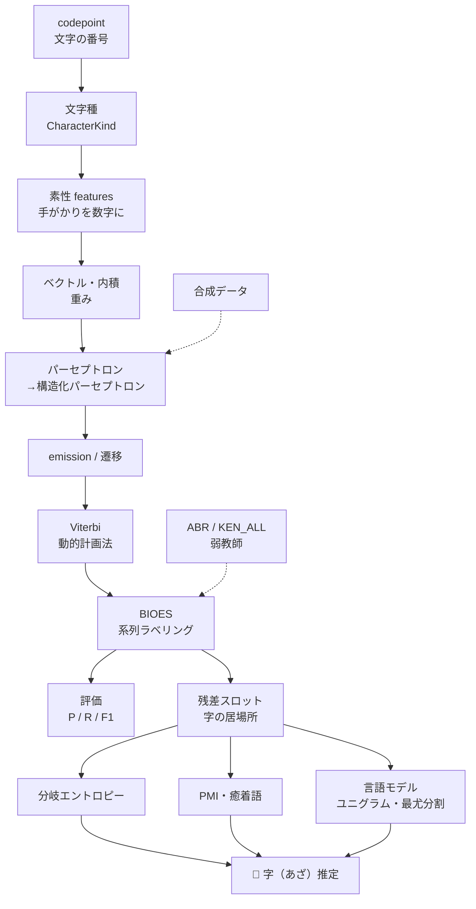

# 付録A3　用語集

> **この付録のゴール**
> - このコースに出てくる用語を、いつでも引けるようにする
> - 「読み（ふりがな）＋英語＋やさしい説明＋出てくる章」をワンセットで確認する
> - 用語どうしのつながりを、1枚の地図でつかむ

> **登場人物**：アザミ、CPねこ

---

**アザミ**：ここは「用語のおうち」なの。読んでいて「あれ、これなんだっけ？」って
なったら、いつでもここに戻ってきてね。

**CPねこ**：迷子になっても大丈夫にゃ。ここに全部の言葉のすみかがあるにゃ。
気になった言葉の **章のリンク** をたどれば、ちゃんとした説明にも飛べるにゃ。

> **この付録の使い方**：本文を読んでいて知らない言葉に出会ったら、
> 下のカテゴリから探してください。各用語には **出てくる章へのリンク** があります。
> 「気持ち（直感）」だけ思い出したいときも、ここを開けばOKです。

---

## 用語のつながりマップ

**アザミ**：言葉はバラバラじゃなくて、手をつないでいるの。ざっくり、こんな形よ。



**CPねこ**：左上の「文字の番号」から始まって、右下の「字推定」までつながってるにゃ。
このコースは、この地図を左上から右下へ歩く旅なんだにゃ。

---

## 文字とデータ

| 用語 | 読み／英語 | やさしい説明 | 章 |
|---|---|---|---|
| **codepoint** | コードポイント／codepoint | 文字ひとつひとつに割り当てられた **背番号（番号）**。kugiri は `char` ではなくこの番号の単位で住所を見る。 | [第1章](01-moji-to-codepoint.md) |
| **Unicode** | ユニコード／Unicode | 世界中の文字に番号をふった、巨大な **共通の番号帳**。codepoint はこの帳簿の中の番号。 | [第1章](01-moji-to-codepoint.md) |
| **サロゲートペア** | サロゲートペア／surrogate pair | 大きな番号の文字を、2つの `char` を組にして表すしくみ。CPねこは「**しっぽが2本**」と呼ぶ。codepoint 単位で扱えば1文字として正しく数えられる。 | [第1章](01-moji-to-codepoint.md) |
| **外字・PUA** | がいじ／external character・Private Use Area | 標準にない文字を入れるために空けてある番号の区画（PUA）。住所の旧字などで出る。codepoint なら取りこぼさない。 | [第1章](01-moji-to-codepoint.md) |
| **文字種・CharacterKind** | もじしゅ／character kind | その文字が「ひらがな・カタカナ・漢字・数字…」のどれかという **種類**。`BuiltinCharacterKind` / `CharacterKindRegistry.kindsOf()` で判定。 | [第2章](02-bunrui-towa.md) |
| **正規化・NFKC** | せいきか／normalization | 見た目が似た文字（全角・半角など）を **そろえて** 表記ゆれを減らすこと。kugiri は `NFKC_CF` を使う。 | [第2章](02-bunrui-towa.md), [第17章](17-weak-supervision-abr.md) |

---

## 数学の道具

| 用語 | 読み／英語 | やさしい説明 | 章 |
|---|---|---|---|
| **ベクトル** | ベクトル／vector | ただの **数字のならび**。「手がかりの値を順番に並べたもの」と思えばよい。 | [第4章](04-vector-naiseki.md) |
| **内積** | ないせき／inner product, dot product | 2つの数字のならびを「**同じ場所どうしをかけて、ぜんぶ足す**」計算。手がかりと重みの相性を1つの数にする。 | [第4章](04-vector-naiseki.md) |
| **重み** | おもみ／weight | 各手がかりが「どれくらい効くか」を表す数字。学習で **ダイヤルのように回して調整** する。 | [第4章](04-vector-naiseki.md), [第8章](08-perceptron.md) |
| **log・対数** | ログ・たいすう／logarithm | 「**だいたい何桁か**」を測るものさし。底2なら「2を何回かけたか」。かけ算を足し算に変えられる。 | [第5章](05-log-to-jouhou.md) |
| **情報量** | じょうほうりょう／information content | 「めずらしい出来事ほど大きい」おどろきの量。`-log(確率)` で測り、単位はビット。 | [第5章](05-log-to-jouhou.md) |
| **微分** | びぶん／differentiation | 「**ちょっと動かしたら、どれだけ変わるか**」の傾き。坂の急さを表す。 | [付録A1](A1-bibun-nyuumon.md) |
| **勾配降下** | こうばいこうか／gradient descent | 傾き（勾配）を見て、誤差が小さくなる方へ **少しずつ下る** 学習のやり方。 | [付録A1](A1-bibun-nyuumon.md) |
| **行列** | ぎょうれつ／matrix | 数字を **縦横に並べた表**。ベクトルをまとめて扱う道具。 | [付録A2](A2-gyouretsu.md) |
| **確率** | かくりつ／probability | 「**100回やったら何回起きるか**」。0〜1の数で表す。数えて割るだけ。 | [第3章](03-kakuritsu.md) |
| **条件つき確率** | じょうけんつきかくりつ／conditional probability | 「**Aが起きたという前提で**、Bが起きる確率」。`P(B|A)` と書く。 | [第3章](03-kakuritsu.md) |
| **エントロピー** | エントロピー／entropy | 「**どれくらい予想しにくいか（ちらばり）**」の平均。底2の log で測る。 | [第13章](13-bunki-entropy.md) |

---

## ラベリング

| 用語 | 読み／英語 | やさしい説明 | 章 |
|---|---|---|---|
| **系列ラベリング** | けいれつラベリング／sequence labeling | 並んだもの（住所の文字列）の **1つ1つに旗（ラベル）を立てる** 仕事。 | [第6章](06-sequence-bioes.md) |
| **ラベル** | ラベル／label | その文字が属する **部品の名前**（都道府県・市・地番…）。`Labels` の表層文字列で表す。 | [第6章](06-sequence-bioes.md) |
| **BIOES** | バイオーズ／BIOES | かたまりの境界を表す5つの旗。**B**(始め)/**I**(中)/**E**(終わり)/**S**(単独)/**O**(外)。長さ1→S、2→B,E、3以上→B,I…,E。 | [第6章](06-sequence-bioes.md) |
| **素性・features** | そせい／features | 機械に渡す **手がかり** を数字にしたもの。「前の文字は数字か」などの観察を 0/1 などで表す。 | [第7章](07-sosei-features.md) |

---

## 学習器

| 用語 | 読み／英語 | やさしい説明 | 章 |
|---|---|---|---|
| **パーセプトロン** | パーセプトロン／perceptron | 手がかり×重みの内積で **○か×かを分ける** いちばん単純な学習器。間違えたら重みを直す。 | [第8章](08-perceptron.md) |
| **構造化パーセプトロン** | こうぞうかパーセプトロン／structured perceptron | 1文字ずつではなく **系列まるごと** の正解を学ぶパーセプトロン。kugiri の本体。 | [第9章](09-structured-perceptron.md) |
| **平均化** | へいきんか／averaging | 学習中の重みを各エポックで足して **エポック数で割る**。ブレを抑えて性能を安定させる（`PerceptronTagger.fit`）。 | [第9章](09-structured-perceptron.md) |
| **emission** | エミッション／emission | 「**この文字に、この旗（ラベル）が合うか**」の点数。文字そのものから出てくるスコア。 | [第8章](08-perceptron.md) |
| **遷移・transition** | せんい／transition | 「**前の旗から次の旗へ移っていいか**」の点数。旗の並びの自然さを表す。 | [第9章](09-structured-perceptron.md) |
| **Viterbi** | ビタビ／Viterbi | emission と遷移の点数から **いちばん良い旗の道** を一瞬で見つけるアルゴリズム。小鳥バーティの得意技。 | [第10章](10-viterbi.md) |
| **動的計画法** | どうてきけいかくほう／dynamic programming, DP | 「途中までの最良」を **使い回して** むだな計算を省くやり方。Viterbi の土台。 | [第10章](10-viterbi.md) |

---

## 評価

| 用語 | 読み／英語 | やさしい説明 | 章 |
|---|---|---|---|
| **適合率・precision** | てきごうりつ／precision | 「**当てた中で、本当に正しかった割合**」。あわてん坊度を測る。 | [第11章](11-hyouka-f1.md) |
| **再現率・recall** | さいげんりつ／recall | 「**正解の中で、ちゃんと拾えた割合**」。見落とし度を測る。 | [第11章](11-hyouka-f1.md) |
| **F1** | エフいち／F1 score | precision と recall の **バランスを1つの数にした** 成績。両方良くないと上がらない（調和平均）。 | [第11章](11-hyouka-f1.md) |
| **正解率・accuracy** | せいかいりつ／accuracy | 「**全体のうち正しかった割合**」。かたよったデータでは当てにならないので、F1 を使う。 | [第11章](11-hyouka-f1.md) |

---

## 字（あざ）推定

| 用語 | 読み／英語 | やさしい説明 | 章 |
|---|---|---|---|
| **残差スロット** | ざんさスロット／residual slot | 県・市・町・番地を取り除いて **残ったまんなか**。そこに「字」がひそんでいる（`Aza.peel`）。 | [第12章](12-zansa-slot.md) |
| **分岐エントロピー** | ぶんきエントロピー／branching entropy | 「**この次に来る文字が、どれくらいバラけるか**」。バラけるところが **区切り目** の候補（底2の log、`AzaInducer.entropy`）。 | [第13章](13-bunki-entropy.md) |
| **PMI** | ピーエムアイ／pointwise mutual information | 2つの文字（語）が「**たまたまじゃなく、本当に一緒に出てるか**」の度合い。自然対数 ln で計算。 | [第14章](14-pmi.md) |
| **癒着語** | ゆちゃくご／collocation | PMI が高くて **くっついて出やすいかたまり**。区切らずに1つに残すべき語（`pruneCollocations`）。 | [第14章](14-pmi.md) |
| **言語モデル** | げんごモデル／language model, LM | 「**この並びはどれくらいありそうか**」を確率で言うモデル。 | [第15章](15-gengo-model-viterbi.md) |
| **ユニグラム** | ユニグラム／unigram | 言語モデルの一番かんたんな形。**1語ずつの出やすさ** だけを見る（`logp` は自然対数）。 | [第15章](15-gengo-model-viterbi.md) |
| **最尤分割** | さいゆうぶんかつ／maximum likelihood segmentation | 「**いちばんありそうな切り方**」を選ぶこと。確率を log で足し、Viterbi で最良の分割を探す（`segment`）。 | [第15章](15-gengo-model-viterbi.md) |
| **教師あり学習** | きょうしありがくしゅう／supervised learning | **正解（ラベル）を見せて** 学ばせるやり方。県・市・番地はこれで学べる。 | [第0章](00-prologue.md), [第16章](16-aza-zentai.md) |
| **教師なし学習** | きょうしなしがくしゅう／unsupervised learning | **正解が無いまま**、データのかたよりだけから構造を見つけるやり方。字推定の心臓。 | [第0章](00-prologue.md), [第16章](16-aza-zentai.md) |
| **弱教師** | じゃくきょうし／weak supervision | 完全な正解ではなく「**だいたいの正解**」を機械的に作って学習に使うこと。 | [第17章](17-weak-supervision-abr.md) |
| **合成データ** | ごうせいデータ／synthetic data | ルールで人工的に作った練習用データ。規則的すぎるので **精度1.000を実力と思ってはいけない**。 | [第18章](18-synth-data.md) |

---

## 住所用語

> **アザミ**：ここはわたしの仲間たちの名前なの。原表記（漢字そのまま）で覚えてね。

| 用語 | 読み／英語 | やさしい説明 | 章 |
|---|---|---|---|
| **大字・字・小字** | おおあざ・あざ・こあざ／oaza, aza, koaza | 町名の中にある **昔からの細かい地名**。ラベルが無く、これを当てるのがコースの目的（＝アザミ）。 | [第12章](12-zansa-slot.md), [第16章](16-aza-zentai.md) |
| **丁目** | ちょうめ／chome | 町をさらに分けた区画。`1丁目` `一丁目` `１丁目` など表記ゆれが多い。 | [第6章](06-sequence-bioes.md) |
| **地番** | ちばん／chiban | 土地につけられた登記上の番号（例：`1234番地`）。 | [第6章](06-sequence-bioes.md) |
| **街区符号** | がいくふごう／block number | 住居表示での「○番」にあたる、街区を表す番号。 | [第6章](06-sequence-bioes.md) |
| **住居番号** | じゅうきょばんごう／house number | 住居表示での「○号」にあたる、建物の番号。 | [第6章](06-sequence-bioes.md) |
| **枝番号** | えだばんごう／branch number | 番地や号にぶら下がる枝分かれの番号（例：`-2`）。 | [第6章](06-sequence-bioes.md) |
| **ABR** | エービーアール／Address Base Registry | 国の **アドレス・ベース・レジストリ**（住所の基盤データ）。弱教師の元ネタ。 | [第17章](17-weak-supervision-abr.md) |
| **KEN_ALL** | ケンオール／KEN_ALL | 日本郵便が配る **郵便番号データ**（CP932 / CSV）。ポストくんが積んでいる。 | [第17章](17-weak-supervision-abr.md) |

**CPねこ**：KEN_ALL は文字コードが **CP932** なことに注意にゃ。ポストくんが
「これはCP932で〜」って几帳面に言うのはそのためにゃ。

---

## 今日のまとめ

- この付録は **困ったときの辞書**。本文で知らない言葉が出たら、ここで「読み・英語・気持ち・章」を確認する。
- 用語は **6つのカテゴリ**（文字とデータ／数学の道具／ラベリング／学習器／評価／字推定／住所用語）に分けてある。
- 言葉どうしは **つながりマップ** のように手をつないでいる。codepoint から始まって、最後は字（あざ）推定にたどり着く。

---

## アザミメーター

```
アザミの見え具合：██████████ 100%
（コメント：言葉のおうちができた。迷っても、ここに戻れば必ず思い出せる！）
```

---

[← 付録A2](A2-gyouretsu.md) ・ [付録A4 →](A4-kigou.md)
