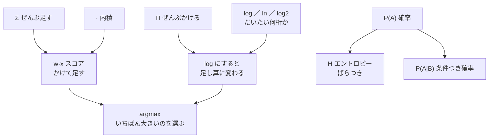

# 付録A4　数式記号の読み方

> **この付録のゴール**
> - 教材に出てきた**数式記号**を、読み方つきの早見表で一気に思い出せる
> - 「記号が出てきたらここを見れば怖くない」を体で覚える
> - **かけ算 → log で足し算**のような、記号どうしのつながりがわかる

> **登場人物**：みどり先生、ツムギ

---

## 「記号が出てきたら、ここに逃げてきていいよ」

**ツムギ**：先生……。本を読んでると、いきなり `Σ` とか `argmax` とか出てくると、
そこで頭が「ピシャッ」って閉じちゃうんです。

**みどり先生**：あわてない、あわてない。
記号はね、**短く書くための「あだ名」**みたいなものなんだ。
こわい意味があるんじゃなくて、長い言葉を1文字にまとめただけ。

**ツムギ**：あだ名……？

**みどり先生**：そう。たとえば `Σ`（シグマ）は「ぜんぶ足してね」っていう一言のあだ名。
毎回「1番目と2番目と3番目と……ぜんぶ足す」って書くのが面倒だから、`Σ` の一文字にしたの。

**ツムギ**：じゃあ、読み方と「気持ち」さえわかれば、こわくない？

**みどり先生**：そのとおり。だからこの付録は**早見表**にしたよ。
記号が出てきて手が止まったら、ここに逃げてきていい。
読み方（カタカナ）と、やさしい意味と、**このコースのどこで出たか**を全部書いてある。

---

## 記号 → 意味のマップ



このマップの読み方：上の段が「部品の記号」、下に行くほど「組み合わせた記号」。
たとえば `·`（内積）と `Σ`（足す）が合わさると `w·x`（スコア）になる、という流れ。
最後はぜんぶ `argmax`（いちばん良いものを選ぶ）に流れこむ。kugiri の心臓部だね。

---

## 早見表（その1）：足す・かける

| 記号 | 読み方 | 意味（やさしく） | どこで出た |
|---|---|---|---|
| `Σ` | シグマ | **ぜんぶ足す**。下に `i`、上に個数を書いて「全部の場所を足してね」 | 第4章・第13章 |
| `Π` | パイ | **ぜんぶかける**。`Σ` のかけ算バージョン | 第15章 |
| `·` | ドット（内積） | **同じ場所どうしをかけて、ぜんぶ足す** | 第4章 |
| `w·x` | ダブリュー・ドット・エックス | 重み `w` と素性 `x` の内積＝**スコア（点数）** | 第4章・第8章 |
| `wᵢ` `xᵢ` | ダブリュー・アイ／エックス・アイ | 添え字 `i` は「**i 番目**」。`w₁` は1番目、`w₂` は2番目 | 第4章 |

> 💡 **こわくないよ**：`Σ` は「足し算の山盛り」、`Π` は「かけ算の山盛り」。
> 山の形（Σ）が「足す」、門の形（Π）が「かける」、と覚えると間違えない。

---

## 早見表（その2）：log のなかま

| 記号 | 読み方 | 意味（やさしく） | どこで出た |
|---|---|---|---|
| `log` | ログ | **だいたい何桁か**を測るものさし | 第5章 |
| `ln` | エルエヌ（自然対数） | **底が e の log**。確率を足し算にするときの定番 | 第5章・第14章・第15章 |
| `e` | ネイピア数（約2.718） | `ln` の底になる、決まった数。円周率 π みたいな「特別な数」 | 第5章 |
| `log2` | ログにのてい（底2のlog） | **2を何回かけたか**。情報の量＝ビットを測る | 第5章・第13章 |

> 💡 **こわくないよ**：log は全部「だいたい何桁か」の仲間。
> 底（した）の数だけが違う。`log2` は「2を何回」、`ln` は「e を何回」かけたか、というだけ。

**みどり先生**：log には「底（てい）」っていう相棒の数があってね。
`log2` は底が2、`ln` は底が e（イー、約2.718…）。
**底が違っても「だいたい何桁か」を測る道具なのは同じ**。あわてない。

---

## 早見表（その3）：確率とエントロピー

| 記号 | 読み方 | 意味（やさしく） | どこで出た |
|---|---|---|---|
| `P(A)` | ピー・エー | **A の起こりやすさ**（確率）。100回やって何回起きるか | 第3章 |
| `P(A\|B)` | ピー・エー・じょうけん・ビー | **B のときの A** の確率（条件つき確率）。「もし B なら、A は？」 | 第3章 |
| `H` | エイチ（エントロピー） | **ばらつき**の大きさ。次に何が来るか読めないほど大きい | 第13章 |

> 💡 **こわくないよ**：`P(A|B)` の縦棒 `|` は「**もし〜のとき**」という区切り。
> 「`B|` の右に書いたほうが条件（前提）」と覚えればOK。

---

## 早見表（その4）：選ぶ・くらべる・その他

| 記号 | 読み方 | 意味（やさしく） | どこで出た |
|---|---|---|---|
| `argmax` | アーグマックス | **いちばん大きくする選択肢**を選ぶ。「最大値」じゃなく「最大にする“もの”」を返す | 第10章・第15章 |
| `−∞` | マイナスむげんだい | **絶対に選ばれない最低スコア**。「ここは通っちゃダメ」の印 | 第10章 |
| `≈` | ニアリーイコール | **だいたい等しい**。「ぴったりじゃないけど、ほぼ同じ」 | （各章） |
| `\|x\|` | ぜったいち／こすう | 文脈による。数なら**絶対値**（プラスにする）、ならびなら**個数**（いくつあるか） | （各章） |

> 💡 **こわくないよ**：`argmax` は「max（最大）」とそっくりだけど一点だけ違う。
> `max` は「いちばん大きい**点数**」、`argmax` は「その点数を出した**選択肢そのもの**」。
> テストで言えば、`max`＝最高点、`argmax`＝最高点を取った**人の名前**。

**ツムギ**：あ、`−∞`（マイナス無限大）って、第10章のバーティが出してた「通行止め」のやつ！

**みどり先生**：よく覚えてたね。Viterbi（ビタビ）で「ここは通っちゃダメ」という道に
`−∞`（どこまでも低い点）を置くと、**いちばん良い道を選ぶときに絶対そこを通らなくなる**。
記号ひとつで「禁止」を表せるんだ。

---

## 記号どうしは、つながっている（だいじ）

**みどり先生**：最後に、いちばん大切な「記号のつながり」を一つだけ。

教師なし学習では、確率を**たくさんかけ算**する。`Π`（パイ）の出番だ。
でも、0.001 × 0.002 × … と小さい数をかけ続けると、答えが小さくなりすぎて
コンピュータが「ほぼ0」と勘違いしてしまう。

**ツムギ**：第4章の最後で先生が言ってたやつだ……。

**みどり先生**：そう。そこで **log の魔法**を使う。
log には「**かけ算を足し算に変える**」という不思議な性質があってね。

```
log(a × b × c)  =  log a + log b + log c
（かけ算 Π）          （足し算 Σ）
```

**つまり `Π`（かける山盛り）に log をかぶせると、`Σ`（足す山盛り）に化ける**。
だから kugiri の中では、確率のかけ算をぜんぶ log にして足し算で計算しているの。
記号は、こうやって手をつないでいるんだよ。あわてない、あわてない。

---

## 手を動かそう

**式を声に出して読んでみよう。**（読めれば勝ち。計算しなくていいよ）

1. $$\mathbf{w}\cdot\mathbf{x} = \sum_{i} w_i \, x_i$$
2. $$\hat{y} = \arg\max_{y} \; \mathbf{w}\cdot\mathbf{x}$$

<details>
<summary>読み方の例</summary>

1. 「**ダブリュー・ドット・エックス** は、**i について wᵢ かける xᵢ を、ぜんぶ足したもの**」
   → 気持ち：「重みと手がかりを、同じ場所どうしかけて、ぜんぶ足してスコアにする」（第4章）

2. 「**ワイハット** は、**y のなかで、w・x をいちばん大きくする y**」
   → 気持ち：「いちばん点数が高くなる答え（ラベル）を選ぶ」（第10章・第15章）
   ※ `ŷ`（ワイハット）の「ハット（帽子 ^）」は「**予想した値**」という印。

</details>

声に出して読めたなら、もう記号はあなたの味方です。

---

## 今日のまとめ

- 記号は「長い言葉のあだ名」。**読み方**と**気持ち**さえわかればこわくない。
- `Σ`＝ぜんぶ足す、`Π`＝ぜんぶかける、`·`＝かけて足す（内積）。
- `log` / `ln` / `log2` はぜんぶ「だいたい何桁か」の仲間。**底だけが違う**。
- `P(A)`＝確率、`P(A|B)`＝もし B のときの A、`H`＝ばらつき。
- `argmax`＝いちばん良い**選択肢**を選ぶ、`−∞`＝絶対通らせない印。
- **`Π` に log をかぶせると `Σ` に化ける**（かけ算→足し算）。これが log の魔法。

---

## アザミメーター

```
アザミの見え具合：██████████ 100%
（コメント：記号が読めるようになった。これでどの章に戻っても、もう道に迷わない！）
```

---

[← 付録A3](A3-yougo-shu.md) ・ [もくじに戻る →](README.md)
