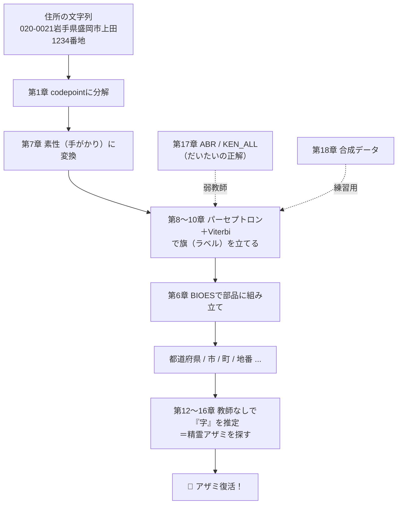

# kugiri 学習コース 〜消えた精霊アザミを探して〜

> **このコースは何？**
> kugiri（区切り）は「住所の文字列を、意味のかたまりごとに切り分ける」ソフトです。
> このコースは、**機械学習（ML）を一度も学んだことがない人**が、
> **中学生レベルの数学**から出発して、kugiri を**自分で実装できる**ところまで行くための、
> 会話形式の長編教材です。

むずかしい数式は出てきますが、**全部その場でかみくだきます**。
微分も、log（ログ）も、確率も、ベクトルも、行列も、「初めて」の前提で進みます。
あわてないで、ゆっくり読んでください。

---

## 🧚 この物語のあらすじ

日本の住所には、名前のついた「住所の部品」がたくさんあります。
都道府県、市、区、町、丁目、番地、号、棟、部屋番号……。

ところが、ひとつだけ **「名前（ラベル）をだれも教えてくれない部品」** があります。
それが **字（あざ）／小字（こあざ）** ——むかしからある、土地の細かい呼び名です。

この「字」の精霊 **アザミ** は、ラベルをもらえなかったせいで、
**半透明になって、姿が見えなくなって**しまいました。

このコースのゴールは、ただの勉強ではありません。
**教えてもらえない「字」を、自分の力で見つけ出す（教師なし学習）**ことで、
**精霊アザミの姿を取りもどす**こと。それが kugiri のいちばんの目的なのです。

各章の終わりには「**アザミの見え具合**」メーターがあります。
あなたが学ぶほど、アザミの輪郭がはっきりしていきます。最後は……お楽しみに。

```
アザミの見え具合：░░░░░░░░░░ 0%   ← いまここ（まだ何も見えない）
```

---

## 👥 登場人物

| | 名前 | 紹介 |
|---|---|---|
| 👩‍🏫 | **みどり先生** | 元・郵便局員のプログラマ先生。たとえ話の達人。口ぐせは「あわてない、あわてない」。 |
| 👧 | **ツムギ** | 中2。主人公。数学はちょっと苦手だけど「なんで？」を大切にする。読者のなかま。 |
| 👦 | **ゲンタ** | 中3。理屈っぽくて「それ、意味あるの？」とツッコむ。じつは面倒見がいい。 |
| 🧚 | **アザミ** | 「字（あざ）」の精霊。ラベルが無いので姿が見えない。学ぶほど見えてくる。 |
| 🐱 | **CPねこ** | Unicode と codepoint にくわしい猫。語尾は「にゃ」。 |
| 📮 | **ポストくん** | 郵便配達ロボット。体に KEN_ALL.CSV を積んでいる。几帳面。 |
| 🐦 | **バーティ** | Viterbi（ビタビ）の小鳥。「いちばん良い道」を一瞬で見つける。 |
| 🤖 | **パーセ** | パーセプトロンのマスコット。間違えると「ごめん！次は気をつける！」 |

---

## 📚 もくじ

### Part 0　ようこそ
- [第0章　消えた精霊と、住所を切る機械](00-prologue.md)

### Part 1　土台：コンピュータと数
- [第1章　コンピュータは文字をどう見ている？（codepoint）](01-moji-to-codepoint.md)
- [第2章　「分類」ってなに？（ルール vs 学習・文字種）](02-bunrui-towa.md)
- [第3章　確率のきほん（数えて、割るだけ）](03-kakuritsu.md)

### Part 2　数学の道具箱（中学数学から）
- [第4章　ベクトルと内積（数字のならびと「かけて足す」）](04-vector-naiseki.md)
- [第5章　log と情報量（だいたい何桁か、を測る魔法）](05-log-to-jouhou.md)
- [付録A1　微分のきほん（なぜ「ちょっとずつ」動かすの？）](A1-bibun-nyuumon.md)

### Part 3　系列ラベリングの心臓部
- [第6章　系列ラベリングと BIOES（住所に旗を立てる）](06-sequence-bioes.md)
- [第7章　素性：手がかりを数字にする](07-sosei-features.md)
- [第8章　パーセプトロン：1個のニューロンで○×を分ける](08-perceptron.md)
- [第9章　構造化パーセプトロンと平均化（学習ループ）](09-structured-perceptron.md)
- [第10章　Viterbi と動的計画法（最良の道を、ズルせず一瞬で）](10-viterbi.md)
- [第11章　評価：適合率・再現率・F1（正解率じゃダメな理由）](11-hyouka-f1.md)

### Part 4　アザミを探せ（教師なし字推定）
- [第12章　残差スロット：字の居場所をつくる](12-zansa-slot.md)
- [第13章　分岐エントロピー：区切り目はどこ？](13-bunki-entropy.md)
- [第14章　PMI：一緒に出てる？それとも、たまたま？](14-pmi.md)
- [第15章　言語モデルと最尤分割（いちばんありそうな切り方）](15-gengo-model-viterbi.md)
- [第16章　教師なし字推定の全工程（アザミ、復活）](16-aza-zentai.md)

### Part 5　弱教師と全体像
- [第17章　弱教師：ABR と KEN_ALL で「だいたいの正解」を作る](17-weak-supervision-abr.md)
- [第18章　合成データと「精度1.000を信じてはいけない」](18-synth-data.md)
- [第19章　全部つなぐ：end-to-end と本番への差し替え](19-zenbu-tsunagu.md)

### Part 6　付録（道具の説明書）
- [付録A2　行列のきほん](A2-gyouretsu.md)
- [付録A3　用語集](A3-yougo-shu.md)
- [付録A4　数式記号の読み方](A4-kigou.md)

---

## 🗺️ 全体マップ

このコースで学ぶことが、kugiri のどこにつながるかの地図です。
（最初は意味がわからなくて大丈夫。最後にもう一度ここを見ると、全部つながります）



---

## 📖 読み方のコツ

- **順番に読む**のがおすすめ。各章は前の章を土台にしています。
- 数式は飛ばさず、でもこわがらず。**読み方とたとえ話**が必ず添えてあります。
- 各章の「**手を動かそう**」では、実際の kugiri のソースコードが出てきます。
  動かしながら読むと、何倍も身につきます。
- わからなくなったら、[付録A3 用語集](A3-yougo-shu.md)と[付録A4 記号の読み方](A4-kigou.md)へ。

---

> **メンテナーのあなたへ**：このコースを読み終えると、kugiri の全ソース
> （`label/` `feature/` `tagger/` `aza/` `abr/` `synth/`）が「なぜそう書いてあるか」
> 説明できるようになります。設計の全体像は [`../DESIGN.md`](../DESIGN.md)、
> 次にやる作業は [`../HANDOFF.md`](../HANDOFF.md) を参照してください。

さあ、[第0章](00-prologue.md)を開きましょう。あわてない、あわてない。
