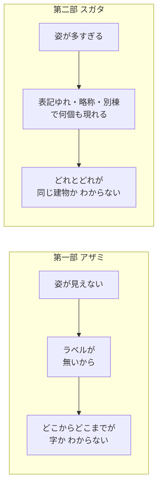
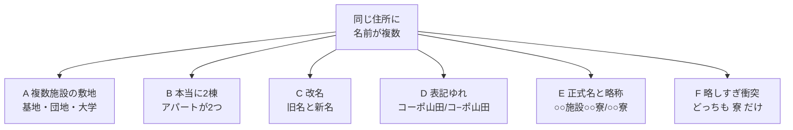
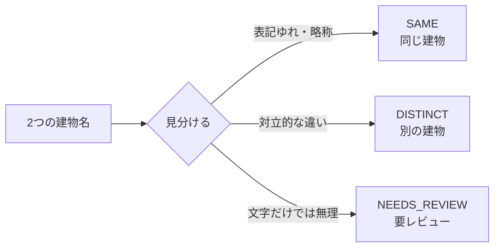

# 第二部 第0章　同じ顔、ちがう名前（スガタ登場）

> **この章のゴール**
> - 第二部が「何を」「なぜ」やるのかを、物語としてつかむ
> - 同じ住所に建物名がいくつも並ぶとき、それが「1棟」か「複数」かを問う面白さに気づく
> - 「複数」の正体は一様でないこと（型A〜F）を、ざっくり知る
> - 判定が **SAME / DISTINCT / NEEDS_REVIEW** の3つになる、という地図を手に入れる

> **登場人物**：みどり先生、ツムギ、ゲンタ、スガタ（新キャラ）、アザミ（カメオ）

---

## 第一部のあと、また放課後のプログラミング室

**ツムギ**：先生〜、第一部おつかれさまでした！　アザミ、ちゃんと見えるようになって、よかったですね。

**アザミ**：……ふふ、おかげさまでね。わたし、もうすけてないでしょう？

**ゲンタ**：ラベルの無い「字（あざ）」を、教師なしで当てて見つける。あれは確かに、意味あったわ。

**みどり先生**：そうだろう。さて——今日からは **第二部** だ。
今度はね、アザミとは **正反対** の精霊が来るよ。

**ツムギ**：正反対……？　アザミは「**姿が見えなさすぎる**」精霊でしたよね。
じゃあ、反対って……？

**みどり先生**：あわてない、あわてない。——スガタ、出ておいで。

**スガタ**：……（と思ったら、いろんな場所に**いくつも**ぼんやり現れる）……
こんにちは。こんにちは。こんにちは。

**ツムギ**：ええっ、なんで **いっぱい** いるんですか！？

**スガタ**：わたしはね、「**同じかどうか**」の精霊なの。
わたしは **いくつもの姿** で、同時に現れる。表記がちょっと違ったり、略されたり、別の棟だったり。
……それでね、わたし自身にも、わからないことがあるの。

> **わたしは“ひとり”なの？　それとも、“別人”が混ざってるの？**

---

## アザミとスガタは、コインの裏表

**みどり先生**：図にするとね、二人はこういう関係なんだ。



**みどり先生**：アザミは「**見えなさすぎて**、境目がわからない」。
スガタは「**見えすぎて**、どれが同じものか、わからない」。
むずかしさの向きが、ちょうど逆なんだよ。

**ゲンタ**：なるほど。第一部は「**切る**」話で、第二部は「**まとめる（同じものを1つにする）**」話、ってことか。

**みどり先生**：その通り。第二部のテーマは **建物の同定（どうてい、identity）**。
「この名前と、あの名前は、**同じ建物**？　それとも**別の建物**？」を見分ける旅だ。

---

## 同じ住所に、よく似た名前がいくつも並ぶ

**みどり先生**：たとえば、郵便や宅配のデータを集めると、同じ住所に、こんな建物名が並ぶことがあるんだ。

```
白雲荘 / 青雲荘
ライオンズマンション梅田 / ライオンズ梅田
コーポ山田 / コ−ポ山田
県立さくら施設さくら寮 / さくら寮
第一宿舎 / 第二宿舎
```

**ツムギ**：うーん……`コーポ山田` と `コ−ポ山田` は、同じですよね？　長音記号がちょっと違うだけで。

**みどり先生**：そう、それは **同じ**。じゃあ `白雲荘` と `青雲荘` は？

**ツムギ**：それは……「白」と「青」だから、**別の建物**？　たぶん？

**みどり先生**：正解。じゃあ `ライオンズマンション梅田` と `ライオンズ梅田` は？　ずいぶん長さがちがうよ。

**ツムギ**：えっ……長さは違うけど、これは……**同じ**な気がします。「マンション」が抜けてるだけ？

**みどり先生**：ばっちり。いまツムギがやったこと、すごく大事なんだ。
**「ちがっている部分が、意味のある対立なのか、ただのノイズ（飾り）なのか」**を、無意識に見分けてた。
これを **機械にやらせる** のが第二部だよ。

**スガタ**：……ね？　わたしの姿は、「1人」だったり「別人」だったりするでしょう。
あなたたちに、見分けてほしいの。

---

## 「複数」の正体は、一様じゃない（型A〜F）

**ゲンタ**：でもさ、「同じ住所に複数の名前」って言っても、理由はいろいろありそうだけど。

**みどり先生**：鋭いな、ゲンタ。まさにそこ。
「複数並んでいる」理由には、いくつかの**型（タイプ）**がある。やさしく並べるとこうだ。



**みどり先生**：1つずつ、たとえで言うとね——

- **A 複数施設の敷地**：自衛隊の基地や、大きな団地。
  ひとつの敷地（site）の中に、宿舎・コンビニ・○○棟……と、**別々の建物がいくつも**ある。
- **B 本当に2棟**：同じ住所に、アパートがほんとに2つ建っている。**別建物**。
- **C 改名**：建物の名前が、途中で変わった。中身は **同じ建物**（昔の名前と今の名前）。
- **D 表記ゆれ**：`コーポ山田` と `コ−ポ山田`。長音や記号がちがうだけ。**同じ**。
- **E 正式名と略称**：`県立さくら施設さくら寮` と `さくら寮`。
  片方が、もう片方の**短い言い方**。**同じ**。
- **F 略しすぎ衝突**：両方とも `寮` とだけ書いてある。
  ……これ、同じ寮かもしれないし、別の寮かもしれない。**文字だけでは決められない**。

**ツムギ**：F、ずるい！　`寮` だけじゃ、ほんとに何もわからない……。

**みどり先生**：そう。そこが正直で大事なところなんだ。
**「わからないものを、わかったふりで決めつけない」**——これも今回のテーマだよ。

---

## だから答えは「3択」になる

**ゲンタ**：てことは、「同じ（SAME）」か「別（DISTINCT）」の2択じゃ足りないんだ。

**みどり先生**：その通り。kugiri の建物同定が出す答えは、**3つ**ある。



> 📌 **3つの答えの読み方**
> - **SAME**（セイム＝同じ）：表記ゆれ（型D）や略称（型E）。**ひとつの建物**。
> - **DISTINCT**（ディスティンクト＝別）：対立的な違いがある（型A/B）。**別の建物**。
> - **NEEDS_REVIEW**（ニーズ・レビュー＝要・見直し）：型Fのように、**文字だけでは決められない**。
>   人や、住所・部屋番号などの**別の証拠**にバトンを渡す。

**みどり先生**：気持ちはこうだ。
**取れるところは統計でビシッと取る。取れないところは、無理に決めず「要レビュー」と正直に言う。**
これが、編集距離（文字の見た目だけ）の昔ながらのやり方には、できなかったことなんだ。

**スガタ**：……「わからない」って、ちゃんと言ってくれるのね。
わたしも、決めつけられるの、こわかったの。

---

## 手を動かそう

第二部のゴールにあたるプロトタイプは、もう動かせます。
9個のペアを、`kugiri` の統計と、昔ながらの編集距離とで「対決」させるデモです。

```bash
mvn -q -f building/pom.xml exec:java \
  -Dexec.mainClass=org.unlaxer.kugiri.building.demo.IdentityProbeDemo \
  -Dstdout.encoding=UTF-8
```

すると、こんなふうに、ペアごとの判定が並びます（イメージ）。

```
=== 建物同定 対決（SAME=同一 / DISTINCT=別 / NEEDS_REVIEW=要レビュー） ===
ペア                          正解          | kugiri        ...
コーポ山田 / コ−ポ山田          SAME          | ○ SAME        ...
白雲荘 / 青雲荘                DISTINCT      | ○ DISTINCT    ...
寮 / さくら寮                  NEEDS_REVIEW  | ○ NEEDS_REVIEW ...
```

いまはまだ「魔法」に見えてOKです。
この一行一行が **なぜそう判定できたのか**、第二部を読み終えるころには全部説明できるようになっています。

---

## 今日のまとめ

- 第二部のテーマは **建物の同定**：2つの建物名が「**同じ建物**か **別の建物**か」を見分ける。
- 第一部のアザミは「**姿が見えなさすぎる**（ラベルが無い）」精霊。
  第二部のスガタは「**姿が多すぎる**（表記ゆれ・略称・別棟）」精霊。むずかしさが逆向き。
- 「同じ住所に複数の名前」は理由がいろいろ＝**型A〜F**
  （A敷地 / B2棟 / C改名 / D表記ゆれ / E略称 / F略しすぎ衝突）。
- だから答えは2択ではなく **SAME / DISTINCT / NEEDS_REVIEW** の **3択**。
  文字だけで決められない型F・Cは、無理せず **要レビュー** に回す。

---

## スガタメーター

```
スガタの見分け：█░░░░░░░░░ 8%
（コメント：物語が始まった。スガタが「いくつもの姿」で来ること、そして
　答えが3択になることが、わかった。何人いるかは、これから見分けていく。）
```

---

## 次回予告

**みどり先生**：まず疑ってみたいのは、いちばん素直なやり方——
「**文字がどれくらい違うか**を数えれば、同じ／別がわかるんじゃない？」というアイデアだ。

**ツムギ**：あ、たしかに。`コーポ山田` と `コ−ポ山田` は、ほとんど同じ字だし……。

**みどり先生**：ところが、それが**みごとに罠**なんだ。
`白雲荘` と `青雲荘` は1文字ちがいなのに別建物。逆に長さがぜんぜん違うのに同じ建物もある。
次の章は、その **白雲荘の罠** から始めよう。あわてない、あわてない。

[← 第一部 もくじ](../study/README.md) ・ [第1章 →](01-kyori-no-wana.md)
