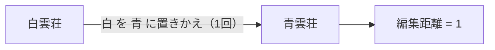
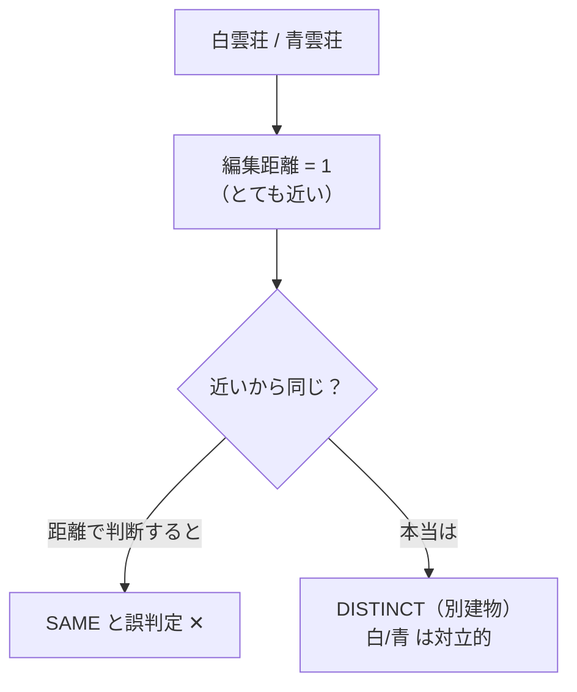
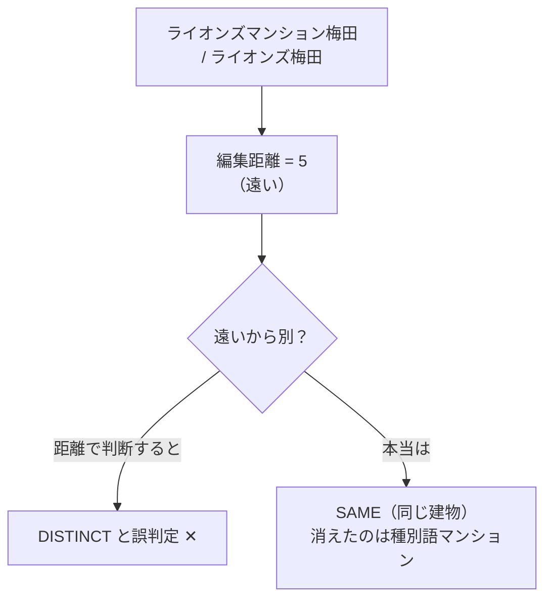
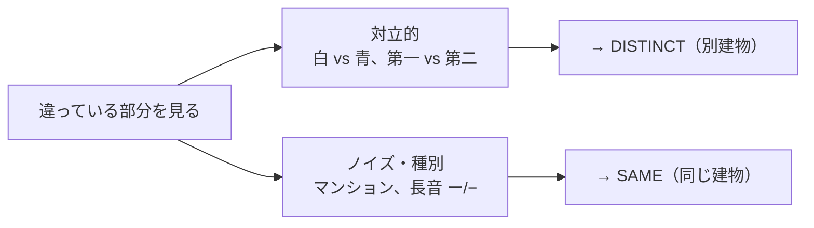
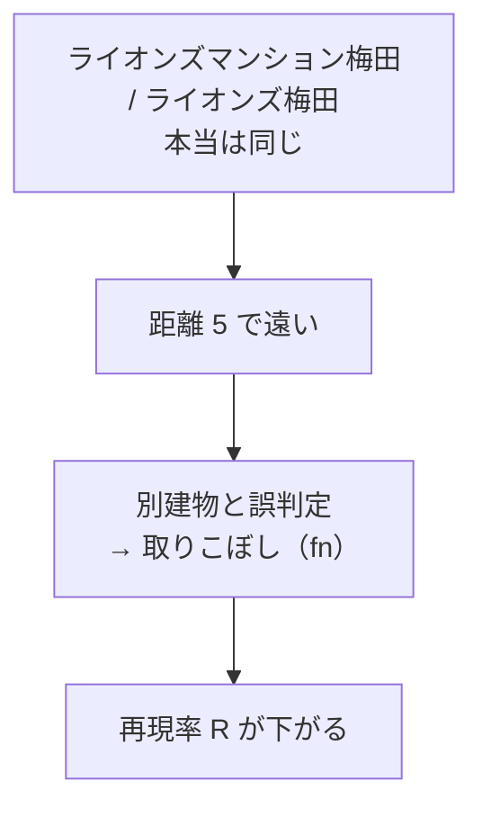

# 第二部 第1章　文字列距離だけでは解けない（白雲荘の罠）

> **この章のゴール**
> - **編集距離（へんしゅうきょり、Levenshtein distance）** が「1文字直すのに何回かかるか」だと分かる
> - 「距離が小さい＝同じ建物」とは**限らない**ことを、白雲荘/青雲荘の罠で体感する
> - 効くのは「距離の大きさ」ではなく「**違っている部分が対立的か、ノイズか**」だと気づく
> - 距離ベースの昔のやり方が、recall（取りこぼしの少なさ）で弱い理由をつかむ

> **登場人物**：みどり先生、ツムギ、ゲンタ、スガタ

---

## まずは、いちばん素直なアイデアから

**ツムギ**：先生、考えてきました！　`コーポ山田` と `コ−ポ山田` って、ほとんど同じ字ですよね。
だから、「**文字がどれくらい違うか**」を数えて、少なければ同じ建物、ってことでいいんじゃ？

**みどり先生**：すばらしい。それはね、ちゃんと名前のある考え方なんだ。
**編集距離（へんしゅうきょり、Levenshtein distance、レーベンシュタイン距離）** という。

**ゲンタ**：編集距離……？　それ、意味あるの？

**みどり先生**：あるある。あわてない、あわてない。まず「編集距離って何か」から行こう。

---

## 編集距離：1文字直すのに、何回かかる？

**みどり先生**：編集距離はね、「**片方の言葉を、もう片方に作り変えるのに、最低何回の手直しがいるか**」を数えた数字だよ。
手直しは3種類だけ。

> 📌 **3つの手直し**
> - **置きかえ**（substitution）：1文字を別の文字に変える（`白`→`青`）
> - **足す**（insertion）：1文字を差し込む
> - **消す**（deletion）：1文字を取りのぞく

**みどり先生**：それぞれ **1回 = 距離1** と数える。やってみよう。
`白雲荘` を `青雲荘` にするには？

**ツムギ**：「白」を「青」に置きかえるだけ……だから **1回**！

**みどり先生**：その通り。だから `白雲荘` と `青雲荘` の編集距離は **1**。図にするとこう。



**ゲンタ**：じゃあ、足したり消したりが必要なときは？

**みどり先生**：たとえば `さくら寮` から `寮` にするなら、「さ」「く」「ら」の3文字を消すから、距離は **3**。
逆に「足す」ほうから見ても同じ。**少ないほうの手直しの回数**が距離になる。

---

## 罠その1：距離が小さいのに、別の建物

**みどり先生**：さて、ここで問題だ。`白雲荘` と `青雲荘` の距離は1だったね。
じゃあこの2つは——**同じ建物**かな？

**ツムギ**：1文字しか違わないし……同じ、って言いたくなりますけど……。

**スガタ**：……ふふ。わたし、ここでは **別人** なの。
「白雲荘」さんと「青雲荘」さんは、本当に別々の建物。

**ツムギ**：ええっ！？　1文字ちがいなのに！？

**みどり先生**：そうなんだ。`白` と `青` は、**色のちがい**＝意味のある対立だ。
人間だって、隣に建つ「白雲荘」と「青雲荘」を、わざわざ別の名前にして区別している。
**距離は1（とても近い）。でも答えは DISTINCT（別建物）**。



**ゲンタ**：……距離が小さいから同じ、ってのが崩れたな。

---

## 罠その2：距離が大きいのに、同じ建物

**みどり先生**：逆もあるんだ。`ライオンズマンション梅田` と `ライオンズ梅田` の編集距離は、いくつだと思う？

**ツムギ**：「マンション」の5文字を消す……から、**距離は5**！　けっこう大きい！

**みどり先生**：そう。距離5は「だいぶ違う」に見えるよね。じゃあ別建物かな？

**ツムギ**：あれ……でも、これは前に「同じ」って言いましたよね。「マンション」が抜けてるだけで……。

**みどり先生**：その通り。`マンション` は、建物の**種類**を表すだけの、ありふれた言葉。
あってもなくても、どの建物かは `ライオンズ` と `梅田` で決まる。
だから **距離5（遠い）。でも答えは SAME（同じ建物）**。



**スガタ**：……ね？　わたし、ここでは「ひとり」なの。
名前が長かったり短かったりするけど、中身は同じ建物。

---

## 何が本当に効いているのか

**ゲンタ**：整理すると……距離1で別建物（白雲荘/青雲荘）、距離5で同じ建物（ライオンズ…）。
**距離の大きさ**では、同じ／別を分けられない、ってことか。

**みどり先生**：まさにそれ。表で見ると、はっきりするよ。

| ペア | 編集距離 | 本当の答え |
|---|---|---|
| 白雲荘 / 青雲荘 | **1（近い）** | DISTINCT（別） |
| ライオンズマンション梅田 / ライオンズ梅田 | **5（遠い）** | SAME（同じ） |

**みどり先生**：距離が小さい・大きいは、答えと**かみ合っていない**だろう？
本当に効いているのは、距離の**大きさ**じゃない。**違っている部分が「どういう種類」か**なんだ。



> 📌 **この章のいちばん大事なこと**
> 同じ／別を分けるのは「**どれだけ違うか（距離の大きさ）**」ではなく、
> 「**違っている部分が、対立的（意味のある区別）か、それともノイズ・種別語（飾り）か**」。
> - `白` vs `青`、`第一` vs `第二` = **対立的** → 別建物
> - `マンション`、`ー`/`−`（長音記号）= **ノイズ・種別** → 同じ建物

**ツムギ**：あ……だから前の章で、わたし「無意識に見分けてた」って言われたんだ。
わたしは距離じゃなくて、「**違う部分が大事な区別かどうか**」を見てたんですね。

**みどり先生**：その通り。第二部は、その**人間の勘**を、コンピュータに学ばせる旅なんだ。

---

## 昔のやり方（編集距離）は、なぜ取りこぼすのか

**ゲンタ**：先生。じゃあ、いまある建物システムは、どうやってるの？

**みどり先生**：第一部で出会う前の「building-hierarchy」（BH と呼ぶ）という既存システムは、
まさに **編集距離（とトークンの重なり）** で「同じ／別」を分けていたんだ。
そして、第一部 第11章でやった **適合率P・再現率R・F1** を思い出してほしい。

**ツムギ**：P が「空振りの少なさ」、R が「取りこぼしの少なさ」、F1 がその合体ですよね。

**みどり先生**：よく覚えてた。BH の編集距離方式は、その数字がこうだったんだ。

| 指標 | 値 | 気持ち |
|---|---|---|
| 適合率 P | **0.96** | 「同じだ」と言ったときは、わりと当たっている |
| 再現率 R | **0.39** | でも、本当に同じものを **6割も取りこぼしている** |

**ゲンタ**：R が 0.39 ……第11章の「取りこぼしが多い機械」そのものだ。

**みどり先生**：そう。なぜ取りこぼすか、もう君たちにはわかるね。



**みどり先生**：`ライオンズマンション梅田` のように、種別語が抜けて距離が開くと、編集距離は「別だ」と切ってしまう。
本当は同じなのに取りこぼす＝**fn（取りこぼし）が増えて、R が下がる**。
逆に `白雲荘`/`青雲荘` は距離が近すぎて、こちらは「同じ」とくっつけてしまう誤りもある。

**スガタ**：……距離だけだと、わたしの「ひとり」と「別人」が、あべこべになっちゃうのね。

**みどり先生**：その通り。だから第二部では、**違いの「種類」を見抜く統計**を足していく。
種別語を消す道具（次章のPMI）、対立的かどうかを測る道具（分岐エントロピー）——
ぜんぶ、第一部でアザミのために学んだ道具の **再利用** だよ。

---

## 手を動かそう

実際のコードで、編集距離がどう計算されているか見てみましょう。
ファイルは `building/src/main/java/org/unlaxer/kugiri/building/identity/BuildingIdentity.java`、メソッドは **`levenshtein`** です。

```java
// BuildingIdentity.levenshtein：a を b に作り変える最小手直し回数（＝編集距離）
static int levenshtein(String a, String b) {
    int[] prev = new int[b.length() + 1], cur = new int[b.length() + 1];
    for (int j = 0; j <= b.length(); j++) prev[j] = j;
    for (int i = 1; i <= a.length(); i++) {
        cur[0] = i;
        for (int j = 1; j <= b.length(); j++) {
            int cost = a.charAt(i - 1) == b.charAt(j - 1) ? 0 : 1; // 同じ字なら0、違えば1
            cur[j] = Math.min(Math.min(cur[j - 1] + 1, prev[j] + 1), prev[j - 1] + cost);
            //                   足す(+1)        消す(+1)      置きかえ(+cost)
        }
        int[] t = prev; prev = cur; cur = t;
    }
    return prev[b.length()];
}
```

> 📌 **読み方メモ**
> `Math.min(...)` は「**いちばん小さいものを選ぶ**」関数。
> 各マスで「足す・消す・置きかえ」の3つの手のうち、**いちばん回数が少ない道**を選び続けています。
> これは第一部 第10章の Viterbi（いちばん良い道を選ぶ）と、考え方の親戚です。

そして、距離をそのまま「同じ／別」に使うベースラインが **`editNormalized`** です。

```java
// BuildingIdentity.editNormalized：距離を 0〜1 の「類似度」に直してしきい値判定
public static Verdict editNormalized(String a, String b, double t) {
    double sim = sim(searchKey(a), searchKey(b)); // sim = 1 - 距離/長さ
    return sim >= t
            ? new Verdict(Decision.SAME, ...)       // 似ていれば同じ
            : new Verdict(Decision.DISTINCT, ...);   // 似てなければ別
}
```

**ゲンタ**：`sim = 1 - 距離/長さ` ……距離が0なら類似度1（そっくり）、距離が大きいほど0に近づく、ってことか。

**みどり先生**：その通り。これが「距離だけで判断する」昔ながらの方式だ。
そして大事なのは——**この方式には `NEEDS_REVIEW` が出せない**こと。SAME か DISTINCT、2つに1つしか言えない。
だから、型F（略しすぎ衝突）のような「文字だけでは無理」な場面で、必ず外すんだ。

---

### 計算練習（紙とえんぴつで）

編集距離を、手で数えてみましょう。

**問題1**：`コーポ山田` と `コ−ポ山田`（2文字目が長音記号 `ー`／`−`）の編集距離は？

<details>
<summary>こたえ</summary>

2文字目の `ー` を `−` に**置きかえる**だけなので、**距離1**。
ただし kugiri は判定の前に `searchKey`（後の章で詳しく）で長音や記号を消すので、
実際は両方 `コポ山田` のように **同じキー**になり、距離は **0**＝即 SAME になります。
これが型D（表記ゆれ）です。

</details>

**問題2**：`第一宿舎` と `第二宿舎` の編集距離は？　そして、答えは SAME / DISTINCT のどっち？

<details>
<summary>こたえ</summary>

`一` を `二` に置きかえるだけなので、**距離1**（とても近い）。
でも答えは **DISTINCT（別建物）**。`第一` と `第二` は順番をあらわす**対立的**な違いだからです。
これも「距離が小さい＝同じ」が崩れる例。次章以降で、この「対立的」を統計で見抜きます。

</details>

---

## 今日のまとめ

- **編集距離（Levenshtein）** ＝「片方をもう片方に作り変える最小の手直し回数」。手直しは置きかえ・足す・消すの3種、各1回。
- 距離が小さくても別建物（`白雲荘`/`青雲荘`＝距離1だが DISTINCT）。
  距離が大きくても同じ建物（`ライオンズマンション梅田`/`ライオンズ梅田`＝距離5だが SAME）。
- だから **「距離の大きさ」では同じ／別を分けられない**。
- 効くのは「**違っている部分が、対立的（意味のある区別）か、ノイズ・種別語（飾り）か**」。
- 昔ながらの編集距離方式（BH）は、適合率P=0.96 と高いが **再現率R=0.39** と低く、`ライオンズ…`のように種別語が抜けて距離が開く同一物を **取りこぼす**。`白雲荘`/`青雲荘` のような対立的近接も誤る。
- 編集距離だけでは **NEEDS_REVIEW を出せない**ので、型Fでは必ず外す。

---

## スガタメーター

```
スガタの見分け：██░░░░░░░░ 18%
（コメント：「距離が近い＝同じ」という思い込みを捨てられた。
　見るべきは“違いの大きさ”ではなく“違いの種類”だと、輪郭が少し見えてきた。）
```

---

## 次回予告

**みどり先生**：「違いの種類を見る」と言ったね。そのためには、まず——
`マンション` や `荘` のような「**ありふれていて、建物を見分けるのに役立たない言葉**」を、
見分けて消せるようにしないといけない。

**ツムギ**：あ、それって第一部の……PMIとか、分岐エントロピーで「ありふれた語」を扱ったやつ……？

**みどり先生**：その通り！　アザミのために学んだ道具が、そっくり役に立つ。
次は **種別語と固有名核**、そして略称を解く **包含** の話だ。あわてない、あわてない。

[← 第0章](00-prologue.md) ・ [第2章 →](02-hougan-to-kaku.md)
