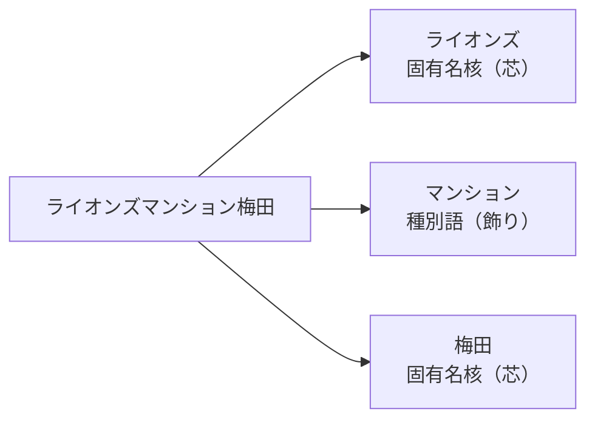
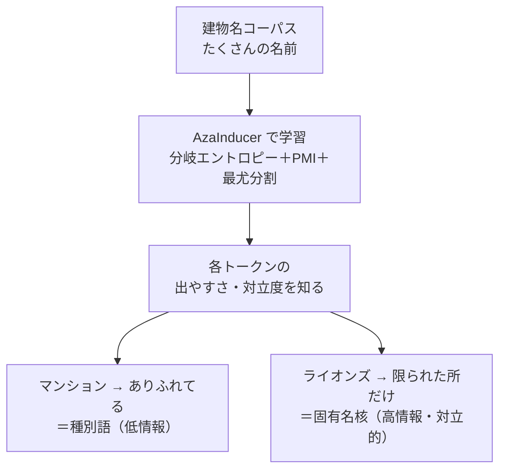
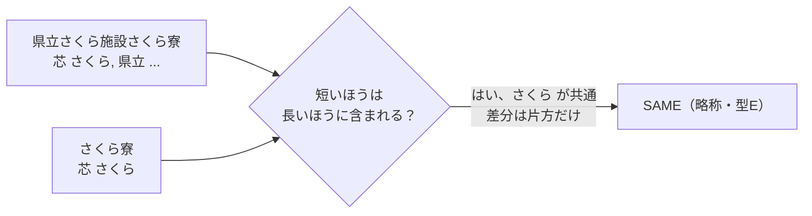
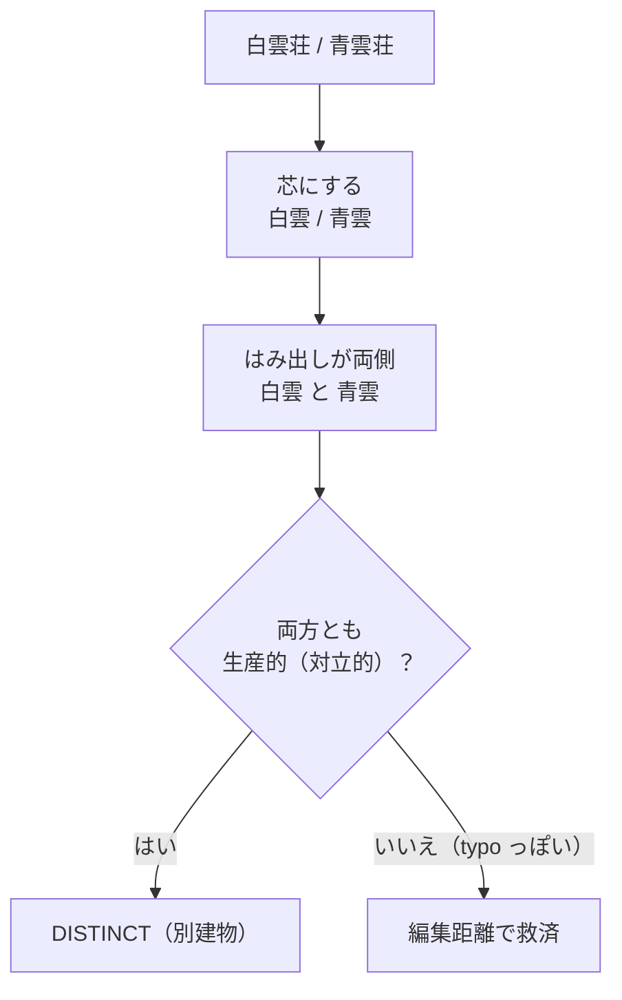
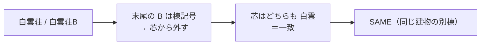
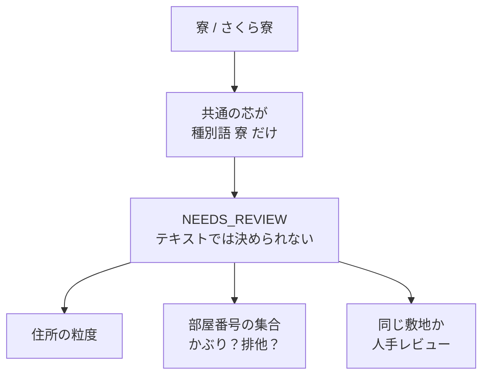
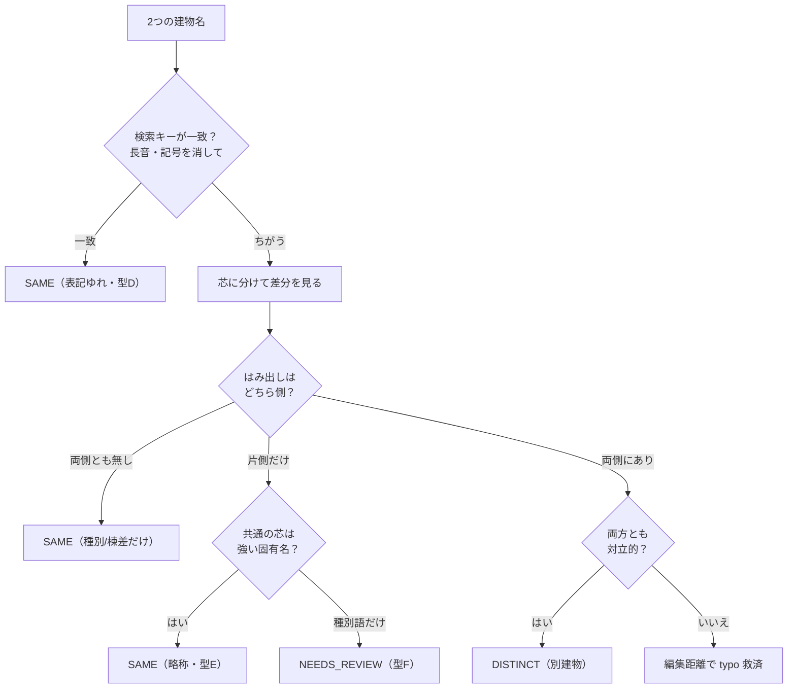
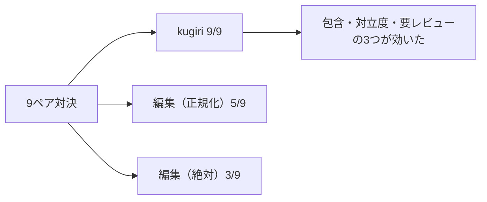

# 第二部 第2章　種別語と固有名核、そして包含（略称のしくみ）

> **この章のゴール**
> - **種別語**（マンション・荘・寮…）と **固有名核**（その建物を見分ける芯）のちがいが分かる
> - 第一部のPMI／分岐エントロピーが「ありふれた語＝低情報」を測る道具だったと思い出す
> - **包含（ほうがん、Overlap）** で略称を解き、**対立度** で別建物を見抜く考え方をつかむ
> - 型F（略しすぎ衝突）は断定せず **NEEDS_REVIEW** に回す理由が分かる
> - プロトタイプが 9ペアで **9/9** を当て、編集距離（5/9・3/9）に勝つことを確かめる

> **登場人物**：みどり先生、ツムギ、ゲンタ、スガタ

---

## 名前は「芯」と「飾り」でできている

**みどり先生**：前章で「違いの**種類**を見る」と言ったね。今日はその第一歩。
建物の名前を、よく見てみよう。`ライオンズマンション梅田`。これ、どの部分が「この建物」を**見分けて**いると思う？

**ツムギ**：えーと……`ライオンズ` と `梅田`？　`マンション` は、なんか……どの建物にもありそう。

**みどり先生**：大正解。`マンション` は **種別語（しゅべつご）**＝建物の**種類**を表すだけの言葉。
`荘`・`寮`・`コーポ`・`ハイツ`・`ビル`……みんな仲間だ。これだけでは、どの建物かは決まらない。
一方 `ライオンズ` や `梅田` は **固有名核（こゆうめいかく）**＝その建物を見分ける**芯**だよ。



**ゲンタ**：芯と飾り、か。で、それをどうやって機械に見分けさせるの？　手で「マンションは飾り」って書くの？

**みどり先生**：それだと第一部の最初に戻っちゃうね。「ルールを全部書くのは無理」だった。
だから——**統計で自動的に**見分ける。ここで第一部の道具が効くんだ。

---

## 思い出そう：ありふれた語は「情報が少ない」

**みどり先生**：あわてない、あわてない。第一部の第13章・第14章を思い出して。
**分岐エントロピー** と **PMI** をやったね。あれは何を測る道具だった？

**ツムギ**：分岐エントロピーは……ある文字のあと、次にいろんな字が来る「**散らばり具合**」でしたっけ。
散らばってる＝区切り目っぽい。

**みどり先生**：そう。そして PMI は「2語が**たまたま隣にいるだけ**か、**いつも一緒**か」を測った。
ここで大事なのは、その裏にある考え方——**「ありふれた語ほど、情報が少ない」** だ。

> 📌 **情報量（じょうほうりょう）の気持ち**（第一部 第5章）
> - めったに出ない言葉が出たら「お、めずらしい！」＝**情報が多い**。
> - どこにでも出る言葉が出ても「ふーん」＝**情報が少ない**。
> - `log`（ログ、「だいたい何桁か」を測るものさし）で測ると、めずらしさ＝情報量になる。

**みどり先生**：`マンション` や `荘` は、**どの建物名にも出てくる**。だから情報が少ない＝種別語。
`ライオンズ` は、特定の系列の建物にだけ出る。だから情報が多い＝固有名核。
この差を、コーパス（建物名をたくさん集めたもの）の**統計**から自動で測るんだ。



**みどり先生**：図の `AzaInducer` は、第一部でアザミの「字」を教師なしで誘導した、あの道具そのものだよ。
建物名コーパスに対して同じ `fit`（学習）をかけて、**建物名版の語彙**を作る。これを `BuildingLexicon` と呼ぶ。

---

## 道具1：包含（Overlap）で「略称」を解く

**みどり先生**：さて、ここからが本番。まず **略称** を解こう。
`県立さくら施設さくら寮` と `さくら寮`。これ、同じ建物だったね。どう見抜く？

**ツムギ**：`さくら寮` のほうが、`県立さくら施設さくら寮` の中に**まるっと入ってる**……？

**みどり先生**：それだ！　それを **包含（ほうがん、Overlap）** という。
両方の名前を芯（固有名核）のトークンに分けて、**片方の芯が、もう片方の芯にすっぽり入っている**なら、それは略称＝同じ建物のサインだ。



> 📌 **包含（Overlap）の気持ち**
> 2つの芯の集合をくらべて、**片方が他方の部分集合**（はみ出しが片側だけ）なら、
> 短いほうは長いほうの**略称**。だから **SAME**。
> `マンション` のような種別語が抜けるのも、この「片側だけはみ出し」の特例として同じく拾える。

**みどり先生**：ここで注意。共通している芯が **`さくら` のような強い固有名**ならいい。
でも、共通しているのが `寮` だけ——つまり **種別語しか共通していない**ときは？

**スガタ**：……それが、わたしの「型F」なの。`寮` と `さくら寮` は、共通が `寮` だけ。
同じ寮かもしれないけど、別の寮の略しすぎかもしれない。決めつけないで……。

**みどり先生**：その通り。だから「包含しているけど、共通が**種別語だけ**」のときは、
SAME と断定せず **NEEDS_REVIEW** にする。文字だけでは無理、と正直に言うんだ。

---

## 道具2：対立度（生産的トークン）で「別建物」を見抜く

**みどり先生**：次は逆。`白雲荘` と `青雲荘` を「別建物」と見抜く道具だ。
芯に分けると、`白雲` と `青雲`。**両方に、相手にない芯がある**（はみ出しが両側）。

**ゲンタ**：両側にはみ出してたら、別ってこと？

**みどり先生**：もうひと押し要る。そのはみ出した芯が **対立的（生産的）** かどうかを見る。
ここで言う **生産的（せいさんてき、productive）** とは——

> 📌 **生産的（対立的）トークンとは**
> その固有名トークンが、コーパスの中で **複数の別々の建物に現れる**＝
> 「ほかの芯と入れ替わって、建物を区別するのに使われている」トークン。
> `白雲`/`青雲`、`第一`/`第二`、`梅田`/`難波` のように、**入れ替えると別の建物を指す**もの。

**みどり先生**：`白雲` と `青雲` は、どちらも「色＋雲」で建物を作り分けている＝生産的。
両側のはみ出しが**どちらも生産的**なら、それは意味のある対立＝**DISTINCT（別建物）**。



**ツムギ**：あ、`梅田` と `難波` も同じですね。両方とも、ほかの土地名と入れ替わる＝対立的だから、別建物。

**みどり先生**：その通り。これが第一部の「ありふれた語は低情報」の応用だ。
**ありふれてない（＝特定の建物を区別する）芯どうしがぶつかっていたら、別建物**なんだよ。

---

## 道具3：enumerator（第N・A棟）は、棟か順番か

**みどり先生**：もう一つ、特別あつかいする記号がある。**enumerator（イニュメレータ、番号づけ）** だ。

**ゲンタ**：イニュメ……？

**みどり先生**：`第一`・`第二` のような**順番**や、`A`・`B`、`東棟`・`西棟` のような**棟の記号**だね。
これらは「**並んだものを区別する**」ための、対立的な記号として扱う。

**みどり先生**：ただし、ここがデリケート。`白雲荘` と `白雲荘B` を見て。

**ツムギ**：`B` がついてるだけ……同じ建物の、B棟？

**みどり先生**：そう。`白雲荘` の芯はそのままで、末尾に `B`（棟記号）が足されただけ。
芯（`白雲`）は共通で、はみ出しは棟記号 `B` だけ。これは **同じ建物の別棟＝SAME** とみなす。



> 📌 **「対立的か」「棟か」の見分け**
> - `第一宿舎` vs `第二宿舎` … 芯の**位置で対立**＝別建物（DISTINCT）。
> - `白雲荘` vs `白雲荘B` … 芯は同じで、末尾に**棟記号が足されただけ**＝同じ建物（SAME）。
> 同じ「番号っぽい記号」でも、芯を分けているのか、棟として足されているのかで意味が逆になります。

---

## 型F は断定しない：NEEDS_REVIEW へ

**スガタ**：……わたしの一番むずかしい姿、型F。`寮` と `さくら寮`。

**みどり先生**：そう。`寮` には固有名核が無い（種別語だけ）。
`さくら寮` の略しすぎかもしれないし、まったく別の寮の略かもしれない。
**文字の情報を、もう使い切ってしまっている**。

**ゲンタ**：……無理に SAME か DISTINCT を選ぶと、半分はずれるな。

**みどり先生**：その通り。だから kugiri は **NEEDS_REVIEW（要レビュー）** を返す。
そして次の証拠にバトンを渡すんだ。



**みどり先生**：住所がどこまで細かいか、部屋番号の集合がかぶっているか排他か、同じ敷地か——
そういう **文字以外の証拠** で最後に決める（これは第7章以降の永続化で扱う）。
**「わからないことを、わからないと言える」**——これが、編集距離にはできなかった一番の進歩だよ。

---

## 全部つなげる：判定の流れ

**みどり先生**：道具がそろった。実際の判定は、こういう順番で進む。



**ツムギ**：上から順に、「表記ゆれ？」「芯のはみ出しは片側？両側？」「共通は強い固有名？」って、ふるいにかけていくんですね。

**みどり先生**：その通り。第一部で学んだ統計（PMIで種別語を消す・対立度で別建物）が、この一本のふるいになっているんだ。

---

## 手を動かそう

実際のコードを読みましょう。
ファイルは `building/src/main/java/org/unlaxer/kugiri/building/identity/BuildingIdentity.java`、中心のメソッドは **`contrastive`** です。さっきの流れ図が、そのままコードになっています。

```java
// BuildingIdentity.contrastive：上の流れ図そのもの
public static Verdict contrastive(String a, String b, BuildingLexicon lex) {
    if (searchKey(a).equals(searchKey(b)))                  // ① 検索キー一致＝表記ゆれ
        return new Verdict(Decision.SAME, "検索キー一致（notation・型D）");

    Set<String> ca = core(a, lex), cb = core(b, lex);       // 芯（固有名核）に分ける
    Set<String> inter  = ...; inter.retainAll(cb);          // 共通の芯
    Set<String> extraA = ...; extraA.removeAll(cb);         // a だけのはみ出し
    Set<String> extraB = ...; extraB.removeAll(ca);         // b だけのはみ出し

    if (extraA.isEmpty() && extraB.isEmpty())               // ② はみ出し両側なし
        return new Verdict(Decision.SAME, "固有名核が一致（種別/棟差のみ）: " + ca);

    if (extraA.isEmpty() ^ extraB.isEmpty()) {              // ③ はみ出しが片側だけ＝包含
        boolean sharedStrong = inter.stream().anyMatch(lex::isProductive);
        return sharedStrong
                ? new Verdict(Decision.SAME, "包含＝略称（型E）共有核 " + inter)
                : new Verdict(Decision.NEEDS_REVIEW, "包含だが共有核が汎用語のみ（型F）: " + inter);
    }

    boolean aC = allContrastive(extraA, lex), bC = allContrastive(extraB, lex);
    if (aC && bC)                                           // ④ 両側のはみ出しが対立的
        return new Verdict(Decision.DISTINCT, "対立的差分 " + extraA + " vs " + extraB);

    Verdict fb = editNormalized(a, b, 0.72);               // ⑤ それ以外は typo 救済
    return new Verdict(fb.decision(), "非対立差分→編集距離: " + fb.reason());
}
```

> 📌 **記号の読み方メモ**
> - `^`（ハット）はここでは「**排他的論理和**（どちらか一方だけが真）」。
>   `extraA.isEmpty() ^ extraB.isEmpty()` ＝「はみ出しが**片側だけ空**（＝もう片側にだけある）」＝**包含**の形。
> - `retainAll` ＝「共通だけ残す（積集合）」、`removeAll` ＝「相手にあるものを引く（差集合）」。

そして「芯にする」`core` と、種別語を消す `BuildingLexicon` がこう連携しています。

```java
// BuildingIdentity.core：segment（トークン分割）から、末尾の棟記号を1つ外す
static Set<String> core(String name, BuildingLexicon lex) {
    List<String> toks = new ArrayList<>(lex.segment(name)); // AzaInducer で分割
    if (toks.size() >= 2) {
        String last = toks.get(toks.size() - 1);
        if (WING_TAIL.matcher(last).matches()) toks.remove(toks.size() - 1); // 末尾の棟記号を外す
    }
    return new LinkedHashSet<>(toks);
}
```

```java
// BuildingLexicon：建物名コーパスから AzaInducer で語彙を学ぶ
public static BuildingLexicon learn(List<String> corpus) {
    AzaInducer inducer = new AzaInducer(2, 1, 8, 0.0, 0.4, 0.3, 0.5).fit(corpus); // 第一部と同じ誘導
    ...
}
// 生産的（対立的）か：複数の建物名に出て（df>=2）、かつ汎用語でない
public boolean isProductive(String token) { return df(token) >= 2 && !isGeneric(token); }
```

**ゲンタ**：`df(token) >= 2` ……「2つ以上の建物名に出てくる」＝いろんな建物に現れる＝対立的、ってことか。
`!isGeneric` で、`マンション` みたいな種別語は除いてるんだな。

**みどり先生**：その通り。`isGeneric` は、最小の seed（`マンション`・`荘`・`寮`…）か、超高頻度のトークンを「ありふれた語」とみなす。
Phase1 では、これを PMI で完全自動化していく予定だ。いまは「第一部の統計で芯と飾りを分ける」骨格ができている、と読めれば十分。

---

## 実証：プロトタイプ対決の結果

**ツムギ**：で、結局どれくらい当たるんですか！？

**みどり先生**：第0章で動かした `IdentityProbeDemo`、あれが答えだ。
9個のペア（型D・E・B・A・typo・棟差・F）で、3つの方式を**対決**させると——

| 方式 | 正答 | 気持ち |
|---|---|---|
| **kugiri 統計（包含＋対立度）** | **9 / 9** | 略称も別建物も型Fも当てる |
| 編集距離（正規化, BH現行相当） | 5 / 9 | 種別語の抜けや対立近接で外す |
| 編集距離（絶対≤4, BH legacy相当） | 3 / 9 | しきい値が硬く、さらに外す |

**ゲンタ**：kugiri だけ全問正解か。なんで距離は外すんだっけ？

**みどり先生**：前章の罠だよ。
- `県立さくら施設さくら寮` / `さくら寮` … 距離が遠くて、距離方式は **別** と誤る。kugiri は **包含で SAME**。
- `ライオンズ梅田` / `ライオンズ難波` … 距離は近いが、`梅田`/`難波` が対立的。kugiri は **DISTINCT**。
- `寮` / `さくら寮` … 距離方式は SAME か DISTINCT のどちらかに**必ず倒れる**。kugiri だけ **NEEDS_REVIEW** と言える。



**みどり先生**：もう一度動かして、`理由` の欄も読んでみよう。各ペアが**なぜ**そう判定されたかが、日本語で出るよ。

```bash
mvn -q -f building/pom.xml exec:java \
  -Dexec.mainClass=org.unlaxer.kugiri.building.demo.IdentityProbeDemo \
  -Dstdout.encoding=UTF-8
```

> 📌 これは**合成コーパスでの概念実証（Phase0）**です。第一部 第11章でやった通り、
> 合成データの好成績を「実力」と思い込まないこと。型F・Cの**最終確定**は、住所粒度・部屋集合という
> 文字以外の証拠（第7章以降）と人手レビューに委ねます。

**スガタ**：……9つの姿のうち、9つとも、ちゃんと見分けてもらえた。
わたしが「ひとり」のときも「別人」のときも、「わからない」ときも、正直に言ってくれたのね。

---

## 今日のまとめ

- 建物名は **固有名核（芯：ライオンズ・梅田・さくら）** と **種別語（飾り：マンション・荘・寮）** でできている。
- 種別語＝**ありふれていて情報が少ない**。これを第一部のPMI／分岐エントロピー（`AzaInducer`）で自動的に見分ける（`BuildingLexicon`）。
- **包含（Overlap）**：片方の芯が他方にすっぽり入る＝**略称**（型E）→ SAME。種別語の省略もこの特例。
- **対立度（生産的トークン）**：両側のはみ出しが、どちらも複数の建物を区別する芯（`白雲`/`青雲`、`梅田`/`難波`）＝**別建物**（型A/B）→ DISTINCT。
- **enumerator**：`第N` は順番の対立（別建物）、末尾の `A`/`B`/`棟` は棟記号（同じ建物の別棟）。
- **型F（略しすぎ衝突）**：共通が種別語だけ（`寮`/`さくら寮`）＝テキスト不能 → **NEEDS_REVIEW**。住所・部屋証拠と人手へ。
- プロトタイプ `IdentityProbeDemo` は 9ペアで **kugiri 9/9**、編集距離は **5/9（正規化）・3/9（絶対）**。合成での概念実証。

---

## スガタメーター

```
スガタの見分け：███░░░░░░░ 32%
（コメント：芯と飾りを分け、包含で略称を、対立度で別建物を見抜けるようになった。
　9つの姿が、ちゃんと見分けられた。スガタの顔のあたりが、はっきりしてきた！）
```

---

## 次回予告

**みどり先生**：今日は「対立的かどうか」をざっくり使ったね。
次の章では、その **対立度** を、第一部の **分岐エントロピー** でもっとちゃんと測りなおす。
「この違いは、ほんとうに意味のある対立？　それとも、ただのノイズ？」を、数字で言えるようにしよう。

**ツムギ**：分岐エントロピー、また会えるんですね！

**みどり先生**：そう、第一部の道具は、第二部でもずっと相棒だ。あわてない、あわてない。

[← 第1章](01-kyori-no-wana.md) ・ [第3章 →](03-clustering.md)
