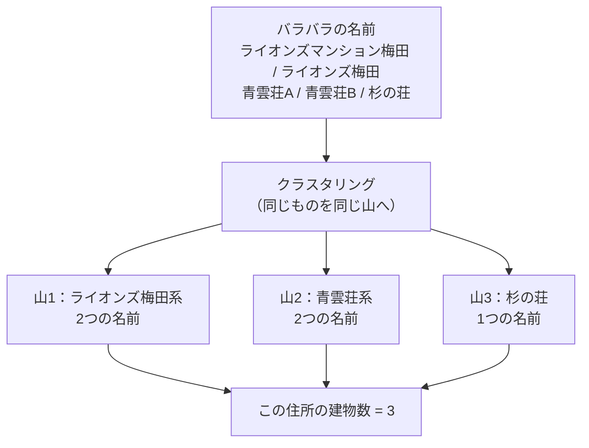
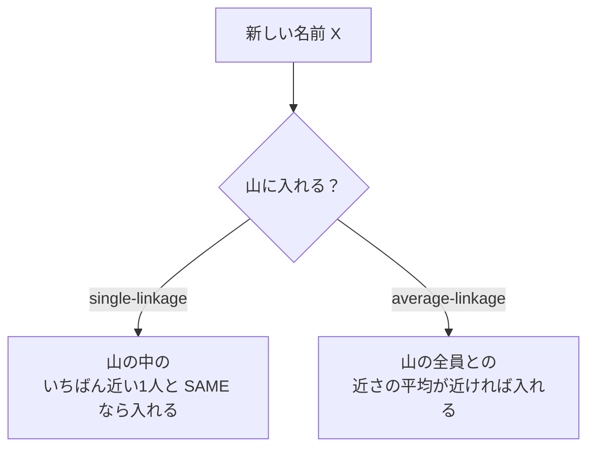
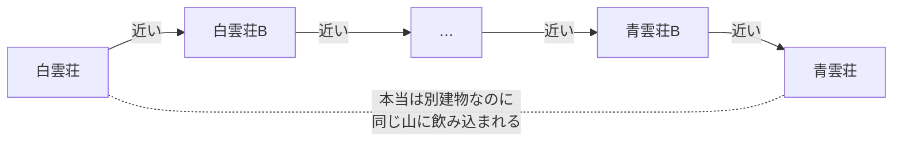
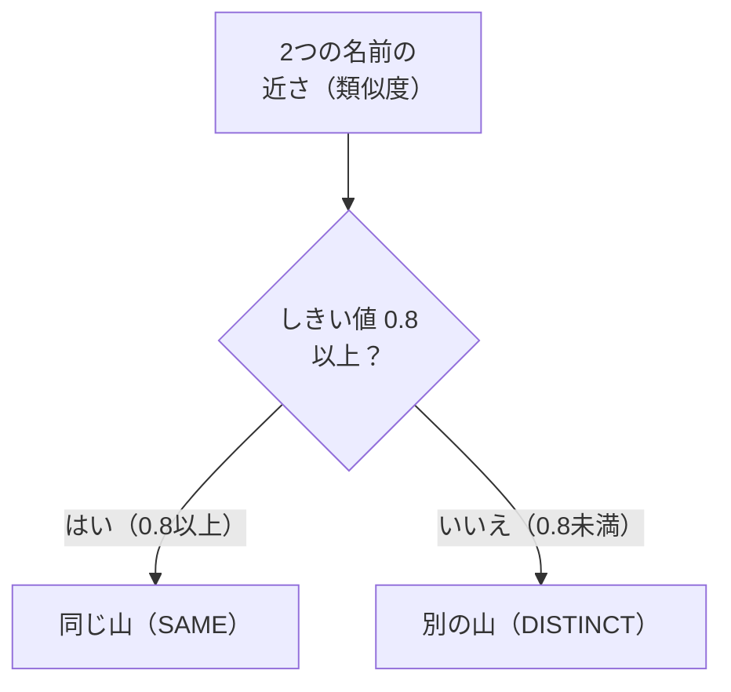
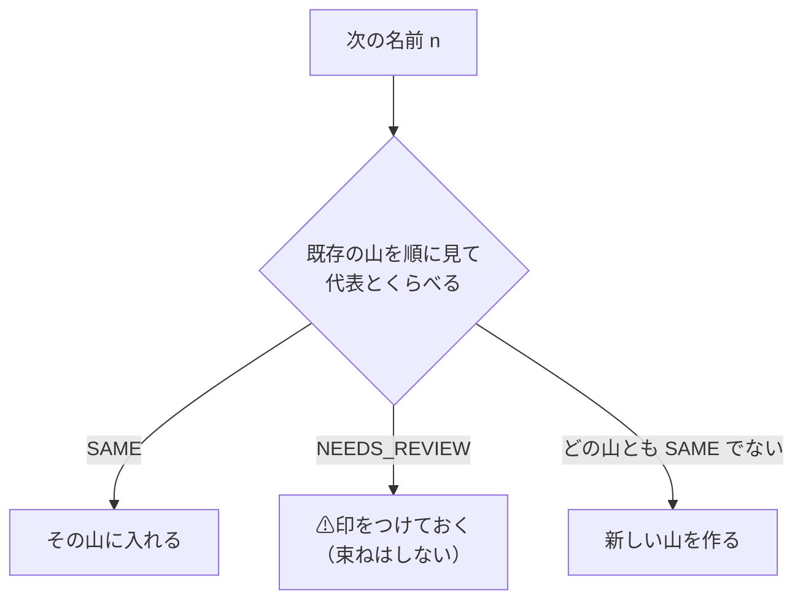

# 第二部 第3章　クラスタリングのきほん（建物が何棟あるか）

> **この章のゴール**
> - 似た名前を **束ねる（グループ分けする）** こと＝**クラスタリング（clustering）** だと分かる
> - 連結のしかた（**single-linkage**／**average-linkage**）のちがいと、数珠つなぎ（chaining）の落とし穴をつかむ
> - **しきい値（threshold）** で「どこまで束ねるか」が決まることを知る
> - 3値（SAME / DISTINCT / NEEDS_REVIEW）を使って「その住所に建物が**何棟**あるか」を決める流れが分かる

> **登場人物**：みどり先生、ツムギ、ゲンタ、スガタ、アザミ（カメオ）

---

## 「同じ／別」がわかったら、次は「束ねる」

**みどり先生**：第2章までで、**2つ**の名前を見て「SAME（同じ）／DISTINCT（別）／NEEDS_REVIEW（要レビュー）」を出せるようになったね。

**ツムギ**：はい！　`コーポ山田` と `コ−ポ山田` は SAME、`白雲荘` と `青雲荘` は DISTINCT……でしたよね。

**みどり先生**：そう。でも本物の住所データは、2つじゃなくて、**たくさん**並んでいる。たとえば同じ住所に、こんなふうに。

```
ライオンズマンション梅田
ライオンズ梅田
青雲荘A
青雲荘B
杉の荘
```

**ゲンタ**：5つもある。で、結局この住所には建物が**何棟**あるの？

**みどり先生**：いい問いだ。それを決めるのが今日のテーマ。
たくさんの名前を「**同じものは同じ山に、別のものは別の山に**」と分けていく——これを **クラスタリング（clustering、かたまり分け）** と言うんだ。

**スガタ**：……わたしが「5つの姿」で現れているとき、本当は何人なのか。それを決める作業なのね。

---

## クラスタリングって、こういうこと

**みどり先生**：あわてない、あわてない。たとえ話からいこう。
トランプを配られて、机にバラバラに置いたとする。それを「**マークごとの山**」に分けるよね。ハートはハートの山、スペードはスペードの山。

**ツムギ**：あ、それなら毎日やってます。カードゲームで。

**みどり先生**：その「**山に分ける**」がクラスタリング。1つ1つの山が **クラスタ（cluster）**。
建物名でいうと、「同じ建物を指す名前」が1つの山になる。



**ゲンタ**：山が3つできたから、建物は3棟、ってことか。

**みどり先生**：その通り。**山の数＝建物の数**。これが「その住所に建物が何棟あるか」の答えになる。

---

## 山を作るとき、何と何をくらべる？（連結法）

**みどり先生**：ここで問題。新しい名前 `ライオンズ梅田` が来たとき、それを「ライオンズ梅田系の山」に入れるかどうか、どうやって決める？　山には**すでに何枚も**カードが入っているよ。

**ツムギ**：えっと……山の中の**だれか**とくらべる？

**みどり先生**：そう。その「**だれとくらべるか**」のルールを **連結法（れんけつほう、linkage）** と呼ぶんだ。代表的なのは2つ。

> 📌 **2つの連結法**
> - **single-linkage（単連結）**：山の中の **だれか1人** とでも SAME なら、その山に入れる。「**いちばん近い相手**」を見る。
> - **average-linkage（平均連結）**：山の中の **みんなとの近さの平均** を見て、平均が近ければ入れる。

**ゲンタ**：single は「1人でも仲良しがいれば仲間」、average は「全体としてなじむか」を見る、みたいな感じか。

**みどり先生**：うまい言い方だ。図にするとこうなる。



---

## single-linkage の落とし穴：数珠つなぎ（chaining）

**ツムギ**：single のほう、「1人でも仲良しがいれば仲間」って、ゆるくないですか？　なんか危なそう……。

**みどり先生**：鋭い、ツムギ。まさにそこが落とし穴なんだ。**数珠（じゅず）つなぎ＝chaining（チェイニング）** という。

**みどり先生**：たとえば、こういう3つの名前があったとする。

```
青雲荘   ←→   青雲荘B   ←→   青雲荘C
```

**みどり先生**：`青雲荘` と `青雲荘B` は近い（SAME）。`青雲荘B` と `青雲荘C` も近い（SAME）。
single-linkage は「1人でも仲良しがいれば仲間」だから、ぜんぶ1つの山になる。ここまではOK。

**ツムギ**：うん、ぜんぶ青雲荘の仲間っぽいし。

**みどり先生**：ところが、こういう並びだと事故が起きる。

```
白雲荘 ←近→ 白雲荘B ←近→ … ←近→ 青雲荘B ←近→ 青雲荘
```

**みどり先生**：となりどうしは確かに近い。でも **はしっこの `白雲荘` と `青雲荘` は、本当は別建物** だよね（第1章の罠！）。
single-linkage は「となりが近ければつなぐ」だけだから、近いものを**手をつないで橋わたし**していって、最後には**遠いものまで同じ山に飲み込んでしまう**。



**ゲンタ**：1本の鎖でつながっちゃうから「数珠つなぎ」か。となりが近いだけで、はしとはしは別物なのにな。

**みどり先生**：そう。single-linkage は「**橋わたしで遠いものまでくっつけてしまう**」弱点がある。
average-linkage は「全員との平均」を見るので、こういう細い橋にだまされにくい。

> 📌 **数珠つなぎ（chaining）の気持ち**
> single-linkage は「1人でも近ければ仲間」。すると **A→B→C→… と近さの橋をつないでいって、
> 端のA と 端のZ が本当は別物でも、同じ山になってしまう**。
> average-linkage（平均で見る）はこの橋わたしに強い。

---

## どこまで近ければ「同じ山」？──しきい値

**ツムギ**：「近ければ入れる」の「近ければ」って、どのくらい近ければいいんですか？

**みどり先生**：いい「なんで？」だ。その**境目の数字**を **しきい値（threshold、スレッショルド）** と呼ぶ。
たとえば「類似度（にてる度合い）が **0.8 以上**なら同じ山」と決める。この 0.8 がしきい値だ。



**みどり先生**：しきい値をどこに置くかで、結果がガラッと変わる。

- しきい値を**低く**（ゆるく）すると → ちょっと似てるだけで束ねる → 山が**少なく**なる（別建物まで混ざる危険）。
- しきい値を**高く**（きびしく）すると → よっぽど似てないと束ねない → 山が**多く**なる（同じ建物がバラける危険）。

**ゲンタ**：ちょうどいい所を探さなきゃいけないのか。むずかしいな。

**みどり先生**：そう。第1章で見たよね。編集距離（文字の見た目だけ）でこのしきい値を引くと、`白雲荘`/`青雲荘`（近いのに別）でつまずく。
だから kugiri は、しきい値1本に頼らず、**第2章の判定（包含・対立度）**で「SAME か DISTINCT か」を決めてから束ねるんだ。

**アザミ**：……ふふ。第一部でわたしの「字」を見分けた統計が、ここでも山分けの目になってるのね。

**みどり先生**：その通り、アザミ。道具は使い回しだ。

---

## kugiri はどう束ねるか：3値で山を作る

**みどり先生**：では kugiri 本体を見よう。`BuildingClusterer`（ビルディング・クラスタラ＝建物の山分け係）が、同じ住所の名前たちを束ねる。
やり方は **single-linkage の近似**。ただし「近いか」の代わりに、第2章の **3値判定** を使う。

**みどり先生**：流れはこうだ。名前を1つずつ取り出して、**すでにある山の代表とくらべる**。



**ツムギ**：SAME なら入れる、別なら新しい山……それは分かります。でも **NEEDS_REVIEW（要レビュー）** のときは？

**みどり先生**：そこが大事だ。NEEDS_REVIEW のときは、**束ねないけど、⚠の印だけつけておく**。
「この名前、もしかしたら別の山と同じかもしれない。でも文字だけじゃ決められない」という正直なメモだね（第2章の型F）。あとで住所や部屋番号の証拠で確かめる。

**スガタ**：……決めつけないで、印だけ残してくれる。わたし、それがうれしいの。

---

## 山の「代表名」は、どう選ぶ？

**ゲンタ**：山ができたとして、その山を**何て呼ぶ**の？　`ライオンズマンション梅田` と `ライオンズ梅田`、どっちが山の名前？

**みどり先生**：それを **代表名（だいひょうめい、canonical name、キャノニカル）** と言う。kugiri のルールはシンプルだ。

> 📌 **代表名の選び方**
> 1. **いちばん多く出てきた名前**（最頻出）を代表にする。データに何度も出る形が、いちばん「正しい表記」っぽいから。
> 2. **同じ回数なら、長いほうを代表**にする。長いほうが情報が多い（`ライオンズマンション梅田` のほうが `ライオンズ梅田` より詳しい）。

**ツムギ**：多数決で決めて、引き分けなら長いほう、って覚えやすい！

---

## 手を動かそう

実際のコードを読みましょう。
ファイルは `building/src/main/java/org/unlaxer/kugiri/building/hierarchy/BuildingClusterer.java`、中心のメソッドは **`cluster`** です。さっきの流れ図が、そのままコードになっています。

```java
// BuildingClusterer.cluster：名前たちを 3値判定で山に束ねる（single-linkage 近似）
public static List<Cluster> cluster(List<String> names, IdentityResolver resolver) {
    // 出現頻度（代表名選出用）
    Map<String, Integer> freq = new LinkedHashMap<>();
    for (String n : names) if (!n.isEmpty()) freq.merge(n, 1, Integer::sum);

    List<List<String>> groups = new ArrayList<>(); // 各クラスタ（山）の member 名
    List<Boolean> review = new ArrayList<>();
    for (String n : freq.keySet()) {
        int joined = -1;
        boolean reviewHit = false;
        for (int g = 0; g < groups.size(); g++) {
            String rep = groups.get(g).get(0);            // その山の代表とくらべる
            Decision d = resolver.decide(n, rep).decision();
            if (d == Decision.SAME) { joined = g; break; } // SAME → その山へ
            if (d == Decision.NEEDS_REVIEW) reviewHit = true; // 要レビュー → 印だけ
        }
        if (joined >= 0) groups.get(joined).add(n);
        else { groups.add(new ArrayList<>(List.of(n))); review.add(reviewHit); } // 新しい山
    }
    // ... このあと、各山の代表名を選ぶ（次のコード）
}
```

> 📌 **読み方メモ**
> - `freq.merge(n, 1, Integer::sum)` ＝「名前 n が出てきたら、回数を **+1** する」。出現回数を数える表（`freq`）を作っています。
> - `resolver.decide(n, rep)` ＝ 第2章の `contrastive`（包含・対立度の判定）を呼んでいるところ。
> - `Decision.SAME / NEEDS_REVIEW` ＝ 第0章で出た3値の答え。
> - `if (...SAME) break;` で、最初に SAME になった山に入れて打ち切る。これが **single-linkage 近似**（「1つでも SAME な山が見つかれば、そこに入れる」）。

そして、山の **代表名** を選ぶ部分がこれです。

```java
// 各山（group）の代表名を選ぶ：最頻出、同数なら長いほう
String canonical = mem.get(0);
int best = -1;
for (String m : mem) {
    int f = freq.getOrDefault(m, 0);
    if (f > best || (f == best && m.length() > canonical.length())) { // ① 多い方 ② 同数なら長い方
        best = f; canonical = m;
    }
}
out.add(new Cluster(canonical, new LinkedHashSet<>(mem), review.get(g)));
```

**ゲンタ**：`f > best` で「いちばん多い名前」を選んで、`f == best && m.length() > ...` で「同じ回数なら長いほう」か。さっきのルールそのままだ。

**みどり先生**：そう。そして山1つ分の結果が `Cluster`（クラスタ）という箱に入る。中身は3つ。

```java
// BuildingClusterer.Cluster：1つの山の結果
public record Cluster(String canonical, Set<String> members, boolean needsReview) {}
//                    代表名          山に入った名前たち   要レビュー印
```

**ツムギ**：`canonical`（代表名）、`members`（山の中身）、`needsReview`（⚠印）。山1つがこれでまるっと表せるんですね。

---

### 動かしてみる

このクラスタリングは、次章以降で出てくる `HierarchyDemo`（行→木デモ）の中で動いています。
（`HierarchyDemo` は第5章の主役なので、ここでは「束ねた結果＝建物数」が出ることだけ確認しておきましょう。）

```bash
mvn -q -f building/pom.xml exec:java \
  -Dexec.mainClass=org.unlaxer.kugiri.building.demo.HierarchyDemo \
  -Dstdout.encoding=UTF-8
```

出力の最後にこんな行が出ます（イメージ）。山の数＝建物数です。

```
  → この住所の建物数 = 3 / 部屋数 = 4
```

**みどり先生**：同じ住所に `ライオンズマンション梅田` と `ライオンズ梅田`（表記ゆれ）が並んでも、SAME で1つの山に束ねられるから、**建物数は二重に数えない**。
逆に `青雲荘` と `杉の荘` のような別建物は、別の山になって、ちゃんと別々に数えられる。

---

### 計算練習（紙とえんぴつで）

同じ住所に、次の4つの名前があるとします。第2章の判定はこうだったとします。

```
① ライオンズマンション梅田   （出現2回）
② ライオンズ梅田             （出現1回）… ① と SAME
③ 杉の荘                     （出現1回）… ①②と DISTINCT
④ 寮                         （出現1回）… ③と NEEDS_REVIEW
```

**問題1**：山はいくつできる？　つまり建物数は？

<details>
<summary>こたえ</summary>

- ① で山1ができる。
- ② は ① と SAME → 山1 に入る。
- ③ は ①②と DISTINCT → 新しい山2 ができる。
- ④ は ③と NEEDS_REVIEW（SAME ではない）→ どの山にも SAME で入れないので、新しい山3 ができる。ただし ④ には **⚠要レビューの印**がつく。

山は **3つ**＝建物数は **3**（うち1つは要レビュー）。

</details>

**問題2**：山1（①と②）の代表名は？

<details>
<summary>こたえ</summary>

`ライオンズマンション梅田`（2回）と `ライオンズ梅田`（1回）。
最頻出は **`ライオンズマンション梅田`（2回）** なので、これが代表名。

</details>

---

## 今日のまとめ

- **クラスタリング**＝似た名前を「同じものは同じ山に」と束ねること。**山の数＝建物の数**。
- **連結法**：**single-linkage**（山の中の1人とでも SAME なら入れる）／**average-linkage**（全員との近さの平均で見る）。
- single-linkage には **数珠つなぎ（chaining）** の落とし穴：となりが近いだけで橋わたしして、端と端の別物まで飲み込む。average-linkage はこれに強い。
- **しきい値**：「どのくらい近ければ同じ山か」の境目の数字。低いと山が減り（混ざる）、高いと山が増える（バラける）。
- kugiri の `BuildingClusterer` は **single-linkage 近似**だが、近さの代わりに第2章の **3値（SAME/DISTINCT/NEEDS_REVIEW）** を使う。NEEDS_REVIEW は束ねず **⚠印**だけ残す。
- 山の **代表名** は「**最頻出、同数なら長いほう**」。

---

## スガタメーター

```
スガタの見分け：█████░░░░░ 45%
（コメント：2つの「同じ／別」を、たくさんの名前の「山分け」に広げられた。
　この住所にスガタが何人いるか＝建物数を数えられるようになった。顔の輪郭がはっきり！）
```

---

## 次回予告

**みどり先生**：今日は「すでに分解された建物名」を束ねたね。でも、生のデータは `ライオンズマンション梅田301号室` のように、**名前と部屋番号がくっついて**いる。

**ツムギ**：あ、たしかに。どこまでが建物名で、どこからが部屋なのか……。

**みどり先生**：そこで次章は、**末尾から「部屋→階→棟」を1枚ずつ剥がして**、残りを建物名として取り出す話だ。
全角を畳むけど、長音の「ー」は残す——`アパート` を `アパト` に壊さないようにね。あわてない、あわてない。

[← 第2章](02-hougan-to-kaku.md) ・ [第4章 →](04-name-extraction.md)
