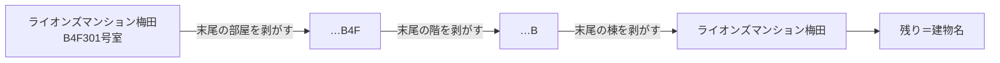
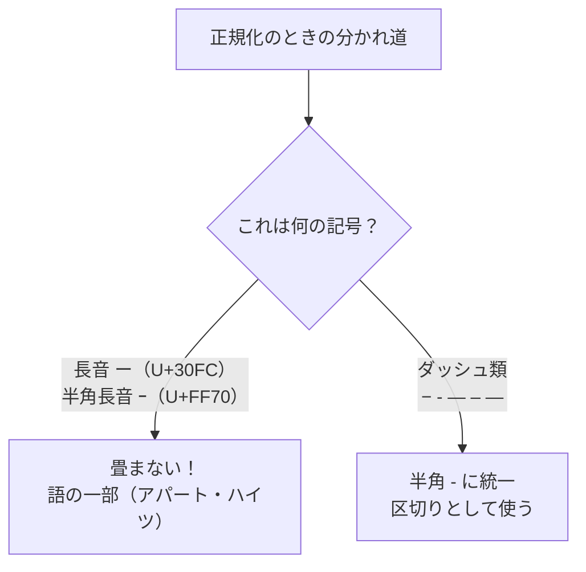
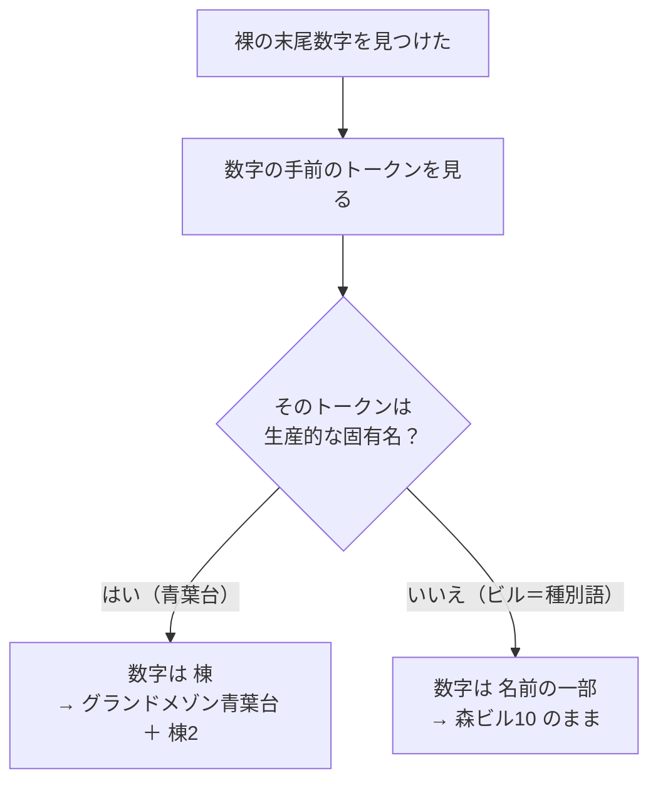

# 第二部 第4章　建物名を切り出す（末尾から剥がす）

> **この章のゴール**
> - 生の住所テールから、**末尾から「部屋→階→棟」の順に1枚ずつ剥がす**と、残りが建物名になると分かる
> - **正規化（NFKC）** で全角を畳むが、**長音「ー」は残す**理由（`アパート` を壊さない）が分かる
> - 各種ダッシュ（`−` `‐` `―` …）だけを `-` に統一する、という細かさの意味をつかむ
> - **裸の末尾数字**が「棟」か「名前の一部」かを、第2章の **誘導語彙（生産性）** で見分ける考え方が分かる

> **登場人物**：みどり先生、ツムギ、ゲンタ、スガタ

---

## 名前と部屋番号は、くっついて届く

**みどり先生**：第3章では「すでにきれいに分かれた建物名」を束ねたね。でも、現実のデータはこうだ。

```
ライオンズマンション梅田301号室
川上ハイツ-101
天王ビル4F
府営柱本団地B2-407
```

**ツムギ**：うわ、ぜんぶくっついてる……。`ライオンズマンション梅田` が建物名で、`301号室` が部屋……ですよね？

**みどり先生**：その通り。この **くっついた1本の文字列（テール）** から、`建物名` / `棟` / `階` / `部屋` を切り出すのが今日の仕事だ。

**ゲンタ**：どこで切るの？　区切りの記号があるとは限らないよね。

**みどり先生**：いい所に気づいた。そこで使うのが「**末尾から剥がす**」という発想なんだ。

---

## 末尾から、1枚ずつ剥がす

**みどり先生**：建物名の文字列は、たいてい **「名前 → 棟 → 階 → 部屋」の順** に並んでいる。

```
ライオンズマンション梅田　B　4F　301号室
└── 名前 ──────────┘ └棟┘ └階┘ └部屋┘
```

**みどり先生**：ということは——**いちばん後ろ（末尾）から**見ていけば、まず「部屋」が見つかる。それを剥がす。次に「階」、次に「棟」。
そして**最後に残ったものが建物名**だ。タマネギの皮をむくのに似ているね。



**ツムギ**：後ろから「部屋・階・棟」を取っていって、残りが名前！　順番が決まってるから、迷わないんだ。

**みどり先生**：そう。この「**末尾から優先順位の順に剥がす**」やり方は、昔ながらの建物システム（BH）も使っていた、しっかりした手だ。kugiri の `RuleBuildingParser`（ルール・ビルディング・パーサ）が、これを最小構成で再現している。

---

## 剥がす前に、字をそろえる（正規化）

**みどり先生**：あわてない、あわてない。剥がす**前に**、ひとつ準備がいる。
データには `301号室` と `３０１号室`（全角）、`4F` と `４Ｆ`（全角）が混ざっている。このままだと、パターンに引っかかったり引っかからなかったりする。

**ツムギ**：全角と半角がバラバラだと、機械が困っちゃうんですね。

**みどり先生**：そこで **正規化（せいかくか、normalization）** をする。全角の `３０１` を半角の `301` に畳む。この畳み方の規格が **NFKC（エヌ・エフ・ケー・シー）** だ。

> 📌 **NFKC の気持ち**
> NFKC は「**見た目が違うけど同じ意味の字を、代表の形にそろえる**」規格。
> 全角 `３０１` → 半角 `301`、全角 `Ｆ` → 半角 `F`、ローマ数字 `Ⅲ` → `III` のように畳む。
> （第一部でアザミのために使った `NFKC_CF` の仲間。CF は大文字小文字も畳むが、ここでは大小は **保持** する。`B棟` の `B` を小文字にしないため。）

**ゲンタ**：全部そろえれば、パターンが素直に書けるってことか。……でも先生、全部畳んで大丈夫なの？

**みどり先生**：そこなんだ、ゲンタ。**全部畳むと壊れるものがある**。それが次の話。

---

## 長音「ー」は畳まない──アパートを壊さないために

**みどり先生**：問題はこれ。`アパート` や `ハイツ` の **長音記号「ー」（U+30FC）**。
NFKC をうかつにかけると、これが消えたり別の記号になったりして、`アパート` が `アパト` みたいに**壊れてしまう**ことがある。

**ツムギ**：`アパト` ……それ、もう別の言葉ですよね。建物名が変わっちゃう！

**みどり先生**：その通り。だから kugiri は、**長音「ー」だけは絶対に畳まない**。語の一部だからね。
一方で、似た見た目の **ダッシュ類**——マイナス記号 `−`、ハイフン `‐`、横棒 `―` など——は、`川上ハイツ-101` のように **区切りの「-」** として使われる。これは **半角ハイフン `-` に統一**する。



**ゲンタ**：見た目はどれも「横棒」なのに、意味は逆——片方は残す、片方はそろえる。ややこしいけど、理由ははっきりしてるな。

**みどり先生**：そう。「**長音は言葉、ダッシュは区切り**」。この一線を守るのが、建物名を壊さないコツなんだ。

---

## 手を動かそう（その1：剥がしと正規化）

実際のコードを読みましょう。
ファイルは `building/src/main/java/org/unlaxer/kugiri/building/parser/RuleBuildingParser.java` です。

まず、剥がすための **パターン（剥がす型）** が、優先順位の順に並んでいます。

```java
// RuleBuildingParser：末尾から探すパターン（部屋→階→棟の順）
private static final Pattern[] ROOM = {        // 部屋
        Pattern.compile("(\\d{1,4})号室$"),     // 301号室
        Pattern.compile("(\\d{1,4})号$"),       // 10号
        Pattern.compile("-(\\d{2,5})$"),        // -101
};
private static final Pattern[] FLOOR = {       // 階
        Pattern.compile("(B?\\d{1,2})階$"),     // 4階 / B1階
        Pattern.compile("(B?\\d{1,2})F$"),      // 4F
};
private static final Pattern[] WING = {        // 棟
        Pattern.compile("(\\d{1,2})-([A-Z])$"), // 4-B → 4B
        Pattern.compile("([A-Z]\\d{0,2})$"),    // B / B2
        Pattern.compile("(\\d{1,2})棟$"),       // 2棟
        Pattern.compile("([東西南北新本別]棟)$"), // 東棟
};
```

> 📌 **読み方メモ（正規表現）**
> - `\\d` ＝「数字1文字」。`{1,4}` ＝「1〜4回くりかえし」。だから `\\d{1,4}` ＝「1〜4桁の数字」。
> - `$` ＝「**文字列のいちばん後ろ**」。末尾から剥がすので、どのパターンも `$` で終わっています。
> - `(...)` ＝「**この部分をあとで取り出す**」しるし（グループ）。`(\\d{1,4})号室` なら、`号室` の前の数字だけを取り出せる。
> - `[A-Z]` ＝「A から Z のどれか1文字」、`[東西南北新本別]` ＝「この7文字のどれか」。

そして、実際に剥がしていくのが **`parse`** メソッドです。

```java
// RuleBuildingParser.parse：末尾から 部屋→階→棟 を1つずつ剥がす
public ParsedBuilding parse(String tail) {
    String s = normalize(tail);           // ① まず字をそろえる
    String room = "", floor = "", wing = "";

    s = stripTrailingSep(s);
    for (Pattern p : ROOM) {              // ② 部屋を探して剥がす
        Matcher m = p.matcher(s);
        if (m.find()) { room = m.group(1); s = stripTrailingSep(s.substring(0, m.start())); break; }
    }
    for (Pattern p : FLOOR) { /* ③ 階を探して剥がす（同じ要領） */ }
    for (Pattern p : WING)  { /* ④ 棟を探して剥がす（同じ要領） */ }
    return new ParsedBuilding(stripTrailingSep(s), wing, floor, room); // 残り s が建物名
}
```

**ツムギ**：`s.substring(0, m.start())` って……見つかった部屋の **手前まで**を残す、ってことですか？

**みどり先生**：その通り。`m.start()` は「見つかった所の先頭の位置」。そこより前を切り出せば、剥がした残りになる。これを部屋・階・棟と3回くりかえす。

次に、字をそろえる **`normalize`**。ここに「長音は残す」が書いてあります。

```java
// RuleBuildingParser.normalize：NFKC で畳むが、長音は残し、ダッシュ類だけ - に統一
static String normalize(String tail) {
    String s = Normalizer.normalize(tail == null ? "" : tail, Normalizer.Form.NFKC); // 全角→半角など
    StringBuilder b = new StringBuilder();
    s.codePoints().forEach(cp -> b.appendCodePoint(switch (cp) {
        case '−', '‐', '―', '–', '—' -> '-';   // ダッシュ類だけ - に統一（長音 ー は含めない！）
        default -> cp;
    }));
    return b.toString().strip();
}
```

**ゲンタ**：`case '−','‐','―','–','—' -> '-'` ……このリストに**長音「ー」が入っていない**んだな。だから長音は畳まれずに残る。

**みどり先生**：そこがこのコードの一番のポイントだ。コメントにもわざわざ「長音は含めない」と書いてある。`アパート` を守るためにね。
ちなみに `s.codePoints()` で**コードポイント単位**で1文字ずつ見ているのも、第一部からのお約束だ（外字やサロゲートを壊さないため）。

---

## 裸の末尾数字は、棟？　それとも名前の一部？

**みどり先生**：さて、ここからが kugiri の見せ場。ルールだけでは解けない、やっかいな2つを見てくれ。

```
グランドメゾン青葉台2
森ビル10
```

**ツムギ**：どっちも、最後に**数字**がくっついてる……`2` と `10`。

**みどり先生**：そう。しかも `号` も `F` も `-` も付いていない、**裸の数字**だ。これが「棟」なのか「名前の一部」なのか、どっちだと思う？

**ツムギ**：うーん……`グランドメゾン青葉台2` の `2` は、**2棟**っぽい？　でも `森ビル10` の `10` は……`森ビル10` で1つの名前な気もする……。

**みどり先生**：まさにその直感が正解なんだ。

> 📌 **裸の末尾数字の謎**
> - `グランドメゾン青葉台2` … `2` は **棟**（青葉台2棟）。
> - `森ビル10` … `10` は **名前の一部**（「森ビル10」でひとつの建物名）。
> どちらも「文字＋数字」なのに、答えが逆。**文字の形だけでは決められない**。

**ゲンタ**：……第1章の罠と同じだ。見た目だけじゃ分からないやつ。

**みどり先生**：その通り。昔の BH は、これを「**同じ住所の他の行を見て**（cross-row）」解いていた。となりの行に `青葉台1` `青葉台3` があれば「ああ、2は棟だな」と分かる、という具合に。でもそれは、まわりにデータが無いと解けない。

**ツムギ**：じゃあ kugiri はどうするんですか？

---

## 誘導語彙の「生産性」で1件ずつ判定する

**みどり先生**：ここで第2章の **生産的（productive）トークン** が効くんだ。思い出して。

**ツムギ**：「コーパスの中で、**複数の建物**に出てくる芯」……でしたよね。`梅田`/`難波` みたいに、入れ替えると別の建物になるやつ。

**みどり先生**：その通り。考え方はこうだ。

> 📌 **数字の手前を見る**
> 数字の手前の **固有名核**（最後のトークン）が **生産的**（複数の建物を区別する芯）なら、
> その数字は「いくつもある中の何番目か」を表す＝**棟**。
> そうでなければ、数字は **名前の一部**。

**みどり先生**：`グランドメゾン青葉台2` の手前は `青葉台`。これは**生産的な固有名**（青葉台1, 青葉台2…と棟を作り分ける芯）。だから `2` は **棟**。
`森ビル10` の手前は `ビル`。これは**種別語**で、生産的な固有名ではない。だから `10` は **名前の一部**として残す。



**ゲンタ**：まわりの行を見なくても、**コーパスから学んだ語彙だけで、1件ずつ**決められるのか。辞書を手で書かなくていいんだな。

**みどり先生**：その通り。辞書レスで、1件単位。これが kugiri の `LexiconBuildingParser`（語彙版パーサ）だ。

---

## 手を動かそう（その2：語彙で裸数字を判定）

ファイルは `building/src/main/java/org/unlaxer/kugiri/building/parser/LexiconBuildingParser.java`、中心は **`parse`** です。
まず `RuleBuildingParser` でふつうに剥がし、それでも「名前が…数字で終わっている」ときだけ、語彙で追加判定します。

```java
// LexiconBuildingParser.parse：rule で剥がした後、裸の末尾数字を語彙で判定
public ParsedBuilding parse(String tail) {
    ParsedBuilding p = rule.parse(tail);
    // 棟がすでに取れている、または名前が「…数字」で終わらないなら、何もしない
    if (!p.wing().isEmpty() || !p.name().matches(".+\\d{1,2}$")) return p;

    Matcher m = TRAILING_BARE_NUM.matcher(p.name()); // 名前を「基底 + 末尾数字」に分ける
    if (!m.matches()) return p;
    String base = m.group(1), digits = m.group(2);   // base=グランドメゾン青葉台, digits=2
    if (base.isEmpty()) return p;

    // ★ 基底名の末尾トークンが生産的な固有名なら、数字は別単位＝棟
    List<String> toks = lex.segment(base);            // 第一部の AzaInducer で分割
    String lastTok = toks.isEmpty() ? base : toks.get(toks.size() - 1);
    if (lex.isProductive(lastTok)) {
        return p.withName(base).withWing(digits);     // 青葉台が生産的 → 2 は棟
    }
    return p; // 例: 森ビル10（ビルは生産的固有名でない）→ 名前のまま
}
```

> 📌 **読み方メモ**
> - `p.name().matches(".+\\d{1,2}$")` ＝「名前が **1〜2桁の数字で終わっているか**」。終わっていなければ、そもそも判定不要。
> - `lex.segment(base)` ＝ 第一部の `AzaInducer`（教師なしの分割）で `base` をトークンに切る。`グランドメゾン青葉台` → `グランドメゾン` `青葉台` のように。
> - `lex.isProductive(lastTok)` ＝ 第2章の生産性判定（`df(token) >= 2 && !isGeneric(token)`）。**複数の建物に出る、種別語でない芯**なら true。
> - `p.withName(base).withWing(digits)` ＝ 名前を `base` に直し、数字を **棟**に移す。

**ツムギ**：`segment` で切って、**いちばん後ろのトークン**が生産的かどうかを見るんですね。`青葉台` は生産的だから棟、`ビル` は種別語だから名前のまま。

**みどり先生**：その通り。第一部でアザミのために学んだ `segment`（教師なし分割）と、第2章の `isProductive`（生産性）。両方が、ここで一緒に働いている。

---

### 動かしてみる

`rule`（ルールだけ）と `lexicon`（語彙版）を**対比**するデモがあります。

```bash
mvn -q -f building/pom.xml exec:java \
  -Dexec.mainClass=org.unlaxer.kugiri.building.demo.BuildingParseDemo \
  -Dstdout.encoding=UTF-8
```

`グランドメゾン青葉台2` と `森ビル10` で、`rule` と `lexicon` の結果に **★差分** が出ます（イメージ）。

```
入力: グランドメゾン青葉台2
   rule    : ParsedBuilding[name=グランドメゾン青葉台2, wing=, ...]
   lexicon : ParsedBuilding[name=グランドメゾン青葉台, wing=2, ...]   ★差分
入力: 森ビル10
   rule    : ParsedBuilding[name=森ビル10, wing=, ...]
   lexicon : ParsedBuilding[name=森ビル10, wing=, ...]
```

**ゲンタ**：`青葉台2` は lexicon だけ `wing=2`（棟2）に分けてる。`森ビル10` はどっちも名前のまま。期待どおりだ。

---

### 計算練習（紙とえんぴつで）

**問題1**：`川上ハイツ-101` を、`RuleBuildingParser` で剥がすと、建物名・棟・階・部屋はそれぞれ何になる？

<details>
<summary>こたえ</summary>

末尾の `-101` が `ROOM` の `-(\\d{2,5})$` に当たる → **部屋 = 101**。
階・棟は見つからない。残りは `川上ハイツ` → **建物名 = 川上ハイツ**（長音「ー」は残る！）。

</details>

**問題2**：あるコーパスで `さくら台` は3つの建物に出る生産的な芯、`コーポ` は種別語だとします。
`コーポさくら台3` の `3` は、棟？　名前の一部？

<details>
<summary>こたえ</summary>

数字 `3` の手前を `segment` すると、末尾トークンは `さくら台`。これは**生産的**（3建物に出る固有名）。
よって `3` は **棟**。建物名は `コーポさくら台`、棟は `3` になります。

</details>

---

## 今日のまとめ

- 生のテールから、**末尾から「部屋→階→棟」を1枚ずつ剥がし、残りを建物名**にする（`RuleBuildingParser.parse`）。
- 剥がす前に **NFKC で正規化**（全角→半角など）。ただし **長音「ー」は畳まない**（`アパート`・`ハイツ` を壊さない）。**ダッシュ類だけ `-` に統一**（区切り用）。
- 「長音は言葉、ダッシュは区切り」が、建物名を壊さない一線。コードは **コードポイント単位**で1文字ずつ処理。
- **裸の末尾数字**（`号`/`F`/`-` の無い数字）が棟か名前の一部かは、文字の形だけでは決められない。
- kugiri は **誘導語彙の生産性**で1件ずつ判定（`LexiconBuildingParser`）：数字の手前が**生産的な固有名なら棟**（`グランドメゾン青葉台2`→棟）、**種別語なら名前の一部**（`森ビル10`→保持）。BH の cross-row 共起を、辞書レスで置きかえた。

---

## スガタメーター

```
スガタの見分け：██████░░░░ 58%
（コメント：くっついた1本の文字列から、名前・棟・階・部屋をちゃんと切り分けられた。
　スガタの「姿」の形が、はっきり取り出せるようになってきた！）
```

---

## 次回予告

**みどり先生**：建物名を切り出せた（第4章）。同じ建物を束ねられた（第3章）。
いよいよ次は、それを**全部つなげて**——たくさんの行を、`住所 → 建物 → 棟 → 階 → 部屋` の **木（ツリー）** に組み上げる。

**ツムギ**：木！　枝分かれするやつですね。

**みどり先生**：そう。基地や団地みたいに、1つの住所に建物がいくつも建っている「型A」も、ちゃんと扱う。あわてない、あわてない。

[← 第3章](03-clustering.md) ・ [第5章 →](05-row-to-tree.md)
