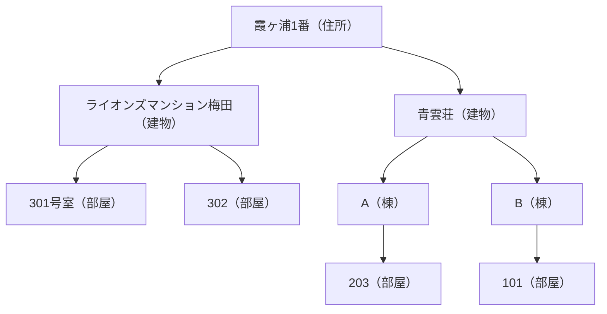
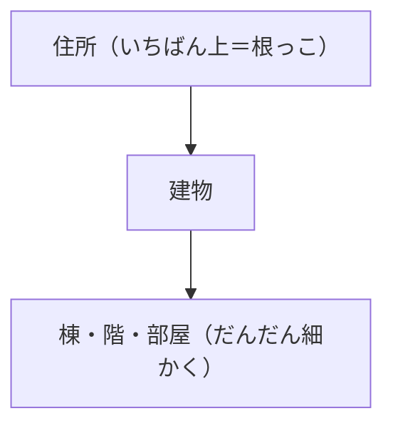
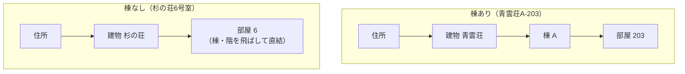
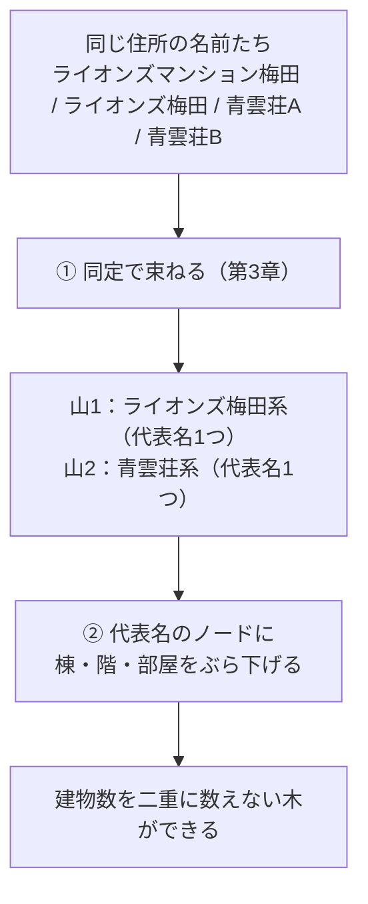
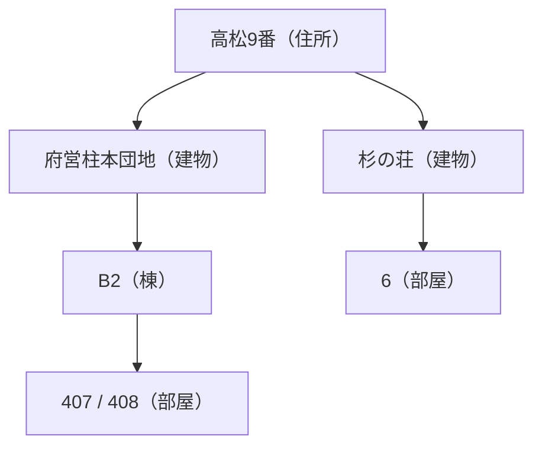

# 第二部 第5章　行を木に組む（住所→建物→棟→階→部屋）

> **この章のゴール**
> - バラバラの行を、`住所 → 建物 → 棟 → 階 → 部屋` の **木（ツリー）** に組み上げる流れが分かる
> - **可変深さ**（存在するレベルだけノードを作る）の意味が分かる
> - 型A（基地・団地など、1住所に複数施設）では、同じ住所に建物が**複数**ぶら下がると分かる
> - 第3章の同定で建物を**束ねてから**、棟・階・部屋を入れ子にする順番をつかむ

> **登場人物**：みどり先生、ツムギ、ゲンタ、スガタ、アザミ（カメオ）

---

## バラバラの行を、ひとつの形にまとめる

**みどり先生**：いよいよ仕上げだ。これまでの道具を全部つなげる。
データは、こういう **行（row）** の集まりだったね。住所キーと、建物のテール（部屋までくっついたやつ）のペア。

```
霞ヶ浦1番 / ライオンズマンション梅田301号室
霞ヶ浦1番 / ライオンズ梅田-302
霞ヶ浦1番 / 青雲荘B-101
霞ヶ浦1番 / 青雲荘A-203
高松9番   / 府営柱本団地B2-407
高松9番   / 杉の荘6号室
```

**ツムギ**：第4章で、テールから建物名・棟・階・部屋を切り出せるようになりましたよね。

**みどり先生**：そう。今日は、その切り出した結果を、**1本の木**に組み上げる。こんな形だ。



**ゲンタ**：上から、住所 → 建物 → 棟 → 階 → 部屋……と枝分かれしていくのか。木っぽいな。

**みどり先生**：その通り。これが「**行→木 集約**」。郵便や宅配のシステムが、住所を整理して持つときの形だ。

---

## 木って、こういうこと

**みどり先生**：あわてない、あわてない。「木（ツリー、tree）」のイメージを先に固めよう。
家系図とか、フォルダの中にフォルダがある感じ。**親があって、その下に子がぶら下がる**。



> 📌 **木のことば**
> - **ノード（node）**：木の「点」。住所も建物も部屋も、ぜんぶノード。
> - **親 / 子**：上にあるのが親、下にぶら下がるのが子。住所が親、建物が子。
> - **根（root、ルート）**：いちばん上のノード。ここでは **住所** が根。
> - **葉（leaf、リーフ）**：いちばん下、子がいないノード。ここでは **部屋**（がふつう葉）。

**ツムギ**：住所が根っこで、部屋が葉っぱ。間に建物や棟がある。木そのものですね。

---

## 可変深さ：あるレベルだけ作る

**ゲンタ**：でもさ、全部の建物に「棟」があるわけじゃないよね。`杉の荘6号室` には棟がないけど。

**みどり先生**：鋭い、ゲンタ。まさにそこが大事なんだ。kugiri の木は **可変深さ（かへんふかさ、variable depth）**。
つまり——**存在するレベルだけ、ノードを作る**。無いレベルは飛ばす。



**みどり先生**：`青雲荘A-203` は「建物→棟→部屋」と3段。`杉の荘6号室` は棟も階も無いから「建物→部屋」と直結する。
深さが**データによって変わる**から「可変深さ」だ。無いものを「なし」と書いて埋めたりしない。

**ツムギ**：必要なところだけ枝が伸びる、ってことですね。むだがない。

---

## 順番が命：束ねてから、入れ子にする

**みどり先生**：ここが今日いちばんのポイント。木を組む**順番**だ。

**みどり先生**：同じ住所に `ライオンズマンション梅田` と `ライオンズ梅田` が両方あったら、そのまま木にすると——

**ツムギ**：あっ、建物が**2つ**できちゃう。でも本当は同じ建物（表記ゆれ）なのに……。

**みどり先生**：その通り。だから、木に組む**前に**、第3章の `BuildingClusterer` で **同じ建物を束ねる**。束ねて代表名を決めてから、その代表名のノードに棟・階・部屋をぶら下げる。



**ゲンタ**：先に束ねるから、表記ゆれの2つが1つの建物ノードにまとまる。`301` と `302` は、その1つの建物の下に2部屋ぶら下がる、と。

**みどり先生**：その通り。**「同定が先、入れ子があと」**。これを逆にすると、表記ゆれのぶんだけ建物が水増しされてしまう。

**スガタ**：……わたしが「ライオンズマンション梅田」と「ライオンズ梅田」の2つの姿で来ても、先に1人だと見抜いてくれる。それから、お部屋を整理してくれるのね。

---

## 型A：1つの住所に、建物がいくつも

**みどり先生**：第0章でやった **型A（複数施設の敷地）** を覚えてる？　基地や団地、大学キャンパスだ。

**ツムギ**：はい。1つの敷地に、宿舎やコンビニや○○棟が、別々に建ってるやつ。

**みどり先生**：そう。型Aでは、同じ住所に **別建物が複数** ぶら下がるのが**正しい**。
たとえば `高松9番` に `府営柱本団地` と `杉の荘` があれば、それは別建物。住所ノードの下に、建物ノードが**2つ**できる。



**ゲンタ**：なるほど。表記ゆれは束ねて1つにするけど、本当に別建物（型A）はちゃんと別ノードにする。第3章の SAME / DISTINCT が、ここで効くのか。

**みどり先生**：その通り。そして型F（`寮` だけ、みたいに決められないやつ）は、束ねずに **⚠要レビューの印** をつけて木に残す。決めつけずに、あとで人や別の証拠にバトンを渡すんだ。

---

## 手を動かそう（その1：木のノード）

ファイルは `building/src/main/java/org/unlaxer/kugiri/building/hierarchy/HierarchyNode.java`。木の1つ1つの点（ノード）です。

```java
// HierarchyNode：可変深さの木のノード
public final class HierarchyNode {
    public enum Level { ADDRESS, BUILDING, WING, FLOOR, ROOM } // レベル＝住所/建物/棟/階/部屋

    private final Level level;
    private final String label;                          // そのノードの名前（代表名や部屋番号）
    private final List<HierarchyNode> children = new ArrayList<>(); // 子ノードたち
    private boolean needsReview;                         // 型F 等のレビュー印

    // 同じ子が無ければ作る、あればそれを返す（重複ノードを作らない）
    public HierarchyNode child(Level lv, String lbl) {
        for (HierarchyNode c : children)
            if (c.level == lv && c.label.equals(lbl)) return c; // 既にある → 使い回す
        HierarchyNode c = new HierarchyNode(lv, lbl);
        children.add(c);                                  // 無い → 新しく作って足す
        return c;
    }
}
```

> 📌 **`child` の気持ち**
> 「**同じレベル・同じ名前の子が、もうあるか**」を見て、あればそれを返し、無ければ作る。
> これで、同じ建物の下に `301` と `302` を足すとき、建物ノードは**1つに保たれる**（毎回作り直さない）。

**ツムギ**：`Level` の `enum` が、住所・建物・棟・階・部屋の5段ですね。`child` を呼ぶたびに、無ければ枝が伸びる。

**みどり先生**：そう。そして「この住所に部屋がいくつあるか」を数えるのが `leafCount`（葉の数）だ。

```java
// HierarchyNode.leafCount：末端（部屋）の数を数える
public int leafCount() {
    if (children.isEmpty()) return 1;          // 子がいない＝自分が葉 → 1
    int n = 0;
    for (HierarchyNode c : children) n += c.leafCount(); // 子の葉を全部たす
    return n;
}
```

**ゲンタ**：自分が葉なら1、そうでなければ子の葉を合計……自分で自分を呼んでる（再帰）。木を下までたどって数えてるんだな。

---

## 手を動かそう（その2：行を木に組む）

ファイルは `building/src/main/java/org/unlaxer/kugiri/building/hierarchy/HierarchyAssembler.java`、中心は **`assemble`** です。
「**住所ごとにまとめる → 束ねる → 入れ子にする**」の順番が、そのままコードになっています。

```java
// HierarchyAssembler.assemble：行（住所キー＋分解済み建物）を木に集約
public static List<HierarchyNode> assemble(List<Row> rows, BuildingLexicon lex) {
    // ① 住所キーごとに行をまとめる
    Map<String, List<Row>> byAddr = new LinkedHashMap<>();
    for (Row r : rows) byAddr.computeIfAbsent(r.addressKey(), k -> new ArrayList<>()).add(r);

    List<HierarchyNode> roots = new ArrayList<>();
    for (var e : byAddr.entrySet()) {
        HierarchyNode addr = new HierarchyNode(Level.ADDRESS, e.getKey()); // 住所＝根ノード

        // ② その住所の建物名を集めて、同定で束ねる（第3章）
        List<String> names = new ArrayList<>();
        for (Row r : e.getValue()) if (!r.building().name().isEmpty()) names.add(r.building().name());
        List<BuildingClusterer.Cluster> clusters = BuildingClusterer.cluster(names, lex);

        // 名前 → (代表名, レビュー印) の早見表を作る
        Map<String, BuildingClusterer.Cluster> byName = new HashMap<>();
        for (var c : clusters) for (String m : c.members()) byName.put(m, c);

        // ③ 各行を、代表名のノードに 棟→階→部屋 とぶら下げる（あるレベルだけ）
        for (Row r : e.getValue()) {
            ParsedBuilding p = r.building();
            String canon = p.name().isEmpty() ? UNKNOWN : byName.get(p.name()).canonical();
            HierarchyNode b = addr.child(Level.BUILDING, canon);          // 建物（代表名で1つに）
            if (!p.name().isEmpty() && byName.get(p.name()).needsReview()) b.markReview(); // 型F の印
            HierarchyNode cur = b;
            if (!p.wing().isEmpty())  cur = cur.child(Level.WING,  p.wing());  // 棟があれば
            if (!p.floor().isEmpty()) cur = cur.child(Level.FLOOR, p.floor()); // 階があれば
            if (!p.room().isEmpty())  cur = cur.child(Level.ROOM,  p.room());  // 部屋があれば
        }
        roots.add(addr);
    }
    return roots;
}
```

> 📌 **読み方メモ**
> - `byAddr.computeIfAbsent(key, ...).add(r)` ＝「その住所キーの箱がまだ無ければ作って、行を入れる」。住所ごとに行をまとめている。
> - `BuildingClusterer.cluster(names, lex)` ＝ **第3章の山分け**。ここで表記ゆれが束ねられ、代表名が決まる。
> - `byName` ＝「元の名前 → どの山（代表名・レビュー印）か」の早見表。
> - `if (!p.wing().isEmpty()) cur = cur.child(...)` の3連発が **可変深さ**そのもの。**あるレベルだけ** `child` を呼んで枝を伸ばす。
> - `cur = cur.child(...)` と `cur` を付け替えているので、棟→階→部屋と**入れ子（親子）**になっていく。

**ツムギ**：①住所でまとめて、②束ねて、③あるレベルだけぶら下げる……先生が言ってた「束ねてから入れ子」が、②→③の順番にちゃんと出てますね。

**みどり先生**：その通り。順番が命、と言ったのはこれだ。

**アザミ**：……第一部の `segment` で切って、束ねて、木にする。わたしのために学んだ道具が、ぜんぶ最後まで働いてるのね。

---

### 動かしてみる

`HierarchyDemo` で、表記ゆれ・棟ちがい・別建物の混ざった住所が、木になる様子を見られます。

```bash
mvn -q -f building/pom.xml exec:java \
  -Dexec.mainClass=org.unlaxer.kugiri.building.demo.HierarchyDemo \
  -Dstdout.encoding=UTF-8
```

入力には、こんな行が入っています（`HierarchyDemo` より）。

```
霞ヶ浦1番 / ライオンズマンション梅田301号室
霞ヶ浦1番 / ライオンズ梅田-302      ← 表記ゆれ（同じ建物）
霞ヶ浦1番 / 青雲荘B-101             ← 別建物・棟B
霞ヶ浦1番 / 青雲荘A-203             ← 同じ建物・棟A
```

期待される動き（みどり先生の言葉で）：

- **ライオンズ表記ゆれ → 1棟**：`ライオンズマンション梅田` と `ライオンズ梅田` は SAME で束ねられ、建物ノードは1つ。その下に部屋 `301` と `302`。
- **青雲荘A/B → 同じ建物の別棟**：`青雲荘A` と `青雲荘B` は、芯 `青雲` が同じで末尾が棟記号だから SAME（1建物）。その下に棟 `A`・`B` がぶら下がる。
- **団地・荘 → 別建物**：`府営柱本団地` と `杉の荘` は対立的な別建物（型A）。住所の下に別々の建物ノード。

出力の最後に、こう出ます（イメージ）。

```
  → この住所の建物数 = 2 / 部屋数 = 4
```

**ゲンタ**：表記ゆれを束ねたから、建物数が水増しされてない。可変深さだから、棟のある所だけ棟ノードが出る。第3章と第4章が、ここで全部つながったんだな。

---

### 計算練習（紙とえんぴつで）

同じ住所 `みどり町1番` に、次の3行があるとします（第4章で分解済み）。

```
① 青雲荘A   → 建物=青雲荘, 棟=A
② 青雲荘B   → 建物=青雲荘, 棟=B
③ 杉の荘    → 建物=杉の荘
```

`青雲荘A` と `青雲荘B` は SAME（芯 青雲が同じ、末尾は棟記号）、`杉の荘` は別建物とします。

**問題1**：この住所の **建物数**（住所ノードの子の数）は？

<details>
<summary>こたえ</summary>

`青雲荘A`/`青雲荘B` は束ねられて建物 `青雲荘` 1つ、`杉の荘` で建物1つ。
建物ノードは **2つ**＝建物数は **2**。

</details>

**問題2**：この住所の **部屋数**（`leafCount`、葉の数）は？

<details>
<summary>こたえ</summary>

- `青雲荘` の下に棟 `A`・`B`（部屋番号が無いので、棟ノードがそれぞれ葉）→ 葉2つ。
- `杉の荘` は子が無いので、それ自身が葉 → 葉1つ。
合計 **3**。（`leafCount` は「子がいないノード」を数えるので、棟止まりなら棟が葉になります。）

</details>

---

## 今日のまとめ

- バラバラの行を、`住所 → 建物 → 棟 → 階 → 部屋` の **木** に組み上げる（`HierarchyAssembler.assemble`）。住所が根、部屋が葉。
- **可変深さ**：存在するレベルだけノードを作る（棟が無ければ建物の下に直接 部屋）。無いレベルは埋めない。
- **順番が命**：まず第3章の `BuildingClusterer` で **同じ建物を束ねて代表名を決め**、それから棟・階・部屋を **入れ子**にする。逆だと表記ゆれで建物が水増しされる。
- **型A（基地・団地）** は、同じ住所に **別建物が複数** ぶら下がるのが正しい。SAME は束ね、DISTINCT は別ノード、型F は **⚠要レビュー** の印を残す。
- `HierarchyNode.child` は「同じ子があれば使い回す」ので、建物ノードを1つに保てる。`leafCount` で部屋数（葉の数）を数える。
- `HierarchyDemo`：ライオンズ表記ゆれ→1棟、青雲荘A/B→同建物の別棟、団地/荘→別建物、として木になる。

---

## スガタメーター

```
スガタの見分け：███████░░░ 70%
（コメント：切り出し・束ね・入れ子が一本につながり、住所まるごとを木に組めた。
　スガタの姿が、住所の中でくっきり立体的に見えるようになった！）
```

---

## 次回予告

**みどり先生**：木を組めた。でも、この木は**いま**のメモリの中にあるだけ。プログラムを閉じたら消えてしまう。

**ツムギ**：あっ、せっかく整理したのに……。

**みどり先生**：それに、型F（要レビュー）の最終確定には、住所の粒度や部屋番号の集合といった「文字以外の証拠」がいる。
それらを**ためておく**場所——データベースへの **永続化（えいぞくか）** が、次の話だ。なぜ「状態」を持つ必要があるのか、から始めよう。あわてない、あわてない。

[← 第4章](04-name-extraction.md) ・ [第6章 →](06-persistence.md)
