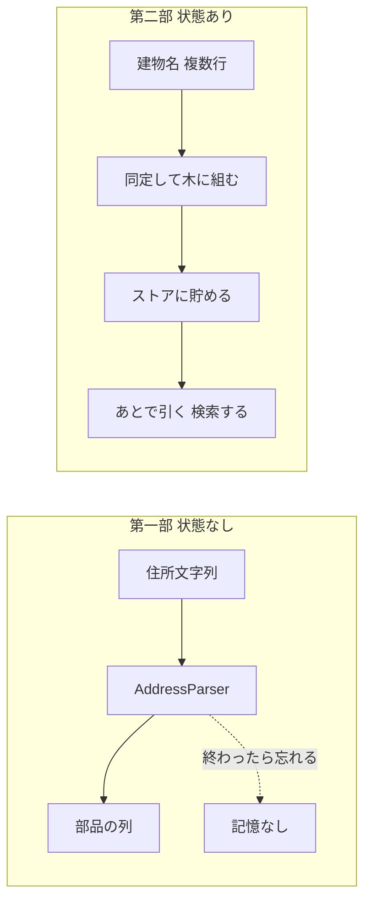
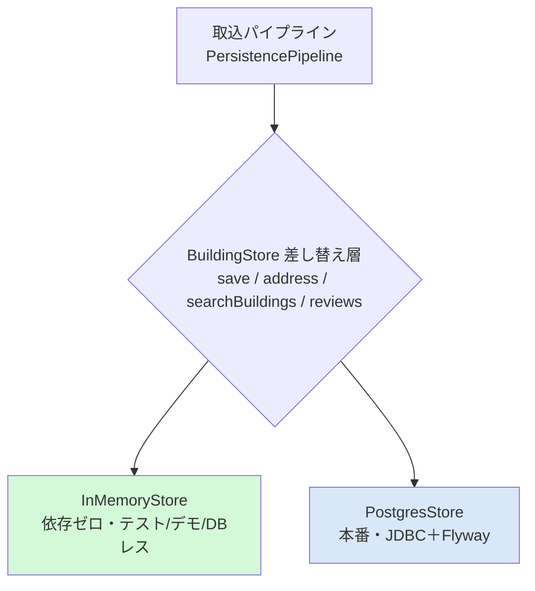
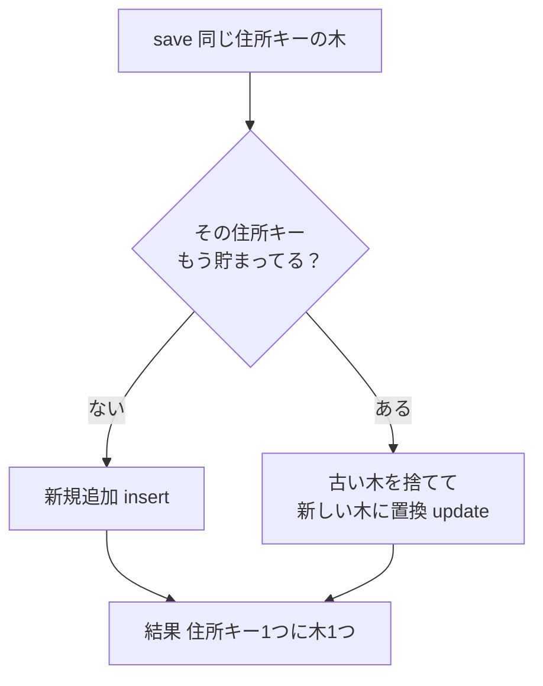
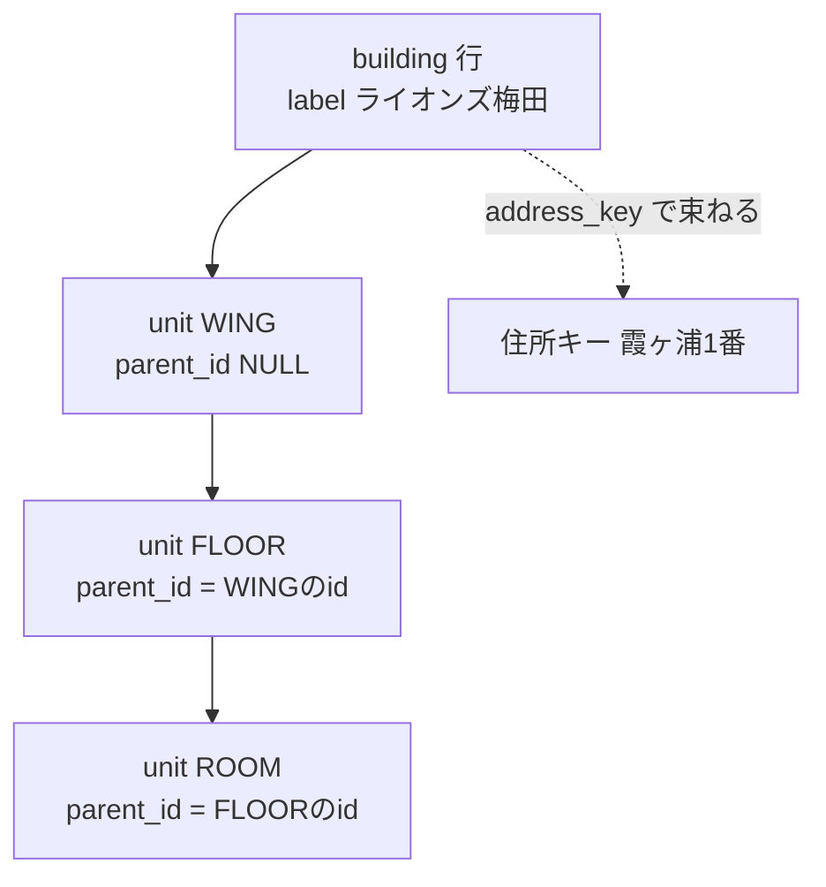

# 第二部 第6章　永続化と検索（なぜ“覚えておく”のか）

> **この章のゴール**
> - 第一部の「文字列→トークン（状態なし）」と、第二部の「コーパス→辞書→木（覚えて貯めて引く）」のちがいが分かる
> - **差し替え可能なストア層**（`BuildingStore`）＝中身が DB でもメモリでも、使い方は同じ、という設計をつかむ
> - 永続化スキーマ（`building` / `unit` 入れ子 / `building_alias` / `identity_review`）の役割が読める
> - **upsert（住所キーで丸ごと置換）** と **Flyway マイグレーション** の気持ちが分かる

> **登場人物**：みどり先生、ツムギ、ゲンタ、スガタ

---

## 第一部の機械は「忘れっぽい」、第二部の機械は「覚える」

**ツムギ**：先生、前章までで、建物名が「同じ」か「別」か見分けられるようになりましたよね。次は何をするんですか？

**みどり先生**：今日はね、見分けた結果を **覚えておく** 話だ。
ところでツムギ、第一部の `AddressParser` を思い出して。あれは、住所の文字列を入れたら、部品の列を返してくれたね。

**ツムギ**：はい。`020-0021岩手県盛岡市…` を入れると、ZIP・都道府県・市…って切ってくれました。

**みどり先生**：じゃあ聞くよ。`AddressParser` は、**さっき切った住所**を覚えていると思う？

**ツムギ**：えーと……たぶん、覚えてない？　毎回、入れたぶんだけ切って返すだけ、というか……。

**みどり先生**：大正解。第一部の機械は **状態なし（ステートレス）** なんだ。
入れたら出す。それでおしまい。前に何を切ったかは、きれいさっぱり忘れる。
学習ずみの重みは持っているけど、「処理したデータそのもの」は持たない。

**ゲンタ**：それの何が問題なの？　毎回切れるなら、それでいいじゃん。

**みどり先生**：いい「それ意味あるの？」だ。第一部はそれでよかった。
でも第二部の建物は、ちがうんだよ。図で比べてみよう。



**みどり先生**：第二部の仕事は、こうだ——
**たくさんの建物名（コーパス）を集めて、語彙（辞書）を学んで、同定して、木に組んで、貯めておく。**
そして、あとから「梅田って名前の建物どれ？」と **引ける** ようにする。
これは、忘れっぽい機械にはできない。**覚えておく＝永続化（えいぞくか、persistence）** が要るんだ。

**スガタ**：……わたしの姿は、一度に全部は来ないの。
きょう「ライオンズ梅田」、あした「ライオンズマンション梅田」……ばらばらに現れる。
だから、前に来た姿を **覚えていて**、新しい姿と見くらべてほしいの。

**みどり先生**：そうだね、スガタ。同定（同じ建物か見分ける）は、**過去の姿を覚えている** からこそできる。
忘れっぽい機械では、スガタを束ねられないんだ。

---

## “貯める箱”は中身を入れ替えられる：差し替えストア層

**ゲンタ**：「貯めておく」って、具体的には？　ファイル？　データベース？

**みどり先生**：そこが今日のキモ。kugiri は **「どこに貯めるか」を後で選べる** ように作ってある。
第一部の最終章（第19章）で、`tagger`（中身の機械学習）を差し替えられる、という話をしたね。覚えてる？

**ツムギ**：はい！　窓口（`AddressParser`）は変えずに、中身（`tagger`）だけ強くできる、ってやつ。

**みどり先生**：それと **まったく同じ発想** を、貯める箱にも使う。
「貯める箱」の **窓口** を1つ決めておいて、中身（メモリ？　DB？）を差し替え放題にするんだ。
この窓口を **`BuildingStore`（ビルディングストア）** という。



**みどり先生**：`BuildingStore` は「**こういうことができます**」という約束ごと（インターフェース）だけを決める。本物のコードを見てみよう。

```java
// BuildingStore.java — 「貯める箱」がやれること（約束ごと）
public interface BuildingStore extends AutoCloseable {

    /** 住所ルートを1件 upsert（同一 addressKey は置換）。 */
    void save(HierarchyNode addressRoot);

    default void saveAll(List<HierarchyNode> roots) { roots.forEach(this::save); }

    /** addressKey の住所サブツリーを復元。 */
    Optional<HierarchyNode> address(String addressKey);

    /** 建物名の部分一致検索。 */
    List<String> searchBuildings(String namePart);

    /** 要レビューの建物（型F=衝突の疑い等）。 */
    List<Review> reviews();

    int buildingCount();

    record Review(String addressKey, String buildingLabel) {}
}
```

**ゲンタ**：`interface`（インターフェース）……「中身は書いてないけど、メソッドの名前と形だけ決める」やつだな。
`save`（貯める）・`address`（住所で引く）・`searchBuildings`（名前で探す）・`reviews`（要レビューを出す）……。

**みどり先生**：その通り。**何ができるか** だけを決めて、**どうやるか** は実装にまかせる。
だから実装は2つある。

> 📌 **2つのストア実装**
> - **`InMemoryStore`**：**依存ゼロ**。データはプログラムが動いている間だけ、メモリ上の `Map`（マップ＝対応表）に持つ。テスト・デモ・DBが無い環境で使う。**プログラムが終わると消える**。
> - **`PostgresStore`**：**本番用**。データを **Postgres**（実在するデータベース）に、`JDBC`（ジェイディービーシー＝Java からDBをさわる標準の道具）で書き込む。**プログラムが終わっても残る**。

**ツムギ**：消える箱と、残る箱……でも、使い方は同じ窓口なんですね。

**みどり先生**：そこが美しいところ。テストはサッと動く `InMemoryStore` で、本番はデータが残る `PostgresStore` で——
**コードの呼び出し方は1ミリも変えずに**、箱だけすげ替える。

---

## いちばん軽い箱：InMemoryStore は `Map` ひとつ

**みどり先生**：まず、いちばんシンプルな `InMemoryStore` を見よう。中身は、おどろくほど素直だ。

```java
// InMemoryStore.java — 住所キー → 木 の対応表ひとつ
public final class InMemoryStore implements BuildingStore {

    private final Map<String, HierarchyNode> byAddress = new LinkedHashMap<>();

    @Override
    public void save(HierarchyNode addressRoot) {
        byAddress.put(addressRoot.label(), addressRoot); // addressKey 単位で置換 = upsert
    }

    @Override
    public Optional<HierarchyNode> address(String addressKey) {
        return Optional.ofNullable(byAddress.get(addressKey));
    }
    // searchBuildings / reviews / buildingCount は byAddress を回って集めるだけ
}
```

**ツムギ**：`Map<String, HierarchyNode>`……「住所キー」をキーにして、「木」を値にした、ただの対応表？

**みどり先生**：そう。`byAddress.put(キー, 木)` で入れて、`byAddress.get(キー)` で取り出す。それだけ。
辞書（国語辞典）と同じだよ。「ことば」を引くと「意味」が出てくる。ここでは「住所キー」を引くと「建物の木」が出てくる。

**ゲンタ**：`Optional`（オプショナル）って？

**みどり先生**：「**あるかもしれないし、ないかもしれない**」を表す箱だ。
聞いた住所キーが、まだ貯まっていなければ「ない（empty）」が返る。
`null`（ヌル＝値なし）をうっかり扱って事故るのを防ぐ、Java の安全装置だと思っていい。

---

## upsert ＝「住所キーで、丸ごと置きかえる」

**ツムギ**：さっきから出てくる **upsert（アップサート）** って何ですか？　ふつうの「保存」と違う？

**みどり先生**：いい質問。`upsert` は **update（更新）＋ insert（新規追加）** をくっつけた言葉だ。
「**もう同じキーがあれば中身を入れ替える。なければ新しく入れる**」——この2つを、1つの操作でまとめてやる。

**みどり先生**：`InMemoryStore` のコードをもう一度見て。`byAddress.put(キー, 木)` は——
そのキーが無ければ新しく入るし、**あれば古い木をポイッと捨てて新しい木に置きかわる**。
これがそのまま upsert になっている。



**ゲンタ**：なんで「足す」じゃなくて「置きかえる」なの？　古いのも残しといたほうがよくない？

**みどり先生**：鋭い。理由はね、**同じ取込を2回流しても、結果が二重にならない** ようにするためだ。
たとえばバッチ処理が途中で失敗して、もう一回頭から流し直した。
「足す」だと、同じ建物が2個ずつ貯まってしまう。でも「住所キーで丸ごと置きかえ」なら、**何回流しても結果は同じ**。
これを **冪等（べきとう、idempotent）** という。「同じ操作を何回やっても、結果が変わらない」性質だ。

> 📌 **冪等（idempotent）の気持ち**
> 電気のスイッチで言うと、「**オフにする**」は冪等（何回押してもオフのまま）。
> 「**切りかえる**」は冪等じゃない（押すたびにオン・オフが変わる）。
> upsert は前者。バッチを何回流しても、同じ住所キーの中身は同じ姿に落ち着く。

---

## 本番の箱：PostgresStore とスキーマ（テーブルの設計図）

**みどり先生**：次は本番の `PostgresStore`。こっちは「木」を、データベースの **テーブル（表）** に分けて書く。
まず、その表の設計図（**スキーマ**）を見よう。`db/migration/V1__init.sql` だ。

```sql
-- 建物（代表名 canonical）。同一住所に複数建物（型A）は building 複数で表現。
CREATE TABLE IF NOT EXISTS building (
    id           BIGSERIAL PRIMARY KEY,
    address_key  TEXT    NOT NULL,
    label        TEXT    NOT NULL,          -- 代表建物名
    needs_review BOOLEAN NOT NULL DEFAULT FALSE,
    UNIQUE (address_key, label)
);

-- 棟/階/部屋（建物内の入れ子）。parent_id が NULL なら建物直下。
CREATE TABLE IF NOT EXISTS unit (
    id          BIGSERIAL PRIMARY KEY,
    building_id BIGINT NOT NULL REFERENCES building (id) ON DELETE CASCADE,
    parent_id   BIGINT REFERENCES unit (id) ON DELETE CASCADE,
    kind        TEXT   NOT NULL CHECK (kind IN ('WING', 'FLOOR', 'ROOM')),
    label       TEXT   NOT NULL
);

-- 表記ゆれ・略称・改名 → 代表建物への別名。
CREATE TABLE IF NOT EXISTS building_alias (
    id          BIGSERIAL PRIMARY KEY,
    building_id BIGINT NOT NULL REFERENCES building (id) ON DELETE CASCADE,
    alias       TEXT   NOT NULL,
    kind        TEXT   NOT NULL CHECK (kind IN ('notation', 'abbrev', 'rename')),
    UNIQUE (building_id, alias)
);

-- 同定の要レビュー（型F=衝突, 型C=改名疑い）。人手 must/cannot-link の入口。
CREATE TABLE IF NOT EXISTS identity_review (
    id           BIGSERIAL PRIMARY KEY,
    address_key  TEXT NOT NULL,
    building_label TEXT NOT NULL,
    reason       TEXT NOT NULL,
    resolved     BOOLEAN NOT NULL DEFAULT FALSE
);
```

**ツムギ**：うわ、表が4つもある……。

**みどり先生**：あわてない、あわてない。1つずつ、役割で読めば簡単だ。

> 📌 **4つのテーブルの役割**
> - **`building`（建物）**：1住所に建物が何個あってもいい（型A＝敷地に複数施設）。`address_key`（住所キー）と `label`（代表名）を持つ。`needs_review` は「要レビュー印」。
> - **`unit`（棟/階/部屋）**：建物の中の入れ子。`parent_id`（親のid）で **自分の親をたどる**。親が無ければ（`NULL`）建物の直下。`kind` は `WING`（棟）/ `FLOOR`（階）/ `ROOM`（部屋）。
> - **`building_alias`（別名）**：同じ建物を指す別の呼び方。`kind` が **`notation`（表記ゆれ・型D）/ `abbrev`（略称・型E）/ `rename`（改名・型C）**。第0〜2章の型と、ぴったり対応している。
> - **`identity_review`（要レビュー）**：型F（略しすぎ衝突）など、機械が断定できなかったものを置く。**人手レビューの入口**。

**ゲンタ**：`unit` の `parent_id` が `unit` 自身を指してる（`REFERENCES unit`）……これ、表が **自分自身を親に持つ** ってこと？

**みどり先生**：そう、それが入れ子（ツリー）の表現だ。
棟の下に階、階の下に部屋……と深さが変わるから、`parent_id` で「自分の親はこのid」と指していくんだ。
親が `NULL` なら建物の直下。これで **可変の深さ** の木を、1つの平らな表で表せる。



**ツムギ**：`ON DELETE CASCADE`（オン・デリート・カスケード）って？

**みどり先生**：「**親が消えたら、子も一緒に消える**」という指定だよ。
`building` を1件消すと、ぶら下がっていた `unit` も `building_alias` も、滝（カスケード）のように一緒に消える。
これが、次に話す upsert で効いてくる。

---

## PostgresStore の upsert ＝「消して、入れ直す」

**みどり先生**：`PostgresStore` の `save` を見よう。`InMemoryStore` と **同じ upsert** を、DB のやり方で実現している。

```java
// PostgresStore.save — addressKey の既存建物を消して入れ直す（= upsert）
@Override
public void save(HierarchyNode addressRoot) {
    String addressKey = addressRoot.label();
    try {
        // ① 同じ住所キーの建物を消す（unit/alias は ON DELETE CASCADE で連れて消える）
        try (PreparedStatement del = conn.prepareStatement("DELETE FROM building WHERE address_key = ?")) {
            del.setString(1, addressKey);
            del.executeUpdate();
        }
        // identity_review も消す（後略）

        // ② 木をたどって入れ直す
        for (HierarchyNode building : addressRoot.children()) {
            if (building.level() != Level.BUILDING) continue;
            long buildingId = insertBuilding(addressKey, building.label(), building.needsReview());
            for (HierarchyNode child : building.children()) insertUnit(buildingId, null, child);
            if (building.needsReview()) insertReview(addressKey, building.label(),
                    "同定で衝突の疑い（型F）。住所/部屋証拠で確定");
        }
        conn.commit();  // ③ ここまで全部成功したら、まとめて確定
    } catch (SQLException e) {
        rollback();     // 途中で失敗したら、全部なかったことに
        throw new RuntimeException("保存に失敗: " + addressKey, e);
    }
}
```

**ゲンタ**：「消して、入れ直す」……`InMemoryStore` の `put` で置きかえてたのと、考え方は同じか。
同じ住所キーを2回流しても、先に `DELETE` するから二重にならない。冪等だな。

**みどり先生**：その通り。よく気づいた。
そして `unit` や `building_alias` は `ON DELETE CASCADE` だから、`building` を消すだけで子も一緒に消える。だから消すのは `building` の1行でいい。

**ツムギ**：最後の `conn.commit()` と `rollback()` は？

**みどり先生**：これが **トランザクション（transaction）** という、データベースの大事な仕組みだ。

> 📌 **トランザクション ＝「全部成功か、全部なかったことか」**
> `commit`（コミット）＝「ここまでの変更を **確定** する」。
> `rollback`（ロールバック）＝「途中で失敗したから、**全部なかったこと** にして元に戻す」。
> 建物だけ入って、棟は入らなかった……みたいな **中途半端な状態** を絶対に残さない。
> 「ぜんぶやる」か「ぜんぶやらない」かの、どちらかだけ。

**みどり先生**：木を復元する `address`（住所で引く）は、この逆をやる。
`building` を読んで、`unit` を `parent_id` でたどりながら、メモリ上の木（`HierarchyNode`）に組み直すんだ。
表に分けて貯めて、引くときに木に戻す——「**分解して貯め、組んで返す**」。これが永続化の往復だよ。

---

## Flyway ＝「スキーマの更新を、順番に管理する」

**ゲンタ**：先生、その表（テーブル）って、最初にだれが作るの？　手で `CREATE TABLE` を打つ？

**みどり先生**：そこを自動でやってくれるのが **Flyway（フライウェイ）** だ。
`PostgresStore.open` の最初の数行を見て。

```java
// PostgresStore.open — 接続する前に、まず Flyway でマイグレーションを適用
public static PostgresStore open(String jdbcUrl, String user, String password) {
    Flyway.configure().dataSource(jdbcUrl, user, password)
            .locations("classpath:db/migration").load().migrate();   // ← ここ
    // ... このあと JDBC で接続
}
```

**みどり先生**：`db/migration` フォルダの中の SQL ファイルを、**ファイル名の順番で**、まだ当てていないものだけ流す。
さっきの `V1__init.sql` の `V1` がその番号だ。

> 📌 **マイグレーション（migration）の気持ち**
> データベースの「設計図の更新」を、**バージョン番号つきの手順書** として残しておく仕組み。
> `V1__init.sql`（最初の表を作る）→ あとで列を足したくなったら `V2__add_xxx.sql` を足す……というふうに、
> **誰がどの順で当てても、同じ最終形にたどり着く**。すでに当てたものは二度と流さない（ここでも冪等）。
> ゲームの「セーブデータのバージョンアップ」を、自動で順番にやってくれる係だと思えばいい。

**みどり先生**：これも結局、第一部から繰り返してきた **「人手の管理を、仕組みで自動化する」** という発想なんだ。
表の作り直しを手で覚えておく代わりに、手順書をファイルにして、Flyway に順番を守らせる。

---

## 手を動かそう

取込から検索・木の復元・要レビューまでを、ひとつ通しで動かすデモが `StoreDemo` です。
DBが無くても動くよう、中身は `InMemoryStore` を使っています。

```bash
mvn -q -f building/pom.xml exec:java \
  -Dexec.mainClass=org.unlaxer.kugiri.building.demo.StoreDemo \
  -Dstdout.encoding=UTF-8
```

中で何をしているか、本物のコードはこれだけです。

```java
// StoreDemo.java（要点）
BuildingLexicon lex = BuildingLexicon.learn(SampleCorpus.names()); // ① 語彙を学ぶ（第2章）
BuildingParser parser = BuildingParser.of("lexicon", lex);          // ② 建物名を分解する係

String[][] raw = {
        {"霞ヶ浦1番", "ライオンズマンション梅田301号室"},
        {"霞ヶ浦1番", "ライオンズ梅田-302"},
        {"霞ヶ浦1番", "青雲荘B-101"},
        {"本町5番", "寮-201"},               // 識別固有名なし → 要レビュー候補
};
List<Row> rows = new ArrayList<>();
for (String[] r : raw) rows.add(new Row(r[0], parser.parse(r[1])));

try (BuildingStore store = new InMemoryStore()) {                   // ③ 箱を用意（本番は PostgresStore）
    int saved = PersistencePipeline.ingest(rows, lex, store);       // ④ 同定→木→upsert（第5章＋本章）
    System.out.printf("保存住所数=%d  建物数=%d%n", saved, store.buildingCount());

    System.out.println("検索『梅田』: " + store.searchBuildings("梅田")); // ⑤ 名前で引く
    store.address("霞ヶ浦1番").ifPresent(a -> System.out.print(a.pretty())); // ⑥ 住所で木を復元
    System.out.println("要レビュー: " + store.reviews());                 // ⑦ 型Fを取り出す
}
```

> 📌 **読み方メモ**
> - `try (BuildingStore store = new InMemoryStore())` の書き方を **try-with-resources** という。
>   ブロックを抜けると、自動で `store.close()` が呼ばれる（DBなら接続を閉じる）。閉じ忘れない安全装置。
> - 本番にするには、`new InMemoryStore()` を `PostgresStore.open(jdbcUrl, user, pw)` に **差し替えるだけ**。
>   あとの `ingest` も `searchBuildings` も `address` も、**1文字も変えなくていい**。これが差し替え層のごほうび。

**ツムギ**：`霞ヶ浦1番` の木を復元すると、`ライオンズ梅田` の下に `301号室` とか `302` がぶら下がって出てくるんですね。
そして `寮-201` は……。

**みどり先生**：そう。`寮` は固有名核が無い（第2章の型F）から、`needsReview` の印がついて、`reviews()` に出てくる。
機械は「これは断定できない」と正直に言って、**人手の入口（`identity_review`）に置く**。覚えておいた上で、後の証拠と人に渡すんだ。

**スガタ**：……ばらばらに来た「ライオンズマンション梅田」と「ライオンズ梅田」が、
ちゃんと **同じ住所キーの下** で、ひとつの建物に束ねられたのね。覚えていてくれたから。

---

### 計算練習（紙とえんぴつで）

**問題1**：`霞ヶ浦1番` の住所に、まず `ライオンズ梅田` を `save` した。
そのあと **もう一度** `霞ヶ浦1番` の取込（`ライオンズ梅田` と `青雲荘B` の2件）を `save` した。
建物は何件になる？　（ヒント：upsert）

<details>
<summary>こたえ</summary>

**2件**。upsert は住所キーで **丸ごと置きかえ** だから、1回目の `ライオンズ梅田` 1件は捨てられ、
2回目の `ライオンズ梅田` ＋ `青雲荘B` の2件に置きかわる。
もし「足す」方式なら `ライオンズ梅田` が2件になって二重化していた。upsert（冪等）のおかげで二重にならない。

</details>

**問題2**：`unit` テーブルで、ある部屋（ROOM）の行の `parent_id` が、ある階（FLOOR）の `id` を指している。
その階の行を `DELETE` すると、部屋の行はどうなる？

<details>
<summary>こたえ</summary>

**部屋の行も一緒に消える**。`parent_id` に `ON DELETE CASCADE` がついているから、
親（階）が消えると、子（部屋）も滝のように連れて消える。だから upsert は `building` を1行消すだけで、
ぶら下がる棟・階・部屋がぜんぶ片づく。

</details>

---

## 今日のまとめ

- 第一部の機械は **状態なし（入れたら出して忘れる）**。第二部は **コーパス→辞書→木を“覚えて貯めて引く”** ＝**永続化**が要る。スガタはばらばらに来るので、過去を覚えていないと束ねられない。
- **`BuildingStore`** は差し替え可能な「貯める箱」の窓口。中身は2つ＝**`InMemoryStore`（依存ゼロ・消える・テスト/デモ）** と **`PostgresStore`（本番・JDBC＋Flyway・残る）**。呼び出し方は同じ。
- **upsert** ＝ 住所キーで **丸ごと置換**（無ければ追加、あれば入れ替え）。だから同じ取込を何回流しても二重にならない＝**冪等**。
- スキーマは **`building`（複数可＝型A）/ `unit`（棟・階・部屋の入れ子・`parent_id`で親をたどる）/ `building_alias`（notation・abbrev・rename＝型D/E/C）/ `identity_review`（型F等の人手入口）**。
- `PostgresStore` の upsert は「**消して入れ直す**」＋ `commit`/`rollback`（全部成功か全部なかったことか＝トランザクション）。
- **Flyway** は SQL の更新手順を **番号つきで順番に当てる**（マイグレーション）。当てずみは流さない＝冪等。

---

## スガタメーター

```
スガタの見分け：████████░░ 82%
（コメント：ばらばらに来る姿を「覚えて貯めて引く」箱ができた。
　同じ住所キーの下に束ね、型Fは人手の入口に正直に置く。あとは“箱の中身を選ぶ”だけ。）
```

---

## 次回予告

**みどり先生**：今日は「貯める箱の中身を差し替えられる」と言ったね。
じつは kugiri は、**箱だけじゃなく、判定アルゴリズムそのものも差し替えられる** んだ。

**ツムギ**：あ、第一部の `tagger` 差し替えと、ストアの差し替えと……また同じパターンですね。

**みどり先生**：その通り。次の章は、`IdentityResolver`（同定の方式）と `BuildingParser`（建物名の分解）を、
動作オプションで切りかえて、**同じデータで方式どうしを“対決”させる**話だ。
あの 9/9 対 5/9 対 3/9 が、どうやって測られているか——その舞台裏を見にいこう。あわてない、あわてない。

[← 第5章](05-row-to-tree.md) ・ [第7章 →](07-swap-layer.md)
