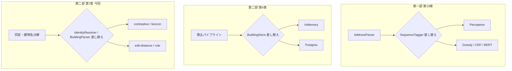
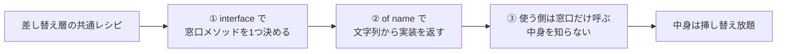
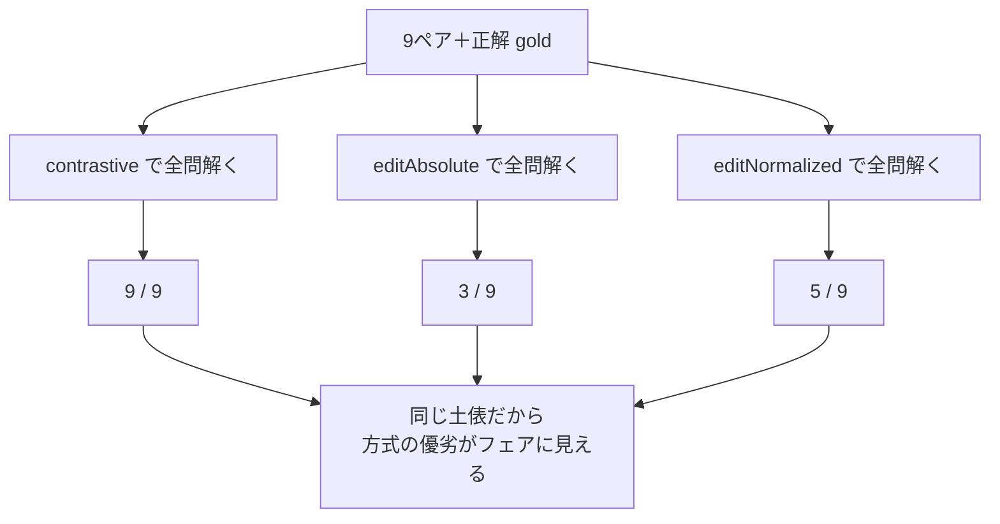
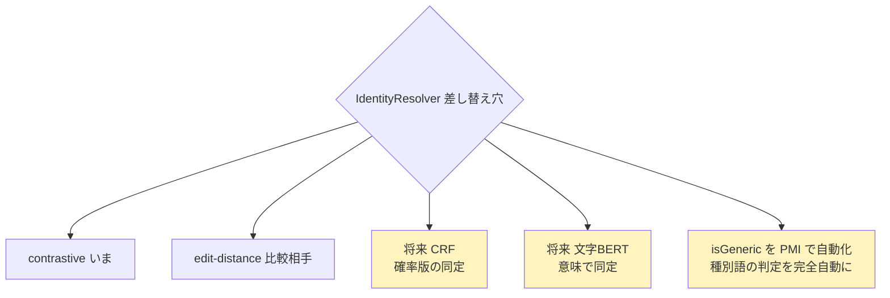

# 第二部 第7章　アルゴリズムを切り替える（差し替え層と対決）

> **この章のゴール**
> - **差し替え層（pluggable layer）** ＝「窓口は同じ、中身だけ取りかえる」設計が、kugiri のあちこちで同じ形で使われていると分かる
> - `IdentityResolver.of(...)` と `BuildingParser.of(...)` で、動作オプション（文字列）からアルゴリズムを選べることをつかむ
> - **対決ハーネス** ＝ 同じデータで方式を並べて点数化するしくみ（9/9 vs 5/9 vs 3/9 の舞台裏）が読める
> - なぜ差し替え可能にするのか（比較・将来の CRF/BERT・PMI 自動化への道）が腑に落ちる

> **登場人物**：みどり先生、ツムギ、ゲンタ、スガタ

---

## 同じ穴に、いろんな道具を挿す

**ゲンタ**：先生、前章でストアを差し替えられるって話、よく分かった。
でもさ、もっと根っこの「**同じか別か判定するアルゴリズム**」そのものは、固定なの？

**みどり先生**：いい食いつきだ、ゲンタ。じつは判定アルゴリズムも **差し替えられる**。
今日のテーマは、その **差し替え層（さしかえそう、pluggable layer）** だ。第一部から、ずっと同じ形で出てきたものだよ。

**ツムギ**：第一部の……`tagger`（パーセプトロンを別の機械に差し替える）と、前章のストアと……。

**みどり先生**：そう。**同じパターンが3回目**だ。図にすると、こうなる。



**みどり先生**：3つとも、形は同じだろう？
**窓口（呼び出し方）は1つに固定** しておいて、**中身（実装）だけを、必要に応じて取りかえる**。
これが kugiri の背骨にある設計思想なんだ。CLAUDE.md にも「差し替え層」と書いてある。

**ゲンタ**：穴の形（インターフェース）をそろえておけば、どんな道具でも挿せる、と。

**みどり先生**：その通り。今日は、その穴を2つ見る。**同定** と **建物名の分解** だ。

---

## 差し替え1：IdentityResolver（同定の方式）

**みどり先生**：まずは同定。「2つの建物名が同じか別か」を決める係を **`IdentityResolver`（アイデンティティ・リゾルバ）** という。
「身元（identity）を、解決（resolve）する人」だね。本物のコードを見よう。

```java
// IdentityResolver.java — 「2名は同一か別か」を判定する差し替え層
public interface IdentityResolver {

    Verdict decide(String a, String b);   // a と b の判定（SAME/DISTINCT/NEEDS_REVIEW）
    String name();

    static IdentityResolver of(String name, BuildingLexicon lex) {
        return switch (name) {
            case "contrastive"     -> /* kugiri 統計：包含＋対立度＋enumerator（3値）*/ ...;
            case "edit-normalized" -> /* 正規化編集距離（BH 現行相当・2値）*/ ...;
            case "edit-absolute"   -> /* 絶対編集距離（BH legacy 相当・2値）*/ ...;
            default -> throw new IllegalArgumentException("Unknown identity resolver: " + name);
        };
    }
}
```

**ツムギ**：`of(name, ...)` に **文字列を渡すと、その方式が返ってくる**……！
`"contrastive"` って打てば kugiri 統計、`"edit-normalized"` って打てば編集距離。

**みどり先生**：そう。これを **動作オプション（うごき方の選択肢）** と呼ぶ。
設定ファイルやコマンドの引数で、文字列を変えるだけで、判定の中身がまるごと入れかわる。

> 📌 **3つの判定方式（動作オプション）**
> - **`"contrastive"`（コントラスティブ＝対立的）**：kugiri 統計。第2章でやった **包含＋対立度＋enumerator**。**3値**（SAME / DISTINCT / NEEDS_REVIEW）を出せる。
> - **`"edit-normalized"`（正規化編集距離）**：第1章の **BH 現行相当**。距離を 0〜1 の類似度に直してしきい値判定。**2値**しか出せない。
> - **`"edit-absolute"`（絶対編集距離）**：**BH legacy（昔の方式）相当**。距離が4以下なら同じ、と硬く決める。**2値**。

**みどり先生**：`switch`（スイッチ）の中身を見てごらん。本物はこう書いてある。

```java
// IdentityResolver.of の中身（contrastive の枝）
case "contrastive" -> new IdentityResolver() {
    public Verdict decide(String a, String b) { return BuildingIdentity.contrastive(a, b, lex); }
    public String name() { return "contrastive"; }
};
case "edit-normalized" -> new IdentityResolver() {
    public Verdict decide(String a, String b) { return BuildingIdentity.editNormalized(a, b, 0.76); }
    public String name() { return "edit-normalized"; }
};
case "edit-absolute" -> new IdentityResolver() {
    public Verdict decide(String a, String b) { return BuildingIdentity.editAbsolute(a, b, 4); }
    public String name() { return "edit-absolute"; }
};
```

**ゲンタ**：どの枝も、`decide(a, b)` という **同じ形のメソッド** を持ってる。
中で呼ぶ計算（`contrastive` か `editNormalized` か `editAbsolute`）だけが違う。

**みどり先生**：その通り。**外から見た形は同じ。中身だけ違う**。
だから、これを使う側（次に話す対決ハーネスやクラスタリング）は、`resolver.decide(a, b)` と呼ぶだけ。
どの方式が刺さっているかを、気にしなくていい。

---

## 差し替え2：BuildingParser（建物名の分解）

**みどり先生**：もう1つの穴は **建物名の分解** だ。`ライオンズマンション梅田301号室` を、
「建物名／棟／階／部屋」に分ける係。これも差し替えられる。`BuildingParser`（ビルディングパーサ）という。

```java
// BuildingParser.java — 建物テールを分解する差し替え層
public interface BuildingParser {

    ParsedBuilding parse(String tail);
    String name();

    static BuildingParser of(String name, BuildingLexicon lexicon) {
        return switch (name) {
            case "rule"    -> new RuleBuildingParser();              // 末尾から優先順位パターンで貪欲に剥がす（BH相当）
            case "lexicon" -> new LexiconBuildingParser(lexicon);    // rule＋誘導語彙（kugiri）
            default -> throw new IllegalArgumentException("Unknown building parser: " + name + " (rule | lexicon)");
        };
    }
}
```

> 📌 **2つの分解方式**
> - **`"rule"`（ルール）**：末尾から、決めた優先順位のパターンで **貪欲に剥がす**。昔ながらの BH 相当の、決定的なベースライン。
> - **`"lexicon"`（レキシコン＝語彙）**：`rule` に、第2章で学んだ **誘導語彙（コーパスから学んだ辞書）** を足す。
>   「裸の末尾数字は、棟か？　名前の一部か？」を、辞書を頼りに判定する kugiri 版。

**ツムギ**：これも `of("rule", ...)` と `of("lexicon", ...)` で切りかえるんですね。
前章の `StoreDemo` で `BuildingParser.of("lexicon", lex)` って書いてあったの、これだったんだ！

**みどり先生**：よく覚えてた。まさにそれ。
そして大事なのは——**第一部の `SequenceTagger` と、ここの `IdentityResolver`・`BuildingParser` は、まったく同じ継ぎ目** だということ。



**ゲンタ**：レシピが完全に一緒だ。`interface` を切って、`of(名前)` で選んで、使う側は窓口だけ叩く。
一回おぼえれば、ぜんぶ同じ読み方でいけるな。

---

## 対決ハーネス：同じデータで方式を競わせる

**ツムギ**：先生、差し替えられるのは分かりました。でも、**どの方式がいいか** は、どうやって決めるんですか？

**みどり先生**：そこだ！　差し替えられることの、いちばんのごほうび。
**同じデータを、ぜんぶの方式に通して、点数を比べる**。これを **対決ハーネス（たいけつハーネス、harness＝仕掛け・台）** という。

**みどり先生**：第0章・第2章で動かした `IdentityProbeDemo`、あれが対決ハーネスの正体だ。中身を見よう。

```java
// IdentityProbeDemo.java（要点）— 9ペアを3方式で判定して、正答数を数える
List<Case> cases = List.of(
        new Case("コーポ山田", "コ−ポ山田", Decision.SAME, "型D notation"),
        new Case("ライオンズマンション梅田", "ライオンズ梅田", Decision.SAME, "型E 包含"),
        new Case("白雲荘", "青雲荘", Decision.DISTINCT, "型B 対立的"),
        new Case("白雲荘", "白雲荘B", Decision.SAME, "B＝棟"),
        new Case("寮", "さくら寮", Decision.NEEDS_REVIEW, "型F 略しすぎ衝突")
        // ... 全9ペア
);

int kHit = 0, aHit = 0, nHit = 0;
for (Case c : cases) {
    Verdict k    = BuildingIdentity.contrastive(c.a(), c.b(), lex);   // kugiri 統計
    Verdict abs  = BuildingIdentity.editAbsolute(c.a(), c.b(), 4);    // 編集（絶対）
    Verdict norm = BuildingIdentity.editNormalized(c.a(), c.b(), 0.76); // 編集（正規化）
    kHit += k.decision()    == c.truth() ? 1 : 0;                     // 正解と一致したら +1
    aHit += abs.decision()  == c.truth() ? 1 : 0;
    nHit += norm.decision() == c.truth() ? 1 : 0;
}
// → 正答数: kugiri 9/9, 編集(絶対) 3/9, 編集(正規化) 5/9
```

**みどり先生**：やっていることは、すごく素直だ。

> 📌 **対決ハーネスの3ステップ**
> 1. **正解つきの問題（gold＝ゴールド）を並べる**：9ペアと、それぞれの「本当の答え（`truth`）」。
> 2. **同じ問題を、全方式に解かせる**：`contrastive` / `editAbsolute` / `editNormalized` の3つ。
> 3. **正解と一致した数を数える**：`got == truth ? 1 : 0` を足していくだけ。

**ツムギ**：`? 1 : 0` ……「合ってたら1、違ってたら0」を足してるんですね。テストの丸つけと同じだ。

**みどり先生**：その通り。これで点数が出る。



**ゲンタ**：なんで編集距離だけ、こんなに外すんだっけ？

**みどり先生**：第1章・第2章の罠そのものだよ。思い出そう。
- `県立さくら施設さくら寮` / `さくら寮` … 距離が遠くて、編集距離は **別** と誤る。kugiri は **包含で SAME**。
- `白雲荘` / `青雲荘` … 距離は近いが、`白雲`/`青雲` が対立的。kugiri は **DISTINCT**。
- `寮` / `さくら寮` … **型F**。編集距離は SAME か DISTINCT のどちらかに **必ず倒れる**。kugiri だけ **NEEDS_REVIEW** と言える。

**スガタ**：……編集距離さんは、「わからない」が言えないの。だから型Fで、わたしを必ず取りちがえる。
contrastive さんだけが、「これは決められない」と正直に言ってくれる。

**みどり先生**：そこが効いている。9問のうち、型F の1問は **3値が出せないと、原理的に取れない**。
編集距離が満点を取れない理由の一つが、これだ。

---

## なぜ差し替え可能にするのか

**ツムギ**：でも先生、kugiri が 9/9 で勝つなら、もう編集距離はいらなくないですか？　なんで残してあるの？

**みどり先生**：すごくいい「なんで？」だ。3つ理由がある。

**みどり先生**：1つ目。**比較できないと、勝ったことが言えない**。
「kugiri は強い」と主張するには、**同じ土俵に、比べる相手** が要る。編集距離（BH 相当）を差し替えで横に並べられるから、9/9 対 5/9 という **数字** で勝ちを示せる。相手がいなければ、ただの自慢だ。

**みどり先生**：2つ目。**typo（打ちまちがい）救済では、編集距離のほうが強い**。
`サンハイツ` / `サソハイツ`（`ン`と`ソ`の打ちまちがい）みたいなのは、距離でしか拾えない。
だから kugiri 本体も、最後のフォールバックで **編集距離を呼んでいる**（第2章の `contrastive` の⑤）。差し替えで横に置けるから、いいとこ取りができる。

**みどり先生**：3つ目。そして、これが一番大きい。**未来のために穴をあけてある**。



**みどり先生**：第2章で、種別語かどうか（`isGeneric`）は、いまは小さな種リスト＋高頻度で判定していたね。
これを将来 **PMI で完全自動化** したくなったら——
新しい方式を `IdentityResolver` の **新しい枝として挿すだけ**。既存の `contrastive` も `edit-distance` も、そのまま残せる。
そして対決ハーネスに通せば、**新方式が本当に勝ったか**、すぐ数字で分かる。

**ゲンタ**：……あ。差し替え層と対決ハーネスは、セットなんだ。
**挿せる穴**があるから新方式を試せて、**対決**があるから、その新方式が良くなったか測れる。

**みどり先生**：その通り！　よく見抜いた。
これが第一部の `tagger`（CRF や BERT に差し替え）と、まったく同じ話だ。
**窓口を固定して、中身を進化させる**。kugiri は、今日のあなたが読める参照実装でありながら、明日のあなたが強くするための **消えない設計図** になっている。

---

## 手を動かそう

`IdentityProbeDemo` を、もう一度、今度は **理由（reason）の欄まで** 読みながら動かしましょう。

```bash
mvn -q -f building/pom.xml exec:java \
  -Dexec.mainClass=org.unlaxer.kugiri.building.demo.IdentityProbeDemo \
  -Dstdout.encoding=UTF-8
```

デモの後半は、各ペアが **なぜ** そう判定されたかを、日本語で出します。

```java
// IdentityProbeDemo.java（後半）— kugiri 判定の「理由」を表示
for (Case c : cases) {
    Verdict k = BuildingIdentity.contrastive(c.a(), c.b(), lex);
    System.out.printf("  %-30s -> %-12s : %s%n", c.a() + " / " + c.b(), k.decision(), k.reason());
}
```

たとえば、こんな行が出ます（イメージ）。

```
  ライオンズマンション梅田 / ライオンズ梅田 -> SAME         : 包含＝略称（型E）共有核 [ライオンズ, 梅田]
  白雲荘 / 青雲荘                          -> DISTINCT     : 対立的差分 [白雲] vs [青雲]
  寮 / さくら寮                            -> NEEDS_REVIEW : 包含だが共有核が汎用語のみ（型F）: [寮]
```

> 📌 **`Verdict`（ヴァーディクト＝判定・評決）** は、`decision()`（SAME/DISTINCT/NEEDS_REVIEW）と、
> `reason()`（なぜそう判定したかの日本語）の **2つをセット** で持つ。
> 「答え」だけでなく「理由」も返すから、機械の判断を人間が **検算** できる。これも大事な設計だ。

**ツムギ**：理由まで日本語で出るから、「あ、これは包含で SAME になったんだ」って、その場で納得できますね。

### 差し替えを試す（擬似コード）

対決ハーネスを、自分の言葉で組むとこうなります。`IdentityResolver.of` で方式を選び、同じループに通すだけ。

```java
// 方式の名前を並べて、同じ gold で回せば対決になる
for (String method : List.of("contrastive", "edit-normalized", "edit-absolute")) {
    IdentityResolver r = IdentityResolver.of(method, lex);   // ← 文字列で方式を選ぶ
    int hit = 0;
    for (Case c : cases)
        if (r.decide(c.a(), c.b()).decision() == c.truth()) hit++;  // 窓口 decide を叩くだけ
    System.out.printf("%-16s : %d/%d%n", r.name(), hit, cases.size());
}
```

**ゲンタ**：`r.decide(...)` を呼ぶところは、方式が何であっても **まったく同じ** だ。
方式を増やしたければ、`List.of(...)` に名前を1個足すだけ。対決の表が1行増える。

---

### 計算練習（紙とえんぴつで）

**問題1**：対決ハーネスに、新しい方式 `"crf"`（将来の実装）を加えたい。
`IdentityProbeDemo` のループ側（`r.decide(...)` を呼ぶところ）は、何行書きかえる必要がある？

<details>
<summary>こたえ</summary>

ループ側は **0行**（書きかえ不要）。`r.decide(a, b)` は窓口なので、中身が `crf` でも呼び方は同じ。
変えるのは `IdentityResolver.of` の `switch` に `case "crf" -> ...` を **1枝足す** ことと、
試す方式リストに `"crf"` を **1個足す** ことだけ。これが差し替え層のごほうび。

</details>

**問題2**：9ペアのうち1つは型F（`寮`/`さくら寮`）。
編集距離方式が、原理的に **絶対に取れない上限** は 9問中 何問？　理由も。

<details>
<summary>こたえ</summary>

少なくとも **型Fの1問** は取れない（最大でも 8/9 が上限）。
編集距離は2値（SAME か DISTINCT）しか出せず、NEEDS_REVIEW を返せないから。
実際にはさらに、距離が遠い略称（型E）や近い対立（型B）でも外すので、5/9・3/9 に下がる。
「3値が出せること」自体が、kugiri の構造的な強みだと分かる。

</details>

---

## 今日のまとめ

- **差し替え層** ＝「窓口（呼び方）は固定、中身（実装）だけ取りかえる」。第一部の `SequenceTagger`、第6章の `BuildingStore`、本章の `IdentityResolver`/`BuildingParser` は **同じレシピ**（interface ＋ `of(名前)` ＋ 窓口だけ呼ぶ）。
- **`IdentityResolver.of("contrastive" | "edit-normalized" | "edit-absolute")`** で同定方式を、**`BuildingParser.of("rule" | "lexicon")`** で建物名分解を、動作オプション（文字列）で選べる。
- **対決ハーネス**（`IdentityProbeDemo`）＝ 同じ gold を全方式に解かせ、正解一致数を数える（`got==truth ? 1 : 0`）。結果は **kugiri 9/9・編集（正規化）5/9・編集（絶対）3/9**。
- 編集距離は **NEEDS_REVIEW を出せない**ので、型Fは原理的に取れない（上限 8/9）。さらに型E/Bの罠で 5/9・3/9 に下がる。
- 差し替え可能にする理由は3つ：**①比較（勝ちを数字で示す）②typo は編集距離が強くフォールバックに使える ③将来の CRF/BERT や `isGeneric` の PMI 自動化を、穴に挿すだけで試せる**。差し替え層と対決ハーネスはセット。

---

## スガタメーター

```
スガタの見分け：█████████░ 92%
（コメント：判定の中身を取りかえても、対決ハーネスでフェアに測れるようになった。
　「わからない」が言える contrastive の強みも、数字で確かめられた。あと一歩で全部つながる。）
```

---

## 次回予告

**みどり先生**：さあ、いよいよ最終章だ。
距離じゃなく、**包含＋対立度＋証拠＋人手レビュー** で、スガタの「いくつもの姿」を見分けられるようになった。
次は、その旅をふり返って、第一部のアザミとの **対比** で物語を締めよう。

**ツムギ**：アザミ、また会えるんですか！？

**みどり先生**：ああ。見えなさすぎたアザミと、見えすぎたスガタ。コインの裏表だった二人を、最後に並べよう。
そして——テキストの **天井** と、その先の冒険の話も。あわてない、あわてない。

[← 第6章](06-persistence.md) ・ [第8章 →](08-epilogue.md)
