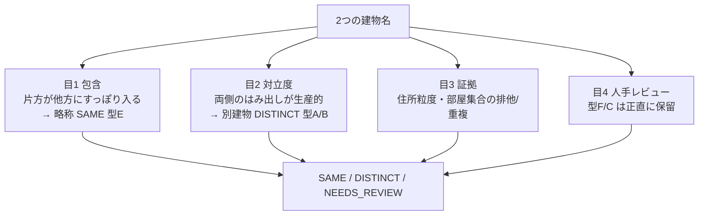
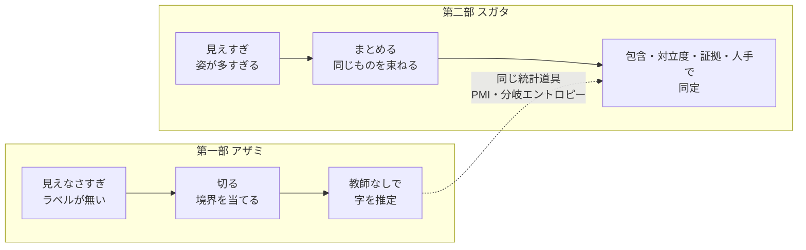
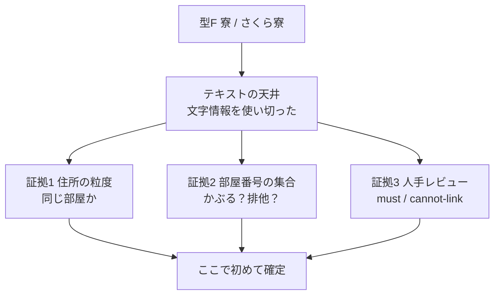
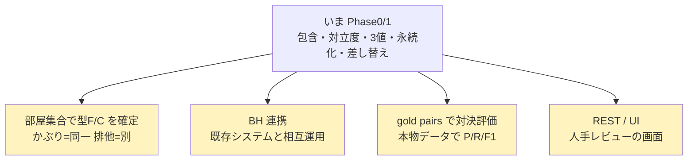

# 第二部 第8章　エピローグ：スガタ、見分けがつく

> **この章のゴール**
> - 第二部の旅を1本の線でふり返り、「距離ではなく **包含＋対立度＋証拠＋人手レビュー**」で同定する全体像をつかむ
> - 第一部のアザミ（見えなさすぎ）と第二部のスガタ（見えすぎ）が、コインの裏表だったと味わう
> - テキスト単独の **天井**（型F・C）と、その先を **謙虚に**受けとめる
> - 次の冒険（Phase2）と、メンテナーになった自分への励ましを受けとる

> **登場人物**：みどり先生、ツムギ、ゲンタ、スガタ、アザミ（再登場！）

---

## また放課後の、プログラミング室

**ツムギ**：先生……第二部も、ここまで来ましたね。

**みどり先生**：来たね。第0章でスガタが「いくつもの姿」で現れたとき、君たちは面くらっていた。
いまはどうだ？

**スガタ**：……（前は、いろんな場所にぼんやり何個も現れていた。いまは、姿がくっきりして、数えられる）……
ねえ、見て。わたし、ちゃんと「ひとり」のときと、「別人」のときと、「まだ決められない」ときが、見分けられてる。

**ゲンタ**：最初は「同じ住所に名前がいっぱい」で、何が何だか分からなかったもんな。
いまは、どれが束ねられて、どれが別で、どれが保留か、説明できるわ。

**みどり先生**：そうだろう。今日は新しいむずかしい数式は無い。**通ってきた道を、1本の線でつなぐ**。それだけだ。

---

## スガタを見分ける「4つの目」

**みどり先生**：第二部で、スガタを見分けるために手に入れた道具を、ぜんぶ並べよう。
昔ながらの **距離（文字がどれだけ違うか）** ではなかった。**4つの目** だ。



**みどり先生**：1つずつ、どの章で手に入れたか、ふり返ろう。

- **目1：包含（第2章）**。`さくら寮 ⊆ 県立さくら施設さくら寮`。短いほうが長いほうにすっぽり入り、共有が強い固有名なら、**略称＝SAME**。距離では遠くて取りこぼすやつだ。
- **目2：対立度（第2章）**。`白雲` vs `青雲`、`梅田` vs `難波`。両側のはみ出しが、どちらも **複数の建物を区別する生産的な芯** なら、**別建物＝DISTINCT**。距離では近すぎて誤るやつだ。
- **目3：証拠（第6章）**。文字だけで決まらないとき、**住所の粒度・部屋番号の集合がかぶるか排他か** という、文字以外の手がかりに渡す。
- **目4：人手レビュー（第6章）**。それでも決められない型F・C は、`identity_review` テーブルに置いて、**人に渡す**。

**ツムギ**：距離ひとつだったのが、4つの目になったんですね。
しかも、その4つって……第一部でアザミのために学んだ道具の、再利用なんですよね。

**みどり先生**：よく覚えてた。包含も対立度も、もとは **PMI（ありふれた語を消す）** と **分岐エントロピー（散らばり＝対立）** だ。
アザミのために磨いた刃が、そっくりスガタに効いた。**道具は使い回せる**。これが、このコース全体の隠れたテーマでもある。

---

## アザミとスガタ：コインの裏表、ふたたび

**みどり先生**：さあ、約束していた再会だ。アザミ、出ておいで。

**アザミ**：……（第一部で、くっきり見えるようになった姿のまま）……ひさしぶり。スガタ、はじめまして。

**スガタ**：……あなたが、第一部の精霊ね。わたしと正反対だって聞いてた。

**みどり先生**：二人を並べると、第二部の旅が、まるごと見えるよ。



**ツムギ**：アザミは「見えなさすぎて、どこで切るか分からない」。
スガタは「見えすぎて、どれが同じか分からない」。むずかしさの向きが、ちょうど逆。

**ゲンタ**：第一部は **切る** 話、第二部は **まとめる** 話。
でも、使った道具の根っこ（PMI・分岐エントロピー）は同じ。……きれいに対になってるな。

**アザミ**：……わたしは「ラベルをくれる人がいなくて」見えなかった。
みんなが、データのかたよりだけで見つけてくれた。

**スガタ**：……わたしは「姿が多すぎて」見分けがつかなかった。
みんなが、距離じゃなくて「違いの種類」で見分けてくれた。

**みどり先生**：二人とも、**「わからない」を、わかったふりで決めつけなかった**から、ちゃんと見えるようになったんだ。
アザミには教師なし推定で。スガタには NEEDS_REVIEW という正直さで。

---

## テキストの天井：型F・C は、謙虚に

**ゲンタ**：先生。正直に聞くけど、kugiri は **何でも見分けられる** の？

**みどり先生**：いい「それ意味あるの？」だ。正直に答えると——**いいや、見分けられないものがある**。
それが **型F（略しすぎ衝突）** と **型C（改名）** だ。

**みどり先生**：`寮` と `さくら寮`。`寮` には固有名核が無い。
これが `さくら寮` の略しすぎなのか、まったく別の寮の略なのか——**文字の情報を、もう使い切っている**。
ここから先は、文字をどんなに賢く見ても、原理的に出てこない。これが **テキストの天井（てんじょう）** だ。



> 📌 **謙虚であること、が強さ**
> 「わからないものを、わかったふりで決めつけない」。
> kugiri は型F・C で **断定せず NEEDS_REVIEW** を返し、住所・部屋という **文字以外の証拠** と、最後は **人** にバトンを渡す。
> 昔ながらの編集距離は、これができずに必ず外した（第1章・第7章）。
> **天井を認めて、その先を別チャネルに渡せること**——これが、距離方式に勝った一番の理由だった。

**ツムギ**：「全部できる」じゃなくて、「ここまでは統計、ここからは証拠と人」って、線を引けるのがえらいんですね。

**みどり先生**：その通り。第一部 第11章で釘を刺したのを覚えてる？
**合成データの好成績（9/9）を、そのまま実力と思い込まない**。
本当の評価は、本物のデータの hold-out（取り置き）と、gold pairs での対決でやる。9/9 は、あくまで **概念実証（Phase0）** だ。

---

## 次の冒険：Phase2 へ

**ゲンタ**：で、先生。ここから先は、何が残ってるの？

**みどり先生**：いい食いつきだ。設計（`docs/building/DESIGN.md`）に、次の冒険＝**Phase2** が書いてある。
今日見えた「天井」の、その先だ。



> 📌 **次の冒険（Phase2）**
> - **部屋集合で型F/C を確定**：第6章で `unit`（部屋）を貯めた。部屋番号の集合が **かぶれば同一・排他なら別**、という証拠で、NEEDS_REVIEW を自動で決着させる。天井のすぐ上だ。
> - **BH 連携**：既存システム（building-hierarchy）と相互運用する。差し替え層（第7章）があるから、同じ穴に挿せる。
> - **gold 対決**：合成ではなく **本物のデータ**で P/R/F1 を測り、編集距離方式と正式に対決する。9/9 が実力かどうかの審判だ。
> - **REST / UI**：人手レビュー（`identity_review`）を、人が見て判断できる画面にする。目4を、本当に人に渡す出口。

**スガタ**：……部屋の集合で、わたしの「型F」が決着するの？

**みどり先生**：そう。`寮` と `さくら寮` が、**同じ部屋番号の集合**を持っていれば、同一の可能性が高い。
排他（かぶらない）なら、別。文字では届かなかった天井の上に、**証拠で手が届く**ようになる。それが Phase2 だ。

---

## メンテナーになった君へ

**みどり先生**：ツムギ、ゲンタ。第一部のおわりに、君たちは「kugiri のメンテナー」になった。
第二部を読み終えたいま、君たちは **building の同定まで** 説明できる。

**ツムギ**：……ほんとだ。距離じゃ解けない理由も、包含と対立度のしくみも、
永続化で「覚える」理由も、差し替え層で「対決」する理由も、ぜんぶ言葉にできます。

**ゲンタ**：型Fを無理に決めない、っていう「謙虚さ」が、いちばん効いてるってのも分かった。
正直、最初は「同じか別かの2択でいいじゃん」って思ってたけど……意味、めちゃくちゃあったわ。

**みどり先生**：その通りだ。これからもし、新しい同定方式（CRF や 文字BERT、PMI 自動化）を試したくなったら——
**`IdentityResolver` の穴に挿して、対決ハーネスで測る**。やり方は、もう君たちの手の中にある。
全体像は `docs/building/DESIGN.md`、次のタスクは Phase2 に書いてある。あわてず、一歩ずつ。それで必ず着く。

**アザミ**：……次に困っている「見えない子」や「見えすぎる子」がいたら、今度はあなたたちが助けてあげてね。

**スガタ**：……わたし、もう、こわくないの。
「ひとり」のときも、「別人」のときも、「まだ決められない」ときも——ちゃんと、見分けてもらえるって、わかったから。

**みどり先生**：おめでとう。アザミの「字」を切り出し、スガタの「同じ／別」を見分けた。
切ることと、まとめること。kugiri の旅は、これでひと区切りだ。よくここまで来たね。

---

## 第二部のふり返り（旅の地図）

**みどり先生**：最後に、通ってきた道をならべておこう。これ全部、もう君たちの武器だ。

| 章 | 学んだこと | kugiri のどこ |
|---|---|---|
| 0 | スガタ登場・型A〜F・3値（SAME/DISTINCT/NEEDS_REVIEW） | 物語の地図 |
| 1 | 編集距離の罠（距離の大きさでは解けない） | `BuildingIdentity.levenshtein` `editNormalized` |
| 2 | 種別語と固有名核・包含・対立度・型Fは保留 | `BuildingIdentity.contrastive` `BuildingLexicon` |
| 3〜4 | 対立度を分岐エントロピーで測りなおす | `BuildingLexicon`（誘導語彙） |
| 5 | 行を木に組む（建物→棟→階→部屋） | `HierarchyAssembler` `HierarchyNode` |
| **6** | **永続化と検索（覚えて貯めて引く）** | **`BuildingStore` `InMemoryStore` `PostgresStore` `V1__init.sql`** |
| **7** | **差し替え層と対決ハーネス** | **`IdentityResolver.of` `BuildingParser.of` `IdentityProbeDemo`** |
| **8** | **包含＋対立度＋証拠＋人手・天井・Phase2** | **DESIGN.md・物語の締め** |

---

## 手を動かそう：第二部の3デモを全部動かす

**みどり先生**：最後の宿題だ。第二部のデモを **全部動かして**、各章のしくみがどこで効いているか、自分の言葉で対応づけてみよう。

```bash
mvn -q -f building/pom.xml exec:java -Dexec.mainClass=org.unlaxer.kugiri.building.demo.IdentityProbeDemo -Dstdout.encoding=UTF-8  # 第1〜2・7章 対決
mvn -q -f building/pom.xml exec:java -Dexec.mainClass=org.unlaxer.kugiri.building.demo.StoreDemo        -Dstdout.encoding=UTF-8  # 第6章 永続化
```

- **`IdentityProbeDemo`** ＝ スガタを見分ける本線。9ペアで kugiri 9/9 対 編集距離 5/9・3/9（第1・2章のしくみ／第7章の対決ハーネス）。理由（`reason`）の欄まで読むこと。
- **`StoreDemo`** ＝ 行→木→ストア upsert→検索／木復元／要レビュー（第5章の集約＋第6章の永続化）。`寮-201` が要レビューに落ちるのを確認。

> ⚠️ **大事な釘**：`IdentityProbeDemo` の **9/9 は合成コーパスでの概念実証（Phase0）**。
> 第一部 第11章と同じく、合成の好成績を「実力」と思い込まないこと。
> 実評価は **本物データの gold pairs**（Phase2）で。型F/C の最終確定は **部屋集合＋人手**に委ねる。

---

## 今日のまとめ

- スガタを見分けるのは **距離ではなく4つの目**：**包含（略称＝SAME）・対立度（別建物＝DISTINCT）・証拠（住所粒度/部屋集合）・人手レビュー（型F/C は保留）**。根っこは第一部の PMI／分岐エントロピーの再利用。
- アザミ（見えなさすぎ＝切る）とスガタ（見えすぎ＝まとめる）は **コインの裏表**。どちらも「わからないを決めつけない」から見えるようになった。
- **テキストの天井**：型F（略しすぎ衝突）・型C（改名）は文字だけでは原理的に解けない。**NEEDS_REVIEW で正直に保留**し、住所・部屋の証拠と人に渡す。謙虚さが強さ。
- **次の冒険 Phase2**：部屋集合で型F/C を確定・BH 連携・gold pairs での対決評価・REST/UI（人手レビューの画面）。
- 君はもう **building の同定まで説明できるメンテナー**。新方式は `IdentityResolver` の穴に挿して対決ハーネスで測る——やり方は手の中にある。

---

## スガタメーター

```
スガタの見分け：██████████ 100%
（コメント：完全に見分けがついた！　包含・対立度・証拠・人手の4つの目で、
　「ひとり」も「別人」も「まだ決められない」も、正直に言える。スガタ、もう迷わない。おかえり！）
```

---

## 次回予告

**みどり先生**：**第二部の物語は、これでおしまい**。アザミは見え、スガタは見分けがついた。よくやった。

**ツムギ**：やりきった〜！　切るのも、まとめるのも、できるようになった！

**みどり先生**：このコースを読み終えた君は、kugiri 本体も building も「なぜそう書いてあるか」説明できる。
設計の全体像は [`../building/DESIGN.md`](../building/DESIGN.md)、第一部は [`../study/README.md`](../study/README.md) に戻れる。
次の冒険（Phase2）が君を待っている。あわてない、あわてない。——いってらっしゃい。

[← 第7章](07-swap-layer.md) ・ [第二部 もくじ →](README.md)
