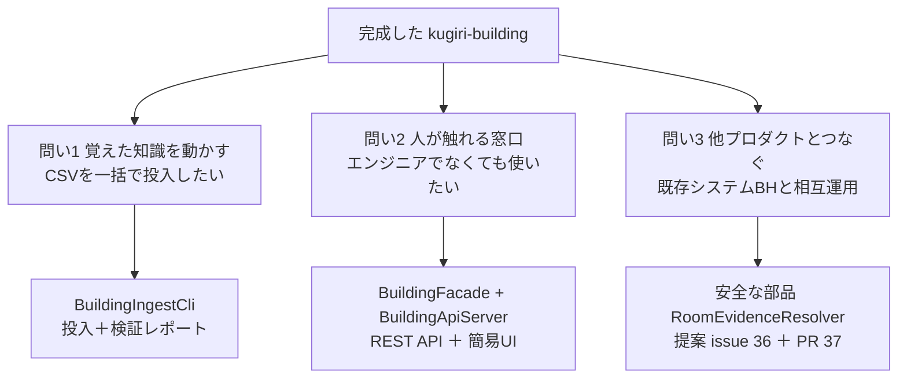
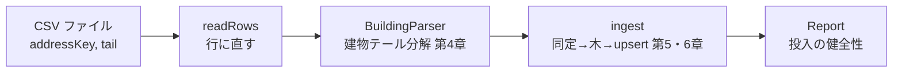
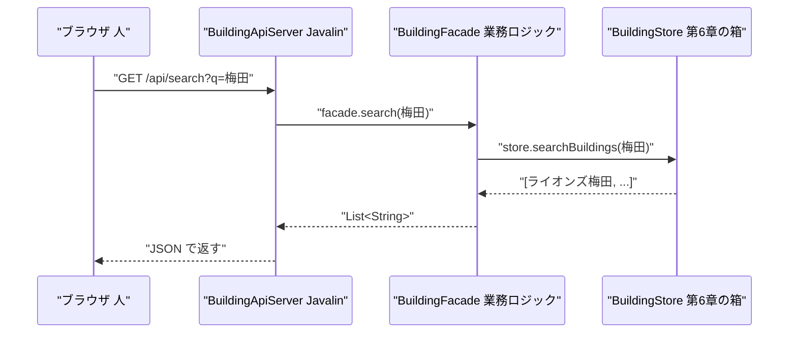
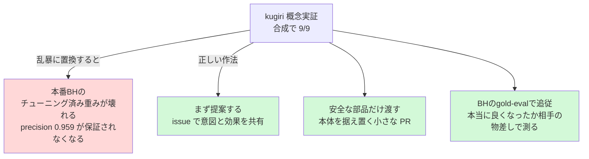
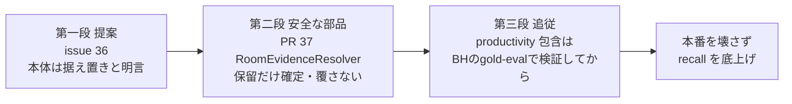

# 第二部 番外編1　動かす＆つなぐ（投入CLI・REST/UI・他プロダクト連携）

> **これは番外編です**。第二部の本編（第0〜8章）は、第8章のエピローグで物語として完結しています。
> この番外編は、その完結したあとに「で、これ **実務でどう動かすの？** 他のプロダクトと **どうつなぐの？**」
> という、現場の三つの問いに答える **実務編** です。新しい数式は出てきません。
> 学んだ知識を「動かす」「人が触る」「他とつなぐ」へ、地続きにしていきます。

> **この章のゴール**
> - 学んだ仕組みを **コマンド1本で動かす**（`BuildingIngestCli` で CSV を投入し、レポートを読む）
> - **人が触れる窓口**（REST API ＋ 簡易 UI）が、第7章の差し替え層の上にどう乗っているか分かる
> - **他プロダクト（building-hierarchy＝BH）と手をつなぐ**作法——「本番を壊さず、安全な部品＋gold-eval を尊重する」——を知る

> **登場人物**：みどり先生、ツムギ、ゲンタ、スガタ

---

## 物語は終わった。でも、機械はこれから働く

**ツムギ**：先生、第二部、エピローグまで読み終わりました……スガタも見分けがついたし、もう完成ですよね？

**みどり先生**：物語としてはね。でもツムギ、本当のスタートはここからなんだ。
学んだ仕組みは、いまは「教科書の中」にいる。これを **現場で働かせる** には、あと三つ、地に足のついた問いがある。

**ゲンタ**：三つ？　それ意味あるの？　もう 9/9 出てるじゃん。

**みどり先生**：いい「それ意味あるの？」だ。じゃあ聞くよ、ゲンタ。
君の会社に「住所と建物名が10万行入った CSV」が届いた。`IdentityProbeDemo` を10万回手で打つ気かい？

**ゲンタ**：……あ。それは無理だわ。

**みどり先生**：そう。だから三つの問いがある。これが今日の地図だ。



**みどり先生**：「**動かす・触る・つなぐ**」。本編で作った道具を、この三つで現場に出す。あわてない、あわてない。ひとつずつ行こう。

---

## 問い1：覚えた知識を「動かす」——BuildingIngestCli

**みどり先生**：まず一つ目。本編の `StoreDemo`（第6章）は、配列をコードに **直書き** していたね。覚えてる？

**ツムギ**：はい、`{"霞ヶ浦1番", "ライオンズマンション梅田301号室"}` みたいなのが Java の中に書いてありました。

**みどり先生**：あれは「しくみの確認」用。現場では、データは **ファイル（CSV）** で来る。
だから、CSV を読んで、本編のパイプライン（分解→同定→木→ストア）に流し込む **投入係** を1本用意した。
それが `BuildingIngestCli`（ビルディング・インジェスト・シーエルアイ。ingest＝取り込む）だ。

> 📌 **CLI（シーエルアイ、command-line interface）とは**
> 「コマンドの行（line）で操作する窓口（interface）」。
> マウスでクリックする画面ではなく、`--csv rows.csv` のように **文字で指示** を渡して動かす。
> バッチ処理（まとめて一括）に向いている。10万行でも、コマンド1本。

**みどり先生**：まず、動かしてみよう。同梱のサンプルなら、CSV を用意しなくても `--samples` で試走できる。

```bash
mvn -q -f building/pom.xml exec:java \
  -Dexec.mainClass=org.unlaxer.kugiri.building.ingest.BuildingIngestCli \
  -Dexec.args="--samples" \
  -Dstdout.encoding=UTF-8
```

**みどり先生**：中で何が起きているか、本物のコードを見よう。`main` の骨格はこれだけだ。

```java
// BuildingIngestCli.main（要点）— 引数を読み、CSVを行に直し、投入してレポート
Map<String, String> a = parseArgs(args);
BuildingLexicon lex = BuildingLexicon.learn(SampleCorpus.names());          // ① 語彙を学ぶ（第2章）
BuildingParser parser = BuildingParser.of(a.getOrDefault("parser", "lexicon"), lex); // ② 分解係を選ぶ（第7章）

List<Row> rows = readRows(reader, addrCol, tailCol, parser);                // ③ CSV → 行（addressKey, 分解ずみ建物）
BuildingStore store = new InMemoryStore();                                   // ④ 貯める箱（第6章）
Report report = ingest(rows, lex, store);                                    // ⑤ 同定→木→upsert＋検証
```

**ゲンタ**：①〜⑤、ぜんぶ本編で見たやつだ。`BuildingLexicon.learn`（語彙、第2章）、`BuildingParser.of`（差し替え、第7章）、`InMemoryStore`（箱、第6章）……。
CLI って、**本編の部品を順番に呼ぶだけ** なんだな。

**みどり先生**：その通り！　ここが大事なところ。CLI は **新しいアルゴリズムを足していない**。
本編で作った部品を、ファイル入力につないで **並べただけ**。賢い部分は、ぜんぶ本編にある。



### レポートを読む——「健全に入ったか」を数字で確かめる

**ツムギ**：実行すると、最後にこういうのが出ました。

```
=== 投入レポート ===
行数=11  住所=4  建物=...  部屋=...  要レビュー=...  建物名空=0
```

**みどり先生**：これが **投入レポート（Report）** だ。10万行を流したとき、本当に健全に入ったかを、人が一目で確かめるための **健康診断書** だと思えばいい。
本物の `Report` の定義はこう。

```java
// BuildingIngestCli.Report — 投入の健全性をまとめた記録
public record Report(int rows, int addresses, int buildings, int rooms,
                     int needsReview, int emptyName) {}
```

> 📌 **6つの数字の読み方**
> - **`rows`（行数）**：CSV から読めた行の数。入力の総量。
> - **`addresses`（住所）**：束ねた結果、住所キーは何種類あったか。
> - **`buildings`（建物）**：同定して束ねた **建物の数**（`store.buildingCount()`）。`rows` より少なければ、表記ゆれがちゃんと束ねられた証拠。
> - **`rooms`（部屋）**：木の葉（部屋）の総数（`leafCount`）。
> - **`needsReview`（要レビュー）**：型F（略しすぎ衝突）などで保留に落ちた数（`store.reviews().size()`）。**人手に渡る件数**。
> - **`emptyName`（建物名空）**：建物名が空っぽだった行。**入力やパーサの異常を見つける** 警報ランプ。

**ゲンタ**：`buildings` が `rows` より少ない、っていうのが「束ねられた」サインなのか。
たとえば `ライオンズマンション梅田` と `ライオンズ梅田` が同じ建物に束ねられたら、2行で建物1個になる。

**みどり先生**：そう。逆に `needsReview` や `emptyName` が大きいと「あれ、何かおかしい」と気づける。
**数字で健全性を見張る**——これは第7章の対決ハーネス（正解数を数える）と、同じ精神だよ。機械の仕事を、人が数字で検算する。

### CP932 と --parser ——現場の二大あるある

**ツムギ**：あの、本物の住所データって、文字コードが変なことありませんか？　昔ポストくんが「これは CP932 で〜」って言ってた……。

**みどり先生**：よく覚えてた。それが一つ目のあるある。
日本の住所データ（KEN_ALL など）は、Windows 由来の **CP932（シーピー・きゅうさんに、別名 Windows-31J）** で書かれていることが多い。
UTF-8 のつもりで読むと、文字化けする。だから CLI は **文字コードを指定できる**。

```java
// BuildingIngestCli — 文字コードを引数で受け取って CSV を開く
Charset cs = Charset.forName(a.getOrDefault("encoding", "UTF-8")); // 既定は UTF-8
reader = Files.newBufferedReader(Path.of(a.get("csv")), cs);
```

```bash
# 実 KEN_ALL のような CP932 のファイルを投入するとき
mvn -q -f building/pom.xml exec:java \
  -Dexec.mainClass=org.unlaxer.kugiri.building.ingest.BuildingIngestCli \
  -Dexec.args="--csv rows.csv --encoding Windows-31J" \
  -Dstdout.encoding=UTF-8
```

> ⚠️ **大事な釘**：CLI のコメントにも明記されている通り、**実 KEN_ALL 等の生データはコミットしない**（サンプルのみ）。
> これは CLAUDE.md の「やってはいけない」と同じ約束。試走は `--samples`、本番は手元の生ファイルを `--csv` で。

**ゲンタ**：二つ目のあるあるは？

**みどり先生**：`--parser`（パーサ切替）だ。第7章で `BuildingParser.of("rule" | "lexicon")` を選べる、と学んだね。
CLI はそれを **コマンド引数で** 選ばせる。既定は賢い `lexicon`（誘導語彙）。比較したいときは `rule`（昔ながら）に、実験なら `perceptron` にも切り替えられる。

```java
// 既定は lexicon。--parser で rule / perceptron に切り替え（第7章の差し替え層がそのまま窓口になる）
BuildingParser parser = BuildingParser.of(a.getOrDefault("parser", "lexicon"), lex);
```

**ツムギ**：第7章の差し替え層が、そのまま **コマンドのスイッチ** になってるんですね……！　穴があいてたから、CLI からも挿し替えられる。

**みどり先生**：その通り。差し替え層を作っておいた **ごほうび** が、こんなところでも効いてくる。

---

## 問い2：人が触れる「窓口」——REST API ＋ 簡易 UI

**みどり先生**：二つ目の問い。CLI は便利だけど、コマンドを打てない人——営業さんや、レビュー担当の人——はどうする？

**ツムギ**：……たしかに。わたしのお母さん、コマンドとか絶対打たないです。

**みどり先生**：だろう。だから「**人が触れる窓口**」を用意する。それが **REST API（レスト・エーピーアイ）** と、その上の **簡易 UI（画面）** だ。

> 📌 **REST API とは（ざっくり）**
> ブラウザや他のプログラムが、`http://～/api/search?q=梅田` のような **URL を叩くと、答えが返ってくる** 窓口。
> 「梅田 を検索して」とお願いすると、JSON（ジェイソン＝機械が読みやすいデータの書き方）で結果が返る。
> CLI が「コマンドの窓口」なら、REST は「ネット越しの窓口」。

### HTTP 非依存ロジック：BuildingFacade

**みどり先生**：ここで、第6章・第7章で何度も出た **差し替え層の発想** が、また顔を出す。
「**業務のロジック**」と「**HTTP（通信）の部分**」を、わざと分けてあるんだ。
業務ロジックのほうを **`BuildingFacade`（ビルディング・ファサード。facade＝建物の「正面玄関」）** という。

```java
// BuildingFacade — REST から呼ぶ業務ロジック（HTTP 非依存・単体テスト可能）
public final class BuildingFacade {
    private final BuildingStore store;
    private final BuildingParser parser;

    public BuildingFacade(BuildingStore store, BuildingLexicon lex, String parserName) {
        this.store = store;
        this.parser = BuildingParser.of(parserName, lex);   // ← また第7章の差し替え層
    }

    public ParsedBuilding parse(String tail) { return parser.parse(tail == null ? "" : tail); }
    public List<String> search(String q) { return q == null || q.isBlank() ? List.of() : store.searchBuildings(q); }
    public Map<String, Object> address(String key) { return store.address(key).map(BuildingFacade::toMap).orElse(null); }
    public List<Map<String, String>> reviews() { /* store.reviews() を Map に詰め替え */ ... }
    public Map<String, Object> stats() { return Map.of("buildings", store.buildingCount(), "reviews", store.reviews().size()); }
}
```

**ゲンタ**：あれ、`BuildingFacade` の中、`import io.javalin...` みたいな **通信のコードが1個も無い**。
やってるのは `store` と `parser` を呼んで、結果を `Map` に詰め替えるだけだ。

**みどり先生**：そこに気づけたら一人前だ。`BuildingFacade` は **HTTP のことを一切知らない**。
「parse して」「search して」「reviews ちょうだい」という **業務の言葉** だけで書いてある。
だから——コメントにある通り——**HTTP 非依存で、単体テストできる**。サーバーを立てなくても、`new BuildingFacade(...)` してメソッドを呼ぶだけで試せる。

> 📌 **なぜ分けるのか（ファサードの気持ち）**
> 通信（HTTP）と業務（同定・検索）が混ざっていると、テストするのにサーバーを立てる必要があり、面倒で壊れやすい。
> 業務ロジックを `BuildingFacade` に **純粋なまま** 取り出しておけば、通信の部品（Javalin）を後で取り替えても、業務側は **1ミリも変えなくていい**。
> ——これ、第6章・第7章で何度も見た「**窓口は固定、中身は差し替え**」と、まったく同じ作法だ。

### HTTP の殻：BuildingApiServer（Javalin）

**みどり先生**：その `BuildingFacade` に、**HTTP の殻** をかぶせるのが `BuildingApiServer` だ。
通信ライブラリ **Javalin（ジャヴァリン）** を使って、URL（経路）を `facade` のメソッドに **つなぐ** だけ。

```java
// BuildingApiServer.main（要点）— URL経路を facade のメソッドへ橋渡しするだけ
BuildingStore store = new InMemoryStore();
loadSamples(lex, store);                                  // サンプルCSVを投入して起動（第6章）
BuildingFacade facade = new BuildingFacade(store, lex, "lexicon");

Javalin app = Javalin.create(cfg -> cfg.staticFiles.add("/static")); // 簡易UI(index.html)も配る
app.get("/api/parse",        ctx -> ctx.json(facade.parse(ctx.queryParam("tail"))));
app.get("/api/search",       ctx -> ctx.json(facade.search(ctx.queryParam("q"))));
app.get("/api/address/{key}",ctx -> { /* facade.address。無ければ 404 */ });
app.get("/api/reviews",      ctx -> ctx.json(facade.reviews()));
app.get("/api/stats",        ctx -> ctx.json(facade.stats()));
app.start(port);
```

**ツムギ**：`app.get("/api/search", ... facade.search(...))`……「`/api/search` という URL が来たら、`facade.search` を呼ぶ」って、住所を指さしてるみたいですね。

**みどり先生**：うまい例えだ。Javalin は **交通整理の係**。
「この URL が来たら、この業務メソッドへ」と、行き先を案内するだけ。賢い判断は、ぜんぶ奥の `facade`（＝本編の部品）がやる。



**ゲンタ**：五つの経路——`parse`・`search`・`address`・`reviews`・`stats`——が、`facade` の五つのメソッドと一対一だ。きれいに対応してる。

### 簡易 UI：ブラウザで触る

**みどり先生**：そして、その API を **人が触れる画面** にしたのが、`resources/static/index.html` だ。
たった1枚の HTML で、入力欄に文字を打つと、裏で `/api/parse` や `/api/search` を呼んで結果を表示する。

```javascript
// index.html（要点）— 入力に応じて API を叩き、結果をそのまま表示
const j = async (u) => (await fetch(u)).json();
const doParse  = debounce(async () => show('parseOut',  await j('/api/parse?tail=' + encodeURIComponent(tail.value))));
const doSearch = debounce(async () => show('searchOut', await j('/api/search?q='   + encodeURIComponent(q.value))));
tail.addEventListener('input', doParse);   // 入力するたびに分解
q.addEventListener('input', doSearch);     // 入力するたびに検索
j('/api/reviews').then(v => show('reviewOut', v.length ? v : '（なし）')); // 要レビューを一覧
```

> 📌 **`debounce`（デバウンス）の気持ち**
> 1文字打つたびに API を叩くと、サーバーに連打になってしまう。
> `debounce` は「**打ち終わって 250 ミリ秒、静かになってから1回だけ呼ぶ**」見張り役。
> エレベーターのボタンを連打しても1回しか効かないのと同じ。やさしい設計だ。

**ツムギ**：要レビュー（`/api/reviews`）が画面にちゃんと出るのが、いいですね。
第8章で「型F は人手に渡す」って言ってた、その **人手の出口** が、これなんだ……！

**みどり先生**：その通り。第8章で「目4＝人手レビュー」「REST/UI は人手レビューの画面（Phase2）」と予告したろう。
**この番外編で、その予告が現実になっている**。`identity_review` に貯めた保留を、人がブラウザで見て判断できる。これが「目4を、本当に人に渡す出口」だ。

---

## 問い3：他プロダクトと「手をつなぐ」——BH 連携の作法

**ゲンタ**：先生、最後の問い。「他プロダクトとつなぐ」って、誰とつなぐの？

**みどり先生**：**building-hierarchy**——略して **BH** という、**別の人たちが作った、別実装** だ。
kugiri と同じ「同じ住所の建物名を束ねる」問題に、**先に・本番で** 取り組んでいる、いわば先輩プロダクトだよ。

**ツムギ**：先輩が、もう本番で動いてるんですね。じゃあ kugiri は何をするんですか？

**みどり先生**：ここが今日いちばん大事な、**設計のマナー**の話だ。あわてない、あわてない。
BH には、もともと **編集距離ベース** の同定がある。そして、自分たちで弱点も分かっている。

> 📌 **BH 側が自認している弱点**（提案ドラフトより）
> - `白雲荘`/`青雲荘`（距離1＝別建物）や `第一宿舎`/`第二宿舎` を、距離では分けにくい。
> - 種別語の分離が **手書き辞書 48 語** ＋ 形態素解析依存で、辞書外カタカナに弱い。
> - **recall 0.39**：真の表記ゆれの多くを自動併合できず、レビュー行きになってしまう。

**ゲンタ**：それ、第1章・第2章でやった「距離の罠」そのものじゃん。kugiri なら包含と対立度で解けるやつ。

**みどり先生**：その通り。kugiri が概念実証した **「対立度・包含・3値・部屋証拠」** が、まさに BH の弱点に効く。
じゃあ——kugiri のコードで BH を **ごっそり書き換えれば** いいと思う？

**ツムギ**：……えっと、9/9 のほうが強いんだから、そうしたほうが……？

**みどり先生**：そこが落とし穴なんだ、ツムギ。**ここで設計のマナーを覚えてほしい**。

### マナー1：本番のチューニング済みシステムを、安易に壊さない

**みどり先生**：BH は **本番で動いている**。しかも、`ClusteringTuner` や `GoldStandardEvaluator` という、
**自分たちの正解データ（gold）で重みをチューニングし、評価する仕組み** を持っている。precision 0.959 という数字も、その gold で測ったものだ。



**みどり先生**：合成データの 9/9 は、第8章でも釘を刺した通り **概念実証（Phase0）** であって、本物データでの実力ではない。
それで本番の、しかも他人が時間をかけてチューニングしたシステムを **乱暴に上書き** したら——壊すかもしれない。これは、やってはいけない。

**ゲンタ**：相手の物差し（gold）で測ってないのに、「俺のほうが強いから明け渡せ」は、たしかに乱暴だわ。

### マナー2：提案する → 安全な部品を渡す → 相手の物差しで測る

**みどり先生**：だから kugiri がやったのは、三段階の、**礼儀正しい連携** だ。

**みどり先生**：**第一段：提案する（issue #36）**。
いきなりコードを送りつけず、まず「こういう特徴量（対立度・包含・3値・部屋証拠）を足すと、あなたたちの弱点（recall 0.39）が改善するはずです」という **提案 issue** を出した。
しかも「**clustering 本体（編集距離・連結法）は据え置き、比較する特徴を足すだけ**」と明言している。本体を壊さない、という約束つきだ。

**ツムギ**：「あなたのやり方を尊重します。足すだけです」って、ちゃんと言ってから始めるんですね。

**みどり先生**：**第二段：安全な部品だけ渡す（PR #37）**。
そして実際に渡したのは、いちばん **安全で・自己完結した部品** ひとつ——`RoomEvidenceResolver` だ。
これは kugiri 側の `EvidenceResolver` に相当する、**部屋番号の集合で型F/Cを確定する** 小さな道具だよ。本物のコードを見よう。

```java
// EvidenceResolver.resolve — テキストで決まらない NEEDS_REVIEW を、部屋集合という非テキスト証拠で確定
public static Decision resolve(Decision textDecision, Set<String> roomsA, Set<String> roomsB) {
    if (textDecision != Decision.NEEDS_REVIEW) return textDecision;     // ① テキストで確信あり → 尊重（覆さない）
    if (roomsA == null || roomsB == null || roomsA.isEmpty() || roomsB.isEmpty())
        return Decision.NEEDS_REVIEW;                                   // ② 証拠なし → 保留のまま（人手へ）
    Set<String> inter = new HashSet<>(roomsA);
    inter.retainAll(roomsB);                                            // ③ 部屋集合の重なりを見る
    return inter.isEmpty() ? Decision.DISTINCT : Decision.SAME;         //    かぶる＝同一 / 排他＝別
}
```

**ゲンタ**：これ、すごく **おとなしい** 部品だな。①でまず「テキスト判定が SAME か DISTINCT なら、それを尊重して何もしない」って書いてある。
**NEEDS_REVIEW のときだけ** しか動かない。

**みどり先生**：そこが「**安全な部品**」のキモなんだ。
この `RoomEvidenceResolver` は、BH の既存判定を **絶対に覆さない**。BH が「SAME」「DISTINCT」と確信した結果には、指一本触れない。
**保留（NEEDS_REVIEW）だけ** を、部屋証拠で **追加で** 確定する。だから、BH の precision 0.959 を **壊しようがない**。足し算しかしない部品だ。

> 📌 **「安全な部品」とは**
> - **既存の判定を覆さない**（確信ある SAME/DISTINCT は尊重）。
> - **証拠が無ければ、無理せず保留のまま**返す（②）。勝手に断定しない＝第8章の「謙虚さ」。
> - **自己完結**（部屋集合という、相手も持っているデータ＝BH の `totalRooms`だけで動く）。
> だから、本番に挿しても **副作用がほぼ無い**。「足すだけ・壊さない」を、コードで体現している。

**みどり先生**：**第三段：相手の物差しで測って追従する**。
残りの大物——productivity（対立度）の配線や、包含での自動併合——は、**いきなり入れない**。
BH の **gold-eval（`ClusteringTuner` / `GoldStandardEvaluator`）を経由** して、「本当に recall が上がり、precision が落ちないか」を **相手の正解データ** で確かめてから追従する、という方針にしてある。

**ツムギ**：自分の 9/9 じゃなくて、**相手の物差し** で測るんですね。

**みどり先生**：そう。これが今日の核心だ。
PR #37（`RoomEvidenceResolver`）は、すでに BH 側に **マージ済み**（BH の `docs/clustering-design §7`）。
安全な部品から、一歩ずつ。残りは gold-eval で追従。——これが、他プロダクトと手をつなぐときの **大人の作法** だよ。



**ゲンタ**：……分かった。強い手札を持ってても、**いきなり全部は出さない**。
提案して、いちばん安全な1枚から出して、相手の物差しで確かめながら増やす。

**みどり先生**：その通り。**強さの見せ方にも、礼儀がある**。
kugiri は「今日のあなたが読める参照実装」であると同時に、「他のシステムを **安全に強くする** 部品の供給源」でもある。
壊さずに貢献する——これが、第7章の差し替え層が最終的に目指していた、いちばん遠い景色だ。

---

## 手を動かそう

**みどり先生**：三つの問いを、順番に手で動かしてみよう。

### ① 動かす（CLI で投入＋レポート）

```bash
mvn -q -f building/pom.xml exec:java \
  -Dexec.mainClass=org.unlaxer.kugiri.building.ingest.BuildingIngestCli \
  -Dexec.args="--samples" \
  -Dstdout.encoding=UTF-8
```

- 出てきた `投入レポート` の6つの数字を読む。`buildings` が `rows` より少ないことを確認（＝表記ゆれが束ねられた）。
- `要レビュー` に `寮`（型F）が落ちているか確認（第2・8章）。
- 余裕があれば `--exec.args="--samples --parser rule"` で **昔ながらの分解**に切り替え、結果の違いを見る（第7章）。

### ② 触る（REST + UI をブラウザで）

```bash
mvn -q -f building/pom.xml exec:java \
  -Dexec.mainClass=org.unlaxer.kugiri.building.api.BuildingApiServer
# 起動したら http://localhost:7072/ をブラウザで開く
```

- 検索欄に `梅田` と打つ → 裏で `/api/search?q=梅田` が叩かれ、束ねた建物が出る。
- `要レビュー` の欄に、保留の建物が出ているか見る（第8章の「人手の出口」）。
- URL を直接叩いてみる：`http://localhost:7072/api/stats`（建物数とレビュー数の統計）。

### 計算練習（紙とえんぴつで）

**問題1**：CSV を投入したら、レポートが `行数=11 住所=4 建物=8 要レビュー=1 建物名空=0` だった。
「`建物` が `行数` より小さい」ことから何が言える？　また `要レビュー=1` は誰の出番か。

<details>
<summary>こたえ</summary>

`建物 8 < 行数 11` は、**11 行のうち少なくとも 3 行ぶんが、既存の建物に束ねられた**（同定で SAME になった＝表記ゆれや略称をちゃんと拾えた）ことを意味する。
`要レビュー=1` は、テキストでは断定できなかった型F等が1件あるということ。その1件は **目4＝人手**（`/api/reviews` の画面）に回り、最終的に **部屋証拠（`EvidenceResolver`）＋人** で確定する。第8章の「天井」の話そのもの。

</details>

**問題2**：BH の本番に kugiri の機能を入れたい。`RoomEvidenceResolver` を挿しても BH の precision 0.959 が **壊れない** のは、コードのどの一行のおかげ？

<details>
<summary>こたえ</summary>

`if (textDecision != Decision.NEEDS_REVIEW) return textDecision;`（①の行）。
テキスト判定が SAME か DISTINCT で **確信ありのときは、何もせずそのまま返す**。
この部品が動くのは **保留（NEEDS_REVIEW）のときだけ** なので、BH が確信した既存判定を **絶対に覆さない**。
「足すだけ・壊さない」が、この1行に集約されている。だから安全に本番へ挿せる。

</details>

---

## 今日のまとめ

- **動かす**：`BuildingIngestCli` は、本編の部品（語彙・差し替えパーサ・ストア）を **ファイル入力につないで並べただけ**の投入係。
  CP932（`--encoding Windows-31J`）に対応し、`--parser` で分解方式を切替可能。**生データはコミットしない**（試走は `--samples`）。
  出力の **投入レポート**（行数/住所/建物/部屋/要レビュー/建物名空）で、健全性を **数字で検算** する。
- **触る**：業務ロジック `BuildingFacade`（**HTTP 非依存・テスト可能**）に、`BuildingApiServer`（Javalin）が **HTTP の殻** をかぶせ、
  `/api/parse`・`/api/search`・`/api/address`・`/api/reviews`・`/api/stats` ＋簡易 UI を提供。これも第6・7章の「**窓口は固定、中身は差し替え**」の再演。
  `/api/reviews` は、第8章で予告した「**人手レビューの出口（目4）**」の実体。
- **つなぐ**：別実装 **BH** へ、kugiri の「対立度・包含・3値・部屋証拠」を **提案（issue #36）** → **安全な部品 `RoomEvidenceResolver` を PR #37 で提供（マージ済み）** → **残りは BH の gold-eval で追従**、の三段階で連携。
- 連携の **設計マナー**：本番のチューニング済みシステムを **安易に壊さない**。**確信ある判定は覆さず、保留だけを足す安全な部品**から渡し、**相手の物差し（gold-eval）** で本当に良くなったか測ってから進める。合成 9/9 を実力と過信しない。

---

## スガタメーター

```
スガタの見分け：██████████ 100%
（コメント：見分ける力は完成。今日は、その力を「動かし・人に触らせ・他とつないだ」。
　しかも本番を壊さず、安全な部品から礼儀正しく。スガタはもう、現場で働ける。）
```

---

## 次回予告

**みどり先生**：今日は「動かす・触る・つなぐ」を一通りやった。でもツムギ、最後に一つ宿題が残ってる。
`--parser lexicon` と `rule`、`IdentityResolver` の `contrastive` と編集距離——「**結局、どれがいちばん強いの？**」を、ちゃんと **測る** 話だ。

**ツムギ**：9/9 とか 5/9 とか、ありましたよね。あれを、もっとちゃんと？

**みどり先生**：そう。合成じゃなく本物のデータで、P/R/F1（精度・再現率・F値）まで含めて、方式を **公平に競わせる**。
次は「“**どのパーサが一番か**”を測る **ベンチマーク編**」だ。——準備中。あわてない、あわてない。

[← 第8章 エピローグ](08-epilogue.md) ・ [第二部 もくじ →](README.md)
